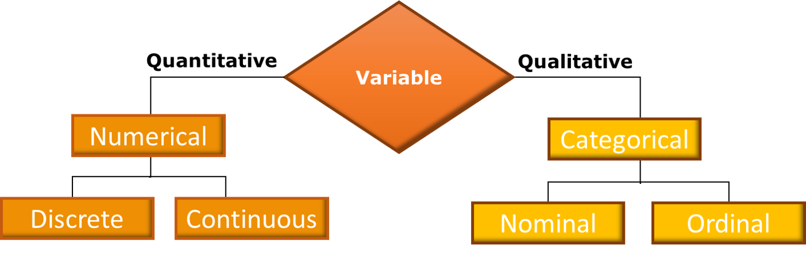
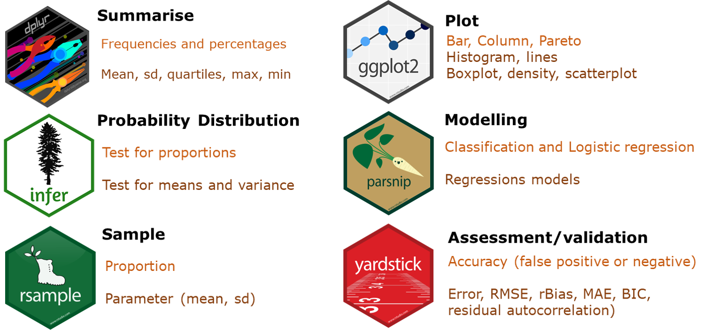
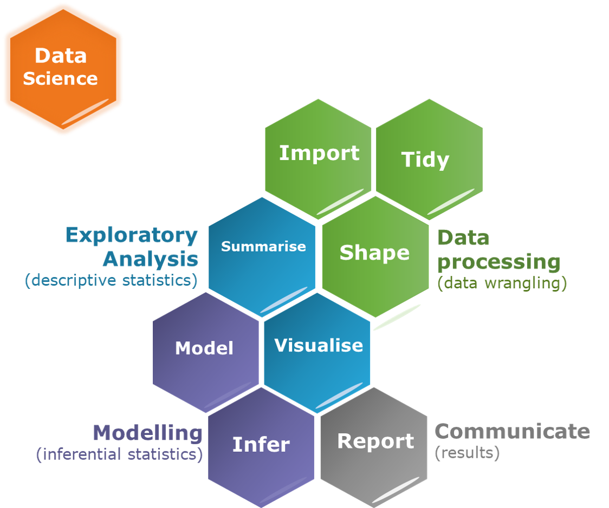
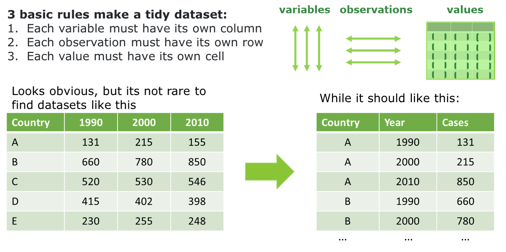

Statistics Course - UWI
================
AlbyDR
2021-03-10

# **Data Science**&nbsp;
&nbsp;

## TYPE OF VARIABLE
### A variable is a quantity or quality that you can measure. The distribution of a variable will depend on whether the variable is categorical, discrete or continuous.
&nbsp;
<!-- --> 
&nbsp; &nbsp; &nbsp;
#
&nbsp;
&nbsp;
&nbsp;
## TYPE OF VARIABLE
### Data type determine the statistics to be applied over a variable.
&nbsp;
<!-- -->
#
&nbsp;
&nbsp;
&nbsp;
## DATA SCIENCE WITH R
<!-- --> 
&nbsp; 
&nbsp; 
&nbsp;
#
&nbsp;
&nbsp;
## DATA PROCESSING
### *Shaping the data based on types of variables* 
&nbsp;
### R has huge collaborative community in continuing expansion, resulting in many different approaches to organize and storage data. 
### We will work through the course with the concepts and tools under the scope of the metapackage ‘tidyverse”. 
<!-- -->
&nbsp;
#
&nbsp; &nbsp; &nbsp;
## IMPORTING DATA (READ/LOAD)
### Data extension: `.csv`, `.txt`, `.xlsx` ….
### Read function: `read_csv( )`, `read_table( )`, `read_delim( )` 
## **Tricks**
### `delim` = character to separate fields within records (coma, semi-coma, tab, space)
### `col_types` = specification of the column types (chr, int, dbl, date)
### `locale`  = time zone (UTC), encoding(ASCII), decimal mark (. or ,) and day/month
### `skip` = number of lines to skip before reading data 
## **Best feature**
### Download direct from the source to R studio 
#

&nbsp;
<!-- -->
#

&nbsp;
<!-- -->
#

&nbsp;
<!-- -->
#

## Example 2.1 Tidy Data 
&nbsp;

``` r
library(tidyverse)
```
``` r
library(lubridate)
```

### DWD precipitation dataset (prec)

**Download historical data** *file RR - id 03987 (Potsdam)*

`string::str_extract_all` and `string::str_split`

``` r
temp <- tempfile()
download.url <- "http://ftp-cdc.dwd.de/climate_environment/CDC/observations_germany/climate/hourly/precipitation/historical/"
zipfile <- readLines(download.url)
zipfile <- unlist(str_extract_all(zipfile, "stundenwerte_RR_03987_.+(.zip)"))
zipfile
```

    ## [1] "stundenwerte_RR_03987_19950901_20191231_hist.zip\">stundenwerte_RR_03987_19950901_20191231_hist.zip"

``` r
zipfile <- str_split(zipfile, ">")[[1]][2]
zipfile
```

    ## [1] "stundenwerte_RR_03987_19950901_20191231_hist.zip"

``` r
download.file(paste0(download.url,zipfile),temp, mode="wb")
metadata <- unzip(temp)
unlink(temp)
metadata 
```

    ##  [1] "./Metadaten_Fehldaten_03987_19950901_20191231.html"      
    ##  [2] "./Metadaten_Fehldaten_03987_19950901_20191231.txt"       
    ##  [3] "./Metadaten_Fehlwerte_03987_19950901_20191231.txt"       
    ##  [4] "./Metadaten_Fehlwerte_Gesamt_03987.txt"                  
    ##  [5] "./Metadaten_Geographie_03987.txt"                        
    ##  [6] "./Metadaten_Geraete_Niederschlag_Gefallen_Ind_03987.html"
    ##  [7] "./Metadaten_Geraete_Niederschlag_Gefallen_Ind_03987.txt" 
    ##  [8] "./Metadaten_Geraete_Niederschlagsform_03987.html"        
    ##  [9] "./Metadaten_Geraete_Niederschlagsform_03987.txt"         
    ## [10] "./Metadaten_Geraete_Niederschlagshoehe_03987.html"       
    ## [11] "./Metadaten_Geraete_Niederschlagshoehe_03987.txt"        
    ## [12] "./Metadaten_Parameter_rr_stunde_03987.html"              
    ## [13] "./Metadaten_Parameter_rr_stunde_03987.txt"               
    ## [14] "./Metadaten_Stationsname_03987.html"                     
    ## [15] "./Metadaten_Stationsname_03987.txt"                      
    ## [16] "./produkt_rr_stunde_19950901_20191231_03987.txt"

**Read historical data** `readr::read_delim`

``` r
dwd_prec <- read_delim(metadata[16], 
                       ";", escape_double = FALSE, 
                       col_types = cols(MESS_DATUM = col_datetime(format="%Y%m%d%H")), 
                       trim_ws = TRUE)
```

``` r
dwd_prec 
```

    ## # A tibble: 211,810 x 7
    ##    STATIONS_ID MESS_DATUM           QN_8    R1 RS_IND  WRTR eor  
    ##          <dbl> <dttm>              <dbl> <dbl>  <dbl> <dbl> <chr>
    ##  1        3987 1995-09-01 00:00:00     1   1.3      1  -999 eor  
    ##  2        3987 1995-09-01 01:00:00     1   1.7      1  -999 eor  
    ##  3        3987 1995-09-01 02:00:00     1   0.5      1  -999 eor  
    ##  4        3987 1995-09-01 03:00:00     1   0.5      1  -999 eor  
    ##  5        3987 1995-09-01 04:00:00     1   0.9      1  -999 eor  
    ##  6        3987 1995-09-01 05:00:00     1   1.1      1  -999 eor  
    ##  7        3987 1995-09-01 06:00:00     1   1.9      1  -999 eor  
    ##  8        3987 1995-09-01 07:00:00     1   1.1      1  -999 eor  
    ##  9        3987 1995-09-01 08:00:00     1   2        1  -999 eor  
    ## 10        3987 1995-09-01 09:00:00     1   0.3      1  -999 eor  
    ## # ... with 211,800 more rows

**Rename the variables/vectors/columns**

``` r
colnames(dwd_prec) <- c("id", "timestamp", "QN_8" , "precip_mm",
                        "prec_hour", "measure_form","eor")
```

\*\*convert the variable measure\_form to integer

``` r
dwd_prec$measure_form <- as.integer(dwd_prec$measure_form)
```

**Run variables summary to Check for NA or estrange values**

``` r
summary(dwd_prec)
```

    ##        id         timestamp                        QN_8      
    ##  Min.   :3987   Min.   :1995-09-01 00:00:00   Min.   :1.000  
    ##  1st Qu.:3987   1st Qu.:2001-11-13 09:15:00   1st Qu.:1.000  
    ##  Median :3987   Median :2007-12-01 08:30:00   Median :3.000  
    ##  Mean   :3987   Mean   :2007-11-23 20:03:54   Mean   :2.241  
    ##  3rd Qu.:3987   3rd Qu.:2013-12-15 19:45:00   3rd Qu.:3.000  
    ##  Max.   :3987   Max.   :2019-12-31 23:00:00   Max.   :3.000  
    ##    precip_mm           prec_hour          measure_form        eor           
    ##  Min.   :-999.0000   Min.   :-999.0000   Min.   :-999.0   Length:211810     
    ##  1st Qu.:   0.0000   1st Qu.:   0.0000   1st Qu.:-999.0   Class :character  
    ##  Median :   0.0000   Median :   0.0000   Median :   0.0   Mode  :character  
    ##  Mean   :  -0.7272   Mean   :  -0.5707   Mean   :-481.7                     
    ##  3rd Qu.:   0.0000   3rd Qu.:   0.0000   3rd Qu.:   0.0                     
    ##  Max.   :  31.7000   Max.   :   1.0000   Max.   :   8.0

**Convert -999.0000 and -999.0 to NA**

``` r
dwd_prec <- na_if(dwd_prec, -999)
```

### DWD Cloudiness data set

**stundenwerte\_TD\_03987**

**Download historical data**

``` r
temp <- tempfile()
download.url <- "http://ftp-cdc.dwd.de/climate_environment/CDC/observations_germany/climate/hourly/cloudiness/historical/"
zipfile <- readLines(download.url) 
zipfile <- unlist(str_extract_all(zipfile, "stundenwerte_N_03987_.+(.zip)"))
zipfile <- str_split(zipfile, ">")[[1]][2]
download.file(paste0(download.url,zipfile),temp, mode="wb")
metadata <- unzip(temp)
unlink(temp)
metadata 
```

    ##  [1] "./Metadaten_Fehldaten_03987_19750701_20191231.html"  
    ##  [2] "./Metadaten_Fehldaten_03987_19750701_20191231.txt"   
    ##  [3] "./Metadaten_Fehlwerte_03987_19750701_20191231.txt"   
    ##  [4] "./Metadaten_Fehlwerte_Gesamt_03987.txt"              
    ##  [5] "./Metadaten_Geographie_03987.txt"                    
    ##  [6] "./Metadaten_Geraete_Gesamt_Bedeckungsgrad_03987.html"
    ##  [7] "./Metadaten_Geraete_Gesamt_Bedeckungsgrad_03987.txt" 
    ##  [8] "./Metadaten_Parameter_n_stunde_03987.html"           
    ##  [9] "./Metadaten_Parameter_n_stunde_03987.txt"            
    ## [10] "./Metadaten_Stationsname_03987.html"                 
    ## [11] "./Metadaten_Stationsname_03987.txt"                  
    ## [12] "./produkt_n_stunde_19750701_20191231_03987.txt"

**Read historical data**

``` r
dwd.cloudiness <- read_delim(metadata[12], 
                             ";", escape_double = FALSE, 
                             col_types = cols(MESS_DATUM = col_datetime(format="%Y%m%d%H")), 
                             trim_ws = TRUE)
```

``` r
dwd.cloudiness
```

    ## # A tibble: 367,979 x 6
    ##    STATIONS_ID MESS_DATUM           QN_8 V_N_I   V_N eor  
    ##          <dbl> <dttm>              <dbl> <chr> <dbl> <chr>
    ##  1        3987 1975-07-01 00:00:00     1 P         8 eor  
    ##  2        3987 1975-07-01 06:00:00     1 P         3 eor  
    ##  3        3987 1975-07-01 12:00:00     1 P         7 eor  
    ##  4        3987 1975-07-01 18:00:00     1 P         7 eor  
    ##  5        3987 1975-07-02 00:00:00     1 P         8 eor  
    ##  6        3987 1975-07-02 06:00:00     1 P         7 eor  
    ##  7        3987 1975-07-02 12:00:00     1 P         5 eor  
    ##  8        3987 1975-07-02 18:00:00     1 P         6 eor  
    ##  9        3987 1975-07-03 00:00:00     1 P         7 eor  
    ## 10        3987 1975-07-03 06:00:00     1 P         6 eor  
    ## # ... with 367,969 more rows

``` r
colnames(dwd.cloudiness) <- c("id", "timestamp", "QN_8","V_N_I",
                              "cloud_cover","eor")
```

``` r
summary(dwd.cloudiness)
```

    ##        id         timestamp                        QN_8      
    ##  Min.   :3987   Min.   :1975-07-01 00:00:00   Min.   :1.000  
    ##  1st Qu.:3987   1st Qu.:1988-05-04 13:30:00   1st Qu.:1.000  
    ##  Median :3987   Median :1999-01-03 17:00:00   Median :1.000  
    ##  Mean   :3987   Mean   :1998-11-27 04:51:44   Mean   :1.715  
    ##  3rd Qu.:3987   3rd Qu.:2009-07-03 20:30:00   3rd Qu.:3.000  
    ##  Max.   :3987   Max.   :2019-12-31 23:00:00   Max.   :3.000  
    ##     V_N_I            cloud_cover         eor           
    ##  Length:367979      Min.   :-1.000   Length:367979     
    ##  Class :character   1st Qu.: 3.000   Class :character  
    ##  Mode  :character   Median : 6.000   Mode  :character  
    ##                     Mean   : 5.188                     
    ##                     3rd Qu.: 8.000                     
    ##                     Max.   : 8.000

``` r
class(dwd.cloudiness$cloud_cover)
```

    ## [1] "numeric"

**Convert to factor (categorical variable)** `forcats::as_factor` and
`forcats::fct_unique`’\`

``` r
dwd.cloudiness$cloud_cover <- as_factor(dwd.cloudiness$cloud_cover)
```

**check the class and levels**

``` r
class(dwd.cloudiness$cloud_cover)
```

    ## [1] "factor"

``` r
typeof(dwd.cloudiness$cloud_cover)
```

    ## [1] "integer"

``` r
attributes(dwd.cloudiness$cloud_cover)
```

    ## $levels
    ##  [1] "-1" "0"  "1"  "2"  "3"  "4"  "5"  "6"  "7"  "8" 
    ## 
    ## $class
    ## [1] "factor"

``` r
fct_unique(dwd.cloudiness$cloud_cover)
```

    ##  [1] -1 0  1  2  3  4  5  6  7  8 
    ## Levels: -1 0 1 2 3 4 5 6 7 8

*name the levels of the factor*

``` r
# Cirrus        0 CI
# Cirrocumulus  1 CC
# Cirrostratus  2 CS
# Altocumulus   3 AC
# Altostratus   4 AS
# Nimbostratus  5 NS
# Stratocumulus 6 SC
# Stratus       7 ST
# Cumulus       8 CU
# Cumulonimbus  9 CB
# bei Instrumentenmessung -1 -1
```

``` r
levels(dwd.cloudiness$cloud_cover) <- c("No_clouds", "Cirrus", "Cirrocumulus", "Cirrostratus", "Altocumulus", 
                                        "Altostratus","Nimbostratus","Stratocumulus","Stratus", "Cumulus",
                                        "Cumulonimbus")
fct_count(dwd.cloudiness$cloud_cover)
```

    ## # A tibble: 11 x 2
    ##    f                  n
    ##    <fct>          <int>
    ##  1 No_clouds       5832
    ##  2 Cirrus         33618
    ##  3 Cirrocumulus   28807
    ##  4 Cirrostratus   22051
    ##  5 Altocumulus    20276
    ##  6 Altostratus    16576
    ##  7 Nimbostratus   21517
    ##  8 Stratocumulus  38604
    ##  9 Stratus        69786
    ## 10 Cumulus       110912
    ## 11 Cumulonimbus       0

\*\*convert NA in NA level

``` r
dwd.cloudiness$cloud_cover <- fct_collapse(dwd.cloudiness$cloud_cover,
                                     "NA" = c("InstrumentM", NA))
```

    ## Warning: Unknown levels in `f`: InstrumentM, NA

``` r
dwd.cloudiness$cloud_cover <- fct_explicit_na(dwd.cloudiness$cloud_cover, na_level = "NA")
fct_count(dwd.cloudiness$cloud_cover)
```

    ## # A tibble: 11 x 2
    ##    f                  n
    ##    <fct>          <int>
    ##  1 No_clouds       5832
    ##  2 Cirrus         33618
    ##  3 Cirrocumulus   28807
    ##  4 Cirrostratus   22051
    ##  5 Altocumulus    20276
    ##  6 Altostratus    16576
    ##  7 Nimbostratus   21517
    ##  8 Stratocumulus  38604
    ##  9 Stratus        69786
    ## 10 Cumulus       110912
    ## 11 Cumulonimbus       0

``` r
summary(dwd.cloudiness$cloud_cover)
```

    ##     No_clouds        Cirrus  Cirrocumulus  Cirrostratus   Altocumulus 
    ##          5832         33618         28807         22051         20276 
    ##   Altostratus  Nimbostratus Stratocumulus       Stratus       Cumulus 
    ##         16576         21517         38604         69786        110912 
    ##  Cumulonimbus 
    ##             0

If you try to join the two dataset by assign the variable to the other,
it will fail, because the number of observations are different

``` r
#dwd_prec$cloud_cover <- dwd.cloudiness$cloud_cover
```

``` r
summary(dwd_prec$timestamp)
```

    ##                  Min.               1st Qu.                Median 
    ## "1995-09-01 00:00:00" "2001-11-13 09:15:00" "2007-12-01 08:30:00" 
    ##                  Mean               3rd Qu.                  Max. 
    ## "2007-11-23 20:03:54" "2013-12-15 19:45:00" "2019-12-31 23:00:00"

If you try to join the two dataset by filtering the timestamp from
cloudiness, base on the precipitation, also will fail because they have
different gaps.

``` r
#dwd_prec$cloud_cover <- filter(dwd.cloudiness, 
#                               timestamp >= "1995-09-01 00:00:00" &
#                               timestamp <= "2019-12-31 23:00:00")$cloud_cover
```

The best solution is to use a join function `dplyr::left_join` select
the variables that are relevant, for instance id (var1) is all the same

``` r
DWD_data <- left_join(dwd_prec[,c(2,3,4,5)], dwd.cloudiness[,c(2,5)], by="timestamp", match="first")
DWD_data
```

    ## # A tibble: 211,810 x 5
    ##    timestamp            QN_8 precip_mm prec_hour cloud_cover
    ##    <dttm>              <dbl>     <dbl>     <dbl> <fct>      
    ##  1 1995-09-01 00:00:00     1       1.3         1 Cumulus    
    ##  2 1995-09-01 01:00:00     1       1.7         1 Cumulus    
    ##  3 1995-09-01 02:00:00     1       0.5         1 Cumulus    
    ##  4 1995-09-01 03:00:00     1       0.5         1 Cumulus    
    ##  5 1995-09-01 04:00:00     1       0.9         1 Cumulus    
    ##  6 1995-09-01 05:00:00     1       1.1         1 Cumulus    
    ##  7 1995-09-01 06:00:00     1       1.9         1 Cumulus    
    ##  8 1995-09-01 07:00:00     1       1.1         1 Cumulus    
    ##  9 1995-09-01 08:00:00     1       2           1 Cumulus    
    ## 10 1995-09-01 09:00:00     1       0.3         1 Cumulus    
    ## # ... with 211,800 more rows

Now works, but lets check the gaps in the timestamp

``` r
unique(diff((DWD_data$timestamp)))
```

    ##  [1]  1  2  3 46  4  6 13  8  7  5  9 17 19

Even better option is to create new timestamp for DWD data.frame or
tibble df

``` r
ts <- seq(as.POSIXct("1995-09-01 00:00:00", tz = "UTC"),
          as.POSIXct("2019-12-31 23:00:00", tz = "UTC"),
          by = "hour")
```

Now, lets join again

``` r
DWD_data <- tibble(timestamp=ts)
DWD_data <- left_join(DWD_data, dwd_prec[,c(2,3,4,5)], by="timestamp", type="left", match="first")
DWD_data <- left_join(DWD_data, dwd.cloudiness[,c(2,5)], by="timestamp", type="left", match="first")
```

lets check again the gaps in the timestamp

``` r
unique(diff((DWD_data$timestamp))) 
```

    ## [1] 1

No gaps

``` r
lubridate::tz(DWD_data$timestamp)
```

    ## [1] "UTC"

``` r
DWD_data
```

    ## # A tibble: 213,312 x 5
    ##    timestamp            QN_8 precip_mm prec_hour cloud_cover
    ##    <dttm>              <dbl>     <dbl>     <dbl> <fct>      
    ##  1 1995-09-01 00:00:00     1       1.3         1 Cumulus    
    ##  2 1995-09-01 01:00:00     1       1.7         1 Cumulus    
    ##  3 1995-09-01 02:00:00     1       0.5         1 Cumulus    
    ##  4 1995-09-01 03:00:00     1       0.5         1 Cumulus    
    ##  5 1995-09-01 04:00:00     1       0.9         1 Cumulus    
    ##  6 1995-09-01 05:00:00     1       1.1         1 Cumulus    
    ##  7 1995-09-01 06:00:00     1       1.9         1 Cumulus    
    ##  8 1995-09-01 07:00:00     1       1.1         1 Cumulus    
    ##  9 1995-09-01 08:00:00     1       2           1 Cumulus    
    ## 10 1995-09-01 09:00:00     1       0.3         1 Cumulus    
    ## # ... with 213,302 more rows

**The data now looks tidy!**

#### In this example we saw how to:

-   download and read data from DWD stations
    (`basic, util, readr, stringr`)
-   redefine data type and create factors when necessary
    (`forcats, stringr`)
-   how manipulation data and use logical operator such as filter and
    join (`dplyr`)
-   convert to missing values (NA) (`basic, forcats`)
-   check the timezone (`lubridate`)

**Note:** *go to the appendix &lt;2.1\_downloading\_data&gt; if you want
to see the complete script to download all available hourly DWD\_data*

### Exercise 2.1

1.  read the data
    [DWD\_data.csv](https://github.com/AlbyDR/UWI-CouRse/tree/main/2_Data_science/DWD_data.csv)
    using the function `read_csv()`;
2.  check if the variable timestamp is assigned as datatime printing
    DWD\_data;
3.  convert `DWD_data$sunlight_times` to a factor using `as_factor()`;
4.  create a variable `DWD_data$day_night <- DWD_data$sunlight_times`
    and reclassify to day or night only using `fct_collapse()`;
5.  are the factors sunlight\_times and day\_night nominal or ordinal?;
6.  save DWD\_data to binary (.rds) instead of text file (.csv) using
    `write_rds("DWD_data.rds")`.

*suggestion:* check the function help `??read_csv()`, `??as_factor()`
and `??fct_collapse()` if you are in doubt how to use it.

write\_rds(DWD\_data, file = “C:/Users/Alby
Rocha/Documents/UWI/UWI-CouRse/2\_Data\_science/DWD\_prec\_data.rds”)
