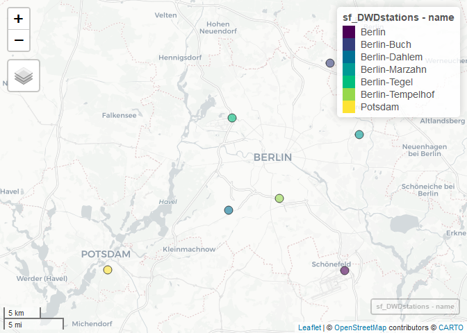
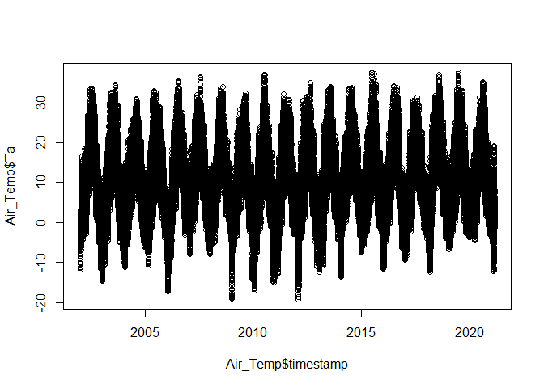

Downloading DWD Data
================
Alby
26/02/2021

``` r
suppressPackageStartupMessages({
library(readr)     #' #read files
library(sp)        #' #spDistsN1 function
library(mapview)   #' #mapview
library(dplyr, quietly = TRUE, verbose=F)     #' #arange
library(lubridate, quietly = TRUE, verbose=F) #' #ymd
library(stringr)   #'
library(webshot) })
```

All DWD stations locations

``` r
temp <- tempfile()
download.url <- "https://opendata.dwd.de/climate_environment/CDC/observations_germany/climate/hourly/air_temperature/recent/TU_Stundenwerte_Beschreibung_Stationen.txt"
download.file(download.url,temp,mode="wb")
```

``` r
suppressWarnings(
DWDstations <- read_table2(temp, locale = locale(encoding = "ASCII"),skip = 1,col_types = cols())
)
```

``` r
colnames(DWDstations) <- c("id","from_date","to_date","height",
                          "lat", "long", "name", "state")
```

``` r
DWDstations$to_date <- ymd(DWDstations$to_date)
DWDstations$from_date <- ymd(DWDstations$from_date)
```

``` r
unlink(temp)
```

**Coordination**

TUCC \* **Lat**: 52.512283° \* **Lon**: 13.327855°

Distance from TUB

``` r
DWDstations$distTUB <- spDistsN1(pts=as.matrix(cbind(DWDstations$long,
                                                     DWDstations$lat)),
                                 pt=c(13.327855,52.512283), 
                                 longlat=TRUE)
```

``` r
DWDstations <- filter(DWDstations, distTUB <= 30 & to_date >= "2021-01-01")
```

Let see where they are

``` r
sf_DWDstations <- SpatialPointsDataFrame(coords = as.matrix(DWDstations[,c('long','lat')]),
                                         data = DWDstations,
                                       proj4string = CRS("+init=epsg:4326"))  
```

``` r
mapview(sf_DWDstations, zcol='name', legend = TRUE)
```

<!-- -->

Distance from ROTH

``` r
DWDstations$distROTH <- spDistsN1(pts=as.matrix(cbind(DWDstations$long,
                                                    DWDstations$lat)),
                                  pt=c(13.315827,52.457232),
                                 longlat=TRUE)
```

``` r
arrange(DWDstations, distROTH)
```

    ## # A tibble: 7 x 10
    ##   id    from_date  to_date    height   lat  long name    state  distTUB distROTH
    ##   <chr> <date>     <date>      <dbl> <dbl> <dbl> <chr>   <chr>    <dbl>    <dbl>
    ## 1 00403 2002-01-01 2021-03-01     51  52.5  13.3 Berlin~ (FU)      6.76     1.04
    ## 2 00433 1951-01-01 2021-03-01     48  52.5  13.4 Berlin~ Berlin    7.09     5.97
    ## 3 00430 1986-01-01 2021-03-01     36  52.6  13.3 Berlin~ Berlin    5.94    11.9 
    ## 4 00427 1973-01-01 2021-03-01     46  52.4  13.5 Berlin  Brand~   20.1     16.9 
    ## 5 03987 1893-01-01 2021-03-01     81  52.4  13.1 Potsdam Brand~   23.2     19.2 
    ## 6 00420 2007-08-01 2021-03-01     60  52.5  13.6 Berlin~ Berlin   16.1     19.2 
    ## 7 00400 1991-01-01 2021-03-01     60  52.6  13.5 Berlin~ Berlin   17.7     23.1

**Download the DWD data** hourly data is divided in historical and
recent data example for the station number 00403

**air temperature (Ta)**

Download historical data

``` r
temp2 <- tempfile()
download.url2 <- "http://ftp-cdc.dwd.de/climate_environment/CDC/observations_germany/climate/hourly/air_temperature/historical/"
zipfile2 <- readLines(download.url2) 
zipfile2 <- unlist(stringr::str_extract_all(zipfile2, "stundenwerte_TU_00403_.+(.zip)"))
zipfile2 <- stringr::str_split(zipfile2, ">")[[1]][2]
download.file(paste0(download.url2,zipfile2),temp2, mode="wb")
metadata2 <- unzip(temp2)
unlink(temp2)
metadata2 
```

    ##  [1] "./Metadaten_Fehldaten_00403_20020101_20191231.html"
    ##  [2] "./Metadaten_Fehldaten_00403_20020101_20191231.txt" 
    ##  [3] "./Metadaten_Fehlwerte_00403_20020101_20191231.txt" 
    ##  [4] "./Metadaten_Fehlwerte_Gesamt_00403.txt"            
    ##  [5] "./Metadaten_Geographie_00403.txt"                  
    ##  [6] "./Metadaten_Geraete_Lufttemperatur_00403.html"     
    ##  [7] "./Metadaten_Geraete_Lufttemperatur_00403.txt"      
    ##  [8] "./Metadaten_Parameter_tu_stunde_00403.html"        
    ##  [9] "./Metadaten_Parameter_tu_stunde_00403.txt"         
    ## [10] "./Metadaten_Stationsname_00403.html"               
    ## [11] "./Metadaten_Stationsname_00403.txt"                
    ## [12] "./produkt_tu_stunde_20020101_20191231_00403.txt"

Read historical data

``` r
dwd.temp.hist <- read_delim(metadata2[12], 
                          ";", escape_double = FALSE, 
                            col_types = cols(MESS_DATUM = col_datetime(format="%Y%m%d%H")), 
                        trim_ws = TRUE)
```

``` r
summary(dwd.temp.hist)
```

    ##   STATIONS_ID    MESS_DATUM                       QN_9            TT_TU        
    ##  Min.   :403   Min.   :2002-01-01 00:00:00   Min.   : 3.000   Min.   :-999.00  
    ##  1st Qu.:403   1st Qu.:2006-07-31 21:30:00   1st Qu.: 3.000   1st Qu.:   4.00  
    ##  Median :403   Median :2011-01-22 20:00:00   Median : 3.000   Median :   9.90  
    ##  Mean   :403   Mean   :2011-01-20 10:25:36   Mean   : 4.034   Mean   :  10.11  
    ##  3rd Qu.:403   3rd Qu.:2015-07-13 05:30:00   3rd Qu.: 3.000   3rd Qu.:  16.10  
    ##  Max.   :403   Max.   :2019-12-31 23:00:00   Max.   :10.000   Max.   :  37.50  
    ##      RF_TU             eor           
    ##  Min.   :-999.00   Length:156687     
    ##  1st Qu.:  63.00   Class :character  
    ##  Median :  81.00   Mode  :character  
    ##  Mean   :  76.42                     
    ##  3rd Qu.:  93.00                     
    ##  Max.   : 100.00

Download recent data

``` r
temp3 <- tempfile()
download.url3 <- "http://ftp-cdc.dwd.de/climate_environment/CDC/observations_germany/climate/hourly/air_temperature/recent/"
zipfile3 <- readLines(download.url3)
zipfile3 <- unlist(str_extract_all(zipfile3, "stundenwerte_TU_00403_.+(.zip)"))
zipfile3 <- str_split(zipfile3, ">")[[1]][2]
download.file(paste0(download.url3,zipfile3),temp3, mode="wb")
metadata3 <- unzip(temp3)
unlink(temp3)
metadata3
```

    ##  [1] "./Metadaten_Fehldaten_00403_20190830_20210301.html"
    ##  [2] "./Metadaten_Fehldaten_00403_20190830_20210301.txt" 
    ##  [3] "./Metadaten_Fehlwerte_00403_20190830_20210301.txt" 
    ##  [4] "./Metadaten_Fehlwerte_Gesamt_00403.txt"            
    ##  [5] "./Metadaten_Geographie_00403.txt"                  
    ##  [6] "./Metadaten_Geraete_Lufttemperatur_00403.html"     
    ##  [7] "./Metadaten_Geraete_Lufttemperatur_00403.txt"      
    ##  [8] "./Metadaten_Parameter_tu_stunde_00403.html"        
    ##  [9] "./Metadaten_Parameter_tu_stunde_00403.txt"         
    ## [10] "./Metadaten_Stationsname_00403.html"               
    ## [11] "./Metadaten_Stationsname_00403.txt"                
    ## [12] "./produkt_tu_stunde_20190830_20210301_00403.txt"

Read recent data

``` r
dwd.temp.recent <- read_delim(metadata3[12],
                              ";", escape_double = FALSE, 
                            col_types = cols(MESS_DATUM = col_datetime(format="%Y%m%d%H")), 
                              trim_ws = TRUE)
```

``` r
head(dwd.temp.recent)
```

    ## # A tibble: 6 x 6
    ##   STATIONS_ID MESS_DATUM           QN_9 TT_TU RF_TU eor  
    ##         <dbl> <dttm>              <dbl> <dbl> <dbl> <chr>
    ## 1         403 2019-08-30 00:00:00     3  21.7    78 eor  
    ## 2         403 2019-08-30 01:00:00     3  21.6    75 eor  
    ## 3         403 2019-08-30 02:00:00     3  19.6    84 eor  
    ## 4         403 2019-08-30 03:00:00     3  20.1    85 eor  
    ## 5         403 2019-08-30 04:00:00     3  19.8    87 eor  
    ## 6         403 2019-08-30 05:00:00     3  20.3    85 eor

Join the historical and recent data

``` r
Air_Temp <- rbind(dwd.temp.hist, filter(dwd.temp.recent, year(MESS_DATUM)>=2020))
```

Rename the columns

``` r
colnames(Air_Temp) <- c("id","timestamp","QN_9","Ta","RH","eor")
```

``` r
summary(Air_Temp$Ta)
```

    ##    Min. 1st Qu.  Median    Mean 3rd Qu.    Max. 
    ## -999.00    4.00    9.90   10.09   16.10   37.50

Convert -999 to NA

``` r
Air_Temp <- na_if(Air_Temp, -999)
plot(x=Air_Temp$timestamp, y=Air_Temp$Ta)
```

<!-- -->
