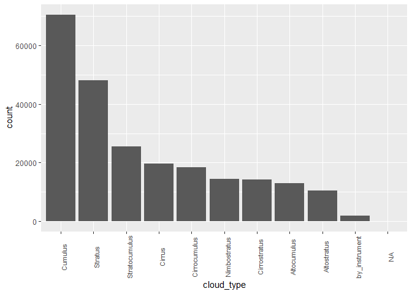
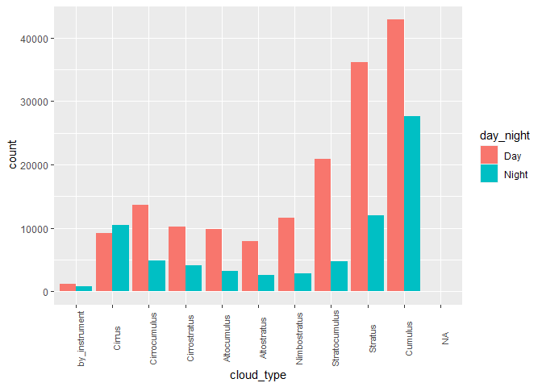
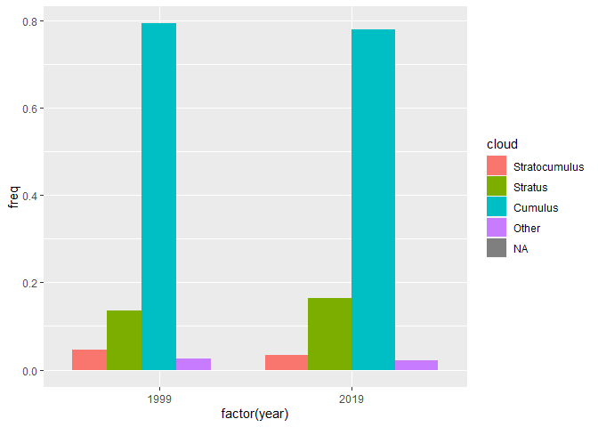

Statistics Course - UWI
================
AlbyDR
2021-03-10

## Example 2.2:Visualization - Part I: Categorical data

``` r
library(tidyverse)
```

``` r
library(lubridate)
```

``` r
DWD_data <- read_rds("DWD_prec_data.rds")
```

### Plotting categorical data

The visualization of Categorical variables are limited to represent
counts of cases in the chr vector (e.g. bar height) or used as a factor
to compare groups (cross-tabulated data) using a second variable
(discrete, continuous or categorical). Always check first if the
variable is nominal or ordinal.

You can add many different plots inside of a `ggplot() +`, here we will
focus on `geom_bar()` or `geom_col()`

**Bar Graph**

Lets start simple

``` r
fct_count(DWD_data$cloud_cover)
```

    ## # A tibble: 11 x 2
    ##    f                 n
    ##    <fct>         <int>
    ##  1 Cirrus        15949
    ##  2 Cirrocumulus  17568
    ##  3 Cirrostratus  13364
    ##  4 Altocumulus   12271
    ##  5 Altostratus    9565
    ##  6 Nimbostratus  13440
    ##  7 Stratocumulus 24090
    ##  8 Stratus       44080
    ##  9 Cumulus       60815
    ## 10 Cumulonimbus      0
    ## 11 NA             2170

*Plot*: \* cloud\_cover variable as it was not a factor

``` r
ggplot(DWD_data, aes(x=unclass(cloud_cover))) +
geom_bar()
```

<!-- -->

Using the aes in the geom\_ the result is the same `ggplot(DWD_data) +`
`geom_bar(aes(x=unclass(cloud_cover)))`

-   Cloud\_cover variable as a factor

``` r
ggplot(DWD_data, aes(x=cloud_cover)) +
  geom_bar()
```

<!-- -->

Plot ordering cloud\_cover according the frequency

Lets introduce pipe operator `%>%` to manipulate and summarise variables
(i.e.vectors) without create a new variable or dataset.Include
`%>% fct_rev()` to revert.

``` r
DWD_data %>% 
  mutate(cloud_cover = cloud_cover %>% fct_infreq()) %>% 
  count(cloud_cover, sort = TRUE) %>%
  print(n = Inf)  # print all the lines
```

    ## # A tibble: 10 x 2
    ##    cloud_cover       n
    ##    <fct>         <int>
    ##  1 Cumulus       60815
    ##  2 Stratus       44080
    ##  3 Stratocumulus 24090
    ##  4 Cirrocumulus  17568
    ##  5 Cirrus        15949
    ##  6 Nimbostratus  13440
    ##  7 Cirrostratus  13364
    ##  8 Altocumulus   12271
    ##  9 Altostratus    9565
    ## 10 NA             2170

Very similar to `fct_count(DWD_data$cloud_cover)` but in order according
to n

``` r
DWD_data %>% 
  mutate(cloud_cover = cloud_cover %>% fct_infreq()) %>%  
  ggplot(aes(cloud_cover)) + 
  geom_bar()
```

<!-- -->

Reducing to 6 categories (aggregate remains on others)

``` r
DWD_data %>%
  mutate(cloud_cover = fct_lump(cloud_cover, n = 6)) %>%
  count(cloud_cover, sort = TRUE) %>%
  print(n = Inf)
```

    ## # A tibble: 7 x 2
    ##   cloud_cover       n
    ##   <fct>         <int>
    ## 1 Cumulus       60815
    ## 2 Stratus       44080
    ## 3 Other         37370
    ## 4 Stratocumulus 24090
    ## 5 Cirrocumulus  17568
    ## 6 Cirrus        15949
    ## 7 Nimbostratus  13440

``` r
DWD_data %>%
  mutate(cloud_cover = fct_lump(cloud_cover, n = 6)) %>%
  ggplot(aes(cloud_cover)) + 
  geom_bar()
```

<!-- -->

Just in case you miss a pie chart,… just in case

``` r
DWD_data %>% 
  mutate(cloud_cover = cloud_cover %>% fct_infreq()) %>% 
  count(cloud_cover, sort = TRUE) %>%
  ggplot() +
  geom_col(aes(x = 1, y = n, fill = cloud_cover), position = "fill") +
  coord_polar(theta = "y") # trick, check without this line
```

<!-- -->

Can be better!

``` r
DWD_data %>% 
  mutate(cloud_cover = cloud_cover %>% fct_infreq()) %>% 
  count(cloud_cover, sort = TRUE) %>%
  ggplot() +
  geom_col(aes(x = 1, y = n, fill = cloud_cover), position = "fill") +
  geom_text(aes(x = 0, y = 0, label = "Cloud")) + # text in the middle
  coord_polar(theta = "y") +
  xlim(0, 1.5) + # role in the middle
  theme_bw() +
  theme(axis.title = element_blank(), # taking out the axis and extra info
        axis.text = element_blank(),
        axis.ticks = element_blank(),
        strip.background=element_blank(),
        strip.text=element_blank(),
        panel.grid.major = element_blank(),
        panel.grid.minor = element_blank(),
        panel.border = element_blank())
```

<!-- -->

**Combining two variables in a plot**

``` r
ggplot(DWD_data, aes(x = cloud_cover, y=precip_mm, fill = cloud_cover)) +
  geom_col(position = "dodge")
```

    ## Warning: Removed 1670 rows containing missing values (geom_col).

<!-- -->

``` r
ggplot(DWD_data, aes(x = year(timestamp), y=precip_mm, fill = cloud_cover)) +
  geom_col(position = "dodge")
```

    ## Warning: Removed 1670 rows containing missing values (geom_col).

<!-- -->

Lets filter for the years 1999 and 2019

``` r
DWD_data %>% 
  filter(year(timestamp)==1999 | year(timestamp)==2019) %>%
  #print(n = 10)  
  ggplot() +
  geom_col(aes(x = factor(year(timestamp)), y = precip_mm, 
               fill = cloud_cover), position = "dodge")
```

    ## Warning: Removed 197 rows containing missing values (geom_col).

<!-- -->

We can do better!

``` r
DWD_data %>%
  filter(year(timestamp)==1999 | year(timestamp)==2019) %>% 
  mutate(cloud_cover = fct_lump(cloud_cover, n = 3)) %>%
  group_by(year=year(timestamp), cloud=cloud_cover) %>%
  summarise(n = n(),
            mm = sum(precip_mm, na.rm=T))%>%
  mutate(freq = mm / sum(mm), ) %>%
  #print(n = Inf)
  ggplot(aes(x = cloud, y = freq, fill = factor(year))) +
  geom_col(position = "dodge")
```

    ## `summarise()` has grouped output by 'year'. You can override using the `.groups` argument.

<!-- -->

**Stacked bar graph**

``` r
DWD_data %>%
  mutate(cloud_cover = fct_lump(cloud_cover, n = 3),
         sunlight_times = fct_collapse(sunlight_times, 
                                       "Day" = unique(sunlight_times)[-1])) %>%
  group_by(sunlight=sunlight_times, cloud=cloud_cover) %>%
  summarise(n = n(),
            mm = sum(precip_mm, na.rm=T))%>%
  #print(n = Inf)
  ggplot(aes(x = cloud, y = mm, fill = factor(sunlight))) +
  geom_col()
```

    ## `summarise()` has grouped output by 'sunlight'. You can override using the `.groups` argument.

<!-- -->

100% stacked bar graph

``` r
DWD_data %>%
  filter(year(timestamp)==1999 | year(timestamp)==2019) %>% 
  mutate(cloud_cover = fct_lump(cloud_cover, n = 3)) %>%
  group_by(year=year(timestamp), cloud=cloud_cover) %>%
  summarise(n = n(),
            mm = sum(precip_mm, na.rm=T))%>%
  mutate(freq = mm / sum(mm), ) %>%
  #print(n = Inf)
  ggplot(aes(x =factor(year) , y = freq, fill = cloud)) +
  geom_col()
```

    ## `summarise()` has grouped output by 'year'. You can override using the `.groups` argument.

<!-- -->

Exercise: 1. Run the plot below and answer, What these plots show
different from the previous using mm 1. Plot the variable
`sunlight_times` in a bar graph

``` r
DWD_data %>%
  mutate(prec_hour = as_factor(prec_hour) %>% 
           fct_recode(sunny = "0", raining = "1")) %>%
  ggplot(aes(x = factor(cloud_cover), fill = factor(prec_hour))) +
  geom_bar(position = "dodge")
```

<!-- -->

``` r
DWD_data %>%
  mutate(prec_hour = as_factor(prec_hour) %>% 
           fct_recode(sunny = "0", raining = "1")) %>%
  ggplot(aes(x = prec_hour, fill = cloud_cover)) +
  geom_bar(position = "dodge")
```

<!-- -->
