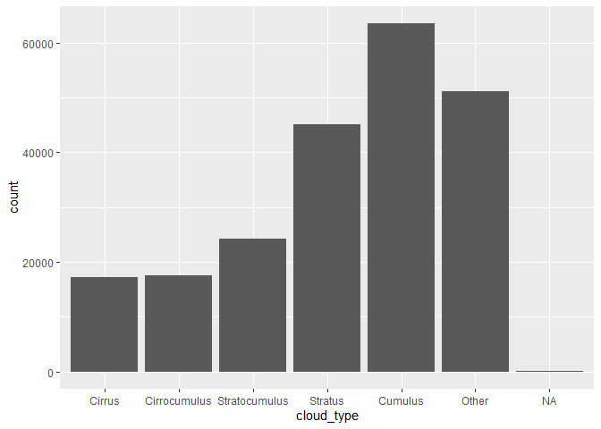
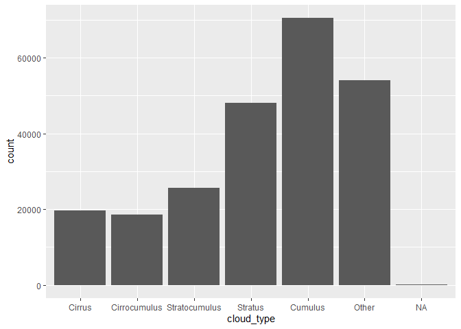
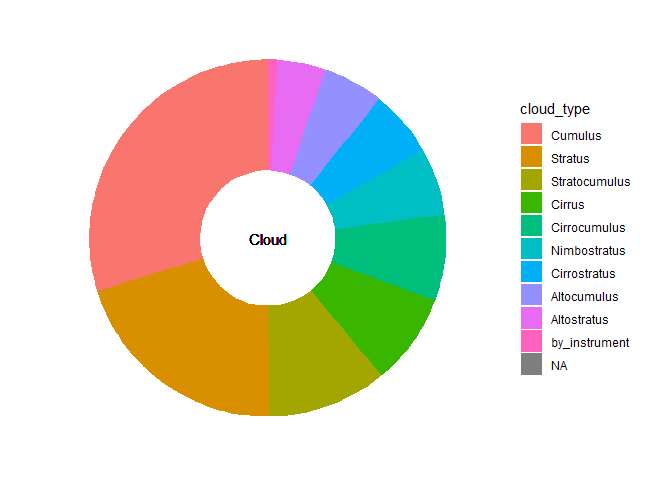

Statistics Course - UWI
================
AlbyDR
2021-03-22

## Example 2.2:Visualization -

### Part I: discrete or categorical data

``` r
suppressPackageStartupMessages({
library(tidyverse)
library(lubridate)
library(kableExtra) })
```

``` r
DWD_precipitation <- read_rds("DWD_precipitation.rds")
```

### Plotting discrete/categorical variables

The visualization of Categorical variables are limited to represent
counts of cases of the <chr> vector (e.g. bar height).

Always check first if the categorical variable is nominal or ordinal.

**One variable plot** (one layer also)

`ggplot() +` `geom_bar()`, `geom_col` or `geom_point()`

**Bar Graph**

Lets start simple

``` r
fct_count(DWD_precipitation$cloud_type)
```

    ## # A tibble: 12 x 2
    ##    f                 n
    ##    <fct>         <int>
    ##  1 by_instrument  1828
    ##  2 Cirrus        17236
    ##  3 Cirrocumulus  17589
    ##  4 Cirrostratus  13550
    ##  5 Altocumulus   12359
    ##  6 Altostratus    9784
    ##  7 Nimbostratus  13663
    ##  8 Stratocumulus 24312
    ##  9 Stratus       45147
    ## 10 Cumulus       63541
    ## 11 Cumulonimbus      0
    ## 12 <NA>             87

*Plot*: \* cloud\_type variable as it was not a factor

``` r
ggplot(DWD_precipitation) +
  geom_bar(aes(x=unclass(cloud_type)))
```

    ## Warning: Removed 87 rows containing non-finite values (stat_count).

<!-- -->

notice that the level 10 (Cumulonimbus) has no occurrence

Using the aes in the <ggplot> the result is the same
`ggplot(DWD_precipitation, aes(x=unclass(cloud_type))) +` `geom_bar()`

-   cloud\_type variable as a factor

``` r
ggplot(DWD_precipitation, aes(x=cloud_type)) +
  geom_bar()+
  theme(axis.text.x = element_text(size = 8, angle = 90))
```

<!-- -->

[see here all the theme
elements](https://ggplot2.tidyverse.org/reference/theme.html) notice
that Cumulonimbus is not showing and NA is now label

### Plot ordering cloud\_type according the frequency

**table maniopulation** Lets introduce pipe operator `%>%` to manipulate
and summarise variables (i.e.vectors) without create a new variable or
dataset.

``` r
DWD_precipitation %>% 
  mutate(cloud_type = cloud_type %>% fct_infreq()) %>% # %>%Include `%>% fct_rev()` to revert order.
  count(cloud_type, sort = TRUE) %>%
  print(n = Inf)  # print all the lines in the console
```

    ## # A tibble: 11 x 2
    ##    cloud_type        n
    ##    <fct>         <int>
    ##  1 Cumulus       63541
    ##  2 Stratus       45147
    ##  3 Stratocumulus 24312
    ##  4 Cirrocumulus  17589
    ##  5 Cirrus        17236
    ##  6 Nimbostratus  13663
    ##  7 Cirrostratus  13550
    ##  8 Altocumulus   12359
    ##  9 Altostratus    9784
    ## 10 by_instrument  1828
    ## 11 <NA>             87

or a customized table in the Viewer `kbl() %>%`
`kable_styling(bootstrap_options = "striped", full_width = F, position = "left")`

or a plot in the Viewer using the modified data without change the
original

``` r
DWD_precipitation %>% 
  mutate(cloud_type = cloud_type %>% fct_infreq()) %>%  
  ggplot(aes(cloud_type)) + 
  geom_bar() +
  theme(axis.text.x = element_text(size = 8, angle = 90))
```

<!-- -->

Reducing to 5 categories (aggregate remains on others)

``` r
DWD_precipitation %>%
  mutate(cloud_type = fct_lump(cloud_type, n = 5)) %>%
  count(cloud_type, sort = TRUE) %>%
  print(n = Inf)
```

    ## # A tibble: 7 x 2
    ##   cloud_type        n
    ##   <fct>         <int>
    ## 1 Cumulus       63541
    ## 2 Other         51184
    ## 3 Stratus       45147
    ## 4 Stratocumulus 24312
    ## 5 Cirrocumulus  17589
    ## 6 Cirrus        17236
    ## 7 <NA>             87

``` r
DWD_precipitation %>%
  mutate(cloud_type = fct_lump(cloud_type, n = 5)) %>%
  ggplot(aes(cloud_type)) + 
  geom_bar()
```

<!-- -->

the category *other* should not be bigger than the smaller category
showed

**Pie chart** Just in case you miss a pie chart,… just in case

``` r
DWD_precipitation %>% 
  mutate(cloud_type = cloud_type %>% fct_infreq()) %>% 
  count(cloud_type, sort = TRUE) %>%
  ggplot() +
  geom_col(aes(x = 1, y = n, fill = cloud_type), position = "fill") +
  coord_polar(theta = "y") # trick, check without this line
```

<!-- -->

the geom\_ is for a column graph but Polar coordinate instead of
Cartesian

Can be better!

``` r
DWD_precipitation %>% 
  mutate(cloud_type = cloud_type %>% fct_infreq()) %>% 
  count(cloud_type, sort = TRUE) %>%
  ggplot() +
  geom_col(aes(x = 1, y = n, fill = cloud_type), position = "fill") +
  geom_text(aes(x = 0, y = 0, label = "Cloud")) + # text in the middle
  coord_polar(theta = "y") +
  xlim(0, 1.5) + # role in the middle
  theme_bw() +
  theme(axis.title = element_blank(), # taking out the axis and extra info
        axis.text = element_blank(),
        axis.ticks = element_blank(),
        strip.background=element_blank(),
        strip.text=element_blank(),
        panel.grid.major = element_blank(),
        panel.grid.minor = element_blank(),
        panel.border = element_blank())
```

<!-- -->

**Two variables in a plot** (but it still one layer)

A factor can be used to compare groups (cross-tabulated data) using a
second variable (discrete, continuous or categorical).

**Two categorical variables**

``` r
DWD_precipitation %>%
  mutate(day_night = fct_collapse(sunlight_times, 
                          "Day" = unique(sunlight_times)[-1])) %>%
ggplot() +
  geom_bar(aes(x = cloud_type, fill = day_night), position = "dodge") +
  theme(axis.text.x = element_text(size = 8, angle = 90))
```

<!-- -->

**Stacked bar graph**

``` r
DWD_precipitation %>%
mutate(day_night = fct_collapse(sunlight_times, 
                                "Day" = unique(sunlight_times)[-1])) %>%
  ggplot() +
  geom_bar(aes(x = cloud_type, fill = day_night))
```

<!-- -->

**100% stacked bar graph**

``` r
DWD_precipitation %>%
  mutate(day_night = fct_collapse(sunlight_times, 
                                  "Day" = unique(sunlight_times)[-1])) %>%
  ggplot() +
  geom_bar(aes(x = cloud_type, fill = day_night), position = "fill")
```

<!-- -->

**Percentage bar graph** by hand

``` r
DWD_precipitation %>%
filter(year(timestamp)==1999 | year(timestamp)==2019) %>% 
  mutate(cloud_type = fct_lump(cloud_type, n = 3)) %>%
  group_by(year=year(timestamp), cloud=cloud_type) %>%
  summarise(n = n(),
            mm = sum(precip_mm, na.rm=T))%>%
  mutate(freq = mm / sum(mm), ) %>%
  #print(n = Inf)
  ggplot(aes(x =factor(year) , y = freq, fill = cloud)) +
  geom_col(position = "dodge")
```

    ## `summarise()` has grouped output by 'year'. You can override using the `.groups` argument.

<!-- -->

Plotting precipitation (mm) per cloud\_type

``` r
ggplot(DWD_precipitation) +
  geom_col(aes(x = cloud_type, y = precip_mm)) + 
  theme(axis.text.x = element_text(size = 8, angle = 90))
```

    ## Warning: Removed 1410 rows containing missing values (position_stack).

<!-- -->

Seems that most of the precipitation occurs in the presence of Cumulus
clouds

``` r
ggplot(DWD_precipitation) +
  geom_col(aes(x = factor(year(timestamp)), y = precip_mm, 
               fill = cloud_type), position = "dodge")
```

    ## Warning: Removed 1410 rows containing missing values (geom_col).

<!-- -->

Lets filter for the years 1999 and 2019

``` r
DWD_precipitation %>% 
  filter(year(timestamp)==1999 | year(timestamp)==2019) %>%
  #print(n = 10)  
  ggplot() +
  geom_col(aes(x = factor(year(timestamp)), y = precip_mm, 
               fill = cloud_type), position = "dodge")
```

    ## Warning: Removed 197 rows containing missing values (geom_col).

<!-- -->

We can do better!

``` r
DWD_precipitation %>%
  filter(year(timestamp)==1999 | year(timestamp)==2019) %>% 
  mutate(cloud_type = fct_lump(cloud_type, n = 3)) %>%
  group_by(year=year(timestamp), cloud=cloud_type) %>%
  summarise(n = n(),
            mm = sum(precip_mm, na.rm=T))%>%
  mutate(freq = mm / sum(mm), ) %>%
  #print(n = Inf)
  ggplot(aes(x = cloud, y = freq, fill = factor(year))) +
  geom_col(position = "dodge") +
  labs(x="cloud type", y='%') +
  scale_fill_manual(name="Year",values = c("blue","green"))
```

    ## `summarise()` has grouped output by 'year'. You can override using the `.groups` argument.

<!-- -->

Exercise:

1.  Run the plot below and answer, What these plots show different from
    the previous using mm
2.  Plot the variable `sunlight_times` in a bar graph

``` r
DWD_precipitation %>%
  mutate(prec_hour = as_factor(precip_h) %>% 
           fct_recode(sunny = "0", raining = "1")) %>%
  #print(n=10)
  ggplot(aes(x = factor(cloud_type), fill = factor(prec_hour))) +
  geom_bar(position = "dodge")
```

<!-- -->

``` r
DWD_precipitation %>%
  mutate(prec_hour = as_factor(precip_h) %>% 
           fct_recode(sunny = "0", raining = "1")) %>%
  ggplot(aes(x = prec_hour, fill = cloud_type)) +
  geom_bar(position = "dodge") +
  theme(axis.text.x = element_text(size = 8, angle = 90))
```

<!-- -->
