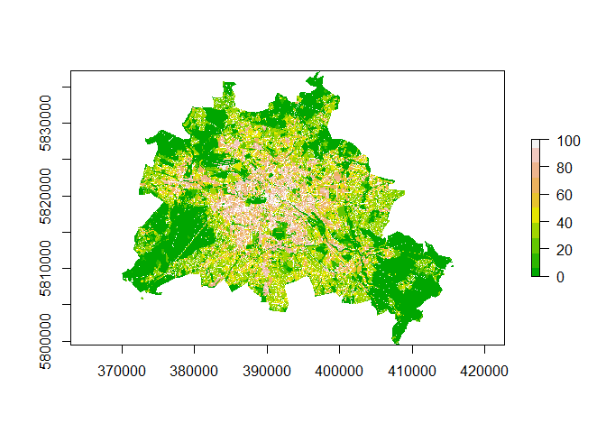
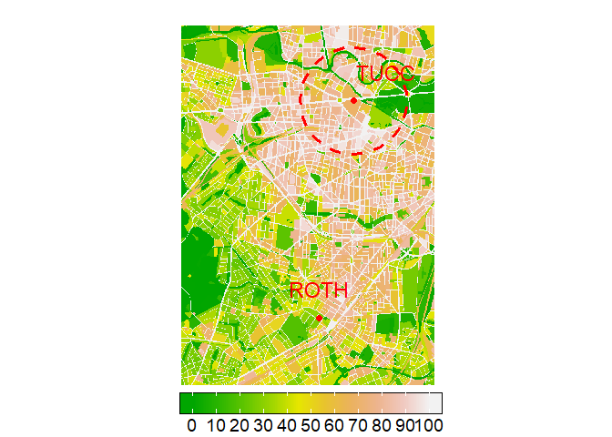
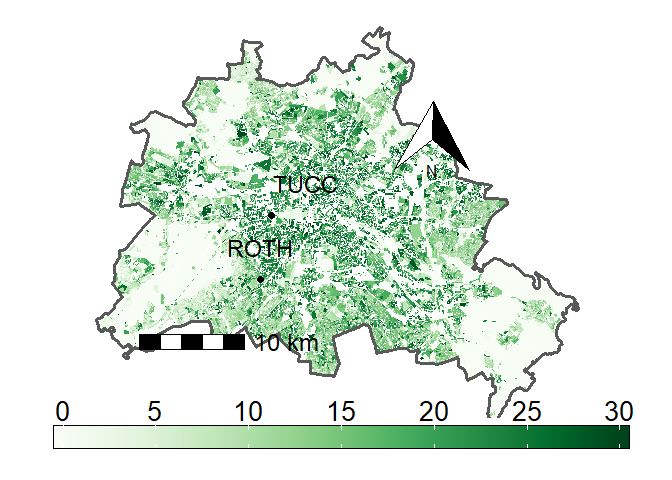
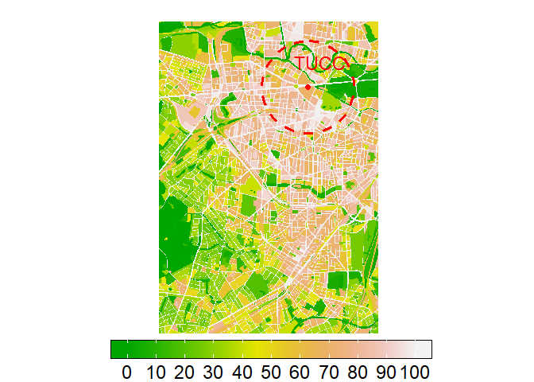

Statistics Course - UWI
================
AlbyDR
2021-03-22

## Example 2.2:Visualization -

### Part III: maps

``` r
suppressPackageStartupMessages({
library(raster)
library(httr)
library(sf)
library(dplyr)
library(fasterize)
library(ggplot2)
library(rasterVis)
library(ggspatial)
library(sp)
library(sf)
library(raster)
library(RColorBrewer)
library(geobuffer) }) # geobuffer_pts
```

functions to import maps from the atlas

``` r
get_X_Y_coordinates <- function(x) {
  sftype <- as.character(sf::st_geometry_type(x, by_geometry = FALSE))
  if(sftype == "POINT") {
    xy <- as.data.frame(sf::st_coordinates(x))
    dplyr::bind_cols(x, xy)
  } else {
    x
  }
}

sf_fisbroker <- function(url) {
  typenames <- basename(url)
  url <- httr::parse_url(url)
  url$query <- list(service = "wfs",
                    version = "2.0.0",
                    request = "GetFeature",
                    srsName = "EPSG:25833",
                    TYPENAMES = typenames)
  request <- httr::build_url(url)
  print(request)
  out <- sf::read_sf(request)
  out <- sf::st_transform(out, 4326)
  out <- get_X_Y_coordinates(out)
  return(out)
}

export_format <- c(
  "geojson", 
  "sqlite"
)

sf_save <- function(z, fname) {
  ifelse(!dir.exists(fname), dir.create(fname), "Folder exists already")
  ff <- paste(file.path(fname, fname), export_format, sep = ".")
  purrr::walk(ff, ~{ sf::st_write(z, .x, delete_dsn = TRUE)})
  saveRDS(z, paste0(file.path(fname, fname), ".rds"))
  
}
```

funtion to resample

``` r
resample_to_footprint = function(r, footprint_rast) {
  r_new = raster::crop(x=r, y=extent(footprint_rast))  # first crop 
  r_new = raster::projectRaster(r_new, footprint_rast) # reproject
  return(r_new)
}
```

import the Imprevious map - ekd102

``` r
###################################################################
# 01.02 Impervious Soil Coverage (Sealing of Soil Surface) (Edition 2017)
###################################################################
#   The real use of the built-up areas, the existing green and open space,
# the urban structure, the sealing and the types of surface. 
# Spatial reference block / partial block map ISU5 (Information System
# City and Environment) as of December 31, 2015.
####################################################################
```

``` r
impervious_map <- sf_fisbroker("https://fbinter.stadt-berlin.de/fb/wfs/data/senstadt/sach_nutz2015_nutzsa")
```

    ## [1] "https://fbinter.stadt-berlin.de/fb/wfs/data/senstadt/sach_nutz2015_nutzsa?service=wfs&version=2.0.0&request=GetFeature&srsName=EPSG%3A25833&TYPENAMES=sach_nutz2015_nutzsa"

``` r
impervious_map <- impervious_map %>%
  dplyr::mutate(RAUMID = stringr::str_sub(gml_id, 12, 19)) %>%
  dplyr::select(gml_id, RAUMID, everything()) %>%
  dplyr::arrange(RAUMID)
```

``` r
dplyr::glimpse(impervious_map)
```

    ## Rows: 25,352
    ## Columns: 19
    ## $ gml_id     <chr> "sach_nutz2015_nutzsa.0100980011000100", "sach_nutz2015_nut~
    ## $ RAUMID     <chr> "15_nutzs", "15_nutzs", "15_nutzs", "15_nutzs", "15_nutzs",~
    ## $ BEZIRK     <chr> "Mitte", "Mitte", "Mitte", "Mitte", "Mitte", "Mitte", "Mitt~
    ## $ WOZ_NAME   <chr> "Wohnnutzung", "Verkehrsfläche (ohne Straßen)", "Wohnnutzun~
    ## $ STSTRNAME  <chr> "Zeilenbebauung seit den 50er Jahren", "Bebauung mit überwi~
    ## $ TYPKLAR    <chr> "Freie Zeilenbebauung mit landschaftlichem Siedlungsgrün (1~
    ## $ FLALLE     <int> 4624, 13431, 5604, 34345, 48930, 13978, 7323, 20959, 99838,~
    ## $ STR_FLGES  <int> 2369, 3184, 2466, 8138, 2825, 3614, 1606, 331, 10012, 0, 0,~
    ## $ VG         <dbl> 69.30, 38.56, 83.53, 73.07, 76.37, 54.67, 91.42, 19.04, 47.~
    ## $ VG_0       <dbl> 69.30, 38.56, 83.53, 73.07, 76.37, 54.67, 91.42, 19.04, 47.~
    ## $ PROBAU     <dbl> 30.81, 0.04, 19.75, 33.65, 40.82, 12.34, 48.75, 0.05, 16.45~
    ## $ PROVGNEU   <dbl> 38.49, 38.52, 63.78, 39.42, 35.54, 42.32, 42.67, 18.98, 31.~
    ## $ PROVGNEU_0 <dbl> 38.49, 38.52, 63.78, 39.42, 35.54, 42.32, 42.67, 18.98, 31.~
    ## $ KL1        <int> 49, 42, 20, 45, 42, 31, 74, 30, 54, 31, 7, 45, 20, 15, 30, ~
    ## $ KL2        <int> 46, 32, 60, 28, 38, 56, 20, 20, 25, 56, 42, 28, 60, 67, 20,~
    ## $ KL3        <int> 3, 19, 10, 13, 8, 1, 1, 5, 3, 1, 5, 13, 10, 7, 5, 3, 4, 15,~
    ## $ KL4        <int> 2, 7, 10, 14, 12, 12, 5, 45, 18, 12, 46, 14, 10, 11, 45, 19~
    ## $ GRZ_NAME   <chr> NA, NA, NA, NA, NA, NA, NA, "Park / Grünfläche", NA, NA, NA~
    ## $ geometry   <MULTIPOLYGON [°]> MULTIPOLYGON (((13.3683 52...., MULTIPOLYGON (~

sf\_save(impervious\_map, “impervious\_map”)

``` r
summary(impervious_map)
```

    ##     gml_id             RAUMID             BEZIRK            WOZ_NAME        
    ##  Length:25352       Length:25352       Length:25352       Length:25352      
    ##  Class :character   Class :character   Class :character   Class :character  
    ##  Mode  :character   Mode  :character   Mode  :character   Mode  :character  
    ##                                                                             
    ##                                                                             
    ##                                                                             
    ##                                                                             
    ##   STSTRNAME           TYPKLAR              FLALLE          STR_FLGES    
    ##  Length:25352       Length:25352       Min.   :     55   Min.   :    0  
    ##  Class :character   Class :character   1st Qu.:   9930   1st Qu.: 1438  
    ##  Mode  :character   Mode  :character   Median :  17812   Median : 3300  
    ##                                        Mean   :  31329   Mean   : 3929  
    ##                                        3rd Qu.:  31104   3rd Qu.: 5406  
    ##                                        Max.   :4233009   Max.   :78888  
    ##                                                          NA's   :697    
    ##        VG              VG_0            PROBAU          PROVGNEU     
    ##  Min.   :  0.00   Min.   :  0.00   Min.   :  0.00   Min.   :  0.00  
    ##  1st Qu.: 13.16   1st Qu.:  8.45   1st Qu.:  0.19   1st Qu.:  6.10  
    ##  Median : 33.83   Median : 33.16   Median : 18.48   Median : 14.29  
    ##  Mean   : 35.97   Mean   : 34.75   Mean   : 19.31   Mean   : 16.66  
    ##  3rd Qu.: 54.09   3rd Qu.: 52.60   3rd Qu.: 27.11   3rd Qu.: 23.09  
    ##  Max.   :100.00   Max.   :100.00   Max.   :100.00   Max.   :100.00  
    ##                                                                     
    ##    PROVGNEU_0          KL1             KL2             KL3        
    ##  Min.   :  0.00   Min.   : 0.00   Min.   : 0.00   Min.   : 0.000  
    ##  1st Qu.:  4.26   1st Qu.:15.00   1st Qu.:20.00   1st Qu.: 1.000  
    ##  Median : 13.56   Median :20.00   Median :37.00   Median : 2.000  
    ##  Mean   : 15.44   Mean   :26.34   Mean   :39.31   Mean   : 4.859  
    ##  3rd Qu.: 22.15   3rd Qu.:42.00   3rd Qu.:65.00   3rd Qu.: 5.000  
    ##  Max.   :100.00   Max.   :85.00   Max.   :74.00   Max.   :32.000  
    ##                   NA's   :697     NA's   :697     NA's   :697     
    ##       KL4          GRZ_NAME                  geometry    
    ##  Min.   : 0.00   Length:25352       MULTIPOLYGON :25352  
    ##  1st Qu.: 6.00   Class :character   epsg:4326    :    0  
    ##  Median :13.00   Mode  :character   +proj=long...:    0  
    ##  Mean   :29.39                                           
    ##  3rd Qu.:45.00                                           
    ##  Max.   :90.00                                           
    ##  NA's   :697

``` r
str(filter(impervious_map, FLALLE==160724)) #key TUCC
```

    ## sf [1 x 19] (S3: sf/tbl_df/tbl/data.frame)
    ##  $ gml_id    : chr "sach_nutz2015_nutzsa.0700231951000000"
    ##  $ RAUMID    : chr "15_nutzs"
    ##  $ BEZIRK    : chr "Charlottenburg-Wilmersdorf"
    ##  $ WOZ_NAME  : chr "Gemeinbedarfs- und Sondernutzung"
    ##  $ STSTRNAME : chr "Bebauung mit überwiegender Nutzung durch Gemeinbedarf und Sondernutzung, Verkehrsflächen ohne Straßenland oder Baustellen"
    ##  $ TYPKLAR   : chr "Hochschule und Forschung"
    ##  $ FLALLE    : int 160724
    ##  $ STR_FLGES : int 38266
    ##  $ VG        : num 68.9
    ##  $ VG_0      : num 68.9
    ##  $ PROBAU    : num 47.5
    ##  $ PROVGNEU  : num 21.4
    ##  $ PROVGNEU_0: num 21.4
    ##  $ KL1       : int 15
    ##  $ KL2       : int 70
    ##  $ KL3       : int 12
    ##  $ KL4       : int 3
    ##  $ GRZ_NAME  : chr NA
    ##  $ geometry  :sfc_MULTIPOLYGON of length 1; first list element: List of 1
    ##   ..$ :List of 1
    ##   .. ..$ : num [1:33, 1:2] 13.3 13.3 13.3 13.3 13.3 ...
    ##   ..- attr(*, "class")= chr [1:3] "XY" "MULTIPOLYGON" "sfg"
    ##  - attr(*, "sf_column")= chr "geometry"
    ##  - attr(*, "agr")= Factor w/ 3 levels "constant","aggregate",..: NA NA NA NA NA NA NA NA NA NA ...
    ##   ..- attr(*, "names")= chr [1:18] "gml_id" "RAUMID" "BEZIRK" "WOZ_NAME" ...

``` r
#$ VG        : num 68.9 = Sealing, track ballast is considered sealed [% of area size]
#$ VG_0      : num 68.9 = Sealing, track ballast is considered unsealed [% of area size]
#$ PROBAU    : num 47.5 = Built-up sealed area [% of area size]
#$ PROVGNEU  : num 21.4 = Sealed area undeveloped, track ballast is considered sealed [% of area size]
#$ PROVGNEU_0: num 21.4 = Unbuilt sealed area, track ballast is considered unsealed [% of area size]
#$ KL1       : int 15   = Surface type 1 [% of undeveloped sealed area]
#$ KL2       : int 70   = Surface type 2 [% of undeveloped sealed area]
#$ KL3       : int 12   = Surface type 3 [% of undeveloped sealed area]
#$ KL4       : int 3    = Surface type 4 [% of undeveloped sealed area]
```

``` r
impervious_map <- st_transform(impervious_map, crs("+proj=utm +zone=33 +datum=WGS84 +units=m +no_defs"))
```

create an empty raster of 10m resolution

``` r
map_raster <- raster(xmn=370000,xmx=415741,ymn=5799519,ymx=5837199, 
               res=10,crs=crs("+proj=utm +zone=33 +datum=WGS84 +units=m +no_defs"))
```

``` r
raster_imprevious <- raster::stack(
  fasterize(impervious_map, map_raster, field="VG",fun="max"),
  fasterize(impervious_map, map_raster, field="VG",fun="max"),
  fasterize(impervious_map, map_raster, field="PROBAU",fun="max"),
  fasterize(impervious_map, map_raster, field="PROVGNEU_0",fun="max"))
```

``` r
raster_imprevious[[2]]@data@values[which(is.na(raster_imprevious[[2]]@data@values))] <- 100
```

``` r
names(raster_imprevious) <- c("Impervious","Impervious_with_str",
                               "Built_up_area","Unbuilt")
```

``` r
plot(raster_imprevious[[1]], col=terrain.colors(10))
```

<!-- -->

``` r
imprevious_zoom <- crop(raster_imprevious, extent(381673,388803,5811189,5821467))
```

EC Tower and DWD stations points

``` r
points <- data.frame(
  x = c(385566.5, 384597.4, 386525.1,385368.3),
  y = c(5813229, 5812858, 5819332,5825159),
  city = c("ROTH", "DWD_Dahlem", "TUCC", "DWD_Tegel"))
```

create a buffer around the tower

``` r
pts_buf_1500m <- geobuffer_pts(xy = data.frame(lon = 13.32785,  
                                               lat = 52.51228), 
                               dist_m = 1500, output = "sp")
```

``` r
summary(pts_buf_1500m)
```

    ## Object of class SpatialPolygons
    ## Coordinates:
    ##        min      max
    ## x 13.30576 13.34994
    ## y 52.49880 52.52576
    ## Is projected: FALSE 
    ## proj4string : [+proj=longlat +datum=WGS84 +no_defs]

``` r
pts_buf_1500m <- spTransform(pts_buf_1500m, CRS("+proj=utm +zone=33 +datum=WGS84 +units=m +no_defs"))
```

``` r
plot(imprevious_zoom$Impervious,axes = F, box = F) #,horizontal=TRUE,legend.args=list(text='impervious (%)')
plot(pts_buf_1500m, add = T, lwd = .5, fg = 2)  
```

<!-- -->

``` r
load(url("https://userpage.fu-berlin.de/soga/300/30100_data_sets/berlin_district.RData"))
st_geometry(berlin.sf)
```

    ## Geometry set for 1 feature 
    ## geometry type:  MULTIPOLYGON
    ## dimension:      XY
    ## bbox:           xmin: 777974.1 ymin: 5808837 xmax: 823510.5 ymax: 5845512
    ## projected CRS:  ETRS89 / UTM zone 32N

    ## MULTIPOLYGON (((802565.3 5844831, 802587.7 5844...

``` r
berlin.Border <- st_transform(berlin.sf, crs(raster_imprevious))
```

Vegetation Height Berlin

``` r
ggplot() +
  layer_spatial(raster_imprevious$Unbuilt) + 
  layer_spatial(berlin.sf, fill="transparent", size=1.2) + 
  #layer_spatial(pts_buf_1500m, fill="transparent", col="red", size=1.2, linetype="dashed") + 
  geom_spatial_point(aes(x=points$x[c(1,3)], y=points$y[c(1,3)]), 
                     crs =crs(raster_imprevious), size=2, 
                     col=c("black","black")) +
  geom_spatial_label(aes(x=points$x[c(1,3)], y=points$y[c(1,3)],label=points$city[c(1,3)]),
                     crs = crs(raster_imprevious),
                     fill="transparent", col=c("black","black"), 
                     vjust=c(-0.5,-0.5),
                     hjust=c(0.5, .05), label.size= 0, size=6) +
  guides(linetype = guide_legend(title=NULL, order = 2), 
         color = guide_legend(order=1)) +
  scale_fill_gradientn(breaks=seq(0,30,5),limits=c(0,30),
                       colors=brewer.pal('Greens', n=9), name="",na.value = NA,
                       guide =guide_colorbar(direction = "horizontal",
                                             label.position = "bottom",
                                             title.vjust=9, label.vjust=9,
                                             frame.colour = "black",
                                             frame.linewidth = 0.5,
                                             frame.linetype = 1,
                                             title.position = "left",
                                             barwidth=30,barheight=1.2,nbin=30,
                                             label.theme=element_text(angle=0,size=20))) +
  annotation_scale(location = "bl", height = unit(0.4, "cm"),
                   pad_x=unit(1.75,"cm"), pad_y=unit(2.5,"cm"),
                   text_pad = unit(0.25, "cm"),
                   text_cex = 1.5) +
  annotation_north_arrow(location = "tr", which_north = "true",
                         height = unit(2, "cm"),width = unit(2, "cm"),
                         pad_x=unit(3.5,"cm"), pad_y=unit(2.5,"cm")) +
  theme(axis.line=element_blank(),
        axis.text.x=element_blank(),
        axis.text.y=element_blank(),
        axis.ticks=element_blank(),
        axis.title.x=element_blank(),
        axis.title.y=element_blank(),
        legend.position="bottom",
        legend.spacing.y = unit(-0.5, "lines"),
        legend.box.spacing = unit(-1.5, "lines"),
        panel.grid.major = element_blank(), 
        panel.background = element_rect("white"))
```

    ## Warning: Removed 10204901 rows containing missing values (geom_raster).

<!-- -->

impervious map

``` r
ggplot() +
  layer_spatial(imprevious_zoom$Impervious_with_str) + 
  layer_spatial(pts_buf_1500m, fill="transparent", col="red", linetype="dashed", size=1.2) + 
  geom_spatial_point(aes(x = points[3,1], y=points[3,2]), 
                     crs =crs(imprevious_zoom), size = 2, 
                     col=c("red")) +
  geom_spatial_label(aes(x=points[3,1], y=points[3,2],
                         label=points[3,3]),
                     crs = crs(imprevious_zoom),
                     fill="transparent", col=c("red"), 
                     vjust=c(-0.5),
                     hjust=c(0.3), label.size= 0, size=6) +
  guides(linetype = guide_legend(title=NULL, order = 2), 
         color = guide_legend(order=1)) +
  scale_fill_gradientn(breaks=seq(0,100,10),limits=c(0,100),
                       colors=terrain.colors(10), name="", na.value = 0,
                       guide =guide_colorbar(direction = "horizontal",
                                             label.position = "bottom",
                                             label.vjust=-2,
                                             frame.colour = "black",
                                             frame.linewidth = 0.5,
                                             frame.linetype = 1,
                                             #title.position = "left",
                                             barwidth=21,barheight=1.2,nbin=10,
                                             label.theme=element_text(angle=0,size=18))) +
  theme(axis.line=element_blank(),
        axis.text.x=element_blank(),
        axis.text.y=element_blank(),
        axis.ticks=element_blank(),
        axis.title.x=element_blank(),
        axis.title.y=element_blank(),
        legend.position="bottom",
        legend.spacing.y = unit(-0.4, "lines"),
        legend.box.spacing = unit(-1.5, "lines"),
        panel.grid.major = element_blank(), 
        panel.background = element_rect("white"))
```

<!-- -->
