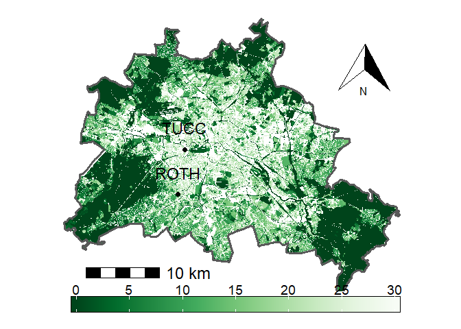

Statistics Course - UWI
================
AlbyDR
2021-04-16

## Example 2.2:Visualization -

### Part III: maps

``` r
packages_list2m <- c("tidyverse", "raster", "httr", "sf", "fasterize", "rasterVis",
                      "sp", "RColorBrewer", "geobuffer", "ggspatial")
#
```

new.packages &lt;- packages\_list2m\[!(packages\_list2m %in%
installed.packages()\[,“Package”\])\] if(length(new.packages))
install.packages(new.packages) \#’ update.packages &lt;-
packages\_list2m\[(packages\_list2m %in% old.packages()\[,“Package”\])\]
if(length(update.packages)) install.packages(update.packages)

``` r
invisible(lapply(packages_list2m, library, character.only = T, quietly = TRUE, warn.conflicts = F))
```

    ## -- Attaching packages --------------------------------------- tidyverse 1.3.1 --

    ## v ggplot2 3.3.3     v purrr   0.3.4
    ## v tibble  3.1.0     v dplyr   1.0.5
    ## v tidyr   1.1.3     v stringr 1.4.0
    ## v readr   1.4.0     v forcats 0.5.1

    ## -- Conflicts ------------------------------------------ tidyverse_conflicts() --
    ## x dplyr::filter() masks stats::filter()
    ## x dplyr::lag()    masks stats::lag()

    ## Linking to GEOS 3.9.0, GDAL 3.2.1, PROJ 7.2.1

    ## terra version 1.1.17

    ## 
    ## Attaching package: 'terra'

    ## The following objects are masked from 'package:dplyr':
    ## 
    ##     collapse, desc, near

    ## The following object is masked from 'package:purrr':
    ## 
    ##     transpose

    ## The following objects are masked from 'package:tidyr':
    ## 
    ##     expand, fill, pack, separate

    ## 
    ## Attaching package: 'latticeExtra'

    ## The following object is masked from 'package:ggplot2':
    ## 
    ##     layer

**Functions to import maps from the atlas**

``` r
get_X_Y_coordinates <- function(x) {
  sftype <- as.character(sf::st_geometry_type(x, by_geometry = FALSE))
  if(sftype == "POINT") {
    xy <- as.data.frame(sf::st_coordinates(x))
    dplyr::bind_cols(x, xy)
  } else {
    x
  }
}

sf_fisbroker <- function(url) {
  typenames <- basename(url)
  url <- httr::parse_url(url)
  url$query <- list(service = "wfs",
                    version = "2.0.0",
                    request = "GetFeature",
                    srsName = "EPSG:25833",
                    TYPENAMES = typenames)
  request <- httr::build_url(url)
  print(request)
  out <- sf::read_sf(request)
  out <- sf::st_transform(out, 4326)
  out <- get_X_Y_coordinates(out)
  return(out)
}

export_format <- c(
  "geojson", 
  "sqlite"
)

sf_save <- function(z, fname) {
  ifelse(!dir.exists(fname), dir.create(fname), "Folder exists already")
  ff <- paste(file.path(fname, fname), export_format, sep = ".")
  purrr::walk(ff, ~{ sf::st_write(z, .x, delete_dsn = TRUE)})
  saveRDS(z, paste0(file.path(fname, fname), ".rds"))
  
}
```

import the Impervious map - ekd102

``` r
###########################################################################
# 01.02 Impervious Soil Coverage (Sealing of Soil Surface) (Edition 2017) #
###########################################################################
# The real use of the built-up areas, the existing green and open space, #
# the urban structure, the sealing and the types of surface.              #
# Spatial reference block / partial block map ISU5 (Information System    #
# City and Environment) as of December 31, 2015.                          #
###########################################################################
```

``` r
impervious_map <- sf_fisbroker("https://fbinter.stadt-berlin.de/fb/wfs/data/senstadt/sach_nutz2015_nutzsa")
```

    ## [1] "https://fbinter.stadt-berlin.de/fb/wfs/data/senstadt/sach_nutz2015_nutzsa?service=wfs&version=2.0.0&request=GetFeature&srsName=EPSG%3A25833&TYPENAMES=sach_nutz2015_nutzsa"

``` r
impervious_map <- impervious_map %>%
  mutate(RAUMID = stringr::str_sub(gml_id, 12, 19)) %>%
  dplyr::select(gml_id, RAUMID, everything()) %>%
  arrange(RAUMID)
```

``` r
glimpse(impervious_map)
```

    ## Rows: 25,352
    ## Columns: 19
    ## $ gml_id     <chr> "sach_nutz2015_nutzsa.0100980011000100", "sach_nutz2015_nut~
    ## $ RAUMID     <chr> "15_nutzs", "15_nutzs", "15_nutzs", "15_nutzs", "15_nutzs",~
    ## $ BEZIRK     <chr> "Mitte", "Mitte", "Mitte", "Mitte", "Mitte", "Mitte", "Mitt~
    ## $ WOZ_NAME   <chr> "Wohnnutzung", "Verkehrsfläche (ohne Straßen)", "Wohnnutzun~
    ## $ STSTRNAME  <chr> "Zeilenbebauung seit den 50er Jahren", "Bebauung mit überwi~
    ## $ TYPKLAR    <chr> "Freie Zeilenbebauung mit landschaftlichem Siedlungsgrün (1~
    ## $ FLALLE     <int> 4624, 13431, 5604, 34345, 48930, 13978, 7323, 20959, 99838,~
    ## $ STR_FLGES  <int> 2369, 3184, 2466, 8138, 2825, 3614, 1606, 331, 10012, 0, 0,~
    ## $ VG         <dbl> 69.30, 38.56, 83.53, 73.07, 76.37, 54.67, 91.42, 19.04, 47.~
    ## $ VG_0       <dbl> 69.30, 38.56, 83.53, 73.07, 76.37, 54.67, 91.42, 19.04, 47.~
    ## $ PROBAU     <dbl> 30.81, 0.04, 19.75, 33.65, 40.82, 12.34, 48.75, 0.05, 16.45~
    ## $ PROVGNEU   <dbl> 38.49, 38.52, 63.78, 39.42, 35.54, 42.32, 42.67, 18.98, 31.~
    ## $ PROVGNEU_0 <dbl> 38.49, 38.52, 63.78, 39.42, 35.54, 42.32, 42.67, 18.98, 31.~
    ## $ KL1        <int> 49, 42, 20, 45, 42, 31, 74, 30, 54, 31, 7, 45, 20, 15, 30, ~
    ## $ KL2        <int> 46, 32, 60, 28, 38, 56, 20, 20, 25, 56, 42, 28, 60, 67, 20,~
    ## $ KL3        <int> 3, 19, 10, 13, 8, 1, 1, 5, 3, 1, 5, 13, 10, 7, 5, 3, 4, 15,~
    ## $ KL4        <int> 2, 7, 10, 14, 12, 12, 5, 45, 18, 12, 46, 14, 10, 11, 45, 19~
    ## $ GRZ_NAME   <chr> NA, NA, NA, NA, NA, NA, NA, "Park / Grünfläche", NA, NA, NA~
    ## $ geometry   <MULTIPOLYGON [°]> MULTIPOLYGON (((13.3683 52...., MULTIPOLYGON (~

VG Sealing, track ballast is considered sealed (% of area size) VG\_0
Sealing, track ballast is considered unsealed (% of area size) PROBAU
Built-up sealed area (% of area size) PROVGNEU Sealed area undeveloped,
track ballast is considered sealed (% of area size) PROVGNEU\_0 Unbuilt
sealed area, track ballast is considered unsealed (% of area size)

``` r
impervious_map <- st_transform(impervious_map, crs("+proj=utm +zone=33 +datum=WGS84 +units=m +no_defs"))
```

Create an empty raster of 10m resolution

``` r
map_raster <- raster(xmn=370000,xmx=415741,ymn=5799519,ymx=5837199, 
               res=10,crs=crs("+proj=utm +zone=33 +datum=WGS84 +units=m +no_defs"))
```

Rasterize the polygons

``` r
raster_imprevious <- raster::stack(
  fasterize(impervious_map, map_raster, field="VG",fun="max"),
  fasterize(impervious_map, map_raster, field="VG",fun="max"),
  fasterize(impervious_map, map_raster, field="PROBAU",fun="max"),
  fasterize(impervious_map, map_raster, field="PROVGNEU_0",fun="max"))
```

``` r
raster_imprevious[[2]]@data@values[which(is.na(raster_imprevious[[2]]@data@values))] <- 100
```

``` r
names(raster_imprevious) <- c("Impervious","Impervious_with_str",
                               "Built_up_area","Unbuilt")
```

``` r
plot(raster_imprevious[[1]], col=terrain.colors(10))
```

<!-- -->

``` r
imprevious_zoom <- crop(raster_imprevious, extent(381673,388803,5811189,5821467))
```

EC Tower and DWD stations points

``` r
points <- data.frame(
  x = c(385566.5, 384597.4, 386525.1, 385368.3),
  y = c(5813229, 5812858, 5819332, 5825159),
  city = c("ROTH", "DWD_Dahlem", "TUCC", "DWD_Tegel"))
```

Create a buffer around the tower

``` r
pts_buf_1500m <- geobuffer_pts(xy = data.frame(lon = 13.32785,  
                                               lat = 52.51228), 
                               dist_m = 1500, output = "sp")
```

``` r
summary(pts_buf_1500m)
```

    ## Object of class SpatialPolygons
    ## Coordinates:
    ##        min      max
    ## x 13.30576 13.34994
    ## y 52.49880 52.52576
    ## Is projected: FALSE 
    ## proj4string : [+proj=longlat +datum=WGS84 +no_defs]

``` r
pts_buf_1500m <- spTransform(pts_buf_1500m, CRS("+proj=utm +zone=33 +datum=WGS84 +units=m +no_defs"))
```

``` r
load(url("https://userpage.fu-berlin.de/soga/300/30100_data_sets/berlin_district.RData"))
st_geometry(berlin.sf)
```

    ## Geometry set for 1 feature 
    ## Geometry type: MULTIPOLYGON
    ## Dimension:     XY
    ## Bounding box:  xmin: 777974.1 ymin: 5808837 xmax: 823510.5 ymax: 5845512
    ## Projected CRS: ETRS89 / UTM zone 32N

    ## MULTIPOLYGON (((802565.3 5844831, 802587.7 5844...

``` r
berlin.Border <- st_transform(berlin.sf, crs(raster_imprevious))
```

Fraction of Unbuild areas

``` r
ggplot() +
  layer_spatial(raster_imprevious$Unbuilt) + 
  layer_spatial(berlin.sf, fill = "transparent", size = 1.2) + 
  geom_spatial_point(aes(x = points$x[c(1,3)], y = points$y[c(1,3)]),
                     crs = crs(raster_imprevious), size = 2,
                     col = c("black","black")) +
  geom_spatial_label(aes(x = points$x[c(1,3)], y = points$y[c(1,3)],
                         label = points$city[c(1,3)]),
                     crs = crs(raster_imprevious),
                     fill = "transparent", col = c("black","black"),
                     vjust = c(-0.5, -0.5),
                     hjust = c(0.5, 0.5), label.size = 0, size = 6) +
  guides(linetype = guide_legend(title = NULL, order = 2), 
         color = guide_legend(order = 1)) +
  scale_fill_gradientn(breaks = seq(0, 30, 5),limits = c(0,30),
                       colors = rev(brewer.pal('Greens', n = 9)), 
                       name = " ", na.value = NA,
                       guide = guide_colorbar(direction = "horizontal",
                                             label.position = "bottom",
                                             title.vjust = 9, label.vjust = 9,
                                             frame.colour = "black",
                                             frame.linewidth = 0.5,
                                             frame.linetype = 1,
                                             title.position = "left",
                                             barwidth = 25, barheight = 1.2, nbin = 30,
                                             label.theme = element_text(angle = 0, size = 14))) +
  annotation_scale(location = "bl", height = unit(0.4, "cm"),
                   pad_x = unit(1.5,"cm"), pad_y = unit(1.2,"cm"),
                   text_pad = unit(0.25, "cm"),
                   text_cex = 1.5) +
  annotation_north_arrow(location = "tr", which_north = "true",
                         height = unit(2, "cm"), width = unit(2, "cm"),
                         pad_x=unit(1,"cm"), pad_y=unit(1.5,"cm")) +
  theme(axis.line=element_blank(),
        axis.text.x=element_blank(),
        axis.text.y=element_blank(),
        axis.ticks=element_blank(),
        axis.title.x=element_blank(),
        axis.title.y=element_blank(),
        legend.position="bottom",
        legend.spacing.y = unit(-0.5, "lines"),
        legend.box.spacing = unit(-1.5, "lines"),
        panel.grid.major = element_blank(), 
        panel.background = element_rect("white"))
```

    ## Warning: Removed 10204901 rows containing missing values (geom_raster).

<!-- -->

Impervious map

``` r
ggplot() +
  layer_spatial(imprevious_zoom$Impervious_with_str) + 
  layer_spatial(pts_buf_1500m, fill = "transparent", col = "red", 
                linetype = "dashed", size = 1.2) + 
  geom_spatial_point(aes(x = points$x[c(1,3)], y = points$y[c(1,3)]), 
                     crs = crs(raster_imprevious), size = 2, 
                     col = c("red","red")) +
  geom_spatial_label(aes(x = points$x[c(1,3)], y = points$y[c(1,3)],
                         label = points$city[c(1,3)]),
                     crs = crs(raster_imprevious),
                     fill = "transparent", col = c("red","red"), 
                     vjust = c(-0.5,-0.5),
                     hjust = c(0.5, .05), label.size = 0, size = 6) +
  guides(linetype = guide_legend(title = NULL, order = 2), 
         color = guide_legend(order = 1)) +
  scale_fill_gradientn(breaks = seq(0,100,10), limits = c(0,100),
                       colors = terrain.colors(10), name = "", na.value = 0,
                       guide = guide_colorbar(direction = "horizontal",
                                             label.position = "bottom",
                                             label.vjust = -2,
                                             frame.colour = "black",
                                             frame.linewidth = 0.5,
                                             frame.linetype = 1,
                                             #title.position = "left",
                                             barwidth=15, barheight=1.2, nbin=10,
                                             label.theme=element_text(angle=0,size=14))) +
  theme(axis.line=element_blank(),
        axis.text.x=element_blank(),
        axis.text.y=element_blank(),
        axis.ticks=element_blank(),
        axis.title.x=element_blank(),
        axis.title.y=element_blank(),
        legend.position="bottom",
        legend.spacing.y = unit(-0.4, "lines"),
        legend.box.spacing = unit(-1.5, "lines"),
        panel.grid.major = element_blank(), 
        panel.background = element_rect("white"))
```

<!-- -->
