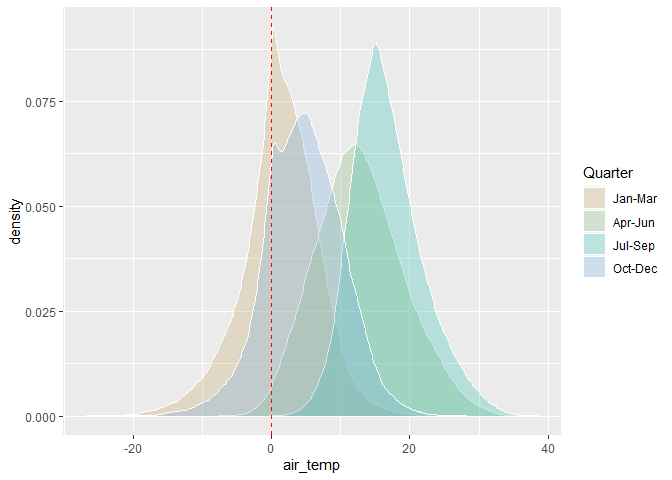
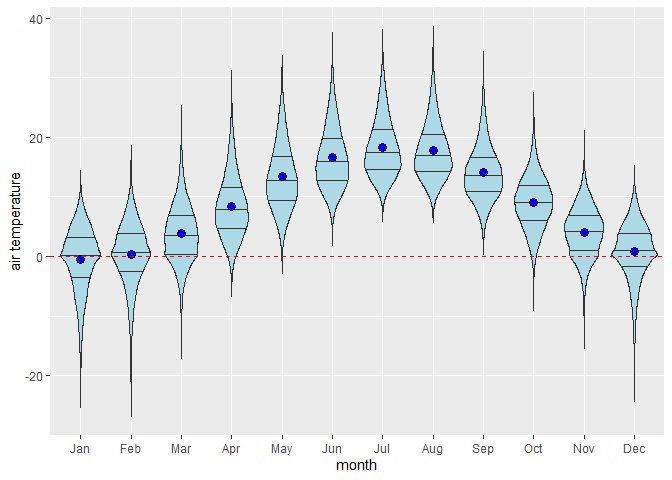
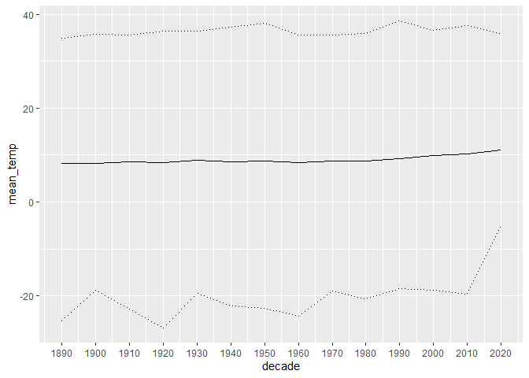
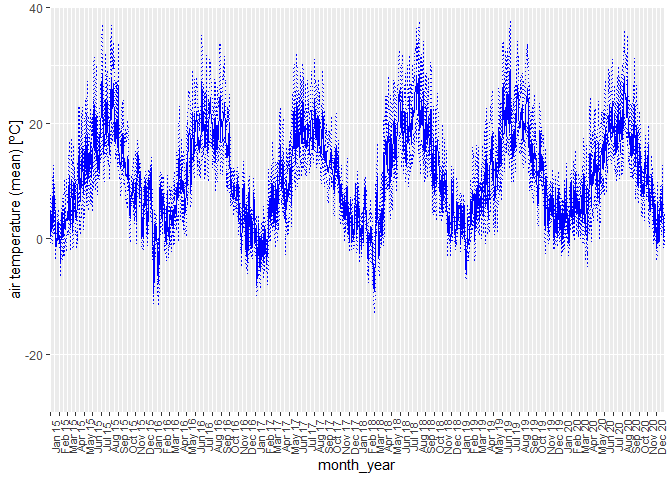
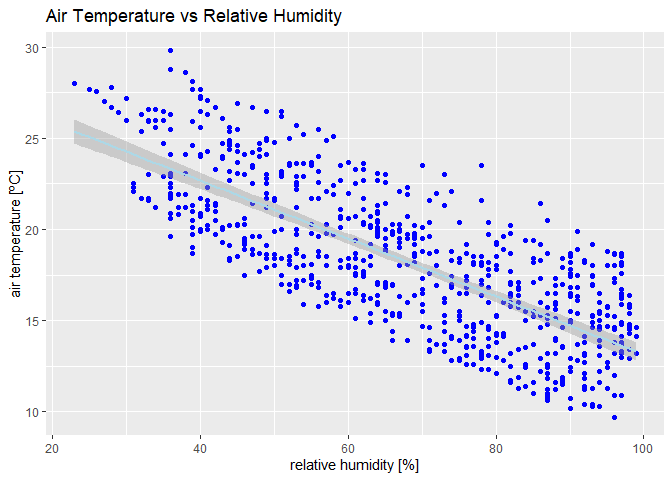
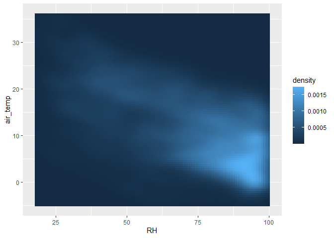

Statistics Course - UWI
================
AlbyDR
2021-04-16

## Example 2.2:Visualization -

### Part II: continuous data

``` r
packages_list2.2 <- c("tidyverse", "lubridate", "kableExtra", "scales", "tidyquant", "cowplot",
                       "gridExtra", "RColorBrewer", "colorspace")
#
```

new.packages &lt;- packages\_list2.2\[!(packages\_list2.2 %in%
installed.packages()\[,“Package”\])\] if(length(new.packages))
install.packages(new.packages) \#’ update.packages &lt;-
packages\_list2.2\[(packages\_list2.2 %in%
old.packages()\[,“Package”\])\] if(length(update.packages))
install.packages(update.packages)

``` r
DWD_temperature <- read_rds("DWD_temperature.rds")
DWD_precipitation <- read_rds("DWD_precipitation.rds")
```

### Plotting continuous variables

The visualization of continuous variables present many different
approaches to show distribution, variation in time, space, and within
factors, relationship and uncertainty.

**One variable plot - distribution**

classical histogram `geom_histogram()` or `geom_freqpoly()`

``` r
ggplot(DWD_temperature) +
  geom_histogram(aes(air_temp), 
                 bins = 50, colour = "blue", fill = "lightblue") +
  geom_vline(xintercept=0, colour = "red", linetype = "dashed") #annotation
```

    ## Warning: Removed 14 rows containing non-finite values (stat_bin).

<!-- -->

**continuous vs factor**

How to compare different histogram

``` r
DWD_temperature %>%
mutate(quarters = factor(quarter(timestamp, fiscal_start = 1))) %>%
ggplot(aes(x = air_temp, y = ..density..)) +
  geom_histogram(bins = 50, colour = "blue", fill = "lightblue") +
  #geom_density(bw = 2, size = 1, ) +
  geom_vline(xintercept = 0, colour = "red", linetype = "dashed") +
  facet_wrap( ~ quarters, labeller = 
  as_labeller(c(`1` = "Jan-Mar", `2` = "Apr-Jun", 
                `3` = "Jul-Sep", `4` ="Oct-Dec")) ) #scales = 'free_x'
```

    ## Warning: Removed 14 rows containing non-finite values (stat_bin).

<!-- -->

With density it can be done with o plot

``` r
DWD_temperature %>%
  mutate(quarters = factor(quarter(timestamp, fiscal_start = 1))) %>%
  ggplot() +
  geom_density(aes(air_temp, fill = quarters), 
  alpha = 0.3, color = "white") +
  geom_vline(xintercept = 0, colour = "red", linetype = "dashed") +
  scale_fill_discrete_qualitative(name = "Quarter", 
  palette = "Harmonic",# spacecolor package function
  labels = c("Jan-Mar", "Apr-Jun", "Jul-Sep", "Oct-Dec"))
```

    ## Warning: Removed 14 rows containing non-finite values (stat_density).

<!-- -->

But more than 4 graphs maybe it not a good idea, but you can make a
boxplot, for instance by month

``` r
ggplot(DWD_temperature) +
  geom_boxplot(aes(y = air_temp, x = factor(month(timestamp, 
  label = TRUE))), fill = "lightblue", position = "dodge") +
  geom_hline(yintercept = 0, colour = "red", linetype = "dashed") +
  labs(x = 'month', y = 'air temperature')
```

    ## Warning: Removed 14 rows containing non-finite values (stat_boxplot).

<!-- -->

Violin it is also a possibility

``` r
ggplot(DWD_temperature, aes(y = air_temp, x = factor(month(timestamp,
label = TRUE)))) +
  geom_violin(aes(y = air_temp, x = factor(month(timestamp,
  label = TRUE))), fill = "lightblue", position = "dodge",
  draw_quantiles = c(0.25, 0.5, 0.75)) +
  stat_summary(fun = "mean", geom = "point", shape = 21, 
  size = 3, fill = "blue") +
  geom_hline(yintercept = 0, colour = "red", linetype = "dashed") +
  labs(x = 'month', y = 'air temperature')
```

    ## Warning: Removed 14 rows containing non-finite values (stat_ydensity).

    ## Warning: Removed 14 rows containing non-finite values (stat_summary).

<!-- -->

**Two variable plot - continuous vs time**  
If we try to plot air temperature

``` r
plot(y=DWD_temperature$air_temp, x=DWD_temperature$timestamp, 
     col="lightblue")
```

<!-- -->

Lets aggregate by decades

``` r
DWD_temperature %>%
  mutate(decade = year(floor_date(timestamp, years(10)))) %>%
  group_by(decade=decade) %>%
  summarise(mean_temp = mean(air_temp, na.rm=T))%>%
  #print(n=Inf) 
  ggplot()+
  geom_line(aes(y=mean_temp, x=decade)) +
  #scale_y_continuous(name="air temperature (mean)", limits = c(0,14), breaks = c(seq(0,14,2)))
  scale_x_continuous(name="decade", breaks = c(seq(1890,2020,10))) 
```

<!-- -->

**scaring!**

lets check it better

``` r
DWD_temperature %>%
  mutate(decade = year(floor_date(timestamp, years(10)))) %>%
  group_by(decade=decade) %>%
  summarise(mean_temp = mean(air_temp, na.rm=T),
            max_temp = max(air_temp, na.rm=T),
            min_temp = min(air_temp, na.rm=T))%>%
  #print(n=Inf) 
  ggplot()+
  geom_line(aes(y = mean_temp, x = decade))+
  geom_line(aes(y = max_temp, x = decade), linetype = "dotted") +
  geom_line(aes(y = min_temp, x = decade), linetype = "dotted") +
  scale_x_continuous(name = "decade", breaks = c(seq(1890, 2020,  10)))
```

<!-- -->

**It is a bit better** but look at the min at 2020 decade, as this
decade is represented by one year we should not consider it.

Lets check by year

``` r
DWD_temperature %>%
  mutate(year = year(timestamp)) %>%
  group_by(year=year) %>%
  summarise(mean_temp = mean(air_temp, na.rm = TRUE),
            max_temp = max(air_temp, na.rm = TRUE),
            min_temp = min(air_temp, na.rm = TRUE)) %>%
  #print(n=Inf) 
  ggplot()+
  geom_line(aes(y = mean_temp, x = year), col = "blue") +
  geom_line(aes(y = max_temp, x = year), col = "blue", 
  linetype = "dotted") +
  geom_line(aes(y = min_temp, x = year), col = "blue", 
  linetype = "dotted") +
  scale_x_continuous(name = "year", breaks = c(seq(1895, 2020, 10))) +
  annotate("rect", xmin = 1980, xmax = 2000, ymin = -30, ymax = 45,
           alpha = .1,fill = "blue")  +
  labs(x = 'year',y = 'air temperature (average)') +
  theme_bw()
```

<!-- -->

What about the variation within the year?

``` r
DWD_temperature %>%
  group_by(date = date(timestamp)) %>%
  summarise(mean_temp = mean(air_temp, na.rm = TRUE),
            max_temp = max(air_temp, na.rm = TRUE),
            min_temp = min(air_temp, na.rm = TRUE))%>%
  #print(n=24) 
  ggplot()+
  geom_line(aes(y = mean_temp, x = date), col = "blue")+
  geom_line(aes(y = max_temp, x = date), col="blue", linetype = "dotted")+
  geom_line(aes(y = min_temp, x = date), col="blue", linetype = "dotted")+
  coord_x_date(xlim = c("2015-01-01", "2020-12-31"), expand = F, 
               ylim = c(-30, 40))+ 
  scale_x_date(date_labels = "%b %y", date_breaks = "month", 
               expand = c(0.0, 0.0)) +
  labs(x = "month_year",y = 'air temperature (mean) [ºC]') +
  theme(axis.text.x = element_text(color = "grey25", 
  size = 8, angle = 90))
```

<!-- -->

``` r
DWD_temperature %>%
  filter(year(timestamp)>=2015) %>%
  group_by(year = year(timestamp),
           month = month(timestamp, label = T)) %>%
  summarise(mean_temp = mean(air_temp, na.rm = T),
            max_temp = max(air_temp, na.rm = T),
            min_temp = min(air_temp, na.rm = T)) %>%
  #print(n=24) 
  ggplot(aes(x = factor(month), group = year)) +
  geom_line(aes(y = mean_temp), col = "blue") +
  geom_line(aes(y = max_temp), col = "darkblue", linetype = "dotted") +
  geom_line(aes(y = min_temp), col = "blue", linetype = "dotted") +
  facet_wrap(. ~ factor(year), nrow = 1) +
  labs(x = 'month', y = 'air temperature (average) [ºC]') +
  theme(axis.text.x = element_text(color="grey25", size=8, angle=90))
```

    ## `summarise()` has grouped output by 'year'. You can override using the `.groups` argument.

<!-- -->

What about the variation within hours in the day?

``` r
DWD_temperature %>%
  filter(year(timestamp)>=2020) %>%
  group_by(quarters = factor(quarter(timestamp, fiscal_start = 1)),
           hours = hour(timestamp)) %>%
  summarise(mean_temp = mean(air_temp, na.rm=T),
            max_temp = max(air_temp, na.rm=T),
            min_temp = min(air_temp, na.rm=T))%>%
  #print(n=24) 
  ggplot()+
  geom_line(aes(y=mean_temp, x=hours), col="blue")+
  geom_line(aes(y=max_temp, x=hours), col="blue", linetype = "dotted")+
  geom_line(aes(y=min_temp, x=hours), col="blue", linetype = "dotted")+
  facet_wrap(. ~ factor(quarters), nrow=1)+
  scale_x_continuous(name="hours", breaks = c(seq(0,24,4)))+
  labs(x = 'hours', y = 'air temperature (mean) [ºC]') +
  theme_bw()
```

    ## `summarise()` has grouped output by 'quarters'. You can override using the `.groups` argument.

<!-- -->

box plot (distribution)

``` r
DWD_temperature %>%
  filter(year(timestamp)>=2020) %>%
  group_by(quarters = factor(quarter(timestamp, fiscal_start = 1)),
           hour = hour(timestamp)) %>%
  #print()
  ggplot() +
  geom_boxplot(aes(y = air_temp, x = factor(hour)), position = "dodge", fill = "lightblue") +
  facet_wrap(. ~ factor(quarters), nrow=1, labeller = 
               as_labeller(c(`1` = "Jan-Mar", `2` = "Apr-Jun", 
                             `3` = "Jul-Sep", `4` = "Oct-Dec"))) +
  scale_x_discrete(name="hours", breaks = c(seq(0,23,2))) +
  labs(x = 'hours', y = 'air temperature (mean) [ºC]') +
  theme_bw()
```

<!-- -->

**Two variables plot - relationship** Scatter plot

``` r
DWD_temperature %>%
filter(year(timestamp)==2020) %>%
ggplot(aes(x = RH, y = air_temp)) + 
  geom_abline(intercept = 45, slope = - 0.5, color = "red", 
  linetype = "dotted") +
  geom_point(color = "blue") +  
  stat_smooth(method = lm, color = "lightblue") +
  ggtitle("Air Temperature vs Relative Humidity") +
  labs(y='air temperature [ºC]',  x='relative humidity [%]') +
  theme()
```

    ## `geom_smooth()` using formula 'y ~ x'

<!-- -->

``` r
DWD_temperature %>%
  filter(year(timestamp)>=2020 & month(timestamp)==7) %>%
  ggplot(aes(x = RH, y = air_temp)) + 
  geom_point(color = "blue") +  
  stat_smooth(method = lm, level = 0.9999, color = "lightblue") +
  ggtitle("Air Temperature vs Relative Humidity") +
  labs(y='air temperature [ºC]',  x='relative humidity [%]') +
  theme()
```

    ## `geom_smooth()` using formula 'y ~ x'

<!-- -->

``` r
DWD_temperature %>%
  filter(year(timestamp)>=2020 | year(timestamp)==1920) %>%
ggplot(aes(x = RH, y = air_temp, colour = factor(year(timestamp)))) + 
  geom_jitter(alpha = 0.05) +  
  stat_smooth(method = lm, level = 0.9999) +
  scale_colour_manual(name = "year" ,values = c("red","blue")) +
  ggtitle("Air Temperature vs Relative Humidity") +
  labs(y='air temperature [ºC]',  x='relative humidity [%]') +
  annotate("text", x = 95, y = 33, 
           label = "italic(R) ^ 2 == 0.52", parse = TRUE) +
  theme()
```

    ## `geom_smooth()` using formula 'y ~ x'

<!-- -->

check change geom\_jitter for geom\_point

create a list object with plots from different years

``` r
unique(DWD_temperature$sunlight_times)
```

    ## [1] "Night"                "Dawn"                 "Goldenhour_morning"  
    ## [4] "Sun_rising"           "Noon"                 "Sun_setting"         
    ## [7] "Goldenhour_afternoon" "Dusk"

``` r
Plots_grid <- lapply(c(1900, 1940, 1980, 2020), FUN = function(i) 
DWD_temperature %>%
  filter(year(timestamp)==i) %>%
  ggplot(aes(x = RH, y = air_temp, colour = (sunlight_times))) + 
  geom_jitter(alpha = 0.05) +  
  stat_smooth(method = lm, se = F, level = 0.9999) +
  scale_color_manual(name = NULL, labels = NULL, breaks = NULL,
                     #  name = "sunlight_times",
                     # breaks = c("Night", "Dawn", "Goldenhour_morning",
                     #             "Sun_rising" , "Noon" , "Sun_setting",
                     #             "Goldenhour_afternoon", "Dusk"),
                       values = c("Night" = "darkgrey", 
                                  "Dawn" = "lightgrey",  
                                  "Goldenhour_morning" = "yellow",
                                  "Sun_rising" = "gold",
                                  "Noon" = "orange",
                                  "Sun_setting" = "red",
                                  "Goldenhour_afternoon" = "purple",
                                  "Dusk" = "grey" ))+
  labs(y='air temperature [ºC]',  x='relative humidity [%]') +
  annotate("text", x = 95, y = 33, 
           label = "italic(R) ^ 2 == 0.57", parse = TRUE, size = 4) +
  theme_bw() )
```

If you plot without the scale\_color\_manual the sunlight\_times will be
in alphabetic order, but they have a chronological order

Plot the in a grid 2x2 including letters a to d

``` r
plot_grid(Plots_grid[[1]], Plots_grid[[2]], Plots_grid[[3]],  
          Plots_grid[[4]], ncol = 2,
          rel_heights=c(0.25, 0.25, 0.25, 0.25), 
          labels = "auto", #c("a)","b)","c)","d)"), 
          label_size = 12)
```

    ## `geom_smooth()` using formula 'y ~ x'
    ## `geom_smooth()` using formula 'y ~ x'
    ## `geom_smooth()` using formula 'y ~ x'
    ## `geom_smooth()` using formula 'y ~ x'

<!-- -->

ready for publication!?

``` r
DWD_temperature %>%
  filter(year(timestamp) == 2020) %>%
  ggplot(aes(x = RH, y = air_temp)) +
  geom_point(alpha = 0.01) +
  stat_density2d(aes(colour = ..level..))
```

<!-- -->

``` r
DWD_temperature %>%
  filter(year(timestamp) == 2020) %>%
ggplot(aes(x = RH, y = air_temp)) +
  stat_density2d(aes(fill = ..density..),
    geom = "raster", contour = F)
```

<!-- -->

Three variables plot like this below uses a factor (categories) to
aggregate values (legend) using `group =`, `colour=`, `fill=` or
`shape=` \#’ inside of the `aes()`

``` r
DWD_precipitation %>%
  mutate(cloud = fct_lump(cloud_type, n = 3)) %>%
  group_by(year = year(timestamp), cloud = cloud) %>%
  summarise(precip_mm = sum(precip_mm, na.rm = TRUE)) %>%
  #print(n=10)
  ggplot(aes(x = year, y = precip_mm, fill = factor(cloud))) +
  geom_area(position = "fill", colour = "white", size = .2, alpha = .4) +
  scale_fill_brewer(palette = "Blues") +
  scale_y_continuous(labels = percent)
```

    ## `summarise()` has grouped output by 'year'. You can override using the `.groups` argument.

<!-- -->

**Three continuous variables plot** doy (day of the year) and 24hours
plots combined create a pallets heat colors (kind of)

by hand

``` r
Hcolor = c("steelblue3", "steelblue2", "steelblue1","white", "khaki1",
           "yellow1", "yellow2", "gold", "orange1", "orangered1",      
           "orangered2", "red1", "red2", "red3", "red4", "darkred")
#`            
#` using the `colorspace` package
Hclcolor = divergingx_hcl(13, palette = "RdBu", rev = TRUE)
#` 
#` lets check the range
summary(filter(DWD_temperature,year(timestamp)==1910))
```

    ##    timestamp                      air_temp            RH        
    ##  Min.   :1910-01-01 00:00:00   Min.   :-8.900   Min.   : 20.00  
    ##  1st Qu.:1910-04-02 05:45:00   1st Qu.: 2.600   1st Qu.: 72.00  
    ##  Median :1910-07-02 11:30:00   Median : 8.100   Median : 88.00  
    ##  Mean   :1910-07-02 11:30:00   Mean   : 8.799   Mean   : 81.95  
    ##  3rd Qu.:1910-10-01 17:15:00   3rd Qu.:14.400   3rd Qu.: 96.00  
    ##  Max.   :1910-12-31 23:00:00   Max.   :31.600   Max.   :100.00  
    ##  sunlight_times    
    ##  Length:8760       
    ##  Class :character  
    ##  Mode  :character  
    ##                    
    ##                    
    ## 

``` r
#` 
ggplot(filter(DWD_temperature,year(timestamp)==1910)) +
  geom_raster(aes(x=yday(timestamp),y=hour(timestamp),fill=air_temp)) + 
  scale_x_continuous(name = "doy", expand = c(0,0), 
  breaks = seq(0, 350, 25), limits=c(1, 365)) +
  scale_y_continuous(name = "hour", expand = c(0,0), 
  breaks=seq(0, 24, 4), limits = c(0,24)) +
  scale_fill_gradientn(limits = c(-10, 35), breaks=seq(-10, 35, 5), 
                       colours = Hclcolor[c(-2, -4, -5, -6)], # 0 central
                       name ="air temperature", na.value = NA,
                       guide = guide_colorbar(direction = "horizontal",
                                             title.position = "left",
                                             label.position = "bottom",
                                             barwidth = 18, 
                                             barheight = 0.9, nbin = 20,
                                             label.theme = element_text                                                (angle = 0,size = 11))) + 
  theme(legend.position = "bottom",
        legend.box.spacing = unit(-0.03, "lines"),
        legend.title = element_text(color="grey25", vjust=.9, size=12),
        axis.text.y = element_text(color="grey25", hjust=.9, size=9),
        axis.title.y=element_text(color = "grey25", face = "bold",
        size = 11,vjust = 1.2),
        axis.text.x = element_text(color="grey25", size=10),
        axis.title.x=element_text(color="grey25",face="bold",
        size=11,vjust=1.2),
        strip.background = element_blank(),
        strip.text.x = element_blank(),
        panel.spacing.y = unit(-0.5, "lines"), 
        panel.spacing.x = unit(0.075, "lines"), 
        panel.background = element_rect(fill = "white"),  
        panel.border = element_blank(), 
        panel.grid.major = element_line(colour="white"),
        panel.grid.minor = element_line(colour="white"),
        plot.title = element_text(size=9, vjust=-1,hjust=0))
```

    ## Warning: Removed 411 rows containing missing values (geom_raster).

<!-- -->

Uncertainty plot

``` r
DWD_temperature %>%
  filter(year(timestamp) == 2020 & hour(timestamp)== 6) %>%
  group_by(month = month(timestamp, label = TRUE)) %>%
  summarise(n = length(month),
    min = min(air_temp, na.rm=T),
            lower = qnorm(0.995)*(sd(air_temp, na.rm=T)/sqrt(length(month))),
            mean = mean(air_temp, na.rm=T),
            upper = qnorm(0.995)*(sd(air_temp, na.rm=T)/sqrt(length(air_temp))),
            max = max(air_temp, na.rm=T)) %>%
  #print(n=10) 
  ggplot(aes(x = factor(month), y = mean)) +
  geom_line(aes(group = 1), linetype="dashed", size=0.5, color="grey45") +
  geom_point(size = 2) +
  geom_errorbar(aes(ymin = mean - lower, ymax = mean + upper), 
  width = .1) +
  #scale_x_discrete(name = "year", breaks = c(seq(1900,2020,5)))+
  #scale_y_continuous(limits=c(5, 15), breaks=c(5:15)) +
  labs(title = '', x = 'year', y = 'air temperature (average)') +
  theme(axis.text.x = element_text(color="grey25", size=8, angle=90))
```

<!-- -->

or shade region (ci by hand)

``` r
DWD_temperature %>%
  filter(year(timestamp) >= 1900) %>%
  group_by(year = year(timestamp)) %>%
  summarise(min = min(air_temp, na.rm = TRUE),
            lower = qnorm(0.975) * (sd(air_temp, na.rm=T) / sqrt(length(air_temp))) ,
            mean = mean(air_temp, na.rm=T),
            upper = qnorm(0.975) * (sd(air_temp, na.rm=T) / sqrt(length(air_temp))),
            max = max(air_temp, na.rm=T)) %>%
  #print(n=10) 
  ggplot(aes(x = year, y = mean)) +
  geom_ribbon(aes(ymin = mean - lower, ymax = mean + upper), alpha = 0.3 , fill = "blue") +
  geom_line(linetype ="solid", size = 1, color = "blue") +
  scale_x_continuous(name="year", breaks = c(seq(1900,2020,5)))+
  scale_y_continuous(limits = c(6, 13), breaks=c(6:13)) +
  labs(x = 'year', y = 'air temperature (average +/- ci)') +
  theme(axis.text.x = element_text(color="grey25", size=8, angle=90))
```

<!-- -->

``` r
DWD_temperature %>%
  filter(year(timestamp) >= 1900) %>%
  group_by(year= year(timestamp)) %>%
  summarise(mean_cl_normal(air_temp)) %>%
  #print(n=10)
ggplot(aes(x = year, y = y)) +
  geom_ribbon(aes(ymin = ymin, ymax = ymax), 
  alpha = 0.3 , fill = "blue") +
  geom_line(linetype ="solid", size = 1, color = "blue") +
  scale_x_continuous(name="year", breaks = c(seq(1900,2020,5)))+
  scale_y_continuous(limits=c(6, 13), breaks=c(6:13)) +
  labs(x = 'year', y = 'air temperature (mean +/- ci)') +
  theme(axis.text.x = element_text(color="grey25", size=8, angle=90))
```

<!-- -->

``` r
#` 
#` **color tools that may be usefull**
display.brewer.all()
```

<!-- -->

``` r
display.brewer.pal(name = 'Greens', n=9)
```

<!-- -->

``` r
RColorBrewer::brewer.pal('Greens', n=9)
```

    ## [1] "#F7FCF5" "#E5F5E0" "#C7E9C0" "#A1D99B" "#74C476" "#41AB5D" "#238B45"
    ## [8] "#006D2C" "#00441B"

``` r
#` 
#` 
hcl_palettes("qualitative", plot = TRUE)
```

<!-- -->

``` r
hcl_palettes("sequential", plot = TRUE)
```

<!-- -->

``` r
hcl_palettes("sequential (single-hue)", n = 9, plot = TRUE)
```

<!-- -->

``` r
hcl_palettes("diverging", plot = TRUE)
```

<!-- -->

``` r
divergingx_palettes(n = 10, plot = TRUE)
```

<!-- -->

``` r
divergingx_hcl(12, palette = "RdBu")
```

    ##  [1] "#611300" "#A42900" "#D05838" "#E38F81" "#EEC0BA" "#F5EAE9" "#EFF3F6"
    ##  [8] "#C6DBE9" "#85B9D7" "#0092C1" "#0068A2" "#003560"

``` r
#` 
```

Exercise: 1. run the below with and without the hour filter  
1. what are the difference and why it happens

``` r
DWD_temperature %>%
  filter(year(timestamp) == 2020 & hour(timestamp)== 6) %>%
  group_by(month = month(timestamp, label = TRUE)) %>%
  summarise(n = length(month),
            min = min(air_temp, na.rm=T),
            lower = qnorm(0.995)*(sd(air_temp, na.rm=T)/sqrt(length(month))),
            mean = mean(air_temp, na.rm=T),
            upper = qnorm(0.995)*(sd(air_temp, na.rm=T)/sqrt(length(air_temp))),
            max = max(air_temp, na.rm=T)) %>%
  #print(n=10) 
  ggplot(aes(x = factor(month), y = mean)) +
  geom_line(aes(group = 1), linetype="dashed", size=0.5, color="grey45") +
  geom_point(size = 2) +
  geom_errorbar(aes(ymin = mean - lower, ymax = mean + upper), 
                width = .1) +
  #scale_x_discrete(name = "year", breaks = c(seq(1900,2020,5)))+
  #scale_y_continuous(limits=c(5, 15), breaks=c(5:15)) +
  labs(title = '', x = 'year', y = 'air temperature (average)') +
  theme(axis.text.x = element_text(color="grey25", size=8, angle=90))
```

<!-- -->
