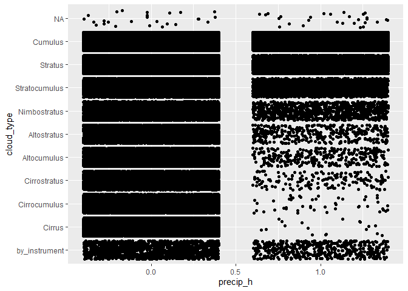

Statistics Course - UWI
================
AlbyDR
2021-03-23

## Example 2.3: Exploratory Data Analysis

``` r
suppressPackageStartupMessages({
library(tidyverse)     # ggplot, readr and dplyr packages
library(lubridate)     # date-time
library(summarytools)
library(kableExtra)
library(magrittr)
library(corrr)
library(GGally)
library(lubridate)
library(minerva)
library(colorspace) })
```

``` r
DWD_temperature <- read_rds("DWD_temperature.rds")
DWD_precipitation <- read_rds("DWD_precipitation.rds")
```

Tidy data and vector types <dbl> , <chr> and <fct>

``` r
DWD_precipitation
```

    ## # A tibble: 219,096 x 8
    ##    timestamp           precip_mm precip_h cloud_cover rel_humidity
    ##    <dttm>                  <dbl>    <dbl>       <dbl>        <dbl>
    ##  1 1997-01-01 00:00:00         0        0           0         90.5
    ##  2 1997-01-01 01:00:00         0        0           0         88.2
    ##  3 1997-01-01 02:00:00         0        0           0         89.7
    ##  4 1997-01-01 03:00:00         0        0           0         91.2
    ##  5 1997-01-01 04:00:00         0        0           0         87.4
    ##  6 1997-01-01 05:00:00         0        0           0         91.1
    ##  7 1997-01-01 06:00:00         0        0           0         86.5
    ##  8 1997-01-01 07:00:00         0        0           0         87.3
    ##  9 1997-01-01 08:00:00         0        0           0         89.5
    ## 10 1997-01-01 09:00:00         0        0           0         88.8
    ## # ... with 219,086 more rows, and 3 more variables: sunlight_times <chr>,
    ## #   prec.window <dbl>, cloud_type <fct>

Lets have a general summary (base function)

``` r
summary(DWD_precipitation)
```

    ##    timestamp                     precip_mm          precip_h     
    ##  Min.   :1997-01-01 00:00:00   Min.   : 0.0000   Min.   :0.0000  
    ##  1st Qu.:2003-04-02 05:45:00   1st Qu.: 0.0000   1st Qu.:0.0000  
    ##  Median :2009-07-01 11:30:00   Median : 0.0000   Median :0.0000  
    ##  Mean   :2009-06-16 22:17:55   Mean   : 0.0653   Mean   :0.2133  
    ##  3rd Qu.:2015-09-30 17:15:00   3rd Qu.: 0.0000   3rd Qu.:0.0000  
    ##  Max.   :2020-12-31 00:00:00   Max.   :31.7000   Max.   :1.0000  
    ##                                NA's   :1410      NA's   :1409    
    ##   cloud_cover      rel_humidity    sunlight_times      prec.window    
    ##  Min.   :-1.000   Min.   : 11.90   Length:219096      Min.   :  0.00  
    ##  1st Qu.: 3.000   1st Qu.: 66.00   Class :character   1st Qu.:  1.00  
    ##  Median : 6.000   Median : 82.80   Mode  :character   Median : 12.00  
    ##  Mean   : 5.286   Mean   : 77.94                      Mean   : 31.87  
    ##  3rd Qu.: 8.000   3rd Qu.: 93.80                      3rd Qu.: 40.00  
    ##  Max.   : 8.000   Max.   :100.00                      Max.   :400.00  
    ##  NA's   :87       NA's   :133                                         
    ##          cloud_type   
    ##  Cumulus      :63541  
    ##  Stratus      :45147  
    ##  Stratocumulus:24312  
    ##  Cirrocumulus :17589  
    ##  Cirrus       :17236  
    ##  (Other)      :51184  
    ##  NA's         :   87

Notice that the <chr> do not show and cloud\_cover statistics make no
sense as <bdl> but cloud\_type <fct> present the sum of the main
categories or levels.

For categorical variables (chr and fct) make sense to check frequencies
(abs, %)

``` r
freq(DWD_precipitation$sunlight_times, cumul = F, report.nas = FALSE, headings = FALSE) #
```

    ## 
    ##                                Freq        %
    ## -------------------------- -------- --------
    ##                       Dawn    19365     8.84
    ##                       Dusk    19911     9.09
    ##       Goldenhour_afternoon     7994     3.65
    ##         Goldenhour_morning     7797     3.56
    ##                      Night    67688    30.89
    ##                       Noon     9129     4.17
    ##                 Sun_rising    40612    18.54
    ##                Sun_setting    46600    21.27
    ##                      Total   219096   100.00

``` r
freq(DWD_precipitation$cloud_type, plain.ascii = FALSE, style = "rmarkdown")
```

    ## ### Frequencies  
    ## #### DWD_precipitation$cloud_type  
    ## **Type:** Factor  
    ## 
    ## |            &nbsp; |   Freq | % Valid | % Valid Cum. | % Total | % Total Cum. |
    ## |------------------:|-------:|--------:|-------------:|--------:|-------------:|
    ## | **by_instrument** |   1828 |    0.83 |         0.83 |    0.83 |         0.83 |
    ## |        **Cirrus** |  17236 |    7.87 |         8.70 |    7.87 |         8.70 |
    ## |  **Cirrocumulus** |  17589 |    8.03 |        16.74 |    8.03 |        16.73 |
    ## |  **Cirrostratus** |  13550 |    6.19 |        22.92 |    6.18 |        22.91 |
    ## |   **Altocumulus** |  12359 |    5.64 |        28.57 |    5.64 |        28.55 |
    ## |   **Altostratus** |   9784 |    4.47 |        33.03 |    4.47 |        33.02 |
    ## |  **Nimbostratus** |  13663 |    6.24 |        39.27 |    6.24 |        39.26 |
    ## | **Stratocumulus** |  24312 |   11.10 |        50.37 |   11.10 |        50.35 |
    ## |       **Stratus** |  45147 |   20.61 |        70.99 |   20.61 |        70.96 |
    ## |       **Cumulus** |  63541 |   29.01 |       100.00 |   29.00 |        99.96 |
    ## |  **Cumulonimbus** |      0 |    0.00 |       100.00 |    0.00 |        99.96 |
    ## |        **\<NA\>** |     87 |         |              |    0.04 |       100.00 |
    ## |         **Total** | 219096 |  100.00 |       100.00 |  100.00 |       100.00 |

If you make a cross table between to categorical

``` r
ctable(DWD_precipitation$cloud_type, DWD_precipitation$precip_h, prop = "r")
```

    ## Cross-Tabulation, Row Proportions  
    ## cloud_type * precip_h  
    ## Data Frame: DWD_precipitation  
    ## 
    ## --------------- ---------- ---------------- --------------- -------------- -----------------
    ##                   precip_h                0               1           <NA>             Total
    ##      cloud_type                                                                             
    ##   by_instrument                1326 (72.5%)     482 (26.4%)     20 ( 1.1%)     1828 (100.0%)
    ##          Cirrus               17126 (99.4%)      18 ( 0.1%)     92 ( 0.5%)    17236 (100.0%)
    ##    Cirrocumulus               17407 (99.0%)      48 ( 0.3%)    134 ( 0.8%)    17589 (100.0%)
    ##    Cirrostratus               13313 (98.3%)     162 ( 1.2%)     75 ( 0.6%)    13550 (100.0%)
    ##     Altocumulus               11978 (96.9%)     303 ( 2.5%)     78 ( 0.6%)    12359 (100.0%)
    ##     Altostratus                9336 (95.4%)     383 ( 3.9%)     65 ( 0.7%)     9784 (100.0%)
    ##    Nimbostratus               12734 (93.2%)     867 ( 6.3%)     62 ( 0.5%)    13663 (100.0%)
    ##   Stratocumulus               21534 (88.6%)    2643 (10.9%)    135 ( 0.6%)    24312 (100.0%)
    ##         Stratus               35318 (78.2%)    9568 (21.2%)    261 ( 0.6%)    45147 (100.0%)
    ##         Cumulus               31162 (49.0%)   31925 (50.2%)    454 ( 0.7%)    63541 (100.0%)
    ##    Cumulonimbus                   0 ( 0.0%)       0 ( 0.0%)      0 ( 0.0%)        0 (  0.0%)
    ##            <NA>                  26 (29.9%)      28 (32.2%)     33 (37.9%)       87 (100.0%)
    ##           Total              171260 (78.2%)   46427 (21.2%)   1409 ( 0.6%)   219096 (100.0%)
    ## --------------- ---------- ---------------- --------------- -------------- -----------------

``` r
ggplot(DWD_precipitation) +
  geom_jitter(aes(y = cloud_type, x = precip_h))
```

    ## Warning: Removed 1409 rows containing missing values (geom_point).

<!-- -->

``` r
DWD_precipitation %>%
  mutate(day_night = fct_collapse(sunlight_times, 
                                  "Day" = unique(sunlight_times)[-1]),
         prec_hour = as_factor(precip_h) %>% 
           fct_recode(dry = "0", raining = "1")) %$%
  #print(n=10)
  ctable(prec_hour, day_night,  useNA = "no",
         chisq = TRUE, OR = TRUE, RR = TRUE,
         headings = FALSE) %>%
   print() #method = "render"
```

    ## 
    ## ----------- ----------- ---------------- --------------- -----------------
    ##               day_night              Day           Night             Total
    ##   prec_hour                                                               
    ##         dry               118799 (69.4%)   52461 (30.6%)   171260 (100.0%)
    ##     raining                31679 (68.2%)   14748 (31.8%)    46427 (100.0%)
    ##       Total               150478 (69.1%)   67209 (30.9%)   217687 (100.0%)
    ## ----------- ----------- ---------------- --------------- -----------------
    ## 
    ## ----------------------------
    ##  Chi.squared   df   p.value 
    ## ------------- ---- ---------
    ##    21.9406     1       0    
    ## ----------------------------
    ## 
    ## ----------------------------------
    ##  Odds Ratio   Lo - 95%   Hi - 95% 
    ## ------------ ---------- ----------
    ##     1.05        1.03       1.08   
    ## ----------------------------------
    ## 
    ## ----------------------------------
    ##  Risk Ratio   Lo - 95%   Hi - 95% 
    ## ------------ ---------- ----------
    ##     1.02        1.01       1.02   
    ## ----------------------------------

**don’t trust!** There are name reasons to not trust this test, one of
then is the number of sample, with 217687 observations the ci is to
narrow as we see plotting uncertainty. Lets the other reasons to the
inference course

``` r
# DWD_precipitation %>%
#   filter(year(timestamp)==2020 & month(timestamp)==4) %>%
#   mutate(day_night = fct_collapse(sunlight_times, 
#                                   "Day" = unique(sunlight_times)[-1]),
#          prec_hour = as_factor(precip_h) %>% 
#            fct_recode(dry = "0", raining = "1")) %$%
#   #print(n=10)
#   ctable(day_night, prec_hour,   useNA = "no",
#          chisq = TRUE, OR = TRUE, headings = FALSE) %>%
#   print() #method = "render"
```

While for quantitative variables (continuous and discrete) we can run
descriptive statistics

``` r
descr(DWD_precipitation$precip_mm, stats = "all") 
```

    ## Descriptive Statistics  
    ## DWD_precipitation$precip_mm  
    ## N: 219096  
    ## 
    ##                     precip_mm
    ## ----------------- -----------
    ##              Mean        0.07
    ##           Std.Dev        0.45
    ##               Min        0.00
    ##                Q1        0.00
    ##            Median        0.00
    ##                Q3        0.00
    ##               Max       31.70
    ##               MAD        0.00
    ##               IQR        0.00
    ##                CV        6.82
    ##          Skewness       21.48
    ##       SE.Skewness        0.01
    ##          Kurtosis      815.53
    ##           N.Valid   217686.00
    ##         Pct.Valid       99.36

Note: including `%>% tb()` in the end to transpose the table and
`stats = "all"` to show more statistics

You can compare the difference between groups and see all quantitative
variables together

``` r
# stby(data = DWD_precipitation, 
#      INDICES = DWD_precipitation$sunlight_times, 
#      FUN = descr, stats = "common", transpose = F)
```

Also use pipe to refine it

``` r
DWD_precipitation %>% 
  mutate(day_night = fct_collapse(sunlight_times, 
                                  "Day" = unique(sunlight_times)[-1])) %>%
  group_by(day_night = day_night) %>%
  descr(stats = "common") %>%
  print(n = "inf")
```

    ## Non-numerical variable(s) ignored: timestamp, sunlight_times, cloud_type

    ## Descriptive Statistics  
    ## DWD_precipitation  
    ## Group: day_night = Day  
    ## N: 151408  
    ## 
    ##                   cloud_cover   prec.window    precip_h   precip_mm   rel_humidity
    ## --------------- ------------- ------------- ----------- ----------- --------------
    ##            Mean          5.35         33.12        0.21        0.07          74.12
    ##         Std.Dev          2.64         52.92        0.41        0.48          20.05
    ##             Min         -1.00          0.00        0.00        0.00          11.90
    ##          Median          6.00         13.00        0.00        0.00          77.90
    ##             Max          8.00        400.00        1.00       31.70         100.00
    ##         N.Valid     151349.00     151408.00   150478.00   150477.00      151325.00
    ##       Pct.Valid         99.96        100.00       99.39       99.39          99.95
    ## 
    ## Group: day_night = Night  
    ## N: 67688  
    ## 
    ##                   cloud_cover   prec.window   precip_h   precip_mm   rel_humidity
    ## --------------- ------------- ------------- ---------- ----------- --------------
    ##            Mean          5.15         29.07       0.22        0.06          86.48
    ##         Std.Dev          3.12         48.65       0.41        0.36          12.08
    ##             Min         -1.00          0.00       0.00        0.00          29.20
    ##          Median          7.00         10.00       0.00        0.00          89.70
    ##             Max          8.00        400.00       1.00       21.60         100.00
    ##         N.Valid      67660.00      67688.00   67209.00    67209.00       67638.00
    ##       Pct.Valid         99.96        100.00      99.29       99.29          99.93

``` r
stby(DWD_precipitation[,c(2,5,8)], DWD_precipitation$precip_h, descr, stats = "fivenum") %>%
  tb(order = 3) %>%
  kable(format = "html", digits = 2) %>%
  collapse_rows(columns = 1, valign = "top")
```

<table>
<thead>
<tr>
<th style="text-align:left;">
variable
</th>
<th style="text-align:left;">
precip\_h
</th>
<th style="text-align:right;">
min
</th>
<th style="text-align:right;">
q1
</th>
<th style="text-align:right;">
med
</th>
<th style="text-align:right;">
q3
</th>
<th style="text-align:right;">
max
</th>
</tr>
</thead>
<tbody>
<tr>
<td style="text-align:left;vertical-align: top !important;" rowspan="2">
precip\_mm
</td>
<td style="text-align:left;">
0
</td>
<td style="text-align:right;">
0.0
</td>
<td style="text-align:right;">
0.0
</td>
<td style="text-align:right;">
0.0
</td>
<td style="text-align:right;">
0.0
</td>
<td style="text-align:right;">
0.0
</td>
</tr>
<tr>
<td style="text-align:left;">
1
</td>
<td style="text-align:right;">
0.0
</td>
<td style="text-align:right;">
0.0
</td>
<td style="text-align:right;">
0.0
</td>
<td style="text-align:right;">
0.2
</td>
<td style="text-align:right;">
31.7
</td>
</tr>
<tr>
<td style="text-align:left;vertical-align: top !important;" rowspan="2">
rel\_humidity
</td>
<td style="text-align:left;">
0
</td>
<td style="text-align:right;">
11.9
</td>
<td style="text-align:right;">
61.7
</td>
<td style="text-align:right;">
78.9
</td>
<td style="text-align:right;">
91.1
</td>
<td style="text-align:right;">
100.0
</td>
</tr>
<tr>
<td style="text-align:left;">
1
</td>
<td style="text-align:right;">
17.9
</td>
<td style="text-align:right;">
84.2
</td>
<td style="text-align:right;">
93.4
</td>
<td style="text-align:right;">
97.8
</td>
<td style="text-align:right;">
100.0
</td>
</tr>
</tbody>
</table>

Or you can have a general summary (descriptive statistics) for the data
only by doing

``` r
#view(dfSummary(DWD_precipitation[,-4])) # excluding the variable four (cloud_cover)
#view(dfSummary(DWD_temperature))
```

``` r
# for markdown
print(dfSummary(DWD_precipitation[,-4], graph.magnif = 0.75), method = 'render', 
      valid.col = FALSE, tmp.img.dir = "/tmp")
```

<!--html_preserve-->
<div class="container st-container">
<h3>
Data Frame Summary
</h3>
<h4>
DWD\_precipitation
</h4>
<strong>Dimensions</strong>: 219096 x 7
<br/><strong>Duplicates</strong>: 1684 <br/>
<table class="table table-striped table-bordered st-table st-table-striped st-table-bordered st-multiline ">
<thead>
<tr>
<th align="center" class="st-protect-top-border">
<strong>No</strong>
</th>
<th align="center" class="st-protect-top-border">
<strong>Variable</strong>
</th>
<th align="center" class="st-protect-top-border">
<strong>Stats / Values</strong>
</th>
<th align="center" class="st-protect-top-border">
<strong>Freqs (% of Valid)</strong>
</th>
<th align="center" class="st-protect-top-border">
<strong>Graph</strong>
</th>
<th align="center" class="st-protect-top-border">
<strong>Missing</strong>
</th>
</tr>
</thead>
<tbody>
<tr>
<td align="center">
1
</td>
<td align="left">
timestamp \[POSIXct, POSIXt\]
</td>
<td align="left">
min : 1997-01-01 med : 2009-07-01 11:30:00 max : 2020-12-31 range : 23y
11m 30d
</td>
<td align="left" style="vertical-align:middle">
210361 distinct values
</td>
<td align="left" style="vertical-align:middle;padding:0;background-color:transparent">

</td>
<td align="center">
0 (0.0%)
</td>
</tr>
<tr>
<td align="center">
2
</td>
<td align="left">
precip\_mm \[numeric\]
</td>
<td align="left">
Mean (sd) : 0.1 (0.4) min &lt; med &lt; max: 0 &lt; 0 &lt; 31.7 IQR (CV)
: 0 (6.8)
</td>
<td align="left" style="vertical-align:middle">
137 distinct values
</td>
<td align="left" style="vertical-align:middle;padding:0;background-color:transparent">

</td>
<td align="center">
1410 (0.6%)
</td>
</tr>
<tr>
<td align="center">
3
</td>
<td align="left">
precip\_h \[numeric\]
</td>
<td align="left">
Min : 0 Mean : 0.2 Max : 1
</td>
<td align="left" style="padding:0;vertical-align:middle">
<table style="border-collapse:collapse;border:none;margin:0">
<tr style="background-color:transparent">
<td style="padding:0 2px 0 7px;margin:0;border:0" align="right">
0
</td>
<td style="padding:0 2px;border:0;" align="left">
:
</td>
<td style="padding:0 4px 0 6px;margin:0;border:0" align="right">
171260
</td>
<td style="padding:0;border:0" align="left">
(
</td>
<td style="padding:0 2px;margin:0;border:0" align="right">
78.7%
</td>
<td style="padding:0 4px 0 0;border:0" align="left">
)
</td>
</tr>
<tr style="background-color:transparent">
<td style="padding:0 2px 0 7px;margin:0;border:0" align="right">
1
</td>
<td style="padding:0 2px;border:0;" align="left">
:
</td>
<td style="padding:0 4px 0 6px;margin:0;border:0" align="right">
46427
</td>
<td style="padding:0;border:0" align="left">
(
</td>
<td style="padding:0 2px;margin:0;border:0" align="right">
21.3%
</td>
<td style="padding:0 4px 0 0;border:0" align="left">
)
</td>
</tr>
</table>
</td>
<td align="left" style="vertical-align:middle;padding:0;background-color:transparent">

</td>
<td align="center">
1409 (0.6%)
</td>
</tr>
<tr>
<td align="center">
4
</td>
<td align="left">
rel\_humidity \[numeric\]
</td>
<td align="left">
Mean (sd) : 77.9 (18.9) min &lt; med &lt; max: 11.9 &lt; 82.8 &lt; 100
IQR (CV) : 27.8 (0.2)
</td>
<td align="left" style="vertical-align:middle">
841 distinct values
</td>
<td align="left" style="vertical-align:middle;padding:0;background-color:transparent">

</td>
<td align="center">
133 (0.1%)
</td>
</tr>
<tr>
<td align="center">
5
</td>
<td align="left">
sunlight\_times \[character\]
</td>
<td align="left">

1.  Dawn
2.  Dusk
3.  Goldenhour\_afternoon
4.  Goldenhour\_morning
5.  Night
6.  Noon
7.  Sun\_rising
8.  Sun\_setting
    </td>
    <td align="left" style="padding:0;vertical-align:middle">
    <table style="border-collapse:collapse;border:none;margin:0">
    <tr style="background-color:transparent">
    <td style="padding:0 5px 0 7px;margin:0;border:0" align="right">
    19365
    </td>
    <td style="padding:0 2px 0 0;border:0;" align="left">
    (
    </td>
    <td style="padding:0;border:0" align="right">
    8.8%
    </td>
    <td style="padding:0 4px 0 2px;border:0" align="left">
    )
    </td>
    </tr>
    <tr style="background-color:transparent">
    <td style="padding:0 5px 0 7px;margin:0;border:0" align="right">
    19911
    </td>
    <td style="padding:0 2px 0 0;border:0;" align="left">
    (
    </td>
    <td style="padding:0;border:0" align="right">
    9.1%
    </td>
    <td style="padding:0 4px 0 2px;border:0" align="left">
    )
    </td>
    </tr>
    <tr style="background-color:transparent">
    <td style="padding:0 5px 0 7px;margin:0;border:0" align="right">
    7994
    </td>
    <td style="padding:0 2px 0 0;border:0;" align="left">
    (
    </td>
    <td style="padding:0;border:0" align="right">
    3.6%
    </td>
    <td style="padding:0 4px 0 2px;border:0" align="left">
    )
    </td>
    </tr>
    <tr style="background-color:transparent">
    <td style="padding:0 5px 0 7px;margin:0;border:0" align="right">
    7797
    </td>
    <td style="padding:0 2px 0 0;border:0;" align="left">
    (
    </td>
    <td style="padding:0;border:0" align="right">
    3.6%
    </td>
    <td style="padding:0 4px 0 2px;border:0" align="left">
    )
    </td>
    </tr>
    <tr style="background-color:transparent">
    <td style="padding:0 5px 0 7px;margin:0;border:0" align="right">
    67688
    </td>
    <td style="padding:0 2px 0 0;border:0;" align="left">
    (
    </td>
    <td style="padding:0;border:0" align="right">
    30.9%
    </td>
    <td style="padding:0 4px 0 2px;border:0" align="left">
    )
    </td>
    </tr>
    <tr style="background-color:transparent">
    <td style="padding:0 5px 0 7px;margin:0;border:0" align="right">
    9129
    </td>
    <td style="padding:0 2px 0 0;border:0;" align="left">
    (
    </td>
    <td style="padding:0;border:0" align="right">
    4.2%
    </td>
    <td style="padding:0 4px 0 2px;border:0" align="left">
    )
    </td>
    </tr>
    <tr style="background-color:transparent">
    <td style="padding:0 5px 0 7px;margin:0;border:0" align="right">
    40612
    </td>
    <td style="padding:0 2px 0 0;border:0;" align="left">
    (
    </td>
    <td style="padding:0;border:0" align="right">
    18.5%
    </td>
    <td style="padding:0 4px 0 2px;border:0" align="left">
    )
    </td>
    </tr>
    <tr style="background-color:transparent">
    <td style="padding:0 5px 0 7px;margin:0;border:0" align="right">
    46600
    </td>
    <td style="padding:0 2px 0 0;border:0;" align="left">
    (
    </td>
    <td style="padding:0;border:0" align="right">
    21.3%
    </td>
    <td style="padding:0 4px 0 2px;border:0" align="left">
    )
    </td>
    </tr>
    </table>
    </td>
    <td align="left" style="vertical-align:middle;padding:0;background-color:transparent">
    
    </td>
    <td align="center">
    0 (0.0%)
    </td>
    </tr>
    <tr>
    <td align="center">
    6
    </td>
    <td align="left">
    prec.window \[numeric\]
    </td>
    <td align="left">
    Mean (sd) : 31.9 (51.7) min &lt; med &lt; max: 0 &lt; 12 &lt; 400
    IQR (CV) : 39 (1.6)
    </td>
    <td align="left" style="vertical-align:middle">
    401 distinct values
    </td>
    <td align="left" style="vertical-align:middle;padding:0;background-color:transparent">
    
    </td>
    <td align="center">
    0 (0.0%)
    </td>
    </tr>
    <tr>
    <td align="center">
    7
    </td>
    <td align="left">
    cloud\_type \[factor\]
    </td>
    <td align="left">

    1.  by\_instrument
9.  Cirrus
10. Cirrocumulus
11. Cirrostratus
12. Altocumulus
13. Altostratus
14. Nimbostratus
15. Stratocumulus
16. Stratus
17. Cumulus
18. Cumulonimbus
    </td>
    <td align="left" style="padding:0;vertical-align:middle">
    <table style="border-collapse:collapse;border:none;margin:0">
    <tr style="background-color:transparent">
    <td style="padding:0 5px 0 7px;margin:0;border:0" align="right">
    1828
    </td>
    <td style="padding:0 2px 0 0;border:0;" align="left">
    (
    </td>
    <td style="padding:0;border:0" align="right">
    0.8%
    </td>
    <td style="padding:0 4px 0 2px;border:0" align="left">
    )
    </td>
    </tr>
    <tr style="background-color:transparent">
    <td style="padding:0 5px 0 7px;margin:0;border:0" align="right">
    17236
    </td>
    <td style="padding:0 2px 0 0;border:0;" align="left">
    (
    </td>
    <td style="padding:0;border:0" align="right">
    7.9%
    </td>
    <td style="padding:0 4px 0 2px;border:0" align="left">
    )
    </td>
    </tr>
    <tr style="background-color:transparent">
    <td style="padding:0 5px 0 7px;margin:0;border:0" align="right">
    17589
    </td>
    <td style="padding:0 2px 0 0;border:0;" align="left">
    (
    </td>
    <td style="padding:0;border:0" align="right">
    8.0%
    </td>
    <td style="padding:0 4px 0 2px;border:0" align="left">
    )
    </td>
    </tr>
    <tr style="background-color:transparent">
    <td style="padding:0 5px 0 7px;margin:0;border:0" align="right">
    13550
    </td>
    <td style="padding:0 2px 0 0;border:0;" align="left">
    (
    </td>
    <td style="padding:0;border:0" align="right">
    6.2%
    </td>
    <td style="padding:0 4px 0 2px;border:0" align="left">
    )
    </td>
    </tr>
    <tr style="background-color:transparent">
    <td style="padding:0 5px 0 7px;margin:0;border:0" align="right">
    12359
    </td>
    <td style="padding:0 2px 0 0;border:0;" align="left">
    (
    </td>
    <td style="padding:0;border:0" align="right">
    5.6%
    </td>
    <td style="padding:0 4px 0 2px;border:0" align="left">
    )
    </td>
    </tr>
    <tr style="background-color:transparent">
    <td style="padding:0 5px 0 7px;margin:0;border:0" align="right">
    9784
    </td>
    <td style="padding:0 2px 0 0;border:0;" align="left">
    (
    </td>
    <td style="padding:0;border:0" align="right">
    4.5%
    </td>
    <td style="padding:0 4px 0 2px;border:0" align="left">
    )
    </td>
    </tr>
    <tr style="background-color:transparent">
    <td style="padding:0 5px 0 7px;margin:0;border:0" align="right">
    13663
    </td>
    <td style="padding:0 2px 0 0;border:0;" align="left">
    (
    </td>
    <td style="padding:0;border:0" align="right">
    6.2%
    </td>
    <td style="padding:0 4px 0 2px;border:0" align="left">
    )
    </td>
    </tr>
    <tr style="background-color:transparent">
    <td style="padding:0 5px 0 7px;margin:0;border:0" align="right">
    24312
    </td>
    <td style="padding:0 2px 0 0;border:0;" align="left">
    (
    </td>
    <td style="padding:0;border:0" align="right">
    11.1%
    </td>
    <td style="padding:0 4px 0 2px;border:0" align="left">
    )
    </td>
    </tr>
    <tr style="background-color:transparent">
    <td style="padding:0 5px 0 7px;margin:0;border:0" align="right">
    45147
    </td>
    <td style="padding:0 2px 0 0;border:0;" align="left">
    (
    </td>
    <td style="padding:0;border:0" align="right">
    20.6%
    </td>
    <td style="padding:0 4px 0 2px;border:0" align="left">
    )
    </td>
    </tr>
    <tr style="background-color:transparent">
    <td style="padding:0 5px 0 7px;margin:0;border:0" align="right">
    63541
    </td>
    <td style="padding:0 2px 0 0;border:0;" align="left">
    (
    </td>
    <td style="padding:0;border:0" align="right">
    29.0%
    </td>
    <td style="padding:0 4px 0 2px;border:0" align="left">
    )
    </td>
    </tr>
    <tr style="background-color:transparent">
    <td style="padding:0 5px 0 7px;margin:0;border:0" align="right">
    0
    </td>
    <td style="padding:0 2px 0 0;border:0;" align="left">
    (
    </td>
    <td style="padding:0;border:0" align="right">
    0.0%
    </td>
    <td style="padding:0 4px 0 2px;border:0" align="left">
    )
    </td>
    </tr>
    </table>
    </td>
    <td align="left" style="vertical-align:middle;padding:0;background-color:transparent">
    
    </td>
    <td align="center">
    87 (0.0%)
    </td>
    </tr>
    </tbody>
    </table>
    <p>
    Generated by
    <a href='https://github.com/dcomtois/summarytools'>summarytools</a>
    0.9.9 (<a href='https://www.r-project.org/'>R</a> version
    4.0.4)<br/>2021-03-23
    </p>
    </div>
    <!--/html_preserve-->

join air\_temp to the precipitation df

``` r
DWD_precipitation <- left_join(DWD_precipitation, DWD_temperature[,1:2], by = "timestamp" )
```

Lets check the statistics

``` r
descr(DWD_precipitation[,c(2,3,5,7,9)], stats = "all")
```

    ## Descriptive Statistics  
    ## DWD_precipitation  
    ## N: 236566  
    ## 
    ##                      air_temp   prec.window    precip_h   precip_mm   rel_humidity
    ## ----------------- ----------- ------------- ----------- ----------- --------------
    ##              Mean       10.16         34.69        0.21        0.06          77.57
    ##           Std.Dev        8.18         57.09        0.41        0.44          19.03
    ##               Min      -19.60          0.00        0.00        0.00          11.90
    ##                Q1        4.00          1.00        0.00        0.00          65.50
    ##            Median        9.90         12.00        0.00        0.00          82.50
    ##                Q3       16.10         42.00        0.00        0.00          93.60
    ##               Max       37.70        400.00        1.00       31.70         100.00
    ##               MAD        8.90         17.79        0.00        0.00          18.98
    ##               IQR       12.10         41.00        0.00        0.00          28.10
    ##                CV        0.81          1.65        1.94        6.81           0.25
    ##          Skewness        0.12          3.16        1.43       21.24          -0.84
    ##       SE.Skewness        0.01          0.01        0.01        0.01           0.01
    ##          Kurtosis       -0.37         12.74        0.03      800.96          -0.19
    ##           N.Valid   236566.00     236566.00   235157.00   235156.00      236433.00
    ##         Pct.Valid      100.00        100.00       99.40       99.40          99.94

**all symmetric?** not at all

**CV** is variation coefficient=std\_dev/mean.

**skewness** is a measure of asymmetry. Close to 0 indicates that the
distribution is symmetrical around its mean. A positive number indicate
tail on the right, whereas a negative number means the opposite.

**kurtosis** describes the distribution tails where higher number
indicate the presence of outliers.

**IQR**\* (Inter quartile range) is the difference between the 3rd and
1st quartile (or 75th and 25th percentiles).

**MAD** ( median absolute deviation) is a more robust estimate the
standard deviation in the presence of outliers.

Temperature look symmetric and approximating to a Normal distribution

``` r
DWD_precipitation %>%
  mutate(quarters = factor(quarter(timestamp, fiscal_start = 1))) %>%
  ggplot() +
  geom_density(aes(air_temp, fill = quarters), 
               alpha = 0.3, color = "white") +
  geom_vline(xintercept = 0, colour = "red", linetype = "dashed") +
  scale_fill_discrete_qualitative(name = "Quarter", 
                                  palette = "Harmonic",# spacecolor package function
                                  labels = c("Jan-Mar", "Apr-Jun", "Jul-Sep", "Oct-Dec"))
```

<!-- -->

Try always to combine statistics with a plot

What about RH, is it symmetric?

``` r
DWD_precipitation %>%
  mutate(day_night = fct_collapse(sunlight_times, 
                                  "Day" = unique(sunlight_times)[-1])) %>%
  ggplot() +
  geom_density(aes(rel_humidity, fill = day_night), 
               alpha = 0.3, color = "white")
```

    ## Warning: Removed 133 rows containing non-finite values (stat_density).

<!-- -->

the difference between mean and med is a good indication when you don’t
remember specific statistics such as Skewness and Kurtosis

What about precipitation?

``` r
DWD_precipitation %>%
  ggplot() +
  geom_density(aes(precip_mm), alpha = 0.3, fill = "blue") +
  geom_vline(xintercept = 0, colour = "red", linetype = "dashed")
```

    ## Warning: Removed 1410 rows containing non-finite values (stat_density).

<!-- -->

**What a long tail**

Lets have a close look, plot only raining periods and up to 1mm

``` r
DWD_precipitation %>%
  filter(precip_h == 1) %>%
  ggplot() +
  geom_density(aes(precip_mm), alpha = 0.3, fill = "blue") +
  scale_x_continuous(name="mm", limits = c(0,1), breaks = c(seq(0,1,0.1))) +
  geom_vline(xintercept = 0, colour = "red", linetype = "dashed")
```

    ## Warning: Removed 3817 rows containing non-finite values (stat_density).

<!-- -->

**What is happening**, gotcha! the measurements system resolution is
only 0.1, so its not really continuous in a close look. you can check
using unique(DWD\_precipitation$precip\_mm)

Lets leave this discussion to extreme events analysis

There is only outlyiers

``` r
DWD_precipitation %>%
  filter(year(timestamp)==1999 | year(timestamp)==2019) %>%
  ggplot() +
  geom_boxplot(aes(y = precip_mm, x = factor(year(timestamp))), fill = "lightblue") 
```

    ## Warning: Removed 197 rows containing non-finite values (stat_boxplot).

<!-- -->

**There is only outliers!** outside the whiskers 1.5 × IQR

99.3% of the data falls in this interval. So every 1000 values that are
normally distributed, we expect to see about 7 outside of this range.

lets have a close look - excluding zeros and sum the m in a day

``` r
DWD_precipitation %>%
  filter(year(timestamp)==1999 | year(timestamp)==2019) %>%
  filter(precip_h == 1) %>%
  group_by(year = year(timestamp), doy = yday(timestamp)) %>%
  summarise(sum_mm = sum(precip_mm, na.rm = TRUE)) %>%
  #print(n=10)
  ggplot() +
  geom_boxplot(aes(y = sum_mm, x = factor(year)), fill = "lightblue") +
  scale_y_continuous(limits = c(0, 10))
```

    ## `summarise()` has grouped output by 'year'. You can override using the `.groups` argument.

    ## Warning: Removed 17 rows containing non-finite values (stat_boxplot).

<!-- -->

17 higher values was removed from the plot

variables like precipitation are challenging not only to present
outliers, but also to present many zero records. While the RH is limited
by zero (not in practical terms) and 100 with can also a problem, for
instance a ci may contain a upper limit above 100.

``` r
ggplot(DWD_precipitation, aes(sample = air_temp)) + 
  stat_qq() + stat_qq_line()
```

<!-- -->

``` r
ggplot(DWD_precipitation, aes(sample = precip_mm)) + 
  stat_qq() + stat_qq_line()
```

    ## Warning: Removed 1410 rows containing non-finite values (stat_qq).

    ## Warning: Removed 1410 rows containing non-finite values (stat_qq_line).

<!-- -->

``` r
DWD_precipitation %>%
  select_if(is.numeric) %>%
correlate( use = "pairwise.complete.obs", quiet = TRUE) 
```

    ## # A tibble: 6 x 7
    ##   term         precip_mm precip_h cloud_cover rel_humidity prec.window air_temp
    ##   <chr>            <dbl>    <dbl>       <dbl>        <dbl>       <dbl>    <dbl>
    ## 1 precip_mm     NA          0.285      0.121         0.142     -0.0892  0.00655
    ## 2 precip_h       0.285     NA          0.392         0.313     -0.313  -0.135  
    ## 3 cloud_cover    0.121      0.392     NA             0.258     -0.325  -0.0985 
    ## 4 rel_humidity   0.142      0.313      0.258        NA         -0.371  -0.567  
    ## 5 prec.window   -0.0892    -0.313     -0.325        -0.371     NA       0.191  
    ## 6 air_temp       0.00655   -0.135     -0.0985       -0.567      0.191  NA

``` r
DWD_precipitation %>%
  select_if(is.numeric) %>%
  correlate( use = "pairwise.complete.obs", quiet = TRUE) %>% 
  focus(air_temp)
```

    ## # A tibble: 5 x 2
    ##   term         air_temp
    ##   <chr>           <dbl>
    ## 1 precip_mm     0.00655
    ## 2 precip_h     -0.135  
    ## 3 cloud_cover  -0.0985 
    ## 4 rel_humidity -0.567  
    ## 5 prec.window   0.191

``` r
DWD_precipitation %>%
  filter(year(timestamp) >= 2020) %>%
  mutate(day_night = fct_collapse(sunlight_times, 
                                  "Day" = unique(sunlight_times)[-1])) %>%
  ggpairs(mapping = aes(color = day_night), columns = c(2, 3, 5, 9))
```

    ## Warning in ggally_statistic(data = data, mapping = mapping, na.rm = na.rm, :
    ## Removed 26 rows containing missing values

    ## Warning in ggally_statistic(data = data, mapping = mapping, na.rm = na.rm, :
    ## Removed 26 rows containing missing values

    ## Warning: Removed 26 rows containing missing values (geom_point).

    ## Warning: Removed 26 rows containing missing values (geom_point).

    ## Warning: Removed 26 rows containing non-finite values (stat_density).

    ## Warning in ggally_statistic(data = data, mapping = mapping, na.rm = na.rm, :
    ## Removed 26 rows containing missing values

    ## Warning: Removed 26 rows containing missing values (geom_point).

<!-- -->

``` r
DWD_precipitation %>%
  filter(year(timestamp) >= 2020) %>%
  ggcorr(label = TRUE, label_alpha = TRUE)
```

    ## Warning in ggcorr(., label = TRUE, label_alpha = TRUE): data in column(s)
    ## 'timestamp', 'sunlight_times', 'cloud_type' are not numeric and were ignored

<!-- -->

``` r
DWD_precipitation %>%
  filter(year(timestamp) >= 2020 & month(timestamp) == 4) %>%
  mutate(day_night = fct_collapse(sunlight_times, 
                                  "Day" = unique(sunlight_times)[-1])) %>%
  ggscatmat(columns = c("air_temp", "precip_mm", "rel_humidity"), color = "day_night", alpha = 0.8)
```

<!-- -->

Pearson’s correlation assumes the variables to be roughly normally
distributed and it is not robust in the presence of outliers. Check the
difference between Person and Spearman

``` r
DWD_precipitation %>% 
  summarise(r = cor(air_temp, rel_humidity, use = 'pairwise.complete.obs')) %>% pull(r)
```

    ## [1] -0.5671673

Spearman method ranq x and y so it is less impacted by outliers

``` r
DWD_precipitation %>% 
  summarise(r = cor(air_temp, rel_humidity, method = "spearman", use = 'pairwise.complete.obs')) %>% pull(r)
```

    ## [1] -0.5100821

There in not so difference here

``` r
DWD_precipitation %>% 
  summarise(r = cor(precip_mm, rel_humidity, use = 'pairwise.complete.obs')) %>% pull(r)
```

    ## [1] 0.1421374

``` r
DWD_precipitation %>% 
  summarise(r = cor(precip_mm, rel_humidity, method = "spearman", use = 'pairwise.complete.obs')) %>% pull(r)
```

    ## [1] 0.3289633

For precipitation the difference are noticeable

Spearman’s linear coefficient is appropriate for both quantitative and
ordinal variables. In addition rank based correlations are not dependent
on the normal distributional assumption and they are more resistant to
outliers

Non-linear correlations

``` r
mine(filter(DWD_precipitation, year(timestamp) >= 2020)[,2:5], na.rm = T)
```

    ## $MIC
    ##               precip_mm  precip_h cloud_cover rel_humidity
    ## precip_mm    0.38947153 0.2239866  0.04851942    0.1224928
    ## precip_h     0.22398656 0.6490904  0.10723239    0.1535287
    ## cloud_cover  0.04851942 0.1072324  0.99098611    0.1572445
    ## rel_humidity 0.12249277 0.1535287  0.15724446    0.9999999
    ## 
    ## $MAS
    ##                 precip_mm     precip_h cloud_cover rel_humidity
    ## precip_mm    0.000000e+00 8.881784e-16 0.006310359   0.04788057
    ## precip_h     8.881784e-16 0.000000e+00 0.014905672   0.08416047
    ## cloud_cover  6.310359e-03 1.490567e-02 0.000000000   0.06924746
    ## rel_humidity 4.788057e-02 8.416047e-02 0.069247463   0.00000000
    ## 
    ## $MEV
    ##               precip_mm  precip_h cloud_cover rel_humidity
    ## precip_mm    0.38947153 0.2239866  0.04851942    0.1224928
    ## precip_h     0.22398656 0.6490904  0.10723239    0.1535287
    ## cloud_cover  0.04851942 0.1072324  0.98578660    0.1572445
    ## rel_humidity 0.12249277 0.1535287  0.15724446    0.9999999
    ## 
    ## $MCN
    ##              precip_mm precip_h cloud_cover rel_humidity
    ## precip_mm            2        2           2            2
    ## precip_h             2        2           2            2
    ## cloud_cover          2        2           2            2
    ## rel_humidity         2        2           2            2
    ## 
    ## $MICR2
    ##                precip_mm    precip_h  cloud_cover  rel_humidity
    ## precip_mm    -0.61052847  0.10958717  0.037199109  9.820187e-02
    ## precip_h      0.10958717 -0.35090963  0.011335817  5.134306e-02
    ## cloud_cover   0.03719911  0.01133582 -0.009013889  6.342957e-02
    ## rel_humidity  0.09820187  0.05134306  0.063429573 -8.524262e-08
    ## 
    ## $GMIC
    ##               precip_mm  precip_h cloud_cover rel_humidity
    ## precip_mm    0.38947153 0.2239866  0.04850973    0.1160237
    ## precip_h     0.22398656 0.6490904  0.10721138    0.1380100
    ## cloud_cover  0.04850973 0.1072114  0.99097503    0.1375219
    ## rel_humidity 0.11602371 0.1380100  0.13752195    0.9999999
    ## 
    ## $TIC
    ##              precip_mm  precip_h cloud_cover rel_humidity
    ## precip_mm    614.96719  528.1603    67.93497     136.8613
    ## precip_h     528.16032 1530.5551   247.06640     253.9146
    ## cloud_cover   67.93497  247.0664  2216.47852     175.6923
    ## rel_humidity 136.86129  253.9146   175.69228    2357.9808
