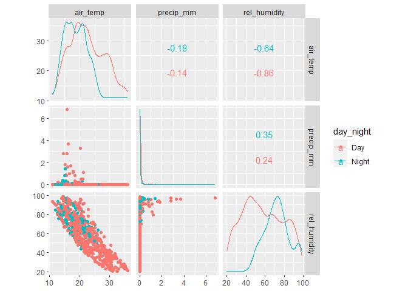
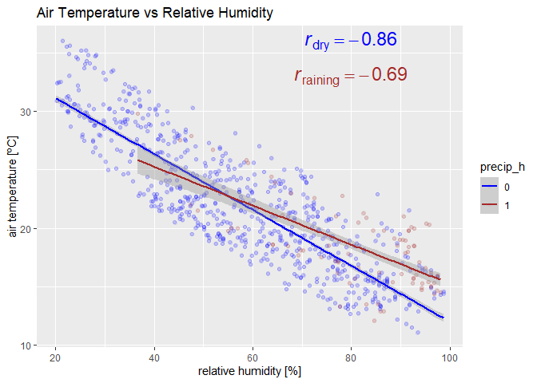
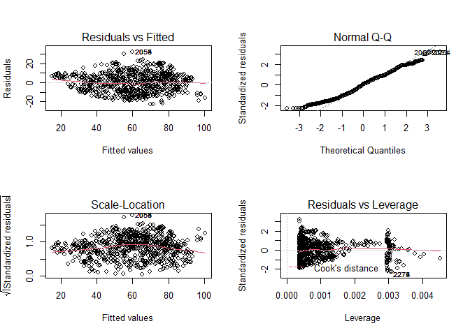
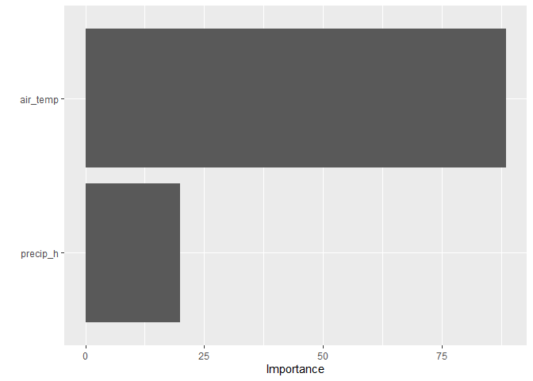
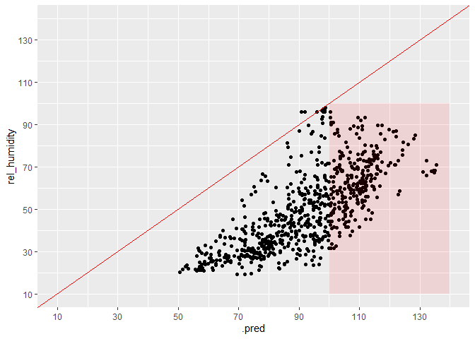
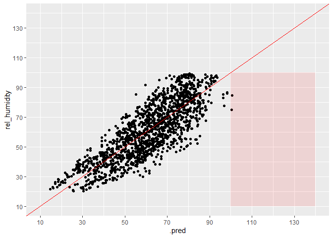
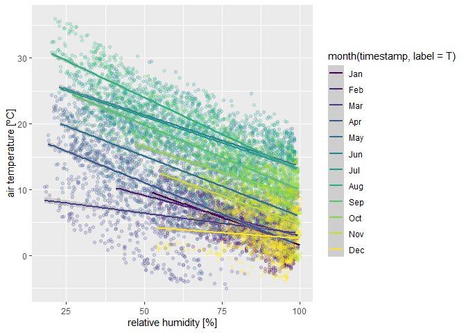

Statistics Course - UWI
================
AlbyDR
2021-03-25

## Example 2.4: Modelling

``` r
suppressPackageStartupMessages({
  library(tidyverse)     
  library(lubridate)
  library(colorspace)
  library(GGally)        
  library(vip) 
  library(tidymodels)
})  
```

``` r
DWD_temperature <- read_rds("DWD_temperature.rds")
DWD_precipitation <- read_rds("DWD_precipitation.rds")

#DWD_precipitation$day_night <- if_else(DWD_precipitation$sunlight_times == "Night", 0, 1)
```

correlation

``` r
DWD_precipitation %>%
  filter(year(timestamp) >= 2020 & month(timestamp) == 8) %>%
  mutate(day_night = fct_collapse(sunlight_times,
                                  "Day" = unique(sunlight_times)[-1])) %>%
  ggscatmat(columns = c("air_temp", "precip_mm", "rel_humidity"), color = "day_night", alpha = 0.8)
```

<!-- -->

when have occurred precipitation in the hour

``` r
DWD_precipitation %>%
  filter(year(timestamp) >= 2020 & month(timestamp) == 8) %>%
  filter(precip_h == 1) %>%
  summarise(r = cor(air_temp, rel_humidity, use = 'pairwise.complete.obs')) %>% pull(r)
```

    ## [1] -0.6892691

when haven’t occurred precipitation in the hour

``` r
DWD_precipitation %>%
  filter(year(timestamp) >= 2020 & month(timestamp) == 8) %>%
  filter(precip_h == 0) %>%
  summarise(r = cor(air_temp, rel_humidity, use = 'pairwise.complete.obs')) %>% pull(r)
```

    ## [1] -0.8624236

``` r
DWD_precipitation %>%
  filter(year(timestamp) >= 2020 & month(timestamp) == 8) %>%
  ggplot(aes(x = rel_humidity, y = air_temp, colour = factor(precip_h))) + 
  geom_jitter(alpha = 0.05) +  
  stat_smooth(method = lm, level = 0.99) +
  scale_colour_manual(name = "precip_h" ,values = c("blue","brown")) +
  ggtitle("Air Temperature vs Relative Humidity") +
  labs(y='air temperature [ºC]',  x='relative humidity [%]') +
  annotate("text", x = 80, y = 33, colour = "brown", size = 6,
           label = "italic(r) [raining] == -0.69", parse = TRUE) +
  annotate("text", x = 80, y = 36, colour = "blue", size = 6,
           label = "italic(r) [dry] == -0.86", parse = TRUE) +
  theme()
```

    ## `geom_smooth()` using formula 'y ~ x'

<!-- -->

But how air temperature explain RH (simple regression model) Linear
Regression Model Specification

``` r
linear_reg() %>% set_engine("lm") %>% set_mode("regression") %>%
  # formula and fit
  fit(rel_humidity ~ air_temp,
      data = filter(DWD_precipitation, 
                    year(timestamp) >= 2020 & month(timestamp) == 8)) %>%
  # summary of training model
  pluck("fit") %>% summary()
```

    ## 
    ## Call:
    ## stats::lm(formula = rel_humidity ~ air_temp, data = data)
    ## 
    ## Residuals:
    ##      Min       1Q   Median       3Q      Max 
    ## -20.3089  -8.7198  -0.1792   7.1814  30.8832 
    ## 
    ## Coefficients:
    ##              Estimate Std. Error t value Pr(>|t|)    
    ## (Intercept) 130.99279    0.81466  160.79   <2e-16 ***
    ## air_temp     -3.25497    0.03646  -89.27   <2e-16 ***
    ## ---
    ## Signif. codes:  0 '***' 0.001 '**' 0.01 '*' 0.05 '.' 0.1 ' ' 1
    ## 
    ## Residual standard error: 10.66 on 2974 degrees of freedom
    ## Multiple R-squared:  0.7282, Adjusted R-squared:  0.7281 
    ## F-statistic:  7969 on 1 and 2974 DF,  p-value: < 2.2e-16

including precip\_h also as in the model (multiple regression)

``` r
linear_reg() %>% set_engine("lm") %>% set_mode("regression") %>%
    fit(rel_humidity ~ air_temp + precip_h,
        data = filter(DWD_precipitation, 
                      year(timestamp) >= 2020 & month(timestamp) == 8)) %>%
    pluck("fit") %>% summary()
```

    ## 
    ## Call:
    ## stats::lm(formula = rel_humidity ~ air_temp + precip_h, data = data)
    ## 
    ## Residuals:
    ##     Min      1Q  Median      3Q     Max 
    ## -22.653  -8.094   0.742   7.262  32.069 
    ## 
    ## Coefficients:
    ##              Estimate Std. Error t value Pr(>|t|)    
    ## (Intercept) 126.34738    0.79945  158.04   <2e-16 ***
    ## air_temp     -3.10307    0.03507  -88.48   <2e-16 ***
    ## precip_h     11.82195    0.59109   20.00   <2e-16 ***
    ## ---
    ## Signif. codes:  0 '***' 0.001 '**' 0.01 '*' 0.05 '.' 0.1 ' ' 1
    ## 
    ## Residual standard error: 10.01 on 2973 degrees of freedom
    ## Multiple R-squared:  0.7605, Adjusted R-squared:  0.7603 
    ## F-statistic:  4719 on 2 and 2973 DF,  p-value: < 2.2e-16

It have improved a bit.

only during the day

``` r
linear_reg() %>% set_engine("lm") %>% set_mode("regression") %>%
    fit(rel_humidity ~ air_temp + precip_h,
        data = filter(DWD_precipitation, 
                      year(timestamp) >= 2020 & month(timestamp) == 8 & sunlight_times != "Night")) %>%
    pluck("fit") %>% summary()
```

    ## 
    ## Call:
    ## stats::lm(formula = rel_humidity ~ air_temp + precip_h, data = data)
    ## 
    ## Residuals:
    ##     Min      1Q  Median      3Q     Max 
    ## -22.540  -7.918   0.594   7.638  32.660 
    ## 
    ## Coefficients:
    ##             Estimate Std. Error t value Pr(>|t|)    
    ## (Intercept) 125.9278     0.8900  141.50   <2e-16 ***
    ## air_temp     -3.1111     0.0379  -82.08   <2e-16 ***
    ## precip_h     12.3008     0.6646   18.51   <2e-16 ***
    ## ---
    ## Signif. codes:  0 '***' 0.001 '**' 0.01 '*' 0.05 '.' 0.1 ' ' 1
    ## 
    ## Residual standard error: 10.01 on 2433 degrees of freedom
    ## Multiple R-squared:  0.7702, Adjusted R-squared:   0.77 
    ## F-statistic:  4077 on 2 and 2433 DF,  p-value: < 2.2e-16

only during the night

``` r
linear_reg() %>% set_engine("lm") %>% set_mode("regression") %>%
    # formula and fit
    fit(rel_humidity ~ air_temp + precip_h,
        data = filter(DWD_precipitation, 
                      year(timestamp) >= 2020 & month(timestamp) == 8 & sunlight_times == "Night")) %>%
    # summary of training model
    pluck("fit") %>% summary()
```

    ## 
    ## Call:
    ## stats::lm(formula = rel_humidity ~ air_temp + precip_h, data = data)
    ## 
    ## Residuals:
    ##      Min       1Q   Median       3Q      Max 
    ## -22.7640  -5.3739   0.6933   6.2159  20.3638 
    ## 
    ## Coefficients:
    ##             Estimate Std. Error t value Pr(>|t|)    
    ## (Intercept) 111.3249     2.2818  48.789   <2e-16 ***
    ## air_temp     -2.1639     0.1182 -18.303   <2e-16 ***
    ## precip_h     11.3840     1.1825   9.627   <2e-16 ***
    ## ---
    ## Signif. codes:  0 '***' 0.001 '**' 0.01 '*' 0.05 '.' 0.1 ' ' 1
    ## 
    ## Residual standard error: 9.125 on 537 degrees of freedom
    ## Multiple R-squared:  0.4954, Adjusted R-squared:  0.4935 
    ## F-statistic: 263.6 on 2 and 537 DF,  p-value: < 2.2e-16

drop significantly

if we include a dummy variable day and night

``` r
linear_reg() %>% set_engine("lm") %>% set_mode("regression") %>%
  fit(rel_humidity ~ air_temp + precip_h + day_night, data = filter(DWD_precipitation, year(timestamp) >= 2020 & month(timestamp) == 8)) %>%
  pluck("fit") %>% summary()
```

    ## 
    ## Call:
    ## stats::lm(formula = rel_humidity ~ air_temp + precip_h + day_night, 
    ##     data = data)
    ## 
    ## Residuals:
    ##     Min      1Q  Median      3Q     Max 
    ## -22.159  -7.884   0.512   7.408  32.682 
    ## 
    ## Coefficients:
    ##              Estimate Std. Error t value Pr(>|t|)    
    ## (Intercept) 127.61753    0.81678  156.25  < 2e-16 ***
    ## air_temp     -3.04005    0.03611  -84.20  < 2e-16 ***
    ## precip_h     11.94115    0.58718   20.34  < 2e-16 ***
    ## day_night    -3.23816    0.49060   -6.60 4.84e-11 ***
    ## ---
    ## Signif. codes:  0 '***' 0.001 '**' 0.01 '*' 0.05 '.' 0.1 ' ' 1
    ## 
    ## Residual standard error: 9.943 on 2972 degrees of freedom
    ## Multiple R-squared:  0.7639, Adjusted R-squared:  0.7637 
    ## F-statistic:  3206 on 3 and 2972 DF,  p-value: < 2.2e-16

It is like before, the drop of Rsquared (coefficient of explanation) is
probably because at night has less variation to explain.

``` r
linear_reg() %>% set_engine("lm") %>% set_mode("regression") %>%
  fit(rel_humidity ~ air_temp + precip_h,
      data = filter(DWD_precipitation, year(timestamp) >= 2020 & month(timestamp) == 8)) -> lm_RH_fit
```

Coefficients and accuracy (training)

``` r
tidy(lm_RH_fit)
```

    ## # A tibble: 3 x 5
    ##   term        estimate std.error statistic  p.value
    ##   <chr>          <dbl>     <dbl>     <dbl>    <dbl>
    ## 1 (Intercept)   126.      0.799      158.  0.      
    ## 2 air_temp       -3.10    0.0351     -88.5 0.      
    ## 3 precip_h       11.8     0.591       20.0 1.36e-83

``` r
glance(lm_RH_fit)
```

    ## # A tibble: 1 x 12
    ##   r.squared adj.r.squared sigma statistic p.value    df  logLik    AIC    BIC
    ##       <dbl>         <dbl> <dbl>     <dbl>   <dbl> <dbl>   <dbl>  <dbl>  <dbl>
    ## 1     0.760         0.760  10.0     4719.       0     2 -11078. 22164. 22188.
    ## # ... with 3 more variables: deviance <dbl>, df.residual <int>, nobs <int>

residuals assessment

``` r
par(mfrow = c(2,2))
plot(lm_RH_fit$fit)
```

<!-- -->

variable importance

``` r
vip(lm_RH_fit)
```

<!-- -->

model prediction (predict on April of the same year)

``` r
predict(lm_RH_fit, new_data = filter(DWD_precipitation, year(timestamp) >= 2020 & month(timestamp) == 4)) %>%
bind_cols(filter(DWD_precipitation, year(timestamp) >= 2020 & month(timestamp) == 4)) -> lm_RH_pred
```

check the metrics of accuracy

``` r
metrics_reg <- metric_set(rsq, rmse, mpe)
metrics_reg(lm_RH_pred, truth = rel_humidity, estimate = .pred) 
```

    ## # A tibble: 3 x 3
    ##   .metric .estimator .estimate
    ##   <chr>   <chr>          <dbl>
    ## 1 rsq     standard       0.516
    ## 2 rmse    standard      44.5  
    ## 3 mpe     standard    -102.

Seem that the Rsquared decrease, the RMSE increased 4x and the bias
rocket to -102

lets confirm with a plot

``` r
ggplot(lm_RH_pred) +
  geom_point(aes(y = rel_humidity, x = .pred)) + 
  geom_abline(intercept = 0, slope = 1, colour = "red") +
  scale_x_continuous(limits = c(10,140), breaks = seq(10, 140, 20)) + 
  scale_y_continuous(limits = c(10,140), breaks = seq(10, 140, 20)) +
  annotate("rect", xmin = 100, xmax = 140, ymin = 10, ymax = 100,
           alpha = .1, fill = "red")
```

<!-- -->

The model is very bias! It predict ‘always’ higher values than the
observed.

Also, the model predict many values over 100%, with is unreasonable. But
is its because a percentage, should not be treated as a continuous
variable

lets try to predict now the month = 8, but from the previous year

``` r
predict(lm_RH_fit, new_data = filter(DWD_precipitation, year(timestamp) >= 2019 & month(timestamp) == 8)) %>%
  bind_cols(filter(DWD_precipitation, year(timestamp) >= 2019 & month(timestamp) == 8)) -> lm_RH_pred
```

``` r
metrics_reg(lm_RH_pred, truth = rel_humidity, estimate = .pred) 
```

    ## # A tibble: 3 x 3
    ##   .metric .estimator .estimate
    ##   <chr>   <chr>          <dbl>
    ## 1 rsq     standard       0.725
    ## 2 rmse    standard      10.5  
    ## 3 mpe     standard      -3.38

The Rsquared dropped a bit, but the error and bias are very similar

``` r
ggplot(lm_RH_pred) +
  geom_point(aes(y = rel_humidity, x = .pred)) + 
  geom_abline(intercept = 0, slope = 1, colour = "red") +
  scale_x_continuous(limits = c(10,140), breaks = seq(10, 140, 20)) + 
  scale_y_continuous(limits = c(10,140), breaks = seq(10, 140, 20)) +
  annotate("rect", xmin = 100, xmax = 140, ymin = 10, ymax = 100,
           alpha = .1, fill = "red")
```

<!-- -->

Much better!!! the bias is gone and only two values slightly higher than
100%

Apparently the model can be generalized to other year if in the same
month.

How is the model accuracy for the entire year?

``` r
linear_reg() %>% set_engine("lm") %>% set_mode("regression") %>%
  fit(rel_humidity ~ air_temp + precip_h, data = filter(DWD_precipitation, year(timestamp) >= 2020)) %>%
  pluck("fit") %>% summary()
```

    ## 
    ## Call:
    ## stats::lm(formula = rel_humidity ~ air_temp + precip_h, data = data)
    ## 
    ## Residuals:
    ##     Min      1Q  Median      3Q     Max 
    ## -55.227  -9.566   1.779  10.967  38.838 
    ## 
    ## Coefficients:
    ##             Estimate Std. Error t value Pr(>|t|)    
    ## (Intercept) 87.49916    0.16043  545.40   <2e-16 ***
    ## air_temp    -1.53319    0.01145 -133.92   <2e-16 ***
    ## precip_h    15.13933    0.22853   66.25   <2e-16 ***
    ## ---
    ## Signif. codes:  0 '***' 0.001 '**' 0.01 '*' 0.05 '.' 0.1 ' ' 1
    ## 
    ## Residual standard error: 15.84 on 34937 degrees of freedom
    ##   (26 observations deleted due to missingness)
    ## Multiple R-squared:  0.4067, Adjusted R-squared:  0.4067 
    ## F-statistic: 1.198e+04 on 2 and 34937 DF,  p-value: < 2.2e-16

The accuracy is drop significantly

Lets stratify by month

``` r
DWD_precipitation %>%
  filter(year(timestamp) >= 2020) %>%
  ggplot(aes(x = rel_humidity, y = air_temp, colour = month(timestamp, label = T))) + 
  geom_jitter(alpha = 0.05) +  
  stat_smooth(method = lm, level = 0.99) +
  labs(y='air temperature [ºC]',  x='relative humidity [%]') +
  theme()
```

    ## `geom_smooth()` using formula 'y ~ x'

    ## Warning: Removed 26 rows containing non-finite values (stat_smooth).

    ## Warning: Removed 26 rows containing missing values (geom_point).

<!-- -->

The relationship look similar (negative / inversely proportional), but
winter months the variation are smaller (short lines).

However, as the average temperature and relative humidity are quite
different across the year. So is a model for each month the solution? It
will will be to laborious to have 12 models. hierarchical In this case
**Multilevel or Hierarchical Model** is probably the best solution
because its allow the model to have a slope and/or an intercept for each
model level (month in this case), but keeping only one \#’ model.
