Statistics Course - UWI
================
AlbyDR
2021-04-16

## Example 3.1: Probability Distribution

``` r
packages_list3 <- c("tidyverse", "lubridate", "infer", "summarytools", "tidymodels",
                      "moderndive", "extRemes")
```
``` r
invisible(lapply(packages_list3, library, character.only = T, quietly = TRUE, warn.conflicts = F))
```


``` r
DWD_temperature <- read_rds("DWD_temperature.rds")
DWD_precipitation <- read_rds("DWD_precipitation.rds")
```

### Probability Distributions

**Binomial**

``` r
rbinom(100000, size = 24, prob = 0.2) %>%
qplot(bins = 30, fill = I("lightblue"), colour = I("darkblue"))
```

<!-- -->

probability to rain 0 and 5 times in a day

``` r
dbinom(0, size = 24, prob = .20)
```

    ## [1] 0.004722366

``` r
dbinom(5, size = 24, prob = .20)
```

    ## [1] 0.1960151

accumulated

``` r
pbinom(0:24, size = 24, prob = 0.2) %>%
  plot()
```

<!-- -->

**Geometric**

``` r
rgeom(100000, prob = 0.2) %>%
  qplot(bins = 120, fill = I("lightblue"), colour = I("darkblue"))
```

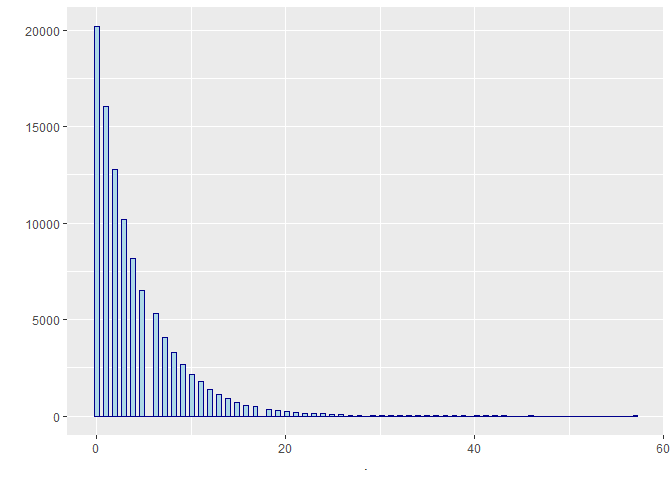<!-- -->

accumulated

``` r
pgeom(0:24, prob = 0.2) %>%
  plot()
```

<!-- -->

probability to rain 0 and 5 times in a day

``` r
dgeom(0, prob = .20)
```

    ## [1] 0.2

``` r
dgeom(5, prob = .20)
```

    ## [1] 0.065536

``` r
dgeom(24, prob = .20)
```

    ## [1] 0.0009444733

**Poisson**

``` r
rpois(100000, lambda  = 5) %>%
  qplot(bins = 120, fill = I("lightblue"), colour = I("darkblue"))
```

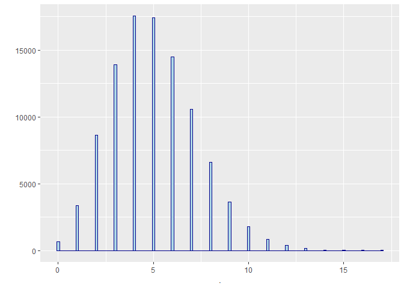<!-- -->

accumulated

``` r
ppois(0:24, lambda  = 5) %>%
  plot()
```

<!-- -->

probability to rain 0 and 5 times in a day

``` r
dpois(0, lambda  = 5)
```

    ## [1] 0.006737947

``` r
dpois(5, lambda  = 5)
```

    ## [1] 0.1754674

``` r
dpois(24, lambda  = 5)
```

    ## [1] 6.472947e-10

**Exponential**

``` r
rexp(100000, rate  = 1/5) %>%
  qplot(bins = 80, fill = I("lightblue"), colour = I("darkblue"))
```

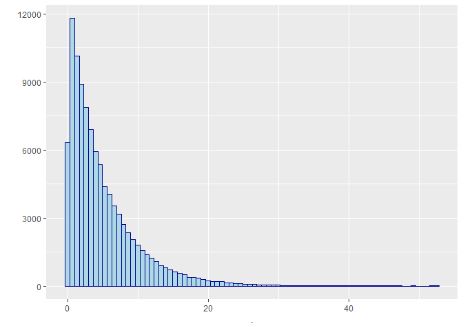<!-- -->

accumulated

``` r
pexp(0:24, rate  = 1/5) %>%
  plot()
```

<!-- -->

probability to rain 0 and 5 times in a day

``` r
pexp(1, rate  = 1/5)
```

    ## [1] 0.1812692

``` r
pexp(5, rate  = 1/5)
```

    ## [1] 0.6321206

``` r
pexp(24, rate  = 1/5)
```

    ## [1] 0.9917703

**Normal**

``` r
rnorm(100000, mean  = 18, sd = 6) %>%
  qplot(bins = 80, fill = I("lightblue"), colour = I("darkblue")) +
  geom_vline(xintercept = 18, colour = "red", linetype = "dashed", size = 1.2)
```

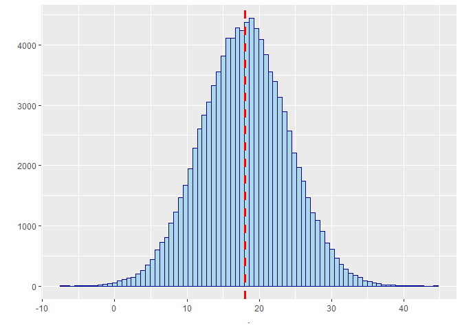<!-- -->

accumulated

``` r
pnorm(seq(-10,40,1), mean  = 18, sd = 6) %>%
  plot()
```

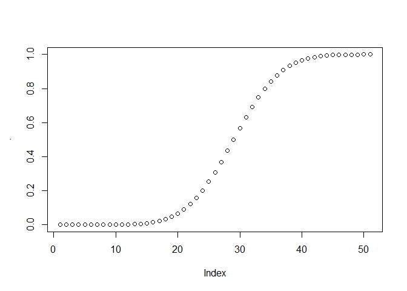<!-- -->

probability to rain 0 and 5 times in a day

``` r
pnorm(0, mean  = 18, sd = 6)
```

    ## [1] 0.001349898

``` r
pnorm(18, mean  = 18, sd = 6)
```

    ## [1] 0.5

``` r
pnorm(30, mean  = 18, sd = 6, lower.tail = FALSE)
```

    ## [1] 0.02275013

Return dnorm(x) for 0 &lt; x &lt; 2, and NA for all other x

``` r
limitRange <- function(fun, mean, sd, min, max) {
  function(x) {
    y <- fun(x, mean, sd)
    y[x < min  |  x > max] <- NA
    return(y)
  }
}
```

ggplot() with dummy data

``` r
ggplot(data.frame(x = c(-3, 3)), aes(x = x)) +
  stat_function(fun = limitRange(dnorm, 0, 1, -3, 3), geom = "area", fill = "blue", alpha = 0.2) +
  stat_function(fun = limitRange(dnorm, 0, 1, -2, 2), geom = "area", fill = "blue", alpha = 0.2) +
  stat_function(fun = limitRange(dnorm, 0, 1, -1, 1), geom = "area", fill = "blue", alpha = 0.2) +
  stat_function(fun = dnorm) +
  scale_x_continuous(breaks = c(-3,-2,-1,0,1,2,3))
```

<!-- -->

``` r
rnorm_plot <- data.frame("N01" = rnorm(1000))
```

``` r
ggplot(rnorm_plot, aes(sample = N01)) +
  stat_qq(colour = "blue") + stat_qq_line() +
  scale_x_continuous(breaks = c(-3,-2,-1,0,1,2,3)) +
  scale_y_continuous(breaks = c(-3,-2,-1,0,1,2,3))
```

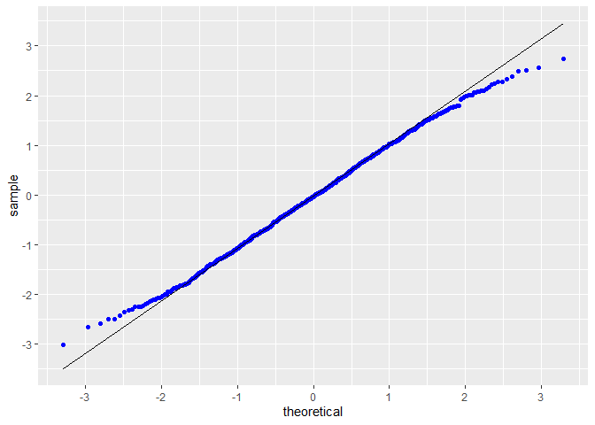<!-- -->

``` r
1-2*pnorm(-1, 0, 1)
```

    ## [1] 0.6826895

``` r
1-2*pnorm(-2, 0, 1)
```

    ## [1] 0.9544997

``` r
1-2*pnorm(-3, 0, 1)
```

    ## [1] 0.9973002

``` r
descr(DWD_precipitation$air_temp, stats = "all")
```

    ## Descriptive Statistics  
    ## DWD_precipitation$air_temp  
    ## N: 236566  
    ## 
    ##                      air_temp
    ## ----------------- -----------
    ##              Mean       10.16
    ##           Std.Dev        8.18
    ##               Min      -19.60
    ##                Q1        4.00
    ##            Median        9.90
    ##                Q3       16.10
    ##               Max       37.70
    ##               MAD        8.90
    ##               IQR       12.10
    ##                CV        0.81
    ##          Skewness        0.12
    ##       SE.Skewness        0.01
    ##          Kurtosis       -0.37
    ##           N.Valid   236566.00
    ##         Pct.Valid      100.00

``` r
ggplot(DWD_precipitation, aes(x = air_temp)) +
  geom_density(size = I(1.5), colour = I("darkblue") ) +
  stat_function(fun = limitRange(dnorm, 10.16, 8.18, 10.16-8.18, 10.16+8.18),  geom = "area", fill = "blue", alpha = 0.1) +
  stat_function(fun = limitRange(dnorm, 10.16, 8.18, 10.16-2*8.18, 10.16+2*8.18),  geom = "area", fill = "blue", alpha = 0.1) +
  stat_function(fun = limitRange(dnorm, 10.16, 8.18, 10.16-3*8.18, 10.16+3*8.18),  geom = "area", fill = "blue", alpha = 0.1) +
  scale_x_continuous(breaks = seq(-20, 40, 10))
```

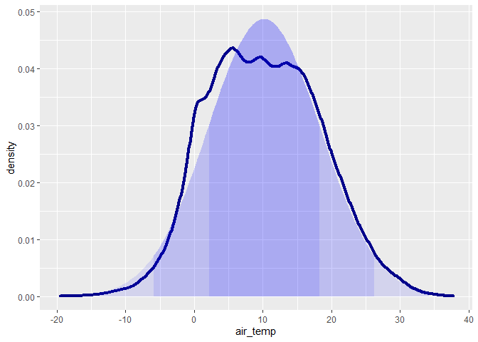<!-- -->

``` r
ggplot(DWD_precipitation, aes(sample = air_temp)) +
  stat_qq(colour = "blue") + stat_qq_line() +
  scale_x_continuous(breaks = c(-3,-2,-1,0,1,2,3))
```

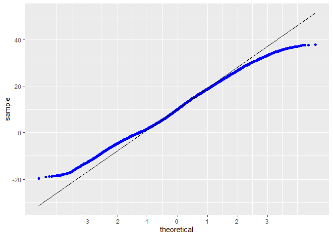<!-- -->

``` r
1-2*pnorm(10.16-8.18, 10.16, 8.18)
```

    ## [1] 0.6826895

``` r
DWD_precipitation %>%
  filter(air_temp >= 10.16-8.18 & air_temp <= 10.16+8.18) %>%
  summarise(n = n())
```

    ## # A tibble: 1 x 1
    ##        n
    ##    <int>
    ## 1 156091

``` r
DWD_precipitation %>%
  filter(is.na(air_temp) != T) %>%
  summarise(n = n())
```

    ## # A tibble: 1 x 1
    ##        n
    ##    <int>
    ## 1 236566

``` r
156091/236566 # 0.66 vs 0.68
```

    ## [1] 0.6598201

probability to have a temperature below zero

``` r
pnorm(0, 10.16, 8.18, lower.tail = T)
```

    ## [1] 0.1071084

``` r
pnorm(-10, 10.16, 8.18, lower.tail = T)
```

    ## [1] 0.006859316

Chi-squared Random numbers

``` r
rchisq(10000, df = 5) %>%
    qplot(bins = 80, fill = I("lightblue"), colour = I("darkblue") )
```

<!-- -->

t Random numbers

``` r
rt(10000, df = 5) %>%
    qplot(bins = 80, fill = I("lightblue"), colour = I("darkblue") )
```

<!-- -->

F Random numbers

``` r
rf(10000, df1 = 9999, df2 = 9999) %>%
    qplot(bins = 80, fill = I("lightblue"), colour = I("darkblue") )
```

<!-- -->

Cauchy Random numbers

``` r
rcauchy(10000, scale = 2) %>%
  qplot(bins = 50, fill = I("lightblue"), colour = I("darkblue") ) +
  scale_x_continuous(limits = c(-50,50))
```

    ## Warning: Removed 254 rows containing non-finite values (stat_bin).

<!-- -->

Generate Gumbel Random numbers

``` r
revd(10000, loc = 0, scale = 1, shape = 0) %>%
  qplot(bins = 80, fill = I("lightblue"), colour = I("darkblue") )
```

<!-- -->

Frechet distribution

``` r
revd(10000,loc= 0, scale = 1, shape = 0.2)  %>%
  qplot(bins = 80, fill = I("lightblue"), colour = I("darkblue") )
```

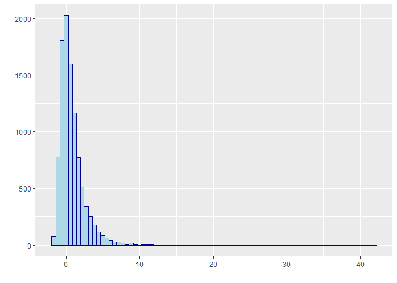<!-- -->

# Generate Weibull Random numbers

``` r
revd(10000,loc= 0, scale = 1, shape = -0.6)  %>%
  qplot(bins = 80, fill = I("lightblue"), colour = I("darkblue") )
```

<!-- -->

Monte Carlo simulations - Normal distribution

``` r
set.seed(999)
simulated_temp <- tibble("temp" = rnorm(100, 10, 8))
```

``` r
ggplot(simulated_temp) +
  geom_density(aes(x = temp), fill = "lightblue") +
  geom_vline(xintercept = 10, colour = "red", linetype = "dashed", size = 1.2) +
  scale_x_continuous(breaks = seq(-20, 40, 10))
```

<!-- -->

``` r
set.seed(999)
simulated_temp <- tibble("temp" = rnorm(100000, 10, 8))
```

``` r
ggplot(simulated_temp) +
  geom_density(aes(x = temp), fill = "lightblue") +
  geom_vline(xintercept = 10, colour = "red", linetype = "dashed", size = 1.2) +
  scale_x_continuous(limits = c(-20 , 40), breaks = seq(-20, 40, 10))
```

    ## Warning: Removed 13 rows containing non-finite values (stat_density).

<!-- -->

``` r
set.seed(999)
simulated_temp_1000 <- tibble("temp" = replicate(1000, {
  simulated_temp <- rnorm(100, 10, 8)
  mean(simulated_temp)
}))
```

``` r
ggplot(simulated_temp_1000) +
  geom_density(aes(x = temp), fill = "lightblue") +
  geom_vline(xintercept = 10, colour = "red", linetype = "dashed", size = 1.2) +
  scale_x_continuous(limits = c(-20 , 40), breaks = seq(-20, 40, 10))
```

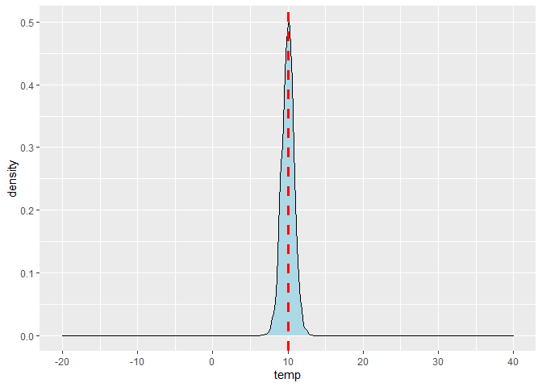<!-- -->

``` r
descr(simulated_temp_1000$temp)
```

    ## Descriptive Statistics  
    ## simulated_temp_1000$temp  
    ## N: 1000  
    ## 
    ##                        temp
    ## ----------------- ---------
    ##              Mean      9.98
    ##           Std.Dev      0.81
    ##               Min      6.97
    ##                Q1      9.46
    ##            Median     10.00
    ##                Q3     10.51
    ##               Max     12.58
    ##               MAD      0.77
    ##               IQR      1.05
    ##                CV      0.08
    ##          Skewness     -0.04
    ##       SE.Skewness      0.08
    ##          Kurtosis      0.22
    ##           N.Valid   1000.00
    ##         Pct.Valid    100.00

the mean is similar but the sd = SEM/sqrt(n))

``` r
8/sqrt(100)
```

    ## [1] 0.8

the sd measure the dispersion around the mean of a data set, while
Standard Error of a mean it is measuring how much discrepancy the sample
mean has in relation of the population mean.

``` r
DWD_precipitation %>%
  filter(year(timestamp)==2020) %>%
  ggplot() +
  geom_histogram(aes(x = precip_mm))
```

    ## `stat_bin()` using `bins = 30`. Pick better value with `binwidth`.

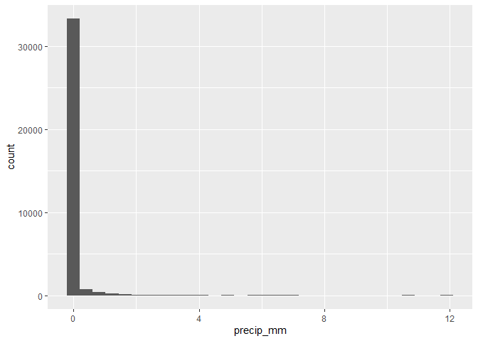<!-- -->

``` r
DWD_precipitation %>%
  filter(year(timestamp)==2020) %>%
  ggplot(aes(sample = precip_mm)) +
  stat_qq() + stat_qq_line()
```

<!-- -->

``` r
set.seed(999)
simulated_recip_1000 <- tibble("mm" = replicate(100, {
  simulated_recip_temp <- sample_n(tibble("mm" = DWD_precipitation$precip_mm), 1000)
  mean(simulated_recip_temp$mm, na.rm=T)
}))
```

``` r
ggplot(simulated_recip_1000) +
  geom_density(aes(x = mm), fill = "lightblue") #+
```

<!-- -->

``` r
simulated_recip_1000 %>%
  ggplot(aes(sample = mm)) +
  stat_qq() + stat_qq_line()
```

<!-- -->
