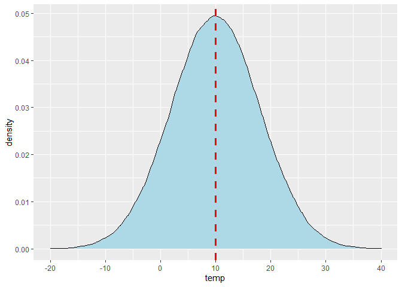
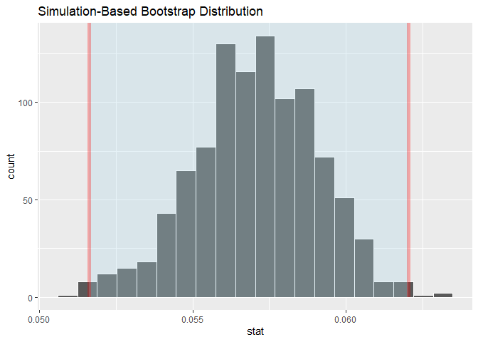

Statistics Course - UWI
================
AlbyDR
2021-04-14

## Example 3.1: Probability Distribution -

### 

``` r
suppressPackageStartupMessages({
  library(tidyverse)     # ggplot, readr and dplyr packages
  library(lubridate)     # date-time
  library(infer)
  library(tidymodels)
  library(summarytools)
  library(moderndive)
  library(extRemes)
  })  # colours
```

    ## Warning: package 'tidyr' was built under R version 4.0.5

    ## Warning: package 'dplyr' was built under R version 4.0.5

    ## Warning: package 'lubridate' was built under R version 4.0.5

    ## Warning: package 'yardstick' was built under R version 4.0.5

    ## Warning: package 'extRemes' was built under R version 4.0.5

``` r
DWD_temperature <- read_rds("DWD_temperature.rds")
DWD_precipitation <- read_rds("DWD_precipitation.rds")
```

### Probability Distributions

``` r
# **Binomial**
rbinom(100000, size = 24, prob = 0.2) %>%
qplot(bins = 30, fill = I("lightblue"), colour = I("darkblue"))
```

<!-- -->

probability to rain 0 and 5 times in a day

``` r
dbinom(0, size = 24, prob = .20)
```

    ## [1] 0.004722366

``` r
dbinom(5, size = 24, prob = .20)
```

    ## [1] 0.1960151

``` r
# accumulated
pbinom(0:24, size = 24, prob = 0.2) %>%
  plot()
```

<!-- -->

**Geometric**

``` r
rgeom(100000, prob = 0.2) %>%
  qplot(bins = 120, fill = I("lightblue"), colour = I("darkblue"))
```

<!-- -->

accumulated

``` r
pgeom(0:24, prob = 0.2) %>%
  plot()
```

<!-- -->

probability to rain 0 and 5 times in a day

``` r
dgeom(0, prob = .20)
```

    ## [1] 0.2

``` r
dgeom(5, prob = .20)
```

    ## [1] 0.065536

``` r
dgeom(24, prob = .20)
```

    ## [1] 0.0009444733

**Poisson**

``` r
rpois(100000, lambda  = 5) %>%
  qplot(bins = 120, fill = I("lightblue"), colour = I("darkblue"))
```

<!-- -->

accumulated

``` r
ppois(0:24, lambda  = 5) %>%
  plot()
```

<!-- -->

probability to rain 0 and 5 times in a day

``` r
dpois(0, lambda  = 5)
```

    ## [1] 0.006737947

``` r
dpois(5, lambda  = 5)
```

    ## [1] 0.1754674

``` r
dpois(24, lambda  = 5)
```

    ## [1] 6.472947e-10

**Exponential**

``` r
rexp(100000, rate  = 1/5) %>%
  qplot(bins = 80, fill = I("lightblue"), colour = I("darkblue"))
```

<!-- -->

accumulated

``` r
pexp(0:24, rate  = 1/5) %>%
  plot()
```

<!-- -->

probability to rain 0 and 5 times in a day

``` r
pexp(1, rate  = 1/5)
```

    ## [1] 0.1812692

``` r
pexp(5, rate  = 1/5)
```

    ## [1] 0.6321206

``` r
pexp(24, rate  = 1/5)
```

    ## [1] 0.9917703

**Normal**

``` r
rnorm(100000, mean  = 18, sd = 6) %>%
  qplot(bins = 80, fill = I("lightblue"), colour = I("darkblue")) +
  geom_vline(xintercept = 18, colour = "red", linetype = "dashed", size = 1.2)
```

<!-- -->

accumulated

``` r
pnorm(seq(-10,40,1), mean  = 18, sd = 6) %>%
  plot()
```

<!-- -->

probability to rain 0 and 5 times in a day

``` r
pnorm(0, mean  = 18, sd = 6)
```

    ## [1] 0.001349898

``` r
pnorm(18, mean  = 18, sd = 6)
```

    ## [1] 0.5

``` r
pnorm(30, mean  = 18, sd = 6, lower.tail = FALSE)
```

    ## [1] 0.02275013

Return dnorm(x) for 0 &lt; x &lt; 2, and NA for all other x

``` r
limitRange <- function(fun, mean, sd, min, max) {
  function(x) {
    y <- fun(x, mean, sd)
    y[x < min  |  x > max] <- NA
    return(y)
  }
}
```

ggplot() with dummy data

``` r
ggplot(data.frame(x = c(-3, 3)), aes(x = x)) +
  stat_function(fun = limitRange(dnorm, 0, 1, -3, 3), geom = "area", fill = "blue", alpha = 0.2) +
  stat_function(fun = limitRange(dnorm, 0, 1, -2, 2), geom = "area", fill = "blue", alpha = 0.2) +
  stat_function(fun = limitRange(dnorm, 0, 1, -1, 1), geom = "area", fill = "blue", alpha = 0.2) +
  stat_function(fun = dnorm) +
  scale_x_continuous(breaks = c(-3,-2,-1,0,1,2,3))
```

<!-- -->

``` r
rnorm_plot <- data.frame("N01" = rnorm(1000))
```

``` r
ggplot(rnorm_plot, aes(sample = N01)) +
  stat_qq(colour = "blue") + stat_qq_line() +
  scale_x_continuous(breaks = c(-3,-2,-1,0,1,2,3)) +
  scale_y_continuous(breaks = c(-3,-2,-1,0,1,2,3))
```

<!-- -->

``` r
1-2*pnorm(-1, 0, 1)
```

    ## [1] 0.6826895

``` r
1-2*pnorm(-2, 0, 1)
```

    ## [1] 0.9544997

``` r
1-2*pnorm(-3, 0, 1)
```

    ## [1] 0.9973002

``` r
descr(DWD_precipitation$air_temp, stats = "all")
```

    ## Descriptive Statistics  
    ## DWD_precipitation$air_temp  
    ## N: 236566  
    ## 
    ##                      air_temp
    ## ----------------- -----------
    ##              Mean       10.16
    ##           Std.Dev        8.18
    ##               Min      -19.60
    ##                Q1        4.00
    ##            Median        9.90
    ##                Q3       16.10
    ##               Max       37.70
    ##               MAD        8.90
    ##               IQR       12.10
    ##                CV        0.81
    ##          Skewness        0.12
    ##       SE.Skewness        0.01
    ##          Kurtosis       -0.37
    ##           N.Valid   236566.00
    ##         Pct.Valid      100.00

``` r
ggplot(DWD_precipitation, aes(x = air_temp)) +
  geom_density(size = I(1.5), colour = I("darkblue") ) +
  stat_function(fun = limitRange(dnorm, 10.16, 8.18, 10.16-8.18, 10.16+8.18),  geom = "area", fill = "blue", alpha = 0.1) +
  stat_function(fun = limitRange(dnorm, 10.16, 8.18, 10.16-2*8.18, 10.16+2*8.18),  geom = "area", fill = "blue", alpha = 0.1) +
  stat_function(fun = limitRange(dnorm, 10.16, 8.18, 10.16-3*8.18, 10.16+3*8.18),  geom = "area", fill = "blue", alpha = 0.1) +
  scale_x_continuous(breaks = seq(-20, 40, 10))
```

<!-- -->

``` r
ggplot(DWD_precipitation, aes(sample = air_temp)) +
  stat_qq(colour = "blue") + stat_qq_line() +
  scale_x_continuous(breaks = c(-3,-2,-1,0,1,2,3))
```

<!-- -->

``` r
1-2*pnorm(10.16-8.18, 10.16, 8.18)
```

    ## [1] 0.6826895

``` r
DWD_precipitation %>%
  filter(air_temp >= 10.16-8.18 & air_temp <= 10.16+8.18) %>%
  summarise(n = n())
```

    ## # A tibble: 1 x 1
    ##        n
    ##    <int>
    ## 1 156091

``` r
DWD_precipitation %>%
  filter(is.na(air_temp) != T) %>%
  summarise(n = n())
```

    ## # A tibble: 1 x 1
    ##        n
    ##    <int>
    ## 1 236566

``` r
156091/236566 # 0.66 vs 0.68
```

    ## [1] 0.6598201

probability to have a temperature below zero

``` r
pnorm(0, 10.16, 8.18, lower.tail = T)
```

    ## [1] 0.1071084

``` r
pnorm(-10, 10.16, 8.18, lower.tail = T)
```

    ## [1] 0.006859316

Chi-squared Random numbers

``` r
rchisq(10000, df = 5) %>%
    qplot(bins = 80, fill = I("lightblue"), colour = I("darkblue") )
```

<!-- -->

t Random numbers

``` r
rt(10000, df = 5) %>%
    qplot(bins = 80, fill = I("lightblue"), colour = I("darkblue") )
```

<!-- -->

F Random numbers

``` r
rf(10000, df1 = 9999, df2 = 9999) %>%
    qplot(bins = 80, fill = I("lightblue"), colour = I("darkblue") )
```

<!-- -->

Cauchy Random numbers

``` r
rcauchy(10000, scale = 2) %>%
  qplot(bins = 50, fill = I("lightblue"), colour = I("darkblue") ) +
  scale_x_continuous(limits = c(-50,50))
```

    ## Warning: Removed 257 rows containing non-finite values (stat_bin).

<!-- -->

Generate Gumbel Random numbers

``` r
revd(10000, loc = 0, scale = 1, shape = 0) %>%
  qplot(bins = 80, fill = I("lightblue"), colour = I("darkblue") )
```

<!-- -->

Frechet distribution

``` r
revd(10000,loc= 0, scale = 1, shape = 0.2)  %>%
  qplot(bins = 80, fill = I("lightblue"), colour = I("darkblue") )
```

<!-- -->

# Generate Weibull Random numbers

``` r
revd(10000,loc= 0, scale = 1, shape = -0.6)  %>%
  qplot(bins = 80, fill = I("lightblue"), colour = I("darkblue") )
```

<!-- -->

Monte Carlo simulations - Normal distribution

``` r
set.seed(999)
simulated_temp <- tibble("temp" = rnorm(100, 10, 8))
```

``` r
ggplot(simulated_temp) +
  geom_density(aes(x = temp), fill = "lightblue") +
  geom_vline(xintercept = 10, colour = "red", linetype = "dashed", size = 1.2) +
  scale_x_continuous(breaks = seq(-20, 40, 10))
```

<!-- -->

``` r
set.seed(999)
simulated_temp <- tibble("temp" = rnorm(100000, 10, 8))
```

``` r
ggplot(simulated_temp) +
  geom_density(aes(x = temp), fill = "lightblue") +
  geom_vline(xintercept = 10, colour = "red", linetype = "dashed", size = 1.2) +
  scale_x_continuous(limits = c(-20 , 40), breaks = seq(-20, 40, 10))
```

    ## Warning: Removed 13 rows containing non-finite values (stat_density).

<!-- -->

``` r
set.seed(999)
simulated_temp_1000 <- tibble("temp" = replicate(1000, {
  simulated_temp <- rnorm(100, 10, 8)
  mean(simulated_temp)
}))
```

``` r
ggplot(simulated_temp_1000) +
  geom_density(aes(x = temp), fill = "lightblue") +
  geom_vline(xintercept = 10, colour = "red", linetype = "dashed", size = 1.2) +
  scale_x_continuous(limits = c(-20 , 40), breaks = seq(-20, 40, 10))
```

<!-- -->

``` r
descr(simulated_temp_1000$temp)
```

    ## Descriptive Statistics  
    ## simulated_temp_1000$temp  
    ## N: 1000  
    ## 
    ##                        temp
    ## ----------------- ---------
    ##              Mean      9.98
    ##           Std.Dev      0.81
    ##               Min      6.97
    ##                Q1      9.46
    ##            Median     10.00
    ##                Q3     10.51
    ##               Max     12.58
    ##               MAD      0.77
    ##               IQR      1.05
    ##                CV      0.08
    ##          Skewness     -0.04
    ##       SE.Skewness      0.08
    ##          Kurtosis      0.22
    ##           N.Valid   1000.00
    ##         Pct.Valid    100.00

the mean is similar but the sd = SEM/sqrt(n))

``` r
8/sqrt(100)
```

    ## [1] 0.8

the sd measure the dispersion around the mean of a data set, while
Standard Error of a mean it is measuring how much discrepancy the sample
mean has in relation of the population mean.

``` r
DWD_precipitation %>%
  filter(year(timestamp)==2020) %>%
  ggplot() +
  geom_histogram(aes(x = precip_mm))
```

    ## `stat_bin()` using `bins = 30`. Pick better value with `binwidth`.

<!-- -->

``` r
DWD_precipitation %>%
  filter(year(timestamp)==2020) %>%
  ggplot(aes(sample = precip_mm)) +
  stat_qq() + stat_qq_line()
```

<!-- -->

``` r
set.seed(999)
simulated_recip_1000 <- tibble("mm" = replicate(100, {
  simulated_recip_temp <- sample_n(tibble("mm" = DWD_precipitation$precip_mm), 1000)
  mean(simulated_recip_temp$mm, na.rm=T)
}))
```

``` r
ggplot(simulated_recip_1000) +
  geom_density(aes(x = mm), fill = "lightblue") #+
```

<!-- -->

``` r
simulated_recip_1000 %>%
  ggplot(aes(sample = mm)) +
  stat_qq() + stat_qq_line()
```

<!-- -->

## Confidence Intervals

``` r
DWD_temperature %>%
filter(year(timestamp) >= 1900) %>%
  group_by(year = year(timestamp),
           doy = yday(timestamp)) %>%
  summarise(mean = mean(air_temp, na.rm=T)) %>%
  summarise(mean_cl_normal(mean)) %>%
#print(n=10)
  ggplot(aes(x = year, y = y)) +
  geom_ribbon(aes(ymin = ymin, ymax = ymax), fill = "blue", alpha = 0.3) +
  geom_jitter(size = 1, color = "blue") +
  scale_x_continuous(name="year", breaks = c(seq(1900,2020,5)))+
  scale_y_continuous(limits = c(5.5, 12.5), breaks=c(6:13)) +
  labs(x = 'year', y = 'air temperature (average +/- ci)') +
  theme(axis.text.x = element_text(color="grey25", size=8, angle=90))
```

    ## `summarise()` has grouped output by 'year'. You can override using the `.groups` argument.

<!-- -->

Distribution of the proportion of precipitation per hour

``` r
DWD_precipitation %>%
  filter(year(timestamp) == 2020) %>%
  mutate(precip_h = as_factor(precip_h) %>% fct_recode(dry = "0", raining = "1")) %>%
  specify(response = precip_h, success = "raining") %>%
  generate(reps = 1000, type = "bootstrap") %>%
  calculate(stat = "prop")  %>%
  visualize()
```

<!-- -->

generate samples based on the population

``` r
DWD_precipitation %>%
  filter(year(timestamp) == 2020) %>%
  mutate(precip_h = as_factor(precip_h) %>% fct_recode(dry = "0", raining = "1")) %>%
  specify(response = precip_h, success = "raining") %>%
  generate(reps = 1000, type = "bootstrap") %>%
  calculate(stat = "prop") -> stat_prop
```

``` r
stat_prop
```

    ## # A tibble: 1,000 x 2
    ##    replicate  stat
    ##        <int> <dbl>
    ##  1         1 0.165
    ##  2         2 0.163
    ##  3         3 0.165
    ##  4         4 0.166
    ##  5         5 0.166
    ##  6         6 0.166
    ##  7         7 0.162
    ##  8         8 0.169
    ##  9         9 0.163
    ## 10        10 0.170
    ## # ... with 990 more rows

calculate the CI

``` r
get_confidence_interval(stat_prop, level = 0.95) -> stat_prop_ci
stat_prop_ci
```

    ## # A tibble: 1 x 2
    ##   lower_ci upper_ci
    ##      <dbl>    <dbl>
    ## 1    0.162    0.170

``` r
get_confidence_interval(stat_prop, level = 0.99) -> stat_prop_ci
stat_prop_ci
```

    ## # A tibble: 1 x 2
    ##   lower_ci upper_ci
    ##      <dbl>    <dbl>
    ## 1    0.161    0.171

visualize CI

``` r
visualize(stat_prop, bin = 20) +
  shade_ci(endpoints = stat_prop_ci, color = "red", fill = "lightblue", alpha = 0.3) +
  geom_vline(xintercept = 0.166, linetype = "dashed")
```

<!-- -->

If we repeated our sampling procedure a large number of times, we expect
about 95% of the times the confidence intervals will capture the value
of the population parameter proportion.

Distribution of the data precipitation in mm

``` r
DWD_precipitation %>%
  filter(year(timestamp) >= 2020) %>%
  ggplot() +
  geom_histogram(aes(x = precip_mm) , bins = 250, colour = "blue", fill = "lightblue")
```

<!-- -->

Distribution of the mean of precipitation in mm

``` r
DWD_precipitation %>%
  filter(year(timestamp) == 2020) %>%
  specify(response = precip_mm) %>%
  generate(reps = 1000, type = "bootstrap") %>%
  calculate(stat = "mean")  -> stat_mean
```

``` r
# calculate the CI
get_confidence_interval(stat_mean, level = 0.99) -> stat_mean_ci
stat_mean_ci
```

    ## # A tibble: 1 x 2
    ##   lower_ci upper_ci
    ##      <dbl>    <dbl>
    ## 1   0.0516   0.0620

``` r
# visualize CI
visualize(stat_mean, bin = 20) +
  shade_ci(endpoints = stat_mean_ci, color = "red", fill = "lightblue", alpha = 0.3)
```

<!-- -->

If we repeated our sampling procedure a large number of times, we expect
about 99% of the times the confidence intervals will capture the value
of the population parameter mean

## Hypothesis Test

define null hypothesis for a difference in proportion p1 - p2 = 0 p1
raining or dry and p2 Cumulus cloud or non-cumulus

``` r
null_distribution <- DWD_precipitation %>%
  filter(year(timestamp) == 2020  & month(timestamp) == 5) %>%
  mutate(cloud = fct_other(cloud_type, keep = "Cumulus", other_level = "non-cumulus"),
         precip_h = as_factor(precip_h) %>% fct_recode(dry = "0", raining = "1")) %>%
  specify(formula = precip_h ~ cloud, success = "raining") %>%
  hypothesize(null = "independence") %>%
  generate(reps = 100, type = "permute") %>%
  calculate(stat = "diff in props", order = c("Cumulus", "non-cumulus"))
```

``` r
null_distribution
```

    ## # A tibble: 100 x 2
    ##    replicate      stat
    ##        <int>     <dbl>
    ##  1         1  0.0137  
    ##  2         2  0.00375 
    ##  3         3  0.00517 
    ##  4         4 -0.00194 
    ##  5         5 -0.000521
    ##  6         6  0.00660 
    ##  7         7  0.0151  
    ##  8         8  0.0137  
    ##  9         9 -0.00764 
    ## 10        10  0.0194  
    ## # ... with 90 more rows

calculate the statistic test with the data for the alternative
hypothesis p1 - p2 &gt; 0

``` r
obs_diff_prop <- DWD_precipitation %>%
  filter(year(timestamp) == 2020  & month(timestamp) == 5) %>%
  mutate(cloud = fct_other(cloud_type, keep = "Cumulus", other_level = "non-cumulus"),
         precip_h = as_factor(precip_h) %>% fct_recode(dry = "0", raining = "1")) %>%
  specify(formula = precip_h ~ cloud, success = "raining") %>%
  calculate(stat = "diff in props", order = c("Cumulus", "non-cumulus"))
```

``` r
obs_diff_prop
```

    ## # A tibble: 1 x 1
    ##    stat
    ##   <dbl>
    ## 1 0.162

visualize

``` r
visualize(null_distribution, bins = 10) +
  shade_p_value(obs_stat = obs_diff_prop, direction = "right")
```

<!-- -->

check the p-value

``` r
null_distribution %>%
  get_p_value(obs_stat = obs_diff_prop, direction = "right")
```

    ## Warning: Please be cautious in reporting a p-value of 0. This result is an
    ## approximation based on the number of `reps` chosen in the `generate()` step. See
    ## `?get_p_value()` for more information.

    ## # A tibble: 1 x 1
    ##   p_value
    ##     <dbl>
    ## 1       0

lets do the same but now Stratus cloud vs others cloud

``` r
null_distribution <- DWD_precipitation %>%
  filter(year(timestamp) == 2020 & month(timestamp) == 5) %>%
  mutate(cloud = fct_other(cloud_type, keep = "Stratus", other_level = "non-stratus"),
         precip_h = as_factor(precip_h) %>% fct_recode(dry = "0", raining = "1")) %>%
  specify(formula = precip_h ~ cloud, success = "raining") %>%
  hypothesize(null = "independence") %>%
  generate(reps = 1000, type = "permute") %>%
  calculate(stat = "diff in props", order = c("Stratus", "non-stratus"))
```

``` r
null_distribution
```

    ## # A tibble: 1,000 x 2
    ##    replicate      stat
    ##        <int>     <dbl>
    ##  1         1 -0.0216  
    ##  2         2  0.0235  
    ##  3         3 -0.00733 
    ##  4         4 -0.0287  
    ##  5         5 -0.00258 
    ##  6         6 -0.0216  
    ##  7         7 -0.000204
    ##  8         8 -0.00258 
    ##  9         9 -0.0121  
    ## 10        10  0.00454 
    ## # ... with 990 more rows

``` r
obs_diff_prop <- DWD_precipitation %>%
  filter(year(timestamp) == 2020 & month(timestamp) == 5) %>%
  mutate(cloud = fct_other(cloud_type, keep = "Stratus", other_level = "non-stratus"),
         precip_h = as_factor(precip_h) %>% fct_recode(dry = "0", raining = "1")) %>%
  specify(formula = precip_h ~ cloud, success = "raining") %>%
  calculate(stat = "diff in props", order = c("Stratus", "non-stratus"))
```

``` r
obs_diff_prop
```

    ## # A tibble: 1 x 1
    ##      stat
    ##     <dbl>
    ## 1 -0.0287

``` r
visualize(null_distribution, bins = 20) +
  shade_p_value(obs_stat = obs_diff_prop, direction = "right")
```

<!-- -->

``` r
null_distribution %>%
  get_p_value(obs_stat = obs_diff_prop, direction = "right")
```

    ## # A tibble: 1 x 1
    ##   p_value
    ##     <dbl>
    ## 1   0.975

using diff in means distribution to test mean

``` r
descr(DWD_precipitation$air_temp)
```

    ## Descriptive Statistics  
    ## DWD_precipitation$air_temp  
    ## N: 236566  
    ## 
    ##                      air_temp
    ## ----------------- -----------
    ##              Mean       10.16
    ##           Std.Dev        8.18
    ##               Min      -19.60
    ##                Q1        4.00
    ##            Median        9.90
    ##                Q3       16.10
    ##               Max       37.70
    ##               MAD        8.90
    ##               IQR       12.10
    ##                CV        0.81
    ##          Skewness        0.12
    ##       SE.Skewness        0.01
    ##          Kurtosis       -0.37
    ##           N.Valid   236566.00
    ##         Pct.Valid      100.00

``` r
DWD_precipitation %>%
  filter(year(timestamp) == 2020 & month(timestamp) == 4) %>%
  mutate(cloud = fct_other(cloud_type, keep = "Cumulus", other_level = "non-cumulus")) %>%
  ggplot(aes(x = cloud, y = air_temp)) +
  geom_boxplot() +
  labs(x = "cloud", y = "air_temp")
```

<!-- -->

``` r
null_distribution <- DWD_precipitation %>%
  filter(year(timestamp) == 2020 & month(timestamp) == 4) %>%
  mutate(cloud = fct_other(cloud_type, keep = "Cumulus", other_level = "non-cumulus")) %>%
  specify(formula = air_temp ~ cloud) %>%
  hypothesize(null = "independence") %>%
  generate(reps = 1000, type = "permute") %>%
  calculate(stat = "diff in means", order = c("Cumulus", "non-cumulus"))  # "diff in means"
```

``` r
null_distribution
```

    ## # A tibble: 1,000 x 2
    ##    replicate    stat
    ##        <int>   <dbl>
    ##  1         1  0.167 
    ##  2         2 -0.277 
    ##  3         3  0.181 
    ##  4         4  0.0333
    ##  5         5 -0.201 
    ##  6         6 -0.479 
    ##  7         7  0.166 
    ##  8         8 -0.390 
    ##  9         9 -0.109 
    ## 10        10 -0.267 
    ## # ... with 990 more rows

``` r
obs_diff_mean <- DWD_precipitation %>%
  filter(year(timestamp) == 2020 & month(timestamp) == 4) %>%
  mutate(cloud = fct_other(cloud_type, keep = "Cumulus", other_level = "non-cumulus")) %>%
  specify(formula = air_temp ~ cloud) %>%
  calculate(stat = "diff in means", order = c("Cumulus", "non-cumulus"))
```

``` r
obs_diff_mean
```

    ## # A tibble: 1 x 1
    ##    stat
    ##   <dbl>
    ## 1 -1.63

``` r
visualize(null_distribution, bins = 20) +
  shade_p_value(obs_stat = obs_diff_mean, direction = "left")
```

<!-- -->

``` r
null_distribution %>%
  get_p_value(obs_stat = obs_diff_mean, direction = "left")
```

    ## Warning: Please be cautious in reporting a p-value of 0. This result is an
    ## approximation based on the number of `reps` chosen in the `generate()` step. See
    ## `?get_p_value()` for more information.

    ## # A tibble: 1 x 1
    ##   p_value
    ##     <dbl>
    ## 1       0
