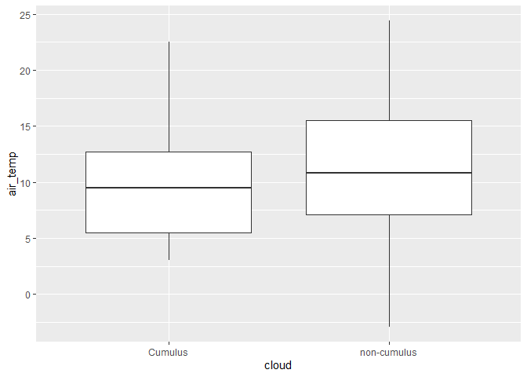

Statistics Course - UWI
================
AlbyDR
2021-04-14

## Example 3.2: Interval od Confidence and Hypothesis Test

### 

``` r
suppressPackageStartupMessages({
  library(tidyverse)     # ggplot, readr and dplyr packages
  library(lubridate)     # date-time
  library(infer)
  library(tidymodels)
  library(summarytools)
  library(moderndive)
  library(extRemes)
  })  # colours
```

    ## Warning: package 'tidyr' was built under R version 4.0.5

    ## Warning: package 'dplyr' was built under R version 4.0.5

    ## Warning: package 'lubridate' was built under R version 4.0.5

    ## Warning: package 'yardstick' was built under R version 4.0.5

    ## Warning: package 'extRemes' was built under R version 4.0.5

``` r
DWD_temperature <- read_rds("DWD_temperature.rds")
DWD_precipitation <- read_rds("DWD_precipitation.rds")
```

## Confidence Intervals

``` r
DWD_temperature %>%
filter(year(timestamp) >= 1900) %>%
  group_by(year = year(timestamp),
           doy = yday(timestamp)) %>%
  summarise(mean = mean(air_temp, na.rm=T)) %>%
  summarise(mean_cl_normal(mean)) %>%
#print(n=10)
  ggplot(aes(x = year, y = y)) +
  geom_ribbon(aes(ymin = ymin, ymax = ymax), fill = "blue", alpha = 0.3) +
  geom_jitter(size = 1, color = "blue") +
  scale_x_continuous(name="year", breaks = c(seq(1900,2020,5)))+
  scale_y_continuous(limits = c(5.5, 12.5), breaks=c(6:13)) +
  labs(x = 'year', y = 'air temperature (average +/- ci)') +
  theme(axis.text.x = element_text(color="grey25", size=8, angle=90))
```

    ## `summarise()` has grouped output by 'year'. You can override using the `.groups` argument.

<!-- -->

Distribution of the proportion of precipitation per hour

``` r
DWD_precipitation %>%
  filter(year(timestamp) == 2020) %>%
  mutate(precip_h = as_factor(precip_h) %>% fct_recode(dry = "0", raining = "1")) %>%
  specify(response = precip_h, success = "raining") %>%
  generate(reps = 1000, type = "bootstrap") %>%
  calculate(stat = "prop")  %>%
  visualize()
```

<!-- -->

generate samples based on the population

``` r
DWD_precipitation %>%
  filter(year(timestamp) == 2020) %>%
  mutate(precip_h = as_factor(precip_h) %>% fct_recode(dry = "0", raining = "1")) %>%
  specify(response = precip_h, success = "raining") %>%
  generate(reps = 1000, type = "bootstrap") %>%
  calculate(stat = "prop") -> stat_prop
```

``` r
stat_prop
```

    ## # A tibble: 1,000 x 2
    ##    replicate  stat
    ##        <int> <dbl>
    ##  1         1 0.165
    ##  2         2 0.168
    ##  3         3 0.168
    ##  4         4 0.166
    ##  5         5 0.165
    ##  6         6 0.167
    ##  7         7 0.166
    ##  8         8 0.169
    ##  9         9 0.162
    ## 10        10 0.167
    ## # ... with 990 more rows

calculate the CI

``` r
get_confidence_interval(stat_prop, level = 0.95) -> stat_prop_ci
stat_prop_ci
```

    ## # A tibble: 1 x 2
    ##   lower_ci upper_ci
    ##      <dbl>    <dbl>
    ## 1    0.162    0.170

``` r
get_confidence_interval(stat_prop, level = 0.99) -> stat_prop_ci
stat_prop_ci
```

    ## # A tibble: 1 x 2
    ##   lower_ci upper_ci
    ##      <dbl>    <dbl>
    ## 1    0.161    0.171

visualize CI

``` r
visualize(stat_prop, bin = 20) +
  shade_ci(endpoints = stat_prop_ci, color = "red", fill = "lightblue", alpha = 0.3) +
  geom_vline(xintercept = 0.166, linetype = "dashed")
```

<!-- -->

If we repeated our sampling procedure a large number of times, we expect
about 95% of the times the confidence intervals will capture the value
of the population parameter proportion.

Distribution of the data precipitation in mm

``` r
DWD_precipitation %>%
  filter(year(timestamp) >= 2020) %>%
  ggplot() +
  geom_histogram(aes(x = precip_mm) , bins = 250, colour = "blue", fill = "lightblue")
```

<!-- -->

Distribution of the mean of precipitation in mm

``` r
DWD_precipitation %>%
  filter(year(timestamp) == 2020) %>%
  specify(response = precip_mm) %>%
  generate(reps = 1000, type = "bootstrap") %>%
  calculate(stat = "mean")  -> stat_mean
```

``` r
# calculate the CI
get_confidence_interval(stat_mean, level = 0.99) -> stat_mean_ci
stat_mean_ci
```

    ## # A tibble: 1 x 2
    ##   lower_ci upper_ci
    ##      <dbl>    <dbl>
    ## 1   0.0524   0.0625

``` r
# visualize CI
visualize(stat_mean, bin = 20) +
  shade_ci(endpoints = stat_mean_ci, color = "red", fill = "lightblue", alpha = 0.3)
```

<!-- -->

If we repeated our sampling procedure a large number of times, we expect
about 99% of the times the confidence intervals will capture the value
of the population parameter mean

## Hypothesis Test

define null hypothesis for a difference in proportion p1 - p2 = 0 p1
raining or dry and p2 Cumulus cloud or non-cumulus

``` r
null_distribution <- DWD_precipitation %>%
  filter(year(timestamp) == 2020  & month(timestamp) == 5) %>%
  mutate(cloud = fct_other(cloud_type, keep = "Cumulus", other_level = "non-cumulus"),
         precip_h = as_factor(precip_h) %>% fct_recode(dry = "0", raining = "1")) %>%
  specify(formula = precip_h ~ cloud, success = "raining") %>%
  hypothesize(null = "independence") %>%
  generate(reps = 100, type = "permute") %>%
  calculate(stat = "diff in props", order = c("Cumulus", "non-cumulus"))
```

``` r
null_distribution
```

    ## # A tibble: 100 x 2
    ##    replicate     stat
    ##        <int>    <dbl>
    ##  1         1 -0.0162 
    ##  2         2 -0.0233 
    ##  3         3  0.0151 
    ##  4         4  0.0151 
    ##  5         5 -0.00337
    ##  6         6  0.00233
    ##  7         7  0.00375
    ##  8         8 -0.00479
    ##  9         9 -0.0119 
    ## 10        10 -0.00764
    ## # ... with 90 more rows

calculate the statistic test with the data for the alternative
hypothesis p1 - p2 &gt; 0

``` r
obs_diff_prop <- DWD_precipitation %>%
  filter(year(timestamp) == 2020  & month(timestamp) == 5) %>%
  mutate(cloud = fct_other(cloud_type, keep = "Cumulus", other_level = "non-cumulus"),
         precip_h = as_factor(precip_h) %>% fct_recode(dry = "0", raining = "1")) %>%
  specify(formula = precip_h ~ cloud, success = "raining") %>%
  calculate(stat = "diff in props", order = c("Cumulus", "non-cumulus"))
```

``` r
obs_diff_prop
```

    ## # A tibble: 1 x 1
    ##    stat
    ##   <dbl>
    ## 1 0.162

visualize

``` r
visualize(null_distribution, bins = 10) +
  shade_p_value(obs_stat = obs_diff_prop, direction = "right")
```

<!-- -->

check the p-value

``` r
null_distribution %>%
  get_p_value(obs_stat = obs_diff_prop, direction = "right")
```

    ## Warning: Please be cautious in reporting a p-value of 0. This result is an
    ## approximation based on the number of `reps` chosen in the `generate()` step. See
    ## `?get_p_value()` for more information.

    ## # A tibble: 1 x 1
    ##   p_value
    ##     <dbl>
    ## 1       0

lets do the same but now Stratus cloud vs others cloud

``` r
null_distribution <- DWD_precipitation %>%
  filter(year(timestamp) == 2020 & month(timestamp) == 5) %>%
  mutate(cloud = fct_other(cloud_type, keep = "Stratus", other_level = "non-stratus"),
         precip_h = as_factor(precip_h) %>% fct_recode(dry = "0", raining = "1")) %>%
  specify(formula = precip_h ~ cloud, success = "raining") %>%
  hypothesize(null = "independence") %>%
  generate(reps = 1000, type = "permute") %>%
  calculate(stat = "diff in props", order = c("Stratus", "non-stratus"))
```

``` r
null_distribution
```

    ## # A tibble: 1,000 x 2
    ##    replicate     stat
    ##        <int>    <dbl>
    ##  1         1 -0.0168 
    ##  2         2 -0.00258
    ##  3         3 -0.0192 
    ##  4         4  0.00217
    ##  5         5 -0.0192 
    ##  6         6  0.00454
    ##  7         7  0.00454
    ##  8         8  0.00692
    ##  9         9 -0.00733
    ## 10        10 -0.0192 
    ## # ... with 990 more rows

``` r
obs_diff_prop <- DWD_precipitation %>%
  filter(year(timestamp) == 2020 & month(timestamp) == 5) %>%
  mutate(cloud = fct_other(cloud_type, keep = "Stratus", other_level = "non-stratus"),
         precip_h = as_factor(precip_h) %>% fct_recode(dry = "0", raining = "1")) %>%
  specify(formula = precip_h ~ cloud, success = "raining") %>%
  calculate(stat = "diff in props", order = c("Stratus", "non-stratus"))
```

``` r
obs_diff_prop
```

    ## # A tibble: 1 x 1
    ##      stat
    ##     <dbl>
    ## 1 -0.0287

``` r
visualize(null_distribution, bins = 20) +
  shade_p_value(obs_stat = obs_diff_prop, direction = "right")
```

<!-- -->

``` r
null_distribution %>%
  get_p_value(obs_stat = obs_diff_prop, direction = "right")
```

    ## # A tibble: 1 x 1
    ##   p_value
    ##     <dbl>
    ## 1   0.975

using diff in means distribution to test mean

``` r
descr(DWD_precipitation$air_temp)
```

    ## Descriptive Statistics  
    ## DWD_precipitation$air_temp  
    ## N: 236566  
    ## 
    ##                      air_temp
    ## ----------------- -----------
    ##              Mean       10.16
    ##           Std.Dev        8.18
    ##               Min      -19.60
    ##                Q1        4.00
    ##            Median        9.90
    ##                Q3       16.10
    ##               Max       37.70
    ##               MAD        8.90
    ##               IQR       12.10
    ##                CV        0.81
    ##          Skewness        0.12
    ##       SE.Skewness        0.01
    ##          Kurtosis       -0.37
    ##           N.Valid   236566.00
    ##         Pct.Valid      100.00

``` r
DWD_precipitation %>%
  filter(year(timestamp) == 2020 & month(timestamp) == 4) %>%
  mutate(cloud = fct_other(cloud_type, keep = "Cumulus", other_level = "non-cumulus")) %>%
  ggplot(aes(x = cloud, y = air_temp)) +
  geom_boxplot() +
  labs(x = "cloud", y = "air_temp")
```

<!-- -->

``` r
null_distribution <- DWD_precipitation %>%
  filter(year(timestamp) == 2020 & month(timestamp) == 4) %>%
  mutate(cloud = fct_other(cloud_type, keep = "Cumulus", other_level = "non-cumulus")) %>%
  specify(formula = air_temp ~ cloud) %>%
  hypothesize(null = "independence") %>%
  generate(reps = 1000, type = "permute") %>%
  calculate(stat = "diff in means", order = c("Cumulus", "non-cumulus"))  # "diff in means"
```

``` r
null_distribution
```

    ## # A tibble: 1,000 x 2
    ##    replicate     stat
    ##        <int>    <dbl>
    ##  1         1 -0.0353 
    ##  2         2 -0.161  
    ##  3         3  0.140  
    ##  4         4 -0.217  
    ##  5         5 -0.0625 
    ##  6         6 -0.00981
    ##  7         7 -0.114  
    ##  8         8 -0.490  
    ##  9         9 -0.0853 
    ## 10        10 -0.122  
    ## # ... with 990 more rows

``` r
obs_diff_mean <- DWD_precipitation %>%
  filter(year(timestamp) == 2020 & month(timestamp) == 4) %>%
  mutate(cloud = fct_other(cloud_type, keep = "Cumulus", other_level = "non-cumulus")) %>%
  specify(formula = air_temp ~ cloud) %>%
  calculate(stat = "diff in means", order = c("Cumulus", "non-cumulus"))
```

``` r
obs_diff_mean
```

    ## # A tibble: 1 x 1
    ##    stat
    ##   <dbl>
    ## 1 -1.63

``` r
visualize(null_distribution, bins = 20) +
  shade_p_value(obs_stat = obs_diff_mean, direction = "left")
```

<!-- -->

``` r
null_distribution %>%
  get_p_value(obs_stat = obs_diff_mean, direction = "left")
```

    ## Warning: Please be cautious in reporting a p-value of 0. This result is an
    ## approximation based on the number of `reps` chosen in the `generate()` step. See
    ## `?get_p_value()` for more information.

    ## # A tibble: 1 x 1
    ##   p_value
    ##     <dbl>
    ## 1       0

``` r
DWD_precipitation %>%
  filter(year(timestamp) <= 2019) %>%
  mutate(cloud = fct_other(cloud_type, keep = "Stratus", other_level = "non-stratus"),
         prec_hour = as_factor(precip_h) %>%
           fct_recode(dry = "0", raining = "1")) %$%
  #print(n = 10)
  ctable(prec_hour, cloud ,   useNA = "no",
         chisq = TRUE, OR = TRUE, headings = FALSE) %>%
  print() #method = "render"
```

    ## 
    ## ----------- ------- --------------- ---------------- -----------------
    ##               cloud         Stratus      non-stratus             Total
    ##   prec_hour                                                           
    ##         dry           32991 (21.1%)   123667 (78.9%)   156658 (100.0%)
    ##     raining            8901 (20.5%)    34594 (79.5%)    43495 (100.0%)
    ##       Total           41892 (20.9%)   158261 (79.1%)   200153 (100.0%)
    ## ----------- ------- --------------- ---------------- -----------------
    ## 
    ## ----------------------------
    ##  Chi.squared   df   p.value 
    ## ------------- ---- ---------
    ##    7.2425      1    0.0071  
    ## ----------------------------
    ## 
    ## ----------------------------------
    ##  Odds Ratio   Lo - 95%   Hi - 95% 
    ## ------------ ---------- ----------
    ##     1.04        1.01       1.06   
    ## ----------------------------------
    ## 
    ## --------------------------------
    ##  Risk Ratio   Lo - 0%   Hi - 0% 
    ## ------------ --------- ---------
    ##     1.03       1.03      1.03   
    ## --------------------------------

despite the p-value is very small, the odds ratio is almost one (no
difference), this is an effect of the sample size that reduce the SE and
make narrow CI that not contain 1 but are very both lower and upper
intervals very close to it.

``` r
DWD_precipitation %>%
  filter(year(timestamp)==2019) %>%
  mutate(cloud = fct_other(cloud_type, keep = "Cumulus", other_level = "non-cumulus"),
         prec_hour = as_factor(precip_h) %>%
           fct_recode(dry = "0", raining = "1")) %$%
  #print(n = 10)
  ctable(prec_hour,cloud ,   useNA = "no",
         chisq = TRUE, OR = TRUE, headings = FALSE) %>%
  print() #method = "render"
```

    ## 
    ## ----------- ------- -------------- -------------- ---------------
    ##               cloud        Cumulus    non-cumulus           Total
    ##   prec_hour                                                      
    ##         dry           1004 (14.2%)   6090 (85.8%)   7094 (100.0%)
    ##     raining           1149 (69.9%)    495 (30.1%)   1644 (100.0%)
    ##       Total           2153 (24.6%)   6585 (75.4%)   8738 (100.0%)
    ## ----------- ------- -------------- -------------- ---------------
    ## 
    ## ----------------------------
    ##  Chi.squared   df   p.value 
    ## ------------- ---- ---------
    ##   2230.075     1       0    
    ## ----------------------------
    ## 
    ## ----------------------------------
    ##  Odds Ratio   Lo - 95%   Hi - 95% 
    ## ------------ ---------- ----------
    ##    0.071       0.063      0.080   
    ## ----------------------------------
    ## 
    ## --------------------------------
    ##  Risk Ratio   Lo - 0%   Hi - 0% 
    ## ------------ --------- ---------
    ##     0.20       0.20      0.20   
    ## --------------------------------

**don’t trust!** There are name reasons to not trust this test, one of
then is the number of sample, with 217687 observations the ci is to
narrow as we see plotting uncertainty. Lets the other reasons to the
inference course

``` r
unique(DWD_precipitation$cloud_type)
```

    ##  [1] Cirrus        Cirrocumulus  Nimbostratus  Altocumulus   Cirrostratus 
    ##  [6] Altostratus   Stratocumulus Cumulus       Stratus       by_instrument
    ## [11] <NA>         
    ## 11 Levels: by_instrument Cirrus Cirrocumulus Cirrostratus ... Cumulonimbus

``` r
fct_count(DWD_precipitation$cloud_type)[10,]
```

    ## # A tibble: 1 x 2
    ##   f           n
    ##   <fct>   <int>
    ## 1 Cumulus 70507

``` r
DWD_precipitation %>%
  filter(year(timestamp)==2020 & month(timestamp)==4) %>%
  mutate(cloud = fct_other(cloud_type, keep = "Cumulus", other_level = "non-cumulus"),
         prec_hour = as_factor(precip_h) %>%
           fct_recode(dry = "0", raining = "1")) %$%
  #print(n = 10)
  ctable(prec_hour,cloud ,   useNA = "no",
         chisq = TRUE, OR = TRUE, headings = FALSE) %>%
  print() #method = "render"
```

    ## 
    ## ----------- ------- ------------- -------------- ---------------
    ##               cloud       Cumulus    non-cumulus           Total
    ##   prec_hour                                                     
    ##         dry           388 (14.2%)   2336 (85.8%)   2724 (100.0%)
    ##     raining           104 (66.7%)     52 (33.3%)    156 (100.0%)
    ##       Total           492 (17.1%)   2388 (82.9%)   2880 (100.0%)
    ## ----------- ------- ------------- -------------- ---------------
    ## 
    ## ----------------------------
    ##  Chi.squared   df   p.value 
    ## ------------- ---- ---------
    ##   282.5752     1       0    
    ## ----------------------------
    ## 
    ## ----------------------------------
    ##  Odds Ratio   Lo - 95%   Hi - 95% 
    ## ------------ ---------- ----------
    ##    0.083       0.059      0.118   
    ## ----------------------------------
    ## 
    ## --------------------------------
    ##  Risk Ratio   Lo - 0%   Hi - 0% 
    ## ------------ --------- ---------
    ##     0.21       0.21      0.21   
    ## --------------------------------

``` r
DWD_precipitation %>%
  filter(year(timestamp)==2020 & month(timestamp)==12) %>%
  mutate(cloud = fct_other(cloud_type, keep = "Cumulus", other_level = "non-cumulus"),
         prec_hour = as_factor(precip_h) %>%
           fct_recode(dry = "0", raining = "1")) %$%
  #print(n = 10)
  ctable(prec_hour,cloud ,   useNA = "no",
         chisq = TRUE, OR = TRUE, headings = FALSE) %>%
  print() #method = "render"
```

    ## 
    ## ----------- ------- -------------- ------------- ---------------
    ##               cloud        Cumulus   non-cumulus           Total
    ##   prec_hour                                                     
    ##         dry           1808 (74.6%)   617 (25.4%)   2425 (100.0%)
    ##     raining            352 (77.2%)   104 (22.8%)    456 (100.0%)
    ##       Total           2160 (75.0%)   721 (25.0%)   2881 (100.0%)
    ## ----------- ------- -------------- ------------- ---------------
    ## 
    ## ----------------------------
    ##  Chi.squared   df   p.value 
    ## ------------- ---- ---------
    ##    1.2847      1     0.257  
    ## ----------------------------
    ## 
    ## ----------------------------------
    ##  Odds Ratio   Lo - 95%   Hi - 95% 
    ## ------------ ---------- ----------
    ##     0.87        0.68       1.10   
    ## ----------------------------------
    ## 
    ## --------------------------------
    ##  Risk Ratio   Lo - 0%   Hi - 0% 
    ## ------------ --------- ---------
    ##     0.97       0.97      0.97   
    ## --------------------------------

``` r
DWD_precipitation %>%
  filter(year(timestamp)<=2019 & month(timestamp)==4) %>%
  mutate(cloud = fct_other(cloud_type, keep = "Cumulus", other_level = "non-cumulus"),
         prec_hour = as_factor(precip_h) %>%
           fct_recode(dry = "0", raining = "1")) %$%
  #print(n = 10)
  ctable(prec_hour,cloud ,   useNA = "no",
         chisq = TRUE, OR = TRUE, headings = FALSE) %>%
  print() #method = "render"
```

    ## 
    ## ----------- ------- -------------- --------------- ----------------
    ##               cloud        Cumulus     non-cumulus            Total
    ##   prec_hour                                                        
    ##         dry           1501 (11.1%)   12049 (88.9%)   13550 (100.0%)
    ##     raining           1640 (57.7%)    1204 (42.3%)    2844 (100.0%)
    ##       Total           3141 (19.2%)   13253 (80.8%)   16394 (100.0%)
    ## ----------- ------- -------------- --------------- ----------------
    ## 
    ## ----------------------------
    ##  Chi.squared   df   p.value 
    ## ------------- ---- ---------
    ##   3290.932     1       0    
    ## ----------------------------
    ## 
    ## ----------------------------------
    ##  Odds Ratio   Lo - 95%   Hi - 95% 
    ## ------------ ---------- ----------
    ##    0.091       0.083      0.100   
    ## ----------------------------------
    ## 
    ## --------------------------------
    ##  Risk Ratio   Lo - 0%   Hi - 0% 
    ## ------------ --------- ---------
    ##     0.19       0.19      0.19   
    ## --------------------------------

``` r
DWD_precipitation %>%
  filter(year(timestamp) == 2019) %>%
  mutate(cloud = fct_other(cloud_type, keep = "Stratus", other_level = "non-stratus"),
         prec_hour = as_factor(precip_h) %>%
           fct_recode(dry = "0", raining = "1")) %$%
  #print(n = 10)
  ctable(prec_hour, cloud ,   useNA = "no",
         chisq = TRUE, OR = TRUE, headings = FALSE) %>%
  print() #method = "render"
```

    ## 
    ## ----------- ------- -------------- -------------- ---------------
    ##               cloud        Stratus    non-stratus           Total
    ##   prec_hour                                                      
    ##         dry           1632 (23.0%)   5462 (77.0%)   7094 (100.0%)
    ##     raining            353 (21.5%)   1291 (78.5%)   1644 (100.0%)
    ##       Total           1985 (22.7%)   6753 (77.3%)   8738 (100.0%)
    ## ----------- ------- -------------- -------------- ---------------
    ## 
    ## ----------------------------
    ##  Chi.squared   df   p.value 
    ## ------------- ---- ---------
    ##    1.7011      1    0.1921  
    ## ----------------------------
    ## 
    ## ----------------------------------
    ##  Odds Ratio   Lo - 95%   Hi - 95% 
    ## ------------ ---------- ----------
    ##     1.09        0.96       1.24   
    ## ----------------------------------
    ## 
    ## --------------------------------
    ##  Risk Ratio   Lo - 0%   Hi - 0% 
    ## ------------ --------- ---------
    ##     1.07       1.07      1.07   
    ## --------------------------------

Note that 1 is not included in the confidence interval which must mean
that the p-value is smaller than 0.05. We can confirm this using:

``` r
  DWD_precipitation %>%
  filter(year(timestamp) == 2019 & month(timestamp) == 9) %>%
  mutate(day_night = fct_collapse(sunlight_times,
                                  "Day" = unique(sunlight_times)[-1]),
         prec_hour = as_factor(precip_h) %>%
           fct_recode(dry = "0", raining = "1")) %$%
  #print(n=10)
  ctable(day_night, prec_hour,   useNA = "no",
         chisq = TRUE, headings = FALSE) %>%
  print() #method = "render"
```

    ## 
    ## ----------- ----------- ------------- ------------- --------------
    ##               prec_hour           dry       raining          Total
    ##   day_night                                                       
    ##         Day               390 (78.0%)   110 (22.0%)   500 (100.0%)
    ##       Night               180 (81.8%)    40 (18.2%)   220 (100.0%)
    ##       Total               570 (79.2%)   150 (20.8%)   720 (100.0%)
    ## ----------- ----------- ------------- ------------- --------------
    ## 
    ## ----------------------------
    ##  Chi.squared   df   p.value 
    ## ------------- ---- ---------
    ##    1.1288      1     0.288  
    ## ----------------------------

``` r
DWD_precipitation %>%
  filter(year(timestamp) <= 2010 & month(timestamp) == 9) %>%
  mutate(day_night = fct_collapse(sunlight_times,
                                  "Day" = unique(sunlight_times)[-1]),
         prec_hour = as_factor(precip_h) %>%
           fct_recode(dry = "0", raining = "1")) %$%
  #print(n=10)
  ctable(day_night, prec_hour,   useNA = "no",
         chisq = TRUE, headings = FALSE) %>%
  print() #method = "render"
```

    ## 
    ## ----------- ----------- -------------- -------------- ----------------
    ##               prec_hour            dry        raining            Total
    ##   day_night                                                           
    ##         Day               5778 (83.2%)   1164 (16.8%)    6942 (100.0%)
    ##       Night               2651 (85.8%)    439 (14.2%)    3090 (100.0%)
    ##       Total               8429 (84.0%)   1603 (16.0%)   10032 (100.0%)
    ## ----------- ----------- -------------- -------------- ----------------
    ## 
    ## ----------------------------
    ##  Chi.squared   df   p.value 
    ## ------------- ---- ---------
    ##    10.2509     1    0.0014  
    ## ----------------------------

``` r
DWD_temperature %>%
  filter(year(timestamp) >= 1900) %>%
  group_by(year = year(timestamp)) %>%
  summarise(mean = mean(air_temp, na.rm=T)) %>% 
  #print(n=10)
  ggplot(aes(x = year, y = mean)) +
  geom_jitter(size = 2, color = "blue") +
  geom_smooth(n = 200,  span = 0.1, level = 0.99) +
  scale_x_continuous(name="year", breaks = c(seq(1900,2020,5)))+
  scale_y_continuous(limits = c(6.3, 11.6), breaks=c(6:13)) +
  labs(x = 'year', y = 'air temperature (average +/- ci)') +
  theme(axis.text.x = element_text(color="grey25", size=8, angle=90))  
```

    ## `geom_smooth()` using method = 'loess' and formula 'y ~ x'

<!-- -->
