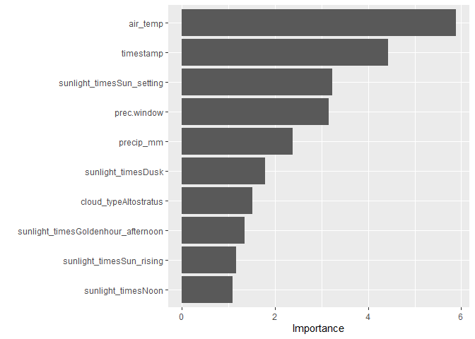

Statistics Course - UWI
================
AlbyDR
2021-04-14

## Example 3.3:Inference and Modelling -

``` r
suppressPackageStartupMessages({
  library(tidyverse)     # ggplot, readr and dplyr packages
  library(lubridate)     # date-time
  library(GGally)        # label percentage 
  library(tidyquant) 
  library(vip) 
  library(moderndive)
  library(kableExtra)
  library(tidymodels) 
  library(bayesplot)
  library(rstanarm)
  library(bayestestR)
  library(insight)
  library(modelbased)
  library(performance)
  library(see)
  })  
```

    ## Warning: package 'tidyr' was built under R version 4.0.5

    ## Warning: package 'dplyr' was built under R version 4.0.5

    ## Warning: package 'lubridate' was built under R version 4.0.5

    ## Warning: package 'yardstick' was built under R version 4.0.5

    ## Warning: package 'insight' was built under R version 4.0.5

``` r
DWD_temperature <- read_rds("DWD_temperature.rds")
DWD_precipitation <- read_rds("DWD_precipitation.rds")
```

``` r
linear_reg() %>% set_engine("lm") %>% set_mode("regression") %>%
  fit(rel_humidity ~ air_temp + precip_h, data = filter(DWD_precipitation, year(timestamp) >= 2020)) %>%
  pluck("fit") %>% summary()
```

    ## 
    ## Call:
    ## stats::lm(formula = rel_humidity ~ air_temp + precip_h, data = data)
    ## 
    ## Residuals:
    ##     Min      1Q  Median      3Q     Max 
    ## -55.227  -9.566   1.779  10.967  38.838 
    ## 
    ## Coefficients:
    ##             Estimate Std. Error t value Pr(>|t|)    
    ## (Intercept) 87.49916    0.16043  545.40   <2e-16 ***
    ## air_temp    -1.53319    0.01145 -133.92   <2e-16 ***
    ## precip_h    15.13933    0.22853   66.25   <2e-16 ***
    ## ---
    ## Signif. codes:  0 '***' 0.001 '**' 0.01 '*' 0.05 '.' 0.1 ' ' 1
    ## 
    ## Residual standard error: 15.84 on 34937 degrees of freedom
    ##   (26 observations deleted due to missingness)
    ## Multiple R-squared:  0.4067, Adjusted R-squared:  0.4067 
    ## F-statistic: 1.198e+04 on 2 and 34937 DF,  p-value: < 2.2e-16

``` r
linear_reg() %>% set_engine("lm") %>% set_mode("regression") %>%
  fit(rel_humidity ~ air_temp + precip_h, data = filter(DWD_precipitation, year(timestamp) >= 2020)) %>%
  pluck("fit") %>% get_regression_table()
```

    ## # A tibble: 3 x 7
    ##   term      estimate std_error statistic p_value lower_ci upper_ci
    ##   <chr>        <dbl>     <dbl>     <dbl>   <dbl>    <dbl>    <dbl>
    ## 1 intercept    87.5      0.16      545.        0    87.2     87.8 
    ## 2 air_temp     -1.53     0.011    -134.        0    -1.56    -1.51
    ## 3 precip_h     15.1      0.229      66.2       0    14.7     15.6

``` r
linear_reg() %>% set_engine("lm") %>% set_mode("regression") %>%
  fit(rel_humidity ~ ., data = filter(DWD_precipitation, year(timestamp) >= 2020)) %>%
  pluck("fit") %>% summary()
```

    ## 
    ## Call:
    ## stats::lm(formula = rel_humidity ~ ., data = data)
    ## 
    ## Residuals:
    ##     Min      1Q  Median      3Q     Max 
    ## -45.038  -7.674   0.275   8.376  38.248 
    ## 
    ## Coefficients: (2 not defined because of singularities)
    ##                                      Estimate Std. Error  t value Pr(>|t|)    
    ## (Intercept)                        -7.679e+02  1.178e+01  -65.201  < 2e-16 ***
    ## timestamp                           5.460e-07  7.305e-09   74.752  < 2e-16 ***
    ## precip_mm                           4.475e+00  1.810e-01   24.730  < 2e-16 ***
    ## precip_h                            8.413e+00  2.003e-01   41.998  < 2e-16 ***
    ## cloud_cover                        -5.192e-01  1.586e-01   -3.274 0.001061 ** 
    ## sunlight_timesDusk                 -9.487e+00  3.060e-01  -31.001  < 2e-16 ***
    ## sunlight_timesGoldenhour_afternoon -1.388e+01  4.041e-01  -34.344  < 2e-16 ***
    ## sunlight_timesGoldenhour_morning    1.468e+00  4.051e-01    3.624 0.000291 ***
    ## sunlight_timesNight                -4.099e+00  2.467e-01  -16.615  < 2e-16 ***
    ## sunlight_timesNoon                 -1.585e+01  3.883e-01  -40.835  < 2e-16 ***
    ## sunlight_timesSun_rising           -6.696e+00  2.698e-01  -24.818  < 2e-16 ***
    ## sunlight_timesSun_setting          -1.951e+01  2.720e-01  -71.726  < 2e-16 ***
    ## prec.window                        -5.505e-02  7.617e-04  -72.278  < 2e-16 ***
    ## cloud_typeCirrus                   -9.557e+00  1.280e+00   -7.467 8.41e-14 ***
    ## cloud_typeCirrocumulus             -1.059e+01  1.145e+00   -9.249  < 2e-16 ***
    ## cloud_typeCirrostratus             -8.000e+00  1.001e+00   -7.996 1.32e-15 ***
    ## cloud_typeAltocumulus              -7.616e+00  8.620e-01   -8.835  < 2e-16 ***
    ## cloud_typeAltostratus              -7.929e+00  7.224e-01  -10.976  < 2e-16 ***
    ## cloud_typeNimbostratus             -5.402e+00  5.754e-01   -9.388  < 2e-16 ***
    ## cloud_typeStratocumulus            -4.752e+00  4.100e-01  -11.589  < 2e-16 ***
    ## cloud_typeStratus                  -1.134e+00  2.438e-01   -4.649 3.34e-06 ***
    ## cloud_typeCumulus                          NA         NA       NA       NA    
    ## day_night                                  NA         NA       NA       NA    
    ## air_temp                           -1.081e+00  1.025e-02 -105.472  < 2e-16 ***
    ## ---
    ## Signif. codes:  0 '***' 0.001 '**' 0.01 '*' 0.05 '.' 0.1 ' ' 1
    ## 
    ## Residual standard error: 12.02 on 34886 degrees of freedom
    ##   (58 observations deleted due to missingness)
    ## Multiple R-squared:  0.659,  Adjusted R-squared:  0.6588 
    ## F-statistic:  3211 on 21 and 34886 DF,  p-value: < 2.2e-16

``` r
linear_reg() %>% set_engine("lm") %>% set_mode("regression") %>%
  fit(rel_humidity ~ ., data = filter(DWD_precipitation, year(timestamp) >= 2020)) %>%
  pluck("fit") %>% get_regression_table()
```

    ## # A tibble: 24 x 7
    ##    term                   estimate std_error statistic p_value lower_ci upper_ci
    ##    <chr>                     <dbl>     <dbl>     <dbl>   <dbl>    <dbl>    <dbl>
    ##  1 intercept              -768.       11.8      -65.2    0     -791.    -745.   
    ##  2 timestamp                 0         0         74.8    0        0        0    
    ##  3 precip_mm                 4.47      0.181     24.7    0        4.12     4.83 
    ##  4 precip_h                  8.41      0.2       42.0    0        8.02     8.81 
    ##  5 cloud_cover              -0.519     0.159     -3.27   0.001   -0.83    -0.208
    ##  6 sunlight_timesDusk       -9.49      0.306    -31.0    0      -10.1     -8.89 
    ##  7 sunlight_timesGoldenh~  -13.9       0.404    -34.3    0      -14.7    -13.1  
    ##  8 sunlight_timesGoldenh~    1.47      0.405      3.62   0        0.674    2.26 
    ##  9 sunlight_timesNight      -4.10      0.247    -16.6    0       -4.58    -3.62 
    ## 10 sunlight_timesNoon      -15.9       0.388    -40.8    0      -16.6    -15.1  
    ## # ... with 14 more rows

``` r
set.seed(123)
linear_reg() %>% set_engine("lm") %>% set_mode("regression") %>%
  fit(rel_humidity ~ ., data = sample_n(filter(DWD_precipitation, year(timestamp) >= 2020), 100)) %>%
  pluck("fit") %>% summary()
```

    ## 
    ## Call:
    ## stats::lm(formula = rel_humidity ~ ., data = data)
    ## 
    ## Residuals:
    ##      Min       1Q   Median       3Q      Max 
    ## -26.4965  -6.2756   0.2166   7.2818  26.9246 
    ## 
    ## Coefficients: (2 not defined because of singularities)
    ##                                      Estimate Std. Error t value Pr(>|t|)    
    ## (Intercept)                        -1.022e+03  2.519e+02  -4.056 0.000116 ***
    ## timestamp                           7.013e-07  1.583e-07   4.430 3.00e-05 ***
    ## precip_mm                           1.472e+01  6.181e+00   2.381 0.019667 *  
    ## precip_h                           -1.706e+00  4.870e+00  -0.350 0.727128    
    ## cloud_cover                         3.717e-01  5.378e-01   0.691 0.491472    
    ## sunlight_timesDusk                 -1.120e+01  6.295e+00  -1.780 0.078913 .  
    ## sunlight_timesGoldenhour_afternoon -1.076e+01  7.983e+00  -1.348 0.181619    
    ## sunlight_timesGoldenhour_morning    2.519e+00  8.521e+00   0.296 0.768284    
    ## sunlight_timesNight                 3.667e-01  4.856e+00   0.076 0.939997    
    ## sunlight_timesNoon                 -8.792e+00  8.056e+00  -1.091 0.278414    
    ## sunlight_timesSun_rising           -6.136e+00  5.281e+00  -1.162 0.248762    
    ## sunlight_timesSun_setting          -1.804e+01  5.580e+00  -3.233 0.001786 ** 
    ## prec.window                        -4.902e-02  1.557e-02  -3.148 0.002318 ** 
    ## cloud_typeCirrocumulus             -2.454e+00  5.411e+00  -0.454 0.651399    
    ## cloud_typeCirrostratus             -2.517e+00  5.936e+00  -0.424 0.672671    
    ## cloud_typeAltocumulus               1.127e+00  6.109e+00   0.185 0.854080    
    ## cloud_typeAltostratus              -9.291e+00  6.155e+00  -1.509 0.135172    
    ## cloud_typeNimbostratus              3.440e+00  9.570e+00   0.359 0.720248    
    ## cloud_typeStratocumulus            -1.150e+00  5.173e+00  -0.222 0.824705    
    ## cloud_typeStratus                   3.224e+00  4.206e+00   0.767 0.445631    
    ## cloud_typeCumulus                          NA         NA      NA       NA    
    ## day_night                                  NA         NA      NA       NA    
    ## air_temp                           -1.289e+00  2.190e-01  -5.884 9.19e-08 ***
    ## ---
    ## Signif. codes:  0 '***' 0.001 '**' 0.01 '*' 0.05 '.' 0.1 ' ' 1
    ## 
    ## Residual standard error: 12.44 on 79 degrees of freedom
    ## Multiple R-squared:  0.7135, Adjusted R-squared:  0.6409 
    ## F-statistic: 9.835 on 20 and 79 DF,  p-value: 3.536e-14

``` r
set.seed(123)
linear_reg() %>% set_engine("lm") %>% set_mode("regression") %>%
  fit(rel_humidity ~ ., data = sample_n(filter(DWD_precipitation, year(timestamp) >= 2020), 100)) %>%
  pluck("fit") %>% get_regression_table() %>% kable()
```

<table>
<thead>
<tr>
<th style="text-align:left;">
term
</th>
<th style="text-align:right;">
estimate
</th>
<th style="text-align:right;">
std\_error
</th>
<th style="text-align:right;">
statistic
</th>
<th style="text-align:right;">
p\_value
</th>
<th style="text-align:right;">
lower\_ci
</th>
<th style="text-align:right;">
upper\_ci
</th>
</tr>
</thead>
<tbody>
<tr>
<td style="text-align:left;">
intercept
</td>
<td style="text-align:right;">
-1021.853
</td>
<td style="text-align:right;">
251.918
</td>
<td style="text-align:right;">
-4.056
</td>
<td style="text-align:right;">
0.000
</td>
<td style="text-align:right;">
-1523.282
</td>
<td style="text-align:right;">
-520.423
</td>
</tr>
<tr>
<td style="text-align:left;">
timestamp
</td>
<td style="text-align:right;">
0.000
</td>
<td style="text-align:right;">
0.000
</td>
<td style="text-align:right;">
4.430
</td>
<td style="text-align:right;">
0.000
</td>
<td style="text-align:right;">
0.000
</td>
<td style="text-align:right;">
0.000
</td>
</tr>
<tr>
<td style="text-align:left;">
precip\_mm
</td>
<td style="text-align:right;">
14.717
</td>
<td style="text-align:right;">
6.181
</td>
<td style="text-align:right;">
2.381
</td>
<td style="text-align:right;">
0.020
</td>
<td style="text-align:right;">
2.415
</td>
<td style="text-align:right;">
27.020
</td>
</tr>
<tr>
<td style="text-align:left;">
precip\_h
</td>
<td style="text-align:right;">
-1.706
</td>
<td style="text-align:right;">
4.870
</td>
<td style="text-align:right;">
-0.350
</td>
<td style="text-align:right;">
0.727
</td>
<td style="text-align:right;">
-11.400
</td>
<td style="text-align:right;">
7.989
</td>
</tr>
<tr>
<td style="text-align:left;">
cloud\_cover
</td>
<td style="text-align:right;">
0.372
</td>
<td style="text-align:right;">
0.538
</td>
<td style="text-align:right;">
0.691
</td>
<td style="text-align:right;">
0.491
</td>
<td style="text-align:right;">
-0.699
</td>
<td style="text-align:right;">
1.442
</td>
</tr>
<tr>
<td style="text-align:left;">
sunlight\_timesDusk
</td>
<td style="text-align:right;">
-11.205
</td>
<td style="text-align:right;">
6.295
</td>
<td style="text-align:right;">
-1.780
</td>
<td style="text-align:right;">
0.079
</td>
<td style="text-align:right;">
-23.734
</td>
<td style="text-align:right;">
1.324
</td>
</tr>
<tr>
<td style="text-align:left;">
sunlight\_timesGoldenhour\_afternoon
</td>
<td style="text-align:right;">
-10.759
</td>
<td style="text-align:right;">
7.983
</td>
<td style="text-align:right;">
-1.348
</td>
<td style="text-align:right;">
0.182
</td>
<td style="text-align:right;">
-26.649
</td>
<td style="text-align:right;">
5.132
</td>
</tr>
<tr>
<td style="text-align:left;">
sunlight\_timesGoldenhour\_morning
</td>
<td style="text-align:right;">
2.519
</td>
<td style="text-align:right;">
8.521
</td>
<td style="text-align:right;">
0.296
</td>
<td style="text-align:right;">
0.768
</td>
<td style="text-align:right;">
-14.442
</td>
<td style="text-align:right;">
19.481
</td>
</tr>
<tr>
<td style="text-align:left;">
sunlight\_timesNight
</td>
<td style="text-align:right;">
0.367
</td>
<td style="text-align:right;">
4.856
</td>
<td style="text-align:right;">
0.076
</td>
<td style="text-align:right;">
0.940
</td>
<td style="text-align:right;">
-9.298
</td>
<td style="text-align:right;">
10.032
</td>
</tr>
<tr>
<td style="text-align:left;">
sunlight\_timesNoon
</td>
<td style="text-align:right;">
-8.792
</td>
<td style="text-align:right;">
8.056
</td>
<td style="text-align:right;">
-1.091
</td>
<td style="text-align:right;">
0.278
</td>
<td style="text-align:right;">
-24.826
</td>
<td style="text-align:right;">
7.242
</td>
</tr>
<tr>
<td style="text-align:left;">
sunlight\_timesSun\_rising
</td>
<td style="text-align:right;">
-6.136
</td>
<td style="text-align:right;">
5.281
</td>
<td style="text-align:right;">
-1.162
</td>
<td style="text-align:right;">
0.249
</td>
<td style="text-align:right;">
-16.647
</td>
<td style="text-align:right;">
4.375
</td>
</tr>
<tr>
<td style="text-align:left;">
sunlight\_timesSun\_setting
</td>
<td style="text-align:right;">
-18.043
</td>
<td style="text-align:right;">
5.580
</td>
<td style="text-align:right;">
-3.233
</td>
<td style="text-align:right;">
0.002
</td>
<td style="text-align:right;">
-29.150
</td>
<td style="text-align:right;">
-6.936
</td>
</tr>
<tr>
<td style="text-align:left;">
prec.window
</td>
<td style="text-align:right;">
-0.049
</td>
<td style="text-align:right;">
0.016
</td>
<td style="text-align:right;">
-3.148
</td>
<td style="text-align:right;">
0.002
</td>
<td style="text-align:right;">
-0.080
</td>
<td style="text-align:right;">
-0.018
</td>
</tr>
<tr>
<td style="text-align:left;">
cloud\_typeCirrocumulus
</td>
<td style="text-align:right;">
-2.454
</td>
<td style="text-align:right;">
5.411
</td>
<td style="text-align:right;">
-0.454
</td>
<td style="text-align:right;">
0.651
</td>
<td style="text-align:right;">
-13.224
</td>
<td style="text-align:right;">
8.316
</td>
</tr>
<tr>
<td style="text-align:left;">
cloud\_typeCirrostratus
</td>
<td style="text-align:right;">
-2.517
</td>
<td style="text-align:right;">
5.936
</td>
<td style="text-align:right;">
-0.424
</td>
<td style="text-align:right;">
0.673
</td>
<td style="text-align:right;">
-14.333
</td>
<td style="text-align:right;">
9.298
</td>
</tr>
<tr>
<td style="text-align:left;">
cloud\_typeAltocumulus
</td>
<td style="text-align:right;">
1.127
</td>
<td style="text-align:right;">
6.109
</td>
<td style="text-align:right;">
0.185
</td>
<td style="text-align:right;">
0.854
</td>
<td style="text-align:right;">
-11.033
</td>
<td style="text-align:right;">
13.288
</td>
</tr>
<tr>
<td style="text-align:left;">
cloud\_typeAltostratus
</td>
<td style="text-align:right;">
-9.291
</td>
<td style="text-align:right;">
6.155
</td>
<td style="text-align:right;">
-1.509
</td>
<td style="text-align:right;">
0.135
</td>
<td style="text-align:right;">
-21.543
</td>
<td style="text-align:right;">
2.961
</td>
</tr>
<tr>
<td style="text-align:left;">
cloud\_typeNimbostratus
</td>
<td style="text-align:right;">
3.440
</td>
<td style="text-align:right;">
9.570
</td>
<td style="text-align:right;">
0.359
</td>
<td style="text-align:right;">
0.720
</td>
<td style="text-align:right;">
-15.609
</td>
<td style="text-align:right;">
22.489
</td>
</tr>
<tr>
<td style="text-align:left;">
cloud\_typeStratocumulus
</td>
<td style="text-align:right;">
-1.150
</td>
<td style="text-align:right;">
5.173
</td>
<td style="text-align:right;">
-0.222
</td>
<td style="text-align:right;">
0.825
</td>
<td style="text-align:right;">
-11.446
</td>
<td style="text-align:right;">
9.147
</td>
</tr>
<tr>
<td style="text-align:left;">
cloud\_typeStratus
</td>
<td style="text-align:right;">
3.224
</td>
<td style="text-align:right;">
4.206
</td>
<td style="text-align:right;">
0.767
</td>
<td style="text-align:right;">
0.446
</td>
<td style="text-align:right;">
-5.148
</td>
<td style="text-align:right;">
11.596
</td>
</tr>
<tr>
<td style="text-align:left;">
cloud\_typeCumulus
</td>
<td style="text-align:right;">
NA
</td>
<td style="text-align:right;">
NA
</td>
<td style="text-align:right;">
NA
</td>
<td style="text-align:right;">
NA
</td>
<td style="text-align:right;">
NA
</td>
<td style="text-align:right;">
NA
</td>
</tr>
<tr>
<td style="text-align:left;">
day\_night
</td>
<td style="text-align:right;">
NA
</td>
<td style="text-align:right;">
NA
</td>
<td style="text-align:right;">
NA
</td>
<td style="text-align:right;">
NA
</td>
<td style="text-align:right;">
NA
</td>
<td style="text-align:right;">
NA
</td>
</tr>
<tr>
<td style="text-align:left;">
air\_temp
</td>
<td style="text-align:right;">
-1.289
</td>
<td style="text-align:right;">
0.219
</td>
<td style="text-align:right;">
-5.884
</td>
<td style="text-align:right;">
0.000
</td>
<td style="text-align:right;">
-1.725
</td>
<td style="text-align:right;">
-0.853
</td>
</tr>
</tbody>
</table>

``` r
set.seed(123)
linear_reg() %>% set_engine("lm") %>% set_mode("regression") %>%
  fit(rel_humidity ~ ., data = sample_n(filter(DWD_precipitation, year(timestamp) >= 2020), 100)) %>%
  pluck("fit") %>% tidy()
```

    ## # A tibble: 23 x 5
    ##    term                               estimate     std.error statistic   p.value
    ##    <chr>                                 <dbl>         <dbl>     <dbl>     <dbl>
    ##  1 (Intercept)                        -1.02e+3 252.            -4.06   0.000116 
    ##  2 timestamp                           7.01e-7   0.000000158    4.43   0.0000300
    ##  3 precip_mm                           1.47e+1   6.18           2.38   0.0197   
    ##  4 precip_h                           -1.71e+0   4.87          -0.350  0.727    
    ##  5 cloud_cover                         3.72e-1   0.538          0.691  0.491    
    ##  6 sunlight_timesDusk                 -1.12e+1   6.29          -1.78   0.0789   
    ##  7 sunlight_timesGoldenhour_afternoon -1.08e+1   7.98          -1.35   0.182    
    ##  8 sunlight_timesGoldenhour_morning    2.52e+0   8.52           0.296  0.768    
    ##  9 sunlight_timesNight                 3.67e-1   4.86           0.0755 0.940    
    ## 10 sunlight_timesNoon                 -8.79e+0   8.06          -1.09   0.278    
    ## # ... with 13 more rows

``` r
set.seed(123)
linear_reg() %>% set_engine("lm") %>% set_mode("regression") %>%
  fit(rel_humidity ~ ., data = sample_n(filter(DWD_precipitation, year(timestamp) >= 2020), 100)) %>%
  pluck("fit") %>% glance()
```

    ## # A tibble: 1 x 12
    ##   r.squared adj.r.squared sigma statistic  p.value    df logLik   AIC   BIC
    ##       <dbl>         <dbl> <dbl>     <dbl>    <dbl> <dbl>  <dbl> <dbl> <dbl>
    ## 1     0.713         0.641  12.4      9.83 3.54e-14    20  -382.  808.  866.
    ## # ... with 3 more variables: deviance <dbl>, df.residual <int>, nobs <int>

``` r
set.seed(123)
linear_reg() %>% set_engine("lm") %>% set_mode("regression") %>%
  fit(rel_humidity ~ ., data = sample_n(filter(DWD_precipitation, year(timestamp) >= 2020), 100)) %>%
  pluck("fit") %>% vip()
```

<!-- -->

``` r
set.seed(123)
linear_reg() %>% set_engine("lm") %>% set_mode("regression") %>%
  fit(rel_humidity ~ ., data = sample_n(filter(DWD_precipitation, year(timestamp) >= 2020), 30)) %>%
  pluck("fit") %>% get_regression_summaries()
```

    ## # A tibble: 1 x 9
    ##   r_squared adj_r_squared   mse  rmse sigma statistic p_value    df  nobs
    ##       <dbl>         <dbl> <dbl> <dbl> <dbl>     <dbl>   <dbl> <dbl> <dbl>
    ## 1     0.781         0.423  83.8  9.15  15.1      2.18   0.094    18    30

``` r
set.seed(123)
linear_reg() %>% set_engine("lm") %>% set_mode("regression") %>%
  fit(rel_humidity ~ ., data = sample_n(filter(DWD_precipitation, year(timestamp) >= 2020), 100)) %>%
  pluck("fit") %>% get_regression_summaries()
```

    ## # A tibble: 1 x 9
    ##   r_squared adj_r_squared   mse  rmse sigma statistic p_value    df  nobs
    ##       <dbl>         <dbl> <dbl> <dbl> <dbl>     <dbl>   <dbl> <dbl> <dbl>
    ## 1     0.713         0.641  122.  11.1  12.4      9.84       0    20   100

``` r
set.seed(123)
linear_reg() %>% set_engine("lm") %>% set_mode("regression") %>%
  fit(rel_humidity ~ ., data = sample_n(filter(DWD_precipitation, year(timestamp) >= 2020), 500)) %>%
  pluck("fit") %>% get_regression_summaries()
```

    ## # A tibble: 1 x 9
    ##   r_squared adj_r_squared   mse  rmse sigma statistic p_value    df  nobs
    ##       <dbl>         <dbl> <dbl> <dbl> <dbl>     <dbl>   <dbl> <dbl> <dbl>
    ## 1     0.635         0.618  151.  12.3  12.6      39.4       0    21   499

``` r
set.seed(123)
linear_reg() %>% set_engine("lm") %>% set_mode("regression") %>%
  fit(rel_humidity ~ ., data = sample_n(filter(DWD_precipitation, year(timestamp) >= 2020), 1000)) %>%
  pluck("fit") %>% get_regression_summaries()
```

    ## # A tibble: 1 x 9
    ##   r_squared adj_r_squared   mse  rmse sigma statistic p_value    df  nobs
    ##       <dbl>         <dbl> <dbl> <dbl> <dbl>     <dbl>   <dbl> <dbl> <dbl>
    ## 1      0.65         0.642  148.  12.2  12.3      86.4       0    21   999

``` r
set.seed(123)
linear_reg() %>% set_engine("lm") %>% set_mode("regression") %>%
  fit(rel_humidity ~ ., data = sample_n(filter(DWD_precipitation, year(timestamp) >= 2020), 10000)) %>%
  pluck("fit") %>% get_regression_summaries()
```

    ## # A tibble: 1 x 9
    ##   r_squared adj_r_squared   mse  rmse sigma statistic p_value    df  nobs
    ##       <dbl>         <dbl> <dbl> <dbl> <dbl>     <dbl>   <dbl> <dbl> <dbl>
    ## 1     0.649         0.648  148.  12.2  12.2      878.       0    21  9984

``` r
set.seed(123)
linear_reg() %>% set_engine("lm") %>% set_mode("regression") %>%
  fit(rel_humidity ~ ., data = sample_n(filter(DWD_precipitation, year(timestamp) >= 2020), 1000)) %>%
  pluck("fit") %>% summary()
```

    ## 
    ## Call:
    ## stats::lm(formula = rel_humidity ~ ., data = data)
    ## 
    ## Residuals:
    ##     Min      1Q  Median      3Q     Max 
    ## -36.123  -7.604   0.969   7.953  29.217 
    ## 
    ## Coefficients: (2 not defined because of singularities)
    ##                                      Estimate Std. Error t value Pr(>|t|)    
    ## (Intercept)                        -7.965e+02  7.268e+01 -10.959  < 2e-16 ***
    ## timestamp                           5.656e-07  4.522e-08  12.507  < 2e-16 ***
    ## precip_mm                           3.550e+00  8.870e-01   4.003 6.73e-05 ***
    ## precip_h                            7.960e+00  1.214e+00   6.559 8.77e-11 ***
    ## cloud_cover                        -8.101e-01  8.006e-01  -1.012  0.31186    
    ## sunlight_timesDusk                 -9.593e+00  1.762e+00  -5.443 6.62e-08 ***
    ## sunlight_timesGoldenhour_afternoon -1.502e+01  2.597e+00  -5.783 9.86e-09 ***
    ## sunlight_timesGoldenhour_morning    9.975e-01  2.540e+00   0.393  0.69458    
    ## sunlight_timesNight                -4.278e+00  1.480e+00  -2.891  0.00393 ** 
    ## sunlight_timesNoon                 -1.691e+01  2.266e+00  -7.464 1.86e-13 ***
    ## sunlight_timesSun_rising           -7.029e+00  1.643e+00  -4.278 2.07e-05 ***
    ## sunlight_timesSun_setting          -1.885e+01  1.693e+00 -11.135  < 2e-16 ***
    ## prec.window                        -5.389e-02  4.703e-03 -11.457  < 2e-16 ***
    ## cloud_typeCirrus                   -1.166e+01  6.468e+00  -1.803  0.07163 .  
    ## cloud_typeCirrocumulus             -1.151e+01  5.848e+00  -1.968  0.04931 *  
    ## cloud_typeCirrostratus             -1.153e+01  5.114e+00  -2.254  0.02440 *  
    ## cloud_typeAltocumulus              -1.157e+01  4.453e+00  -2.597  0.00954 ** 
    ## cloud_typeAltostratus              -1.084e+01  3.751e+00  -2.891  0.00393 ** 
    ## cloud_typeNimbostratus             -4.413e+00  3.166e+00  -1.394  0.16371    
    ## cloud_typeStratocumulus            -6.652e+00  2.276e+00  -2.922  0.00355 ** 
    ## cloud_typeStratus                   3.321e-01  1.369e+00   0.243  0.80837    
    ## cloud_typeCumulus                          NA         NA      NA       NA    
    ## day_night                                  NA         NA      NA       NA    
    ## air_temp                           -1.093e+00  6.762e-02 -16.161  < 2e-16 ***
    ## ---
    ## Signif. codes:  0 '***' 0.001 '**' 0.01 '*' 0.05 '.' 0.1 ' ' 1
    ## 
    ## Residual standard error: 12.29 on 977 degrees of freedom
    ##   (1 observation deleted due to missingness)
    ## Multiple R-squared:   0.65,  Adjusted R-squared:  0.6424 
    ## F-statistic: 86.38 on 21 and 977 DF,  p-value: < 2.2e-16

``` r
set.seed(123)
linear_reg() %>% set_engine("lm") %>% set_mode("regression") %>%
  fit(rel_humidity ~ ., data = sample_n(filter(DWD_precipitation, year(timestamp) >= 2020), 1000)) %>%
  pluck("fit") %>% glance()
```

    ## # A tibble: 1 x 12
    ##   r.squared adj.r.squared sigma statistic   p.value    df logLik   AIC   BIC
    ##       <dbl>         <dbl> <dbl>     <dbl>     <dbl> <dbl>  <dbl> <dbl> <dbl>
    ## 1     0.650         0.642  12.3      86.4 1.16e-205    21 -3913. 7871. 7984.
    ## # ... with 3 more variables: deviance <dbl>, df.residual <int>, nobs <int>

``` r
set.seed(123)
linear_reg() %>% set_engine("lm") %>% set_mode("regression") %>%
  fit(rel_humidity ~ air_temp + prec.window, data = sample_n(filter(DWD_precipitation, year(timestamp) >= 2020), 1000)) %>%
  pluck("fit") %>% glance()
```

    ## # A tibble: 1 x 12
    ##   r.squared adj.r.squared sigma statistic   p.value    df logLik   AIC   BIC
    ##       <dbl>         <dbl> <dbl>     <dbl>     <dbl> <dbl>  <dbl> <dbl> <dbl>
    ## 1     0.437         0.436  15.4      386. 6.00e-125     2 -4150. 8308. 8328.
    ## # ... with 3 more variables: deviance <dbl>, df.residual <int>, nobs <int>

``` r
set.seed(123)
linear_reg() %>% set_engine("lm") %>% set_mode("regression") %>%
  fit(rel_humidity ~ air_temp, data = sample_n(filter(DWD_precipitation, year(timestamp) >= 2020), 100)) %>%
  pluck("fit") %>% get_regression_summaries()
```

    ## # A tibble: 1 x 9
    ##   r_squared adj_r_squared   mse  rmse sigma statistic p_value    df  nobs
    ##       <dbl>         <dbl> <dbl> <dbl> <dbl>     <dbl>   <dbl> <dbl> <dbl>
    ## 1     0.385         0.379  263.  16.2  16.4      61.3       0     1   100

``` r
# the test statistic and p-values are based on a t-distribution with degrees of freedom equal to df= n−p = 999-2=996.

set.seed(123)
linear_reg() %>% set_engine("lm") %>% set_mode("regression") %>%
  fit(rel_humidity ~ air_temp + prec.window, data = sample_n(filter(DWD_precipitation, year(timestamp) >= 2020), 100)) %>%
  pluck("fit") %>% get_regression_summaries()
```

    ## # A tibble: 1 x 9
    ##   r_squared adj_r_squared   mse  rmse sigma statistic p_value    df  nobs
    ##       <dbl>         <dbl> <dbl> <dbl> <dbl>     <dbl>   <dbl> <dbl> <dbl>
    ## 1     0.441         0.429  239.  15.4  15.7      38.3       0     2   100

``` r
set.seed(999)
linear_reg() %>% set_engine("lm") %>% set_mode("regression") %>%
  fit(rel_humidity ~ air_temp + prec.window, data = sample_n(filter(DWD_precipitation, year(timestamp) >= 2020), 100)) %>%
  pluck("fit") %>% get_regression_summaries()
```

    ## # A tibble: 1 x 9
    ##   r_squared adj_r_squared   mse  rmse sigma statistic p_value    df  nobs
    ##       <dbl>         <dbl> <dbl> <dbl> <dbl>     <dbl>   <dbl> <dbl> <dbl>
    ## 1     0.596         0.588  217.  14.7  15.0      71.6       0     2   100

``` r
set.seed(999)
linear_reg() %>% set_engine("lm") %>% set_mode("regression") %>%
  fit(rel_humidity ~ air_temp + prec.window, data = sample_n(filter(DWD_precipitation, year(timestamp) >= 2020), 100)) %>%
  pluck("fit") %>% get_regression_points()
```

    ## # A tibble: 100 x 6
    ##       ID rel_humidity air_temp prec.window rel_humidity_hat residual
    ##    <int>        <dbl>    <dbl>       <dbl>            <dbl>    <dbl>
    ##  1     1         35.7      5.8          83             81.6   -45.9 
    ##  2     2         90.8      7.5           3             84.1     6.73
    ##  3     3         64.2      7.3          28             82.8   -18.6 
    ##  4     4         28       34.7         150             30.2    -2.25
    ##  5     5        100        5.2         142             78.7    21.3 
    ##  6     6         57.2     16.8         281             50.7     6.48
    ##  7     7         99.3      9.7          18             79.5    19.8 
    ##  8     8         79.5     11.1          27             76.6     2.85
    ##  9     9         27.1     27           189             40.2   -13.1 
    ## 10    10         62.5     20.3         129             55.0     7.49
    ## # ... with 90 more rows

``` r
set.seed(999)
linear_reg() %>% set_engine("lm") %>% set_mode("regression") %>%
  fit(rel_humidity ~ air_temp + prec.window, data = sample_n(filter(DWD_precipitation, year(timestamp) >= 2020), 100)) %>%
  pluck("fit") %>% residuals()
```

    ##           1           2           3           4           5           6 
    ## -45.8811298   6.7313052 -18.5533150  -2.2460127  21.3152690   6.4755884 
    ##           7           8           9          10          11          12 
    ##  19.7886730   2.8530295 -13.0935969   7.4877484  -1.3202497   0.8799670 
    ##          13          14          15          16          17          18 
    ##   6.0643441  25.1771180  11.6841582 -13.7285628   1.5523965  -2.4943424 
    ##          19          20          21          22          23          24 
    ##   4.6497919  -1.8568384   2.1736655 -23.0697721   6.7021873   1.9226576 
    ##          25          26          27          28          29          30 
    ##  -6.3756960 -32.2314006  -4.3739633  -8.7237246  18.4452952   3.0383273 
    ##          31          32          33          34          35          36 
    ## -12.2347339  -4.4747699   7.1580357  20.4577777  -1.5126348  13.5930503 
    ##          37          38          39          40          41          42 
    ##  10.6252176  -0.2921503 -46.8660097 -17.3966152 -34.4635872  18.2071042 
    ##          43          44          45          46          47          48 
    ##  12.1415995  11.8606444   5.2412206  -0.9270800  -8.2419004 -14.5820586 
    ##          49          50          51          52          53          54 
    ##  22.3656450  -4.1546103  14.2686412  -0.7979700   3.6064322   7.7129838 
    ##          55          56          57          58          59          60 
    ##  17.8110793 -19.9399592  -3.8414742   0.5817329  15.5579996  16.4503388 
    ##          61          62          63          64          65          66 
    ##  -5.1526556  -8.6475797  -2.6463512  -2.8555514  29.0776040   5.4894630 
    ##          67          68          69          70          71          72 
    ##   5.5173458   2.1486675 -10.5424224  -9.9578841  24.3127587   1.3625256 
    ##          73          74          75          76          77          78 
    ## -14.7856863   3.8408568   0.7147705  -0.9897917 -22.5023710  21.7379525 
    ##          79          80          81          82          83          84 
    ## -11.0756168  10.8380886   1.2835236  -1.6832651  -7.9131318   5.4640223 
    ##          85          86          87          88          89          90 
    ## -30.9199065  -0.7132762  12.1077150 -30.4467192  -3.7118989  10.6599599 
    ##          91          92          93          94          95          96 
    ##   6.4766559  10.3953231 -30.5926208   7.8768697  24.2480181  -3.1291904 
    ##          97          98          99         100 
    ##   7.4416040   7.1981815  -1.2565165   0.4236626

``` r
set.seed(999)
linear_reg() %>% set_engine("lm") %>% set_mode("regression") %>%
  fit(rel_humidity ~ air_temp + prec.window, data = sample_n(filter(DWD_precipitation, year(timestamp) >= 2020), 100)) %>%
  pluck("fit") %>% fitted()
```

    ##        1        2        3        4        5        6        7        8 
    ## 81.58113 84.06869 82.75332 30.24601 78.68473 50.72441 79.51133 76.64697 
    ##        9       10       11       12       13       14       15       16 
    ## 40.19360 55.01225 87.02025 92.12003 62.43566 69.22288 83.61584 51.42856 
    ##       17       18       19       20       21       22       23       24 
    ## 94.84760 46.09434 70.35021 41.25684 91.42633 60.56977 56.39781 89.77734 
    ##       25       26       27       28       29       30       31       32 
    ## 88.97570 54.53140 69.07396 57.22372 80.85470 92.06167 74.93473 75.37477 
    ##       33       34       35       36       37       38       39       40 
    ## 81.34196 39.44222 90.11263 76.30695 81.97478 73.29215 81.96601 50.99662 
    ##       41       42       43       44       45       46       47       48 
    ## 75.06359 79.19290 72.05840 79.73936 75.55878 97.32708 87.44190 88.68206 
    ##       49       50       51       52       53       54       55       56 
    ## 71.43436 86.75461 80.33136 94.49797 78.09357 90.18702 49.08892 47.63996 
    ##       57       58       59       60       61       62       63       64 
    ## 45.54147 84.01827 68.54200 65.74966 90.45266 31.54758 97.64635 94.95555 
    ##       65       66       67       68       69       70       71       72 
    ## 59.52240 28.71054 87.08265 79.75133 78.84242 67.65788 65.58724 90.43747 
    ##       73       74       75       76       77       78       79       80 
    ## 59.88569 84.45914 94.98523 60.28979 78.30237 69.46205 94.97562 23.96191 
    ##       81       82       83       84       85       86       87       88 
    ## 62.71648 85.58327 68.31313 91.63598 59.71991 88.81328 80.69228 55.44672 
    ##       89       90       91       92       93       94       95       96 
    ## 97.31190 85.24004 92.82334 71.40468 77.39262 91.42313 47.95198 88.12919 
    ##       97       98       99      100 
    ## 34.95840 86.70182 89.25652 87.67634

``` r
## interaction
set.seed(999)
linear_reg() %>% set_engine("lm") %>% set_mode("regression") %>%
  fit(rel_humidity ~ air_temp*precip_h, data = sample_n(filter(DWD_precipitation, year(timestamp) >= 2020), 100)) %>%
  pluck("fit") %>% get_regression_table()
```

    ## # A tibble: 4 x 7
    ##   term              estimate std_error statistic p_value lower_ci upper_ci
    ##   <chr>                <dbl>     <dbl>     <dbl>   <dbl>    <dbl>    <dbl>
    ## 1 intercept           93.1       2.76      33.7    0       87.6      98.6 
    ## 2 air_temp            -2.05      0.19     -10.8    0       -2.43     -1.67
    ## 3 precip_h             0.003     6.8        0      1      -13.5      13.5 
    ## 4 air_temp:precip_h    1.78      0.672      2.65   0.009    0.445     3.11

``` r
# the “interaction effect” is significant while the precip_h effect is not. However you can not exclude the
# explanatory variable precip_h and keep the interaction, so both should be kept.

set.seed(999)
linear_reg() %>% set_engine("lm") %>% set_mode("regression") %>%
  fit(rel_humidity ~ air_temp*precip_h, data = sample_n(filter(DWD_precipitation, year(timestamp) >= 2020), 100)) %>%
  pluck("fit") %>% get_regression_table()
```

    ## # A tibble: 4 x 7
    ##   term              estimate std_error statistic p_value lower_ci upper_ci
    ##   <chr>                <dbl>     <dbl>     <dbl>   <dbl>    <dbl>    <dbl>
    ## 1 intercept           93.1       2.76      33.7    0       87.6      98.6 
    ## 2 air_temp            -2.05      0.19     -10.8    0       -2.43     -1.67
    ## 3 precip_h             0.003     6.8        0      1      -13.5      13.5 
    ## 4 air_temp:precip_h    1.78      0.672      2.65   0.009    0.445     3.11

``` r
set.seed(999)
linear_reg() %>% set_engine("lm") %>% set_mode("regression") %>%
  fit(rel_humidity ~ air_temp*precip_h, data = sample_n(filter(DWD_precipitation, year(timestamp) >= 2020), 100)) %>%
  pluck("fit") %>% get_regression_summaries()
```

    ## # A tibble: 1 x 9
    ##   r_squared adj_r_squared   mse  rmse sigma statistic p_value    df  nobs
    ##       <dbl>         <dbl> <dbl> <dbl> <dbl>     <dbl>   <dbl> <dbl> <dbl>
    ## 1      0.61         0.598  210.  14.5  14.8      50.1       0     3   100

``` r
set.seed(999)
DWD_precipitation %>%
  filter(year(timestamp) >= 2020) %>%
  sample_n(100) %>%
  ggplot(aes(x = air_temp, y = rel_humidity, color = factor(precip_h))) +
  geom_point() +
  labs(x = "air temperature", y = "relative humidity", color = "precipitation") +
  geom_smooth(method = "lm", se = FALSE)
```

    ## `geom_smooth()` using formula 'y ~ x'

<!-- -->

``` r
# There is an interaction effect if the associated effect of one variable depends on the value of 
# another variable. Here, the associated effect of the variable temperature depends on whether 
# is raining or not. The difference in slopes for precipitation shows this.

set.seed(999)
linear_reg() %>% set_engine("lm") %>% set_mode("regression") %>%
  fit(rel_humidity ~ air_temp + precip_h, data = sample_n(filter(DWD_precipitation, year(timestamp) >= 2020), 100)) %>%
  pluck("fit") %>% get_regression_table()
```

    ## # A tibble: 3 x 7
    ##   term      estimate std_error statistic p_value lower_ci upper_ci
    ##   <chr>        <dbl>     <dbl>     <dbl>   <dbl>    <dbl>    <dbl>
    ## 1 intercept    91.4      2.77      33.0        0    85.9     96.9 
    ## 2 air_temp     -1.91     0.188    -10.2        0    -2.28    -1.54
    ## 3 precip_h     14.9      3.94       3.78       0     7.06    22.7

``` r
set.seed(999)
linear_reg() %>% set_engine("lm") %>% set_mode("regression") %>%
  fit(rel_humidity ~ air_temp + precip_h, data = sample_n(filter(DWD_precipitation, year(timestamp) >= 2020), 100)) %>%
  pluck("fit") %>% get_regression_summaries()
```

    ## # A tibble: 1 x 9
    ##   r_squared adj_r_squared   mse  rmse sigma statistic p_value    df  nobs
    ##       <dbl>         <dbl> <dbl> <dbl> <dbl>     <dbl>   <dbl> <dbl> <dbl>
    ## 1     0.582         0.573  225.  15.0  15.2      67.5       0     2   100

``` r
set.seed(999)
DWD_precipitation %>%
  filter(year(timestamp) >= 2020) %>%
  sample_n(100) %>%
  ggplot(aes(x = air_temp, y = rel_humidity, color = factor(precip_h))) +
  geom_point() +
  labs(x = "air temperature", y = "relative humidity", color = "precipitation") +
  geom_parallel_slopes(se = FALSE)
```

<!-- -->

``` r
set.seed(999)
model <- stan_glm(rel_humidity ~ air_temp + precip_h, 
                  data=sample_n(filter(DWD_precipitation, year(timestamp) >= 2020), 100))
```

    ## 
    ## SAMPLING FOR MODEL 'continuous' NOW (CHAIN 1).
    ## Chain 1: 
    ## Chain 1: Gradient evaluation took 0 seconds
    ## Chain 1: 1000 transitions using 10 leapfrog steps per transition would take 0 seconds.
    ## Chain 1: Adjust your expectations accordingly!
    ## Chain 1: 
    ## Chain 1: 
    ## Chain 1: Iteration:    1 / 2000 [  0%]  (Warmup)
    ## Chain 1: Iteration:  200 / 2000 [ 10%]  (Warmup)
    ## Chain 1: Iteration:  400 / 2000 [ 20%]  (Warmup)
    ## Chain 1: Iteration:  600 / 2000 [ 30%]  (Warmup)
    ## Chain 1: Iteration:  800 / 2000 [ 40%]  (Warmup)
    ## Chain 1: Iteration: 1000 / 2000 [ 50%]  (Warmup)
    ## Chain 1: Iteration: 1001 / 2000 [ 50%]  (Sampling)
    ## Chain 1: Iteration: 1200 / 2000 [ 60%]  (Sampling)
    ## Chain 1: Iteration: 1400 / 2000 [ 70%]  (Sampling)
    ## Chain 1: Iteration: 1600 / 2000 [ 80%]  (Sampling)
    ## Chain 1: Iteration: 1800 / 2000 [ 90%]  (Sampling)
    ## Chain 1: Iteration: 2000 / 2000 [100%]  (Sampling)
    ## Chain 1: 
    ## Chain 1:  Elapsed Time: 0.039 seconds (Warm-up)
    ## Chain 1:                0.056 seconds (Sampling)
    ## Chain 1:                0.095 seconds (Total)
    ## Chain 1: 
    ## 
    ## SAMPLING FOR MODEL 'continuous' NOW (CHAIN 2).
    ## Chain 2: 
    ## Chain 2: Gradient evaluation took 0 seconds
    ## Chain 2: 1000 transitions using 10 leapfrog steps per transition would take 0 seconds.
    ## Chain 2: Adjust your expectations accordingly!
    ## Chain 2: 
    ## Chain 2: 
    ## Chain 2: Iteration:    1 / 2000 [  0%]  (Warmup)
    ## Chain 2: Iteration:  200 / 2000 [ 10%]  (Warmup)
    ## Chain 2: Iteration:  400 / 2000 [ 20%]  (Warmup)
    ## Chain 2: Iteration:  600 / 2000 [ 30%]  (Warmup)
    ## Chain 2: Iteration:  800 / 2000 [ 40%]  (Warmup)
    ## Chain 2: Iteration: 1000 / 2000 [ 50%]  (Warmup)
    ## Chain 2: Iteration: 1001 / 2000 [ 50%]  (Sampling)
    ## Chain 2: Iteration: 1200 / 2000 [ 60%]  (Sampling)
    ## Chain 2: Iteration: 1400 / 2000 [ 70%]  (Sampling)
    ## Chain 2: Iteration: 1600 / 2000 [ 80%]  (Sampling)
    ## Chain 2: Iteration: 1800 / 2000 [ 90%]  (Sampling)
    ## Chain 2: Iteration: 2000 / 2000 [100%]  (Sampling)
    ## Chain 2: 
    ## Chain 2:  Elapsed Time: 0.045 seconds (Warm-up)
    ## Chain 2:                0.041 seconds (Sampling)
    ## Chain 2:                0.086 seconds (Total)
    ## Chain 2: 
    ## 
    ## SAMPLING FOR MODEL 'continuous' NOW (CHAIN 3).
    ## Chain 3: 
    ## Chain 3: Gradient evaluation took 0 seconds
    ## Chain 3: 1000 transitions using 10 leapfrog steps per transition would take 0 seconds.
    ## Chain 3: Adjust your expectations accordingly!
    ## Chain 3: 
    ## Chain 3: 
    ## Chain 3: Iteration:    1 / 2000 [  0%]  (Warmup)
    ## Chain 3: Iteration:  200 / 2000 [ 10%]  (Warmup)
    ## Chain 3: Iteration:  400 / 2000 [ 20%]  (Warmup)
    ## Chain 3: Iteration:  600 / 2000 [ 30%]  (Warmup)
    ## Chain 3: Iteration:  800 / 2000 [ 40%]  (Warmup)
    ## Chain 3: Iteration: 1000 / 2000 [ 50%]  (Warmup)
    ## Chain 3: Iteration: 1001 / 2000 [ 50%]  (Sampling)
    ## Chain 3: Iteration: 1200 / 2000 [ 60%]  (Sampling)
    ## Chain 3: Iteration: 1400 / 2000 [ 70%]  (Sampling)
    ## Chain 3: Iteration: 1600 / 2000 [ 80%]  (Sampling)
    ## Chain 3: Iteration: 1800 / 2000 [ 90%]  (Sampling)
    ## Chain 3: Iteration: 2000 / 2000 [100%]  (Sampling)
    ## Chain 3: 
    ## Chain 3:  Elapsed Time: 0.039 seconds (Warm-up)
    ## Chain 3:                0.065 seconds (Sampling)
    ## Chain 3:                0.104 seconds (Total)
    ## Chain 3: 
    ## 
    ## SAMPLING FOR MODEL 'continuous' NOW (CHAIN 4).
    ## Chain 4: 
    ## Chain 4: Gradient evaluation took 0 seconds
    ## Chain 4: 1000 transitions using 10 leapfrog steps per transition would take 0 seconds.
    ## Chain 4: Adjust your expectations accordingly!
    ## Chain 4: 
    ## Chain 4: 
    ## Chain 4: Iteration:    1 / 2000 [  0%]  (Warmup)
    ## Chain 4: Iteration:  200 / 2000 [ 10%]  (Warmup)
    ## Chain 4: Iteration:  400 / 2000 [ 20%]  (Warmup)
    ## Chain 4: Iteration:  600 / 2000 [ 30%]  (Warmup)
    ## Chain 4: Iteration:  800 / 2000 [ 40%]  (Warmup)
    ## Chain 4: Iteration: 1000 / 2000 [ 50%]  (Warmup)
    ## Chain 4: Iteration: 1001 / 2000 [ 50%]  (Sampling)
    ## Chain 4: Iteration: 1200 / 2000 [ 60%]  (Sampling)
    ## Chain 4: Iteration: 1400 / 2000 [ 70%]  (Sampling)
    ## Chain 4: Iteration: 1600 / 2000 [ 80%]  (Sampling)
    ## Chain 4: Iteration: 1800 / 2000 [ 90%]  (Sampling)
    ## Chain 4: Iteration: 2000 / 2000 [100%]  (Sampling)
    ## Chain 4: 
    ## Chain 4:  Elapsed Time: 0.07 seconds (Warm-up)
    ## Chain 4:                0.044 seconds (Sampling)
    ## Chain 4:                0.114 seconds (Total)
    ## Chain 4:

``` r
print(model, digits = 3)
```

    ## stan_glm
    ##  family:       gaussian [identity]
    ##  formula:      rel_humidity ~ air_temp + precip_h
    ##  observations: 100
    ##  predictors:   3
    ## ------
    ##             Median MAD_SD
    ## (Intercept) 91.436  2.791
    ## air_temp    -1.908  0.184
    ## precip_h    14.908  3.909
    ## 
    ## Auxiliary parameter(s):
    ##       Median MAD_SD
    ## sigma 15.319  1.078
    ## 
    ## ------
    ## * For help interpreting the printed output see ?print.stanreg
    ## * For info on the priors used see ?prior_summary.stanreg

``` r
describe_posterior(model)
```

    ## Warning in doTryCatch(return(expr), name, parentenv, handler): Note that the
    ## default rope range for binomial models might change in future versions (see
    ## https://github.com/easystats/bayestestR/issues/364).Please set it explicitly to
    ## preserve current results.

    ## # Description of Posterior Distributions
    ## 
    ## Parameter   | Median |         0.89% CI |      pd |        89% ROPE | % in ROPE |  Rhat |      ESS
    ## --------------------------------------------------------------------------------------------------
    ## (Intercept) | 91.436 | [87.400, 96.212] | 100.00% | [-2.332, 2.332] |         0 | 1.000 | 4688.684
    ## air_temp    | -1.908 | [-2.202, -1.603] | 100.00% | [-2.332, 2.332] |       100 | 1.001 | 4674.764
    ## precip_h    | 14.908 | [ 8.413, 21.268] |  99.98% | [-2.332, 2.332] |         0 | 1.000 | 4962.185

``` r
mcmc_dens(model, pars = c("air_temp"))+
  vline_at(-1.908  , col="red")
```

<!-- -->

``` r
mcmc_dens(model, pars = c("precip_h"))+
  vline_at(14.9  , col="red")
```

<!-- -->

``` r
rope(get_parameters(model)$air_temp)
```

    ## # Proportion of samples inside the ROPE [-0.10, 0.10]:
    ## 
    ## inside ROPE
    ## -----------
    ## 0.00 %

``` r
# For air_temp almost all the credible interval (HDI) is outside the ROPE range, which means that 
# coefficient is highly significant.

model_performance(model)
```

    ## # Indices of model performance
    ## 
    ## ELPD     | ELPD_SE |   LOOIC | LOOIC_SE |    WAIC |    R2 | R2 (adj.) |   RMSE |  Sigma
    ## ---------------------------------------------------------------------------------------
    ## -416.583 |   8.594 | 833.166 |   17.187 | 833.138 | 0.575 |     0.564 | 15.006 | 15.319

``` r
estimate_means(model, levels = c("precip_h"), length = 2)
```

    ## precip_h |  Mean |         95% CI
    ## ---------------------------------
    ## 0.00     | 70.42 | [67.05, 73.78]
    ## 1.00     | 85.32 | [78.29, 92.46]

``` r
plot(rope(model))
```

    ## Warning in doTryCatch(return(expr), name, parentenv, handler): Note that the
    ## default rope range for binomial models might change in future versions (see
    ## https://github.com/easystats/bayestestR/issues/364).Please set it explicitly to
    ## preserve current results.

<!-- -->

``` r
# CI: Credible Interval, it is used to quantify the uncertainty about the regression coefficients.
# with 89% probability (given the data) that a coefficient lies above the CI_low value and under CI_high value
# This straightforward probabilistic interpretation is completely different from the confidence interval
# used in classical linear regression where the coefficient fall inside this confidence interval 
# (if we choose 95% of confidence) 95 times if we repeat the study 100 times.

# pd: Probability of Direction, which is the probability that the effect goes to the positive or 
# to the negative direction, and it is considered as the best equivalent for the p-value (p-value = 1-PD).

# ROPE_CI: Region of Practical Equivalence, since bayes method deals with true probabilities, 
# it does not make sense to compute the probability of getting the effect equals zero (the null hypothesis) 
# as a point (probability of a point in continuous intervals equal zero ). 
# Thus, we define instead a small range around zero which can be considered practically the same as 
# no effect (zero), this range therefore is called ROPE.
# By default (according to Cohen, 1988) The Rope is [-0.1,0.1] from the standardized coefficients.

# Rhat: scale reduction factor 𝑅̂ , it is computed for each scalar quantity of interest, as the 
# standard deviation of that quantity from all the chains included together, divided by the root 
# mean square of the separate within-chain standard deviations. When this value is close to 1 
# we do not have any convergence problem with MCMC.

# ESS: effective sample size, it captures how many independent draws contain the same amount of 
# information as the dependent sample obtained by the MCMC algorithm, the higher the ESS the better. 
# The threshold used in practice is 400.

# Logistic Model 
# using a binomial model (e.g., a logistic model), it is possible to reformulate the following hypothesis,
# “there is an important difference in this variable between the two groups” with the hypothesis 
# “this variable is able to discriminate between (or classify) the two groups (rainfall and dry)”
set.seed(999)
model_B <- stan_glm(precip_h ~ rel_humidity + air_temp, family = "binomial", refresh = 0,
                    data = sample_n(filter(DWD_precipitation, year(timestamp) >= 2020), 100))
print(model_B, digits = 3)
```

    ## stan_glm
    ##  family:       binomial [logit]
    ##  formula:      precip_h ~ rel_humidity + air_temp
    ##  observations: 100
    ##  predictors:   3
    ## ------
    ##              Median  MAD_SD 
    ## (Intercept)  -11.522   3.054
    ## rel_humidity   0.111   0.032
    ## air_temp       0.087   0.054
    ## 
    ## ------
    ## * For help interpreting the printed output see ?print.stanreg
    ## * For info on the priors used see ?prior_summary.stanreg

``` r
describe_posterior(model_B)
```

    ## # Description of Posterior Distributions
    ## 
    ## Parameter    |  Median |          0.89% CI |      pd |        89% ROPE | % in ROPE |  Rhat |      ESS
    ## -----------------------------------------------------------------------------------------------------
    ## (Intercept)  | -11.522 | [-16.567, -6.646] | 100.00% | [-0.181, 0.181] |         0 | 1.003 | 1250.988
    ## rel_humidity |   0.111 | [  0.062,  0.165] | 100.00% | [-0.181, 0.181] |       100 | 1.003 | 1299.535
    ## air_temp     |   0.087 | [ -0.002,  0.168] |  94.77% | [-0.181, 0.181] |       100 | 1.001 | 1799.149

``` r
rope(get_parameters(model_B)$rel_humidity)
```

    ## # Proportion of samples inside the ROPE [-0.10, 0.10]:
    ## 
    ## inside ROPE
    ## -----------
    ## 34.79 %

``` r
rope(get_parameters(model_B)$air_temp)
```

    ## # Proportion of samples inside the ROPE [-0.10, 0.10]:
    ## 
    ## inside ROPE
    ## -----------
    ## 61.81 %

``` r
model_performance(model_B)
```

    ## # Indices of model performance
    ## 
    ## ELPD    | ELPD_SE |  LOOIC | LOOIC_SE |   WAIC |    R2 |  RMSE | Sigma | Log_loss | Score_log | Score_spherical
    ## ---------------------------------------------------------------------------------------------------------------
    ## -39.600 |   4.843 | 79.200 |    9.686 | 79.180 | 0.202 | 0.354 | 1.000 |    0.370 |    -4.013 |           0.062

``` r
estimate_means(model_B, levels = c("air_temp"), length = 2)
```

    ## air_temp | Probability |       95% CI
    ## -------------------------------------
    ## -3.00    |        0.03 | [0.00, 0.11]
    ## 34.70    |        0.41 | [0.04, 0.87]

``` r
plot(rope(model_B))
```

<!-- -->

``` r
# logistic
model.BF <- glm(precip_h ~ rel_humidity + air_temp, family = binomial, 
                data = sample_n(filter(DWD_precipitation, year(timestamp) >= 2020), 100))

model.BF
```

    ## 
    ## Call:  glm(formula = precip_h ~ rel_humidity + air_temp, family = binomial, 
    ##     data = sample_n(filter(DWD_precipitation, year(timestamp) >= 
    ##         2020), 100))
    ## 
    ## Coefficients:
    ##  (Intercept)  rel_humidity      air_temp  
    ##     -5.93187       0.06173      -0.05807  
    ## 
    ## Degrees of Freedom: 98 Total (i.e. Null);  96 Residual
    ##   (1 observation deleted due to missingness)
    ## Null Deviance:       96.82 
    ## Residual Deviance: 80.54     AIC: 86.54

``` r
summary(model.BF)
```

    ## 
    ## Call:
    ## glm(formula = precip_h ~ rel_humidity + air_temp, family = binomial, 
    ##     data = sample_n(filter(DWD_precipitation, year(timestamp) >= 
    ##         2020), 100))
    ## 
    ## Deviance Residuals: 
    ##     Min       1Q   Median       3Q      Max  
    ## -1.2062  -0.6882  -0.3760  -0.1160   2.4953  
    ## 
    ## Coefficients:
    ##              Estimate Std. Error z value Pr(>|z|)  
    ## (Intercept)  -5.93187    2.49712  -2.375   0.0175 *
    ## rel_humidity  0.06173    0.02667   2.314   0.0207 *
    ## air_temp     -0.05807    0.06067  -0.957   0.3384  
    ## ---
    ## Signif. codes:  0 '***' 0.001 '**' 0.01 '*' 0.05 '.' 0.1 ' ' 1
    ## 
    ## (Dispersion parameter for binomial family taken to be 1)
    ## 
    ##     Null deviance: 96.821  on 98  degrees of freedom
    ## Residual deviance: 80.538  on 96  degrees of freedom
    ##   (1 observation deleted due to missingness)
    ## AIC: 86.538
    ## 
    ## Number of Fisher Scoring iterations: 6

``` r
# poisson
DWD_precipitation %>%
  filter(year(timestamp) >= 1900 & precip_h == 1) %>%
  group_by(year = year(timestamp)) %>%
  summarise(precip_hour_year = n(),
            rel_humidity = mean(rel_humidity, na.rm=T),
            air_temp = mean(air_temp, na.rm=T)) %>%
 glm(formula = precip_hour_year ~ rel_humidity + air_temp,
              family = poisson) %>%
  summary()
```

    ## 
    ## Call:
    ## glm(formula = precip_hour_year ~ rel_humidity + air_temp, family = poisson, 
    ##     data = .)
    ## 
    ## Deviance Residuals: 
    ##     Min       1Q   Median       3Q      Max  
    ## -14.707   -9.294   -4.004   -0.150   62.747  
    ## 
    ## Coefficients:
    ##              Estimate Std. Error z value Pr(>|z|)    
    ## (Intercept)  7.148653   0.299608  23.860   <2e-16 ***
    ## rel_humidity 0.001029   0.003204   0.321    0.748    
    ## air_temp     0.048467   0.004234  11.447   <2e-16 ***
    ## ---
    ## Signif. codes:  0 '***' 0.001 '**' 0.01 '*' 0.05 '.' 0.1 ' ' 1
    ## 
    ## (Dispersion parameter for poisson family taken to be 1)
    ## 
    ##     Null deviance: 5740.9  on 23  degrees of freedom
    ## Residual deviance: 5590.6  on 21  degrees of freedom
    ## AIC: 5822.7
    ## 
    ## Number of Fisher Scoring iterations: 4
