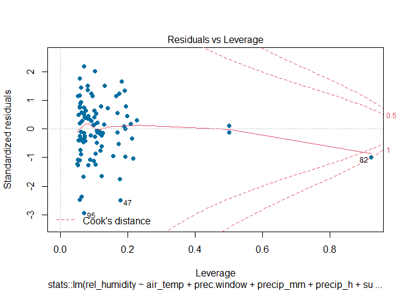

Statistics Course - UWI
================
AlbyDR
2021-04-16

## Example 3.3:Inference and Modeling -

``` r
packages_list3.3 <- c("tidyverse", "lubridate", "GGally", "summarytools", "tidymodels",
                    "moderndive", "vip", "kableExtra", "bayesplot", "bayestestR", 
                    "rstanarm", "insight", "modelbased", "performance", "see", "car", "lmtest")
```

new.packages &lt;- packages\_list3.3\[!(packages\_list3.3 %in%
installed.packages()\[,“Package”\])\] if(length(new.packages))
install.packages(new.packages) \#’ update.packages &lt;-
packages\_list3.3\[(packages\_list3.3 %in%
old.packages()\[,“Package”\])\] if(length(update.packages))
install.packages(update.packages)

``` r
invisible(lapply(packages_list3.3, library, character.only = T, quietly = TRUE, warn.conflicts = F))
```

    ## -- Attaching packages --------------------------------------- tidyverse 1.3.1 --

    ## v ggplot2 3.3.3     v purrr   0.3.4
    ## v tibble  3.1.0     v dplyr   1.0.5
    ## v tidyr   1.1.3     v stringr 1.4.0
    ## v readr   1.4.0     v forcats 0.5.1

    ## -- Conflicts ------------------------------------------ tidyverse_conflicts() --
    ## x dplyr::filter() masks stats::filter()
    ## x dplyr::lag()    masks stats::lag()

    ## Registered S3 method overwritten by 'GGally':
    ##   method from   
    ##   +.gg   ggplot2

    ## Registered S3 method overwritten by 'pryr':
    ##   method      from
    ##   print.bytes Rcpp

    ## For best results, restart R session and update pander using devtools:: or remotes::install_github('rapporter/pander')

    ## -- Attaching packages -------------------------------------- tidymodels 0.1.2 --

    ## v broom     0.7.6          v recipes   0.1.15    
    ## v dials     0.0.9          v rsample   0.0.9     
    ## v infer     0.5.4          v tune      0.1.3.9001
    ## v modeldata 0.1.0          v workflows 0.2.2     
    ## v parsnip   0.1.5          v yardstick 0.0.8

    ## -- Conflicts ----------------------------------------- tidymodels_conflicts() --
    ## x scales::discard()    masks purrr::discard()
    ## x dplyr::filter()      masks stats::filter()
    ## x recipes::fixed()     masks stringr::fixed()
    ## x dplyr::lag()         masks stats::lag()
    ## x yardstick::spec()    masks readr::spec()
    ## x recipes::step()      masks stats::step()
    ## x summarytools::view() masks tibble::view()

    ## This is bayesplot version 1.8.0

    ## - Online documentation and vignettes at mc-stan.org/bayesplot

    ## - bayesplot theme set to bayesplot::theme_default()

    ##    * Does _not_ affect other ggplot2 plots

    ##    * See ?bayesplot_theme_set for details on theme setting

    ## 
    ## Attaching package: 'Rcpp'

    ## The following object is masked from 'package:rsample':
    ## 
    ##     populate

    ## This is rstanarm version 2.21.1

    ## - See https://mc-stan.org/rstanarm/articles/priors for changes to default priors!

    ## - Default priors may change, so it's safest to specify priors, even if equivalent to the defaults.

    ## - For execution on a local, multicore CPU with excess RAM we recommend calling

    ##   options(mc.cores = parallel::detectCores())

    ## Registered S3 methods overwritten by 'car':
    ##   method                          from
    ##   influence.merMod                lme4
    ##   cooks.distance.influence.merMod lme4
    ##   dfbeta.influence.merMod         lme4
    ##   dfbetas.influence.merMod        lme4

    ## 
    ## Attaching package: 'zoo'

    ## The following objects are masked from 'package:base':
    ## 
    ##     as.Date, as.Date.numeric

``` r
DWD_temperature <- read_rds("DWD_temperature.rds")
DWD_precipitation <- read_rds("DWD_precipitation.rds")
```

**Simple linear regression**

``` r
linear_reg() %>% set_engine("lm") %>% set_mode("regression") %>%
  fit(rel_humidity ~ air_temp, data = filter(DWD_precipitation, year(timestamp) >= 2020)) %>%
  pluck("fit") %>% summary()
```

    ## 
    ## Call:
    ## stats::lm(formula = rel_humidity ~ air_temp, data = data)
    ## 
    ## Residuals:
    ##     Min      1Q  Median      3Q     Max 
    ## -57.927  -9.963   2.058  11.703  37.586 
    ## 
    ## Coefficients:
    ##             Estimate Std. Error t value Pr(>|t|)    
    ## (Intercept)  90.7119     0.1622   559.1   <2e-16 ***
    ## air_temp     -1.5958     0.0121  -131.8   <2e-16 ***
    ## ---
    ## Signif. codes:  0 '***' 0.001 '**' 0.01 '*' 0.05 '.' 0.1 ' ' 1
    ## 
    ## Residual standard error: 16.81 on 34938 degrees of freedom
    ##   (26 observations deleted due to missingness)
    ## Multiple R-squared:  0.3322, Adjusted R-squared:  0.3322 
    ## F-statistic: 1.738e+04 on 1 and 34938 DF,  p-value: < 2.2e-16

**Multiple linear regression** two explanatory variables (predictors,
independent variables, model inputs)

``` r
linear_reg() %>% set_engine("lm") %>% set_mode("regression") %>%
  fit(rel_humidity ~ air_temp + precip_h, data = filter(DWD_precipitation, year(timestamp) >= 2020)) %>%
  pluck("fit") %>% summary()
```

    ## 
    ## Call:
    ## stats::lm(formula = rel_humidity ~ air_temp + precip_h, data = data)
    ## 
    ## Residuals:
    ##     Min      1Q  Median      3Q     Max 
    ## -55.227  -9.566   1.779  10.967  38.838 
    ## 
    ## Coefficients:
    ##             Estimate Std. Error t value Pr(>|t|)    
    ## (Intercept) 87.49916    0.16043  545.40   <2e-16 ***
    ## air_temp    -1.53319    0.01145 -133.92   <2e-16 ***
    ## precip_h    15.13933    0.22853   66.25   <2e-16 ***
    ## ---
    ## Signif. codes:  0 '***' 0.001 '**' 0.01 '*' 0.05 '.' 0.1 ' ' 1
    ## 
    ## Residual standard error: 15.84 on 34937 degrees of freedom
    ##   (26 observations deleted due to missingness)
    ## Multiple R-squared:  0.4067, Adjusted R-squared:  0.4067 
    ## F-statistic: 1.198e+04 on 2 and 34937 DF,  p-value: < 2.2e-16

very low p-values as the sample size is very big.

CI for the estimations

``` r
linear_reg() %>% set_engine("lm") %>% set_mode("regression") %>%
  fit(rel_humidity ~ air_temp + precip_h, data = filter(DWD_precipitation, year(timestamp) >= 2020)) %>%
  pluck("fit") %>% get_regression_table()
```

    ## # A tibble: 3 x 7
    ##   term      estimate std_error statistic p_value lower_ci upper_ci
    ##   <chr>        <dbl>     <dbl>     <dbl>   <dbl>    <dbl>    <dbl>
    ## 1 intercept    87.5      0.16      545.        0    87.2     87.8 
    ## 2 air_temp     -1.53     0.011    -134.        0    -1.56    -1.51
    ## 3 precip_h     15.1      0.229      66.2       0    14.7     15.6

very narrow CI as the sample size is very big.

many explanatory variables

``` r
linear_reg() %>% set_engine("lm") %>% set_mode("regression") %>%
  fit(rel_humidity ~ ., data = filter(DWD_precipitation, year(timestamp) >= 2020)) %>%
  pluck("fit") %>% summary()
```

    ## 
    ## Call:
    ## stats::lm(formula = rel_humidity ~ ., data = data)
    ## 
    ## Residuals:
    ##     Min      1Q  Median      3Q     Max 
    ## -45.038  -7.674   0.275   8.376  38.248 
    ## 
    ## Coefficients: (2 not defined because of singularities)
    ##                                      Estimate Std. Error  t value Pr(>|t|)    
    ## (Intercept)                        -7.679e+02  1.178e+01  -65.201  < 2e-16 ***
    ## timestamp                           5.460e-07  7.305e-09   74.752  < 2e-16 ***
    ## precip_mm                           4.475e+00  1.810e-01   24.730  < 2e-16 ***
    ## precip_h                            8.413e+00  2.003e-01   41.998  < 2e-16 ***
    ## cloud_cover                        -5.192e-01  1.586e-01   -3.274 0.001061 ** 
    ## sunlight_timesDusk                 -9.487e+00  3.060e-01  -31.001  < 2e-16 ***
    ## sunlight_timesGoldenhour_afternoon -1.388e+01  4.041e-01  -34.344  < 2e-16 ***
    ## sunlight_timesGoldenhour_morning    1.468e+00  4.051e-01    3.624 0.000291 ***
    ## sunlight_timesNight                -4.099e+00  2.467e-01  -16.615  < 2e-16 ***
    ## sunlight_timesNoon                 -1.585e+01  3.883e-01  -40.835  < 2e-16 ***
    ## sunlight_timesSun_rising           -6.696e+00  2.698e-01  -24.818  < 2e-16 ***
    ## sunlight_timesSun_setting          -1.951e+01  2.720e-01  -71.726  < 2e-16 ***
    ## prec.window                        -5.505e-02  7.617e-04  -72.278  < 2e-16 ***
    ## cloud_typeCirrus                   -9.557e+00  1.280e+00   -7.467 8.41e-14 ***
    ## cloud_typeCirrocumulus             -1.059e+01  1.145e+00   -9.249  < 2e-16 ***
    ## cloud_typeCirrostratus             -8.000e+00  1.001e+00   -7.996 1.32e-15 ***
    ## cloud_typeAltocumulus              -7.616e+00  8.620e-01   -8.835  < 2e-16 ***
    ## cloud_typeAltostratus              -7.929e+00  7.224e-01  -10.976  < 2e-16 ***
    ## cloud_typeNimbostratus             -5.402e+00  5.754e-01   -9.388  < 2e-16 ***
    ## cloud_typeStratocumulus            -4.752e+00  4.100e-01  -11.589  < 2e-16 ***
    ## cloud_typeStratus                  -1.134e+00  2.438e-01   -4.649 3.34e-06 ***
    ## cloud_typeCumulus                          NA         NA       NA       NA    
    ## day_night                                  NA         NA       NA       NA    
    ## air_temp                           -1.081e+00  1.025e-02 -105.472  < 2e-16 ***
    ## ---
    ## Signif. codes:  0 '***' 0.001 '**' 0.01 '*' 0.05 '.' 0.1 ' ' 1
    ## 
    ## Residual standard error: 12.02 on 34886 degrees of freedom
    ##   (58 observations deleted due to missingness)
    ## Multiple R-squared:  0.659,  Adjusted R-squared:  0.6588 
    ## F-statistic:  3211 on 21 and 34886 DF,  p-value: < 2.2e-16

the factors was converted in dummy variables (0/1) according with the
number of categories the Rsquared is better, but in practice not all of
this parameters are significant in practice

``` r
linear_reg() %>% set_engine("lm") %>% set_mode("regression") %>%
  fit(rel_humidity ~ ., data = filter(DWD_precipitation, year(timestamp) >= 2020)) %>%
  pluck("fit") %>% get_regression_table() %>% print(n = 24)
```

    ## # A tibble: 24 x 7
    ##    term                   estimate std_error statistic p_value lower_ci upper_ci
    ##    <chr>                     <dbl>     <dbl>     <dbl>   <dbl>    <dbl>    <dbl>
    ##  1 intercept              -768.       11.8      -65.2    0     -791.    -745.   
    ##  2 timestamp                 0         0         74.8    0        0        0    
    ##  3 precip_mm                 4.47      0.181     24.7    0        4.12     4.83 
    ##  4 precip_h                  8.41      0.2       42.0    0        8.02     8.81 
    ##  5 cloud_cover              -0.519     0.159     -3.27   0.001   -0.83    -0.208
    ##  6 sunlight_timesDusk       -9.49      0.306    -31.0    0      -10.1     -8.89 
    ##  7 sunlight_timesGoldenh~  -13.9       0.404    -34.3    0      -14.7    -13.1  
    ##  8 sunlight_timesGoldenh~    1.47      0.405      3.62   0        0.674    2.26 
    ##  9 sunlight_timesNight      -4.10      0.247    -16.6    0       -4.58    -3.62 
    ## 10 sunlight_timesNoon      -15.9       0.388    -40.8    0      -16.6    -15.1  
    ## 11 sunlight_timesSun_ris~   -6.70      0.27     -24.8    0       -7.22    -6.17 
    ## 12 sunlight_timesSun_set~  -19.5       0.272    -71.7    0      -20.0    -19.0  
    ## 13 prec.window              -0.055     0.001    -72.3    0       -0.057   -0.054
    ## 14 cloud_typeCirrus         -9.56      1.28      -7.47   0      -12.1     -7.05 
    ## 15 cloud_typeCirrocumulus  -10.6       1.14      -9.25   0      -12.8     -8.35 
    ## 16 cloud_typeCirrostratus   -8         1.00      -8.00   0       -9.96    -6.04 
    ## 17 cloud_typeAltocumulus    -7.62      0.862     -8.84   0       -9.31    -5.93 
    ## 18 cloud_typeAltostratus    -7.93      0.722    -11.0    0       -9.35    -6.51 
    ## 19 cloud_typeNimbostratus   -5.40      0.575     -9.39   0       -6.53    -4.27 
    ## 20 cloud_typeStratocumul~   -4.75      0.41     -11.6    0       -5.56    -3.95 
    ## 21 cloud_typeStratus        -1.13      0.244     -4.65   0       -1.61    -0.656
    ## 22 cloud_typeCumulus        NA        NA         NA     NA       NA       NA    
    ## 23 day_night                NA        NA         NA     NA       NA       NA    
    ## 24 air_temp                 -1.08      0.01    -105.     0       -1.10    -1.06

what happens if we take a sample before modeling

``` r
set.seed(123, sample.kind = "Rounding")
```

    ## Warning in set.seed(123, sample.kind = "Rounding"): non-uniform 'Rounding'
    ## sampler used

``` r
linear_reg() %>% set_engine("lm") %>% set_mode("regression") %>%
  fit(rel_humidity ~ ., data = sample_n(filter(DWD_precipitation, year(timestamp) >= 2020), 100)) %>%
  pluck("fit") %>% summary()
```

    ## 
    ## Call:
    ## stats::lm(formula = rel_humidity ~ ., data = data)
    ## 
    ## Residuals:
    ##      Min       1Q   Median       3Q      Max 
    ## -29.2844  -7.1223  -0.5829   8.0750  21.0425 
    ## 
    ## Coefficients: (2 not defined because of singularities)
    ##                                      Estimate Std. Error t value Pr(>|t|)    
    ## (Intercept)                        -7.959e+02  2.542e+02  -3.131 0.002464 ** 
    ## timestamp                           5.768e-07  1.579e-07   3.652 0.000473 ***
    ## precip_mm                           8.438e+00  3.793e+00   2.224 0.029044 *  
    ## precip_h                            3.538e+00  4.086e+00   0.866 0.389262    
    ## cloud_cover                        -2.605e+00  1.463e+00  -1.781 0.078907 .  
    ## sunlight_timesDusk                 -1.203e+01  5.747e+00  -2.094 0.039565 *  
    ## sunlight_timesGoldenhour_afternoon -1.795e+01  6.766e+00  -2.653 0.009695 ** 
    ## sunlight_timesGoldenhour_morning    1.411e+00  1.047e+01   0.135 0.893145    
    ## sunlight_timesNight                -4.043e+00  4.966e+00  -0.814 0.418095    
    ## sunlight_timesNoon                 -1.650e+01  7.142e+00  -2.310 0.023589 *  
    ## sunlight_timesSun_rising           -9.491e+00  5.294e+00  -1.793 0.076947 .  
    ## sunlight_timesSun_setting          -1.931e+01  5.023e+00  -3.845 0.000247 ***
    ## prec.window                        -8.981e-02  2.594e-02  -3.462 0.000879 ***
    ## cloud_typeCirrus                   -2.746e+01  1.200e+01  -2.289 0.024816 *  
    ## cloud_typeCirrocumulus             -1.511e+01  1.286e+01  -1.175 0.243603    
    ## cloud_typeCirrostratus             -1.137e+01  1.065e+01  -1.067 0.289152    
    ## cloud_typeAltocumulus              -1.704e+01  9.499e+00  -1.793 0.076831 .  
    ## cloud_typeAltostratus              -3.514e+01  9.278e+00  -3.788 0.000300 ***
    ## cloud_typeNimbostratus             -8.706e+00  7.591e+00  -1.147 0.254999    
    ## cloud_typeStratocumulus            -5.019e-01  7.286e+00  -0.069 0.945259    
    ## cloud_typeStratus                  -4.052e+00  3.632e+00  -1.116 0.268078    
    ## cloud_typeCumulus                          NA         NA      NA       NA    
    ## day_night                                  NA         NA      NA       NA    
    ## air_temp                           -1.159e+00  2.194e-01  -5.284 1.14e-06 ***
    ## ---
    ## Signif. codes:  0 '***' 0.001 '**' 0.01 '*' 0.05 '.' 0.1 ' ' 1
    ## 
    ## Residual standard error: 12.27 on 77 degrees of freedom
    ##   (1 observation deleted due to missingness)
    ## Multiple R-squared:  0.6933, Adjusted R-squared:  0.6096 
    ## F-statistic: 8.288 on 21 and 77 DF,  p-value: 2.009e-12

The Rsquare is simmilar but now many predictors are not significant at
all

lets check some metrics

``` r
set.seed(123, sample.kind = "Rounding")
```

    ## Warning in set.seed(123, sample.kind = "Rounding"): non-uniform 'Rounding'
    ## sampler used

``` r
linear_reg() %>% set_engine("lm") %>% set_mode("regression") %>%
  fit(rel_humidity ~ ., data = sample_n(filter(DWD_precipitation, year(timestamp) >= 2020), 100)) %>%
  pluck("fit") %>% get_regression_summaries()
```

    ## # A tibble: 1 x 9
    ##   r_squared adj_r_squared   mse  rmse sigma statistic p_value    df  nobs
    ##       <dbl>         <dbl> <dbl> <dbl> <dbl>     <dbl>   <dbl> <dbl> <dbl>
    ## 1     0.693          0.61  117.  10.8  12.3      8.29       0    21    99

other metrics

``` r
set.seed(123, sample.kind = "Rounding") 
```

    ## Warning in set.seed(123, sample.kind = "Rounding"): non-uniform 'Rounding'
    ## sampler used

``` r
linear_reg() %>% set_engine("lm") %>% set_mode("regression") %>%
  fit(rel_humidity ~ ., data = sample_n(filter(DWD_precipitation, year(timestamp) >= 2020), 100)) %>%
  pluck("fit") %>% glance()
```

    ## # A tibble: 1 x 12
    ##   r.squared adj.r.squared sigma statistic  p.value    df logLik   AIC   BIC
    ##       <dbl>         <dbl> <dbl>     <dbl>    <dbl> <dbl>  <dbl> <dbl> <dbl>
    ## 1     0.693         0.610  12.3      8.29 2.01e-12    21  -376.  798.  858.
    ## # ... with 3 more variables: deviance <dbl>, df.residual <int>, nobs <int>

many different statistics

Lets check the importance of the predictors

``` r
set.seed(123, sample.kind = "Rounding")
```

    ## Warning in set.seed(123, sample.kind = "Rounding"): non-uniform 'Rounding'
    ## sampler used

``` r
linear_reg() %>% set_engine("lm") %>% set_mode("regression") %>%
  fit(rel_humidity ~ ., data = sample_n(filter(DWD_precipitation, year(timestamp) >= 2020), 100)) %>%
  pluck("fit") %>% vip()
```

<!-- -->

timestamp? this kind of variable should be not in the model

``` r
set.seed(123, sample.kind = "Rounding")
```

    ## Warning in set.seed(123, sample.kind = "Rounding"): non-uniform 'Rounding'
    ## sampler used

``` r
linear_reg() %>% set_engine("lm") %>% set_mode("regression") %>%
  fit(rel_humidity ~ air_temp + prec.window + precip_mm + precip_h + sunlight_times, 
      data = sample_n(filter(DWD_precipitation, year(timestamp) >= 2020), 100)) %>%
  pluck("fit") %>% summary()
```

    ## 
    ## Call:
    ## stats::lm(formula = rel_humidity ~ air_temp + prec.window + precip_mm + 
    ##     precip_h + sunlight_times, data = data)
    ## 
    ## Residuals:
    ##     Min      1Q  Median      3Q     Max 
    ## -39.595  -6.212   0.603   8.031  29.610 
    ## 
    ## Coefficients:
    ##                                     Estimate Std. Error t value Pr(>|t|)    
    ## (Intercept)                        103.86961    4.92746  21.080  < 2e-16 ***
    ## air_temp                            -0.91297    0.23606  -3.868 0.000210 ***
    ## prec.window                         -0.09259    0.02543  -3.641 0.000458 ***
    ## precip_mm                            7.77489    4.13722   1.879 0.063520 .  
    ## precip_h                             6.18638    4.31610   1.433 0.155307    
    ## sunlight_timesDusk                 -17.79024    6.01070  -2.960 0.003955 ** 
    ## sunlight_timesGoldenhour_afternoon -23.98822    7.06363  -3.396 0.001028 ** 
    ## sunlight_timesGoldenhour_morning    -4.10579   10.82365  -0.379 0.705353    
    ## sunlight_timesNight                 -9.03736    5.06649  -1.784 0.077912 .  
    ## sunlight_timesNoon                 -27.55801    7.31526  -3.767 0.000298 ***
    ## sunlight_timesSun_rising           -14.77497    5.28800  -2.794 0.006387 ** 
    ## sunlight_timesSun_setting          -26.98220    5.16379  -5.225 1.16e-06 ***
    ## ---
    ## Signif. codes:  0 '***' 0.001 '**' 0.01 '*' 0.05 '.' 0.1 ' ' 1
    ## 
    ## Residual standard error: 13.95 on 88 degrees of freedom
    ## Multiple R-squared:  0.5487, Adjusted R-squared:  0.4922 
    ## F-statistic: 9.725 on 11 and 88 DF,  p-value: 2.856e-11

``` r
set.seed(123, sample.kind = "Rounding")
```

    ## Warning in set.seed(123, sample.kind = "Rounding"): non-uniform 'Rounding'
    ## sampler used

``` r
linear_reg() %>% set_engine("lm") %>% set_mode("regression") %>%
  fit(rel_humidity ~ air_temp + prec.window + precip_mm + precip_h + sunlight_times, 
      data = sample_n(filter(DWD_precipitation, year(timestamp) >= 2020), 100)) %>%
  pluck("fit") %>% glance()
```

    ## # A tibble: 1 x 12
    ##   r.squared adj.r.squared sigma statistic  p.value    df logLik   AIC   BIC
    ##       <dbl>         <dbl> <dbl>     <dbl>    <dbl> <dbl>  <dbl> <dbl> <dbl>
    ## 1     0.549         0.492  14.0      9.73 2.86e-11    11  -399.  824.  858.
    ## # ... with 3 more variables: deviance <dbl>, df.residual <int>, nobs <int>

Residual analysis

``` r
set.seed(123, sample.kind = "Rounding")
```

    ## Warning in set.seed(123, sample.kind = "Rounding"): non-uniform 'Rounding'
    ## sampler used

``` r
linear_reg() %>% set_engine("lm") %>% set_mode("regression") %>%
  fit(rel_humidity ~ air_temp + prec.window + precip_mm + precip_h + sunlight_times, 
      data = sample_n(filter(DWD_precipitation, year(timestamp) >= 2020), 100)) -> lm_fit
```

``` r
ggplot(mapping = aes(x = lm_fit$fit$fitted.values, y = lm_fit$fit$model$rel_humidity)) +
  geom_point(color = '#006EA1') +
  geom_abline(intercept = 0, slope = 1, color = 'orange') +
  labs(title = 'Linear Regression Results - rel_humidity train Set',
       x = 'Predicted rel_humidity',
       y = 'Observed rel_humidity')
```

<!-- -->

``` r
set.seed(123, sample.kind = "Rounding")
```

    ## Warning in set.seed(123, sample.kind = "Rounding"): non-uniform 'Rounding'
    ## sampler used

``` r
new_data <- sample_n(filter(DWD_precipitation, year(timestamp) >= 2019), 100)
```

``` r
test_pred <- predict(lm_fit, new_data = new_data) %>% 
  bind_cols(new_data)
```

``` r
ggplot(data = test_pred,
       mapping = aes(x = .pred, y = rel_humidity)) +
  geom_point(color = '#006EA1') +
  geom_abline(intercept = 0, slope = 1, color = 'orange') +
  labs(title = 'Linear Regression Results - rel_humidity Test Set',
       x = 'Predicted rel_humidity',
       y = 'Observed rel_humidity')
```

<!-- -->

``` r
par(mfrow=c(2,2)) # plot all 4 plots in one
```

``` r
plot(lm_fit$fit, pch = 16, col = '#006EA1')
```

<!-- --><!-- --><!-- --><!-- -->

as the 100 sample is spread over the year the pattern are not clear

Autocorrelation

``` r
lm_fit %>% pluck("fit") %>% durbinWatsonTest() %>% glance()
```

    ## # A tibble: 1 x 5
    ##   statistic p.value autocorrelation method             alternative
    ##       <dbl>   <dbl>           <dbl> <chr>              <chr>      
    ## 1      1.83   0.356          0.0503 Durbin-Watson Test two.sided

or

``` r
lm_fit %>% pluck("fit") %>% pluck("residuals") %>% Box.test(type = "Ljung-Box") %>% glance()
```

    ## # A tibble: 1 x 4
    ##   statistic p.value parameter method        
    ##       <dbl>   <dbl>     <dbl> <chr>         
    ## 1     0.261   0.610         1 Box-Ljung test

apparently no temporal autocorrelation

Multicollinearity

``` r
lm_fit %>%  pluck("fit") %>% vif()
```

    ##                    GVIF Df GVIF^(1/(2*Df))
    ## air_temp       1.283738  1        1.133022
    ## prec.window    1.324549  1        1.150890
    ## precip_mm      1.299730  1        1.140057
    ## precip_h       1.472741  1        1.213565
    ## sunlight_times 1.714126  7        1.039244

apparently no Multicollinearity, VIF values that exceeds 5 or 10
indicates a problematic amount of collinearity.

Heterocedasticity

``` r
lm_fit %>%  pluck("fit") %>% bptest() %>% glance()
```

    ## # A tibble: 1 x 4
    ##   statistic p.value parameter method                        
    ##       <dbl>   <dbl>     <dbl> <chr>                         
    ## 1      9.11   0.612        11 studentized Breusch-Pagan test

we cannot also reject Heterocedasticity

Normality test

``` r
lm_fit %>% pluck("fit") %>% pluck("residuals") %>% shapiro.test() %>% glance()
```

    ## # A tibble: 1 x 3
    ##   statistic p.value method                     
    ##       <dbl>   <dbl> <chr>                      
    ## 1     0.982   0.195 Shapiro-Wilk normality test

sound Normal

What’s happens If we take the data in a sequence

``` r
linear_reg() %>% set_engine("lm") %>% set_mode("regression") %>%
  fit(rel_humidity ~ air_temp + prec.window + precip_mm + precip_h, 
      data = filter(DWD_precipitation, year(timestamp) >= 2020 & 
                      month(timestamp) == 6 & hour(timestamp) == 12)) -> lm_fit_seq
```

``` r
par(mfrow=c(2,2)) # plot all 4 plots in one
```

``` r
lm_fit_seq %>% pluck("fit") %>% plot(pch = 16, col = '#006EA1')
```

<!-- --><!-- --><!-- --><!-- -->

Autocorrelation

``` r
lm_fit_seq %>% pluck("fit") %>% durbinWatsonTest() %>% glance()
```

    ## # A tibble: 1 x 5
    ##   statistic p.value autocorrelation method             alternative
    ##       <dbl>   <dbl>           <dbl> <chr>              <chr>      
    ## 1     0.320       0           0.835 Durbin-Watson Test two.sided

or

``` r
lm_fit_seq %>% pluck("fit") %>% pluck("residuals") %>% Box.test(type = "Ljung-Box") %>% glance()
```

    ## # A tibble: 1 x 4
    ##   statistic p.value parameter method        
    ##       <dbl>   <dbl>     <dbl> <chr>         
    ## 1      85.7       0         1 Box-Ljung test

temporal autocorrelation just pop-out

Heterocedasticity

``` r
lm_fit_seq %>%  pluck("fit") %>% bptest() %>% glance()
```

    ## # A tibble: 1 x 4
    ##   statistic   p.value parameter method                        
    ##       <dbl>     <dbl>     <dbl> <chr>                         
    ## 1      25.6 0.0000384         4 studentized Breusch-Pagan test

Now we should reject Heterocedasticity

Normality test

``` r
lm_fit_seq %>% pluck("fit") %>% pluck("residuals") %>% shapiro.test() %>% glance()
```

    ## # A tibble: 1 x 3
    ##   statistic p.value method                     
    ##       <dbl>   <dbl> <chr>                      
    ## 1     0.960 0.00117 Shapiro-Wilk normality test

even Normality is rejected

Lets check sample size effect

``` r
lm_fit %>% pluck("fit") %>% glance()
```

    ## # A tibble: 1 x 12
    ##   r.squared adj.r.squared sigma statistic  p.value    df logLik   AIC   BIC
    ##       <dbl>         <dbl> <dbl>     <dbl>    <dbl> <dbl>  <dbl> <dbl> <dbl>
    ## 1     0.549         0.492  14.0      9.73 2.86e-11    11  -399.  824.  858.
    ## # ... with 3 more variables: deviance <dbl>, df.residual <int>, nobs <int>

``` r
new_data %>%
  dplyr::select(rel_humidity) %>%
  bind_cols(predict(lm_fit, new_data = new_data)) %>% metrics(truth = rel_humidity, estimate = .pred)
```

    ## # A tibble: 3 x 3
    ##   .metric .estimator .estimate
    ##   <chr>   <chr>          <dbl>
    ## 1 rmse    standard      14.3  
    ## 2 rsq     standard       0.491
    ## 3 mae     standard      11.2

n=30

``` r
set.seed(123, sample.kind = "Rounding")
```

    ## Warning in set.seed(123, sample.kind = "Rounding"): non-uniform 'Rounding'
    ## sampler used

``` r
linear_reg() %>% set_engine("lm") %>% set_mode("regression") %>%
  fit(rel_humidity ~ air_temp + prec.window + precip_mm + precip_h + sunlight_times, 
      data = sample_n(filter(DWD_precipitation, year(timestamp) >= 2020), 30)) -> lm_fit30
```

``` r
lm_fit30 %>%  pluck("fit") %>% glance()
```

    ## # A tibble: 1 x 12
    ##   r.squared adj.r.squared sigma statistic p.value    df logLik   AIC   BIC
    ##       <dbl>         <dbl> <dbl>     <dbl>   <dbl> <dbl>  <dbl> <dbl> <dbl>
    ## 1     0.640         0.451  13.1      3.38  0.0108    10  -113.  250.  267.
    ## # ... with 3 more variables: deviance <dbl>, df.residual <int>, nobs <int>

r.squared much bigger, but the error sigma is higher

``` r
new_data30 <- sample_n(filter(DWD_precipitation, year(timestamp) >= 2019), 30) 
```

``` r
new_data30 %>%
  dplyr::select(rel_humidity) %>%
  bind_cols(predict(lm_fit30, new_data = new_data30)) %>% metrics(truth = rel_humidity, estimate = .pred)
```

    ## # A tibble: 3 x 3
    ##   .metric .estimator .estimate
    ##   <chr>   <chr>          <dbl>
    ## 1 rmse    standard      13.3  
    ## 2 rsq     standard       0.587
    ## 3 mae     standard      10.9

The difference between accuracy in the training and testing set is huge

``` r
set.seed(123, sample.kind = "Rounding")
```

    ## Warning in set.seed(123, sample.kind = "Rounding"): non-uniform 'Rounding'
    ## sampler used

``` r
linear_reg() %>% set_engine("lm") %>% set_mode("regression") %>%
  fit(rel_humidity ~ air_temp + prec.window + precip_mm + precip_h + sunlight_times, 
      data = sample_n(filter(DWD_precipitation, year(timestamp) >= 2020), 1000)) -> lm_fit1000
```

``` r
lm_fit1000 %>%  pluck("fit") %>% glance()
```

    ## # A tibble: 1 x 12
    ##   r.squared adj.r.squared sigma statistic   p.value    df logLik   AIC   BIC
    ##       <dbl>         <dbl> <dbl>     <dbl>     <dbl> <dbl>  <dbl> <dbl> <dbl>
    ## 1     0.600         0.595  13.1      135. 8.97e-188    11 -3989. 8004. 8068.
    ## # ... with 3 more variables: deviance <dbl>, df.residual <int>, nobs <int>

r.squared much bigger, but the error sigma is higher

``` r
new_data1000 <- sample_n(filter(DWD_precipitation, year(timestamp) >= 2019), 1000) 
```

``` r
new_data1000 %>%
  dplyr::select(rel_humidity) %>%
  bind_cols(predict(lm_fit1000, new_data = new_data1000)) %>% metrics(truth = rel_humidity, estimate = .pred)
```

    ## # A tibble: 3 x 3
    ##   .metric .estimator .estimate
    ##   <chr>   <chr>          <dbl>
    ## 1 rmse    standard      14.5  
    ## 2 rsq     standard       0.512
    ## 3 mae     standard      11.4

The difference between accuracy in the training and testing set are
small

the test statistic and p-values are based on a t-distribution with
degrees of freedom equal to df= n−p = 1000-2 = 998.

``` r
set.seed(999, sample.kind = "Rounding")
```

    ## Warning in set.seed(999, sample.kind = "Rounding"): non-uniform 'Rounding'
    ## sampler used

``` r
linear_reg() %>% set_engine("lm") %>% set_mode("regression") %>%
  fit(rel_humidity ~ air_temp + prec.window + precip_mm + precip_h + sunlight_times, 
      data = sample_n(filter(DWD_precipitation, year(timestamp) >= 2020), 100)) %>%
  pluck("fit") %>% get_regression_points()
```

    ## # A tibble: 100 x 9
    ##       ID rel_humidity air_temp prec.window precip_mm precip_h sunlight_times
    ##    <int>        <dbl>    <dbl>       <dbl>     <dbl>    <dbl> <chr>         
    ##  1     1         25.7     20.5         115         0        0 Sun_setting   
    ##  2     2         51       20.7         162         0        0 Sun_rising    
    ##  3     3         72.7      5.7           7         0        0 Noon          
    ##  4     4         90.3      9.2          12         0        0 Sun_setting   
    ##  5     5         69.8     11.5          50         0        0 Sun_setting   
    ##  6     6         69        5            83         0        0 Noon          
    ##  7     7         40.8     27.6         285         0        0 Dusk          
    ##  8     8         76.1      7             2         0        0 Noon          
    ##  9     9         50       15           143         0        0 Sun_rising    
    ## 10    10         38.3     28.7         134         0        0 Sun_setting   
    ## # ... with 90 more rows, and 2 more variables: rel_humidity_hat <dbl>,
    ## #   residual <dbl>

``` r
set.seed(999, sample.kind = "Rounding")
```

    ## Warning in set.seed(999, sample.kind = "Rounding"): non-uniform 'Rounding'
    ## sampler used

``` r
linear_reg() %>% set_engine("lm") %>% set_mode("regression") %>%
  fit(rel_humidity ~ air_temp + prec.window + precip_mm + precip_h + sunlight_times, 
      data = sample_n(filter(DWD_precipitation, year(timestamp) >= 2020), 100)) %>%
  pluck("fit") %>% fitted()
```

    ##        1        2        3        4        5        6        7        8 
    ## 51.36321 57.34915 75.42982 69.13171 64.38116 71.04689 40.06801 74.50724 
    ##        9       10       11       12       13       14       15       16 
    ## 64.11833 42.17980 87.36277 45.74151 88.38192 94.68415 83.28090 64.08489 
    ##       17       18       19       20       21       22       23       24 
    ## 69.76079 74.78456 76.33242 81.18742 73.49035 55.41231 57.64440 88.23277 
    ##       25       26       27       28       29       30       31       32 
    ## 73.01629 82.07492 72.07103 41.22066 78.32586 71.56398 98.34213 87.60862 
    ##       33       34       35       36       37       38       39       40 
    ## 71.48328 46.81757 72.69519 80.77463 80.62536 72.79344 88.61439 81.61821 
    ##       41       42       43       44       45       46       47       48 
    ## 89.74674 84.30912 87.85953 75.76689 82.04630 86.94398 66.61449 82.73906 
    ##       49       50       51       52       53       54       55       56 
    ## 78.89872 86.95507 79.70379 77.25854 86.64922 86.78235 93.39462 71.08492 
    ##       57       58       59       60       61       62       63       64 
    ## 87.27553 72.09197 55.19817 95.77149 80.89873 92.25587 54.07916 83.80234 
    ##       65       66       67       68       69       70       71       72 
    ## 58.11246 76.85915 75.07147 81.33060 72.66584 81.42507 82.82633 35.17078 
    ##       73       74       75       76       77       78       79       80 
    ## 67.79553 70.80001 81.74487 88.09499 59.02572 74.36247 89.50625 86.50460 
    ##       81       82       83       84       85       86       87       88 
    ## 53.78946 66.53305 75.71343 72.40716 90.19607 79.43633 91.17689 87.23519 
    ##       89       90       91       92       93       94       95       96 
    ## 42.79753 68.21058 46.80470 77.71847 89.21486 80.18806 54.34727 86.73268 
    ##       97       98       99      100 
    ## 46.52836 61.67589 50.98701 80.58222

``` r
set.seed(999, sample.kind = "Rounding")
```

    ## Warning in set.seed(999, sample.kind = "Rounding"): non-uniform 'Rounding'
    ## sampler used

``` r
linear_reg() %>% set_engine("lm") %>% set_mode("regression") %>%
  fit(rel_humidity ~ air_temp + prec.window + precip_mm + precip_h + sunlight_times,  
      data = sample_n(filter(DWD_precipitation, year(timestamp) >= 2020), 100)) %>%
  pluck("fit") %>% residuals()
```

    ##            1            2            3            4            5            6 
    ## -25.66321150  -6.34915033  -2.72981628  21.16829205   5.41884440  -2.04688644 
    ##            7            8            9           10           11           12 
    ##   0.73198780   1.59276173 -14.11833133  -3.87979708 -26.46277379  -6.24151272 
    ##           13           14           15           16           17           18 
    ##  -3.78192114  -0.38414638   9.91909735   7.21510775  -0.46079468   7.51543898 
    ##           19           20           21           22           23           24 
    ## -12.93242203  13.11258352  24.40964852   4.18769323   6.95559751   4.56723410 
    ##           25           26           27           28           29           30 
    ##   3.18371216   7.02508227  -5.07103063  -5.72065906   7.27413819   0.03601504 
    ##           31           32           33           34           35           36 
    ##  -5.44212896 -35.20861678   9.01672206  -5.61757184  20.40481327  16.52536803 
    ##           37           38           39           40           41           42 
    ##  18.67464167  12.60656326   6.48560810  -0.61820722 -29.74674329  13.59088498 
    ##           43           44           45           46           47           48 
    ##   4.34046822  -1.46688682   8.75369575  -5.44398210 -13.31448826 -33.03905784 
    ##           49           50           51           52           53           54 
    ## -20.09872248   6.64493047   1.99620848  -2.15854223 -18.54921722  11.11765343 
    ##           55           56           57           58           59           60 
    ##   2.50537571  -3.78492155  -3.57553188  24.60803059   6.90183463   2.82850531 
    ##           61           62           63           64           65           66 
    ##  -6.39873013   5.14413463  14.52083575   7.29765885  14.58753507   8.24084581 
    ##           67           68           69           70           71           72 
    ##   5.12852513  15.26940132   2.03415786  -4.62506855  10.07366641  -5.77077636 
    ##           73           74           75           76           77           78 
    ##  -2.69553268  27.29999112  -1.74486644   1.70501480 -12.62571552  -5.36247333 
    ##           79           80           81           82           83           84 
    ##  -3.50625254   2.49539810  -4.08945624 -13.43305203  20.58656716  -2.10715940 
    ##           85           86           87           88           89           90 
    ##  -4.89606945 -20.73632971 -11.87689089   9.36481141 -20.29753398  16.28942422 
    ##           91           92           93           94           95           96 
    ##  18.49530069  -9.51847292  -1.11486385  -2.38805961  -3.74727199 -13.63267586 
    ##           97           98           99          100 
    ##  -0.02836353  -1.77588794  -9.68701124 -13.88222088

**Interaction**

``` r
set.seed(999, sample.kind = "Rounding")
```

    ## Warning in set.seed(999, sample.kind = "Rounding"): non-uniform 'Rounding'
    ## sampler used

``` r
linear_reg() %>% set_engine("lm") %>% set_mode("regression") %>%
  fit(rel_humidity ~ air_temp*precip_h, 
      data = sample_n(filter(DWD_precipitation, year(timestamp) >= 2020), 100)) %>%
  pluck("fit") %>% get_regression_table()
```

    ## # A tibble: 4 x 7
    ##   term              estimate std_error statistic p_value lower_ci upper_ci
    ##   <chr>                <dbl>     <dbl>     <dbl>   <dbl>    <dbl>    <dbl>
    ## 1 intercept           88.4       2.84      31.1    0       82.7      94.0 
    ## 2 air_temp            -1.44      0.191     -7.54   0       -1.82     -1.06
    ## 3 precip_h             2.13      7.89       0.27   0.788  -13.5      17.8 
    ## 4 air_temp:precip_h    0.924     0.688      1.34   0.183   -0.443     2.29

the “interaction effect” is significant while the precip\_h effect is
not. However you can not exclude the explanatory variable precip\_h and
keep the interaction, so both should be kept.

``` r
set.seed(999, sample.kind = "Rounding")
```

    ## Warning in set.seed(999, sample.kind = "Rounding"): non-uniform 'Rounding'
    ## sampler used

``` r
linear_reg() %>% set_engine("lm") %>% set_mode("regression") %>%
  fit(rel_humidity ~ air_temp*precip_h, 
      data = sample_n(filter(DWD_precipitation, year(timestamp) >= 2020), 100)) %>%
  pluck("fit") %>% get_regression_summaries()
```

    ## # A tibble: 1 x 9
    ##   r_squared adj_r_squared   mse  rmse sigma statistic p_value    df  nobs
    ##       <dbl>         <dbl> <dbl> <dbl> <dbl>     <dbl>   <dbl> <dbl> <dbl>
    ## 1     0.433         0.416  204.  14.3  14.6      24.5       0     3   100

``` r
set.seed(999, sample.kind = "Rounding")
```

    ## Warning in set.seed(999, sample.kind = "Rounding"): non-uniform 'Rounding'
    ## sampler used

``` r
DWD_precipitation %>%
  filter(year(timestamp) >= 2020) %>%
  sample_n(100) %>%
  ggplot(aes(x = air_temp, y = rel_humidity, color = factor(precip_h))) +
  geom_point() +
  labs(x = "air temperature", y = "relative humidity", color = "precipitation") +
  geom_smooth(method = "lm", se = FALSE)
```

    ## `geom_smooth()` using formula 'y ~ x'

<!-- -->

There is an interaction effect if the associated effect of one variable
depends on the value of another variable. Here, the associated effect of
the variable temperature depends on whether is raining or not. The
difference in slopes for precipitation shows this.

``` r
set.seed(999, sample.kind = "Rounding")
```

    ## Warning in set.seed(999, sample.kind = "Rounding"): non-uniform 'Rounding'
    ## sampler used

``` r
linear_reg() %>% set_engine("lm") %>% set_mode("regression") %>%
  fit(rel_humidity ~ air_temp + precip_h, 
      data = sample_n(filter(DWD_precipitation, year(timestamp) >= 2020), 100)) %>%
  pluck("fit") %>% get_regression_table()
```

    ## # A tibble: 3 x 7
    ##   term      estimate std_error statistic p_value lower_ci upper_ci
    ##   <chr>        <dbl>     <dbl>     <dbl>   <dbl>    <dbl>    <dbl>
    ## 1 intercept    87.5      2.78      31.5    0        82.0     93.0 
    ## 2 air_temp     -1.37     0.184     -7.43   0        -1.74    -1.00
    ## 3 precip_h     11.5      3.68       3.12   0.002     4.19    18.8

the parameters for model without interaction is ver different

``` r
set.seed(999, sample.kind = "Rounding")
```

    ## Warning in set.seed(999, sample.kind = "Rounding"): non-uniform 'Rounding'
    ## sampler used

``` r
linear_reg() %>% set_engine("lm") %>% set_mode("regression") %>%
  fit(rel_humidity ~ air_temp + precip_h, 
      data = sample_n(filter(DWD_precipitation, year(timestamp) >= 2020), 100)) %>%
  pluck("fit") %>% get_regression_summaries()
```

    ## # A tibble: 1 x 9
    ##   r_squared adj_r_squared   mse  rmse sigma statistic p_value    df  nobs
    ##       <dbl>         <dbl> <dbl> <dbl> <dbl>     <dbl>   <dbl> <dbl> <dbl>
    ## 1     0.423         0.411  208.  14.4  14.6      35.5       0     2   100

``` r
set.seed(999, sample.kind = "Rounding")
```

    ## Warning in set.seed(999, sample.kind = "Rounding"): non-uniform 'Rounding'
    ## sampler used

``` r
DWD_precipitation %>%
  filter(year(timestamp) >= 2020) %>%
  sample_n(100) %>%
  ggplot(aes(x = air_temp, y = rel_humidity, color = factor(precip_h))) +
  geom_point() +
  labs(x = "air temperature", y = "relative humidity", color = "precipitation") +
  geom_parallel_slopes(se = FALSE)
```

<!-- -->

without interaction the slopes are parallel

**Bayesian Framework**

``` r
set.seed(999, sample.kind = "Rounding")
```

    ## Warning in set.seed(999, sample.kind = "Rounding"): non-uniform 'Rounding'
    ## sampler used

``` r
model <- stan_glm(rel_humidity ~ air_temp*precip_h, 
                  data=sample_n(filter(DWD_precipitation, year(timestamp) >= 2020), 100))
```

    ## 
    ## SAMPLING FOR MODEL 'continuous' NOW (CHAIN 1).
    ## Chain 1: 
    ## Chain 1: Gradient evaluation took 0 seconds
    ## Chain 1: 1000 transitions using 10 leapfrog steps per transition would take 0 seconds.
    ## Chain 1: Adjust your expectations accordingly!
    ## Chain 1: 
    ## Chain 1: 
    ## Chain 1: Iteration:    1 / 2000 [  0%]  (Warmup)
    ## Chain 1: Iteration:  200 / 2000 [ 10%]  (Warmup)
    ## Chain 1: Iteration:  400 / 2000 [ 20%]  (Warmup)
    ## Chain 1: Iteration:  600 / 2000 [ 30%]  (Warmup)
    ## Chain 1: Iteration:  800 / 2000 [ 40%]  (Warmup)
    ## Chain 1: Iteration: 1000 / 2000 [ 50%]  (Warmup)
    ## Chain 1: Iteration: 1001 / 2000 [ 50%]  (Sampling)
    ## Chain 1: Iteration: 1200 / 2000 [ 60%]  (Sampling)
    ## Chain 1: Iteration: 1400 / 2000 [ 70%]  (Sampling)
    ## Chain 1: Iteration: 1600 / 2000 [ 80%]  (Sampling)
    ## Chain 1: Iteration: 1800 / 2000 [ 90%]  (Sampling)
    ## Chain 1: Iteration: 2000 / 2000 [100%]  (Sampling)
    ## Chain 1: 
    ## Chain 1:  Elapsed Time: 0.08 seconds (Warm-up)
    ## Chain 1:                0.084 seconds (Sampling)
    ## Chain 1:                0.164 seconds (Total)
    ## Chain 1: 
    ## 
    ## SAMPLING FOR MODEL 'continuous' NOW (CHAIN 2).
    ## Chain 2: 
    ## Chain 2: Gradient evaluation took 0 seconds
    ## Chain 2: 1000 transitions using 10 leapfrog steps per transition would take 0 seconds.
    ## Chain 2: Adjust your expectations accordingly!
    ## Chain 2: 
    ## Chain 2: 
    ## Chain 2: Iteration:    1 / 2000 [  0%]  (Warmup)
    ## Chain 2: Iteration:  200 / 2000 [ 10%]  (Warmup)
    ## Chain 2: Iteration:  400 / 2000 [ 20%]  (Warmup)
    ## Chain 2: Iteration:  600 / 2000 [ 30%]  (Warmup)
    ## Chain 2: Iteration:  800 / 2000 [ 40%]  (Warmup)
    ## Chain 2: Iteration: 1000 / 2000 [ 50%]  (Warmup)
    ## Chain 2: Iteration: 1001 / 2000 [ 50%]  (Sampling)
    ## Chain 2: Iteration: 1200 / 2000 [ 60%]  (Sampling)
    ## Chain 2: Iteration: 1400 / 2000 [ 70%]  (Sampling)
    ## Chain 2: Iteration: 1600 / 2000 [ 80%]  (Sampling)
    ## Chain 2: Iteration: 1800 / 2000 [ 90%]  (Sampling)
    ## Chain 2: Iteration: 2000 / 2000 [100%]  (Sampling)
    ## Chain 2: 
    ## Chain 2:  Elapsed Time: 0.077 seconds (Warm-up)
    ## Chain 2:                0.078 seconds (Sampling)
    ## Chain 2:                0.155 seconds (Total)
    ## Chain 2: 
    ## 
    ## SAMPLING FOR MODEL 'continuous' NOW (CHAIN 3).
    ## Chain 3: 
    ## Chain 3: Gradient evaluation took 0 seconds
    ## Chain 3: 1000 transitions using 10 leapfrog steps per transition would take 0 seconds.
    ## Chain 3: Adjust your expectations accordingly!
    ## Chain 3: 
    ## Chain 3: 
    ## Chain 3: Iteration:    1 / 2000 [  0%]  (Warmup)
    ## Chain 3: Iteration:  200 / 2000 [ 10%]  (Warmup)
    ## Chain 3: Iteration:  400 / 2000 [ 20%]  (Warmup)
    ## Chain 3: Iteration:  600 / 2000 [ 30%]  (Warmup)
    ## Chain 3: Iteration:  800 / 2000 [ 40%]  (Warmup)
    ## Chain 3: Iteration: 1000 / 2000 [ 50%]  (Warmup)
    ## Chain 3: Iteration: 1001 / 2000 [ 50%]  (Sampling)
    ## Chain 3: Iteration: 1200 / 2000 [ 60%]  (Sampling)
    ## Chain 3: Iteration: 1400 / 2000 [ 70%]  (Sampling)
    ## Chain 3: Iteration: 1600 / 2000 [ 80%]  (Sampling)
    ## Chain 3: Iteration: 1800 / 2000 [ 90%]  (Sampling)
    ## Chain 3: Iteration: 2000 / 2000 [100%]  (Sampling)
    ## Chain 3: 
    ## Chain 3:  Elapsed Time: 0.094 seconds (Warm-up)
    ## Chain 3:                0.11 seconds (Sampling)
    ## Chain 3:                0.204 seconds (Total)
    ## Chain 3: 
    ## 
    ## SAMPLING FOR MODEL 'continuous' NOW (CHAIN 4).
    ## Chain 4: 
    ## Chain 4: Gradient evaluation took 0 seconds
    ## Chain 4: 1000 transitions using 10 leapfrog steps per transition would take 0 seconds.
    ## Chain 4: Adjust your expectations accordingly!
    ## Chain 4: 
    ## Chain 4: 
    ## Chain 4: Iteration:    1 / 2000 [  0%]  (Warmup)
    ## Chain 4: Iteration:  200 / 2000 [ 10%]  (Warmup)
    ## Chain 4: Iteration:  400 / 2000 [ 20%]  (Warmup)
    ## Chain 4: Iteration:  600 / 2000 [ 30%]  (Warmup)
    ## Chain 4: Iteration:  800 / 2000 [ 40%]  (Warmup)
    ## Chain 4: Iteration: 1000 / 2000 [ 50%]  (Warmup)
    ## Chain 4: Iteration: 1001 / 2000 [ 50%]  (Sampling)
    ## Chain 4: Iteration: 1200 / 2000 [ 60%]  (Sampling)
    ## Chain 4: Iteration: 1400 / 2000 [ 70%]  (Sampling)
    ## Chain 4: Iteration: 1600 / 2000 [ 80%]  (Sampling)
    ## Chain 4: Iteration: 1800 / 2000 [ 90%]  (Sampling)
    ## Chain 4: Iteration: 2000 / 2000 [100%]  (Sampling)
    ## Chain 4: 
    ## Chain 4:  Elapsed Time: 0.097 seconds (Warm-up)
    ## Chain 4:                0.075 seconds (Sampling)
    ## Chain 4:                0.172 seconds (Total)
    ## Chain 4:

``` r
print(model, digits = 3)
```

    ## stan_glm
    ##  family:       gaussian [identity]
    ##  formula:      rel_humidity ~ air_temp * precip_h
    ##  observations: 100
    ##  predictors:   4
    ## ------
    ##                   Median MAD_SD
    ## (Intercept)       88.343  2.802
    ## air_temp          -1.437  0.191
    ## precip_h           1.997  7.520
    ## air_temp:precip_h  0.944  0.686
    ## 
    ## Auxiliary parameter(s):
    ##       Median MAD_SD
    ## sigma 14.683  1.063
    ## 
    ## ------
    ## * For help interpreting the printed output see ?print.stanreg
    ## * For info on the priors used see ?prior_summary.stanreg

``` r
describe_posterior(model)
```

    ## Possible multicollinearity between air_temp:precip_h and precip_h (r = 0.88). This might lead to inappropriate results. See 'Details' in '?rope'.

    ## Summary of Posterior Distribution
    ## 
    ## Parameter         | Median |          95% CI |     pd |          ROPE | % in ROPE |  Rhat |     ESS
    ## ---------------------------------------------------------------------------------------------------
    ## (Intercept)       |  88.34 | [ 82.68, 93.85] |   100% | [-1.91, 1.91] |        0% | 1.000 | 3199.00
    ## air_temp          |  -1.44 | [ -1.83, -1.06] |   100% | [-1.91, 1.91] |      100% | 1.001 | 3024.00
    ## precip_h          |   2.00 | [-12.44, 17.80] | 60.75% | [-1.91, 1.91] |    20.52% | 1.000 | 2169.00
    ## air_temp:precip_h |   0.94 | [ -0.38,  2.26] | 91.30% | [-1.91, 1.91] |    94.90% | 1.000 | 2298.00

``` r
mcmc_dens(model, pars = c("air_temp"))+
  vline_at(-2.045  , col="red")
```

<!-- -->

``` r
mcmc_dens(model, pars = c("precip_h"))+
  vline_at(3.475, col="red")
```

<!-- -->

``` r
rope(get_parameters(model)$air_temp)
```

    ## # Proportion of samples inside the ROPE [-0.10, 0.10]:
    ## 
    ## inside ROPE
    ## -----------
    ## 0.00 %

``` r
# For air_temp almost all the credible interval (HDI) is outside the ROPE range, which means that 
# coefficient is highly significant.
```

``` r
model_performance(model)
```

    ## # Indices of model performance
    ## 
    ## ELPD     | ELPD_SE |   LOOIC | LOOIC_SE |    WAIC |    R2 | R2 (adj.) |   RMSE |  Sigma
    ## ---------------------------------------------------------------------------------------
    ## -412.591 |   7.662 | 825.182 |   15.324 | 825.148 | 0.428 |     0.397 | 14.285 | 14.683

``` r
estimate_means(model, levels = c("precip_h"), length = 2)
```

    ## NOTE: Results may be misleading due to involvement in interactions

    ## precip_h |  Mean |         95% CI
    ## ---------------------------------
    ## 0.00     | 71.43 | [68.20, 74.59]
    ## 1.00     | 84.35 | [77.82, 91.52]

``` r
plot(rope(model))
```

    ## Possible multicollinearity between air_temp:precip_h and precip_h (r = 0.88). This might lead to inappropriate results. See 'Details' in '?rope'.

<!-- -->

CI: Credible Interval, it is used to quantify the uncertainty about the
regression coefficients. with 89% probability (given the data) that a
coefficient lies above the CI\_low value and under CI\_high value This
straightforward probabilistic interpretation is completely different
from the confidence interval used in classical linear regression where
the coefficient fall inside this confidence interval (if we choose 95%
of confidence) 95 times if we repeat the study 100 times.

pd: Probability of Direction, which is the probability that the effect
goes to the positive or to the negative direction, and it is considered
as the best equivalent for the p-value (p-value = 1-PD).

ROPE\_CI: Region of Practical Equivalence, since bayes method deals with
true probabilities, it does not make sense to compute the probability of
getting the effect equals zero (the null hypothesis) as a point
(probability of a point in continuous intervals equal zero ). Thus, we
define instead a small range around zero which can be considered
practically the same as no effect (zero), this range therefore is called
ROPE. By default (according to Cohen, 1988) The Rope is \[-0.1,0.1\]
from the standardized coefficients.

Rhat: scale reduction factor 𝑅̂ , it is computed for each scalar quantity
of interest, as the standard deviation of that quantity from all the
chains included together, divided by the root mean square of the
separate within-chain standard deviations. When this value is close to 1
we do not have any convergence problem with MCMC.

``` r
# ESS: effective sample size, it captures how many independent draws contain the same amount of 
# information as the dependent sample obtained by the MCMC algorithm, the higher the ESS the better. 
# The threshold used in practice is 400.
```

**Logistic Model** using a binomial model (e.g., a logistic model), it
is possible to reformulate the following hypothesis, “there is an
important difference in this variable between the two groups” with the
hypothesis “this variable is able to discriminate between (or classify)
the two groups (rainfall and dry)”

``` r
set.seed(999, sample.kind = "Rounding")
```

    ## Warning in set.seed(999, sample.kind = "Rounding"): non-uniform 'Rounding'
    ## sampler used

``` r
model_B <- stan_glm(precip_h ~ rel_humidity + air_temp, family = "binomial", refresh = 0,
                    data = sample_n(filter(DWD_precipitation, year(timestamp) >= 2020), 100))
```

``` r
print(model_B, digits = 3)
```

    ## stan_glm
    ##  family:       binomial [logit]
    ##  formula:      precip_h ~ rel_humidity + air_temp
    ##  observations: 100
    ##  predictors:   3
    ## ------
    ##              Median MAD_SD
    ## (Intercept)  -6.933  2.075
    ## rel_humidity  0.065  0.021
    ## air_temp      0.037  0.048
    ## 
    ## ------
    ## * For help interpreting the printed output see ?print.stanreg
    ## * For info on the priors used see ?prior_summary.stanreg

``` r
describe_posterior(model_B)
```

    ## Summary of Posterior Distribution
    ## 
    ## Parameter    | Median |          95% CI |     pd |          ROPE | % in ROPE |  Rhat |     ESS
    ## ----------------------------------------------------------------------------------------------
    ## (Intercept)  |  -6.93 | [-11.31, -3.16] |   100% | [-0.18, 0.18] |        0% | 1.002 | 1543.00
    ## rel_humidity |   0.07 | [  0.02,  0.11] | 99.98% | [-0.18, 0.18] |      100% | 1.001 | 1684.00
    ## air_temp     |   0.04 | [ -0.06,  0.13] | 78.33% | [-0.18, 0.18] |      100% | 1.002 | 1829.00

``` r
rope(get_parameters(model_B)$rel_humidity)
```

    ## # Proportion of samples inside the ROPE [-0.10, 0.10]:
    ## 
    ## inside ROPE
    ## -----------
    ## 96.37 %

``` r
rope(get_parameters(model_B)$air_temp)
```

    ## # Proportion of samples inside the ROPE [-0.10, 0.10]:
    ## 
    ## inside ROPE
    ## -----------
    ## 93.19 %

``` r
model_performance(model_B)
```

    ## # Indices of model performance
    ## 
    ## ELPD    | ELPD_SE |  LOOIC | LOOIC_SE |   WAIC |    R2 |  RMSE | Sigma | Log_loss | Score_log | Score_spherical
    ## ---------------------------------------------------------------------------------------------------------------
    ## -46.929 |   5.692 | 93.858 |   11.385 | 93.836 | 0.123 | 0.380 | 1.000 |    0.441 |    -4.449 |           0.056

``` r
estimate_means(model_B, levels = c("air_temp"), length = 2)
```

    ## air_temp | Probability |       95% CI
    ## -------------------------------------
    ## -3.70    |        0.09 | [0.01, 0.26]
    ## 31.30    |        0.27 | [0.03, 0.64]

``` r
plot(rope(model_B))
```

<!-- -->

logistic

``` r
set.seed(999, sample.kind = "Rounding")
```

    ## Warning in set.seed(999, sample.kind = "Rounding"): non-uniform 'Rounding'
    ## sampler used

``` r
model.BF <- glm(precip_h ~ rel_humidity + air_temp, family = binomial, 
                data = sample_n(filter(DWD_precipitation, year(timestamp) >= 2020), 100))
```

``` r
model.BF
```

    ## 
    ## Call:  glm(formula = precip_h ~ rel_humidity + air_temp, family = binomial, 
    ##     data = sample_n(filter(DWD_precipitation, year(timestamp) >= 
    ##         2020), 100))
    ## 
    ## Coefficients:
    ##  (Intercept)  rel_humidity      air_temp  
    ##     -6.89769       0.06435       0.03986  
    ## 
    ## Degrees of Freedom: 99 Total (i.e. Null);  97 Residual
    ## Null Deviance:       100.1 
    ## Residual Deviance: 88.11     AIC: 94.11

``` r
summary(model.BF)
```

    ## 
    ## Call:
    ## glm(formula = precip_h ~ rel_humidity + air_temp, family = binomial, 
    ##     data = sample_n(filter(DWD_precipitation, year(timestamp) >= 
    ##         2020), 100))
    ## 
    ## Deviance Residuals: 
    ##     Min       1Q   Median       3Q      Max  
    ## -1.2308  -0.7012  -0.4844  -0.2492   2.2979  
    ## 
    ## Coefficients:
    ##              Estimate Std. Error z value Pr(>|z|)   
    ## (Intercept)  -6.89769    2.15179  -3.206  0.00135 **
    ## rel_humidity  0.06435    0.02226   2.892  0.00383 **
    ## air_temp      0.03986    0.04699   0.848  0.39624   
    ## ---
    ## Signif. codes:  0 '***' 0.001 '**' 0.01 '*' 0.05 '.' 0.1 ' ' 1
    ## 
    ## (Dispersion parameter for binomial family taken to be 1)
    ## 
    ##     Null deviance: 100.080  on 99  degrees of freedom
    ## Residual deviance:  88.114  on 97  degrees of freedom
    ## AIC: 94.114
    ## 
    ## Number of Fisher Scoring iterations: 5

**Poisson**

``` r
DWD_precipitation %>%
  filter(year(timestamp) >= 1900 & precip_h == 1) %>%
  group_by(year = year(timestamp)) %>%
  summarise(precip_hour_year = n(),
            rel_humidity = mean(rel_humidity, na.rm=T),
            air_temp = mean(air_temp, na.rm=T)) %>%
  glm(formula = precip_hour_year ~ rel_humidity + air_temp,
      family = poisson) %>%
  summary()
```

    ## 
    ## Call:
    ## glm(formula = precip_hour_year ~ rel_humidity + air_temp, family = poisson, 
    ##     data = .)
    ## 
    ## Deviance Residuals: 
    ##     Min       1Q   Median       3Q      Max  
    ## -14.707   -9.294   -4.004   -0.150   62.747  
    ## 
    ## Coefficients:
    ##              Estimate Std. Error z value Pr(>|z|)    
    ## (Intercept)  7.148653   0.299608  23.860   <2e-16 ***
    ## rel_humidity 0.001029   0.003204   0.321    0.748    
    ## air_temp     0.048467   0.004234  11.447   <2e-16 ***
    ## ---
    ## Signif. codes:  0 '***' 0.001 '**' 0.01 '*' 0.05 '.' 0.1 ' ' 1
    ## 
    ## (Dispersion parameter for poisson family taken to be 1)
    ## 
    ##     Null deviance: 5740.9  on 23  degrees of freedom
    ## Residual deviance: 5590.6  on 21  degrees of freedom
    ## AIC: 5822.7
    ## 
    ## Number of Fisher Scoring iterations: 4

``` r
DWD_precipitation %>%
  filter(year(timestamp) >= 1900 & precip_h == 1) %>%
  group_by(year = year(timestamp)) %>%
  summarise(precip_hour_year = n(),
            rel_humidity = mean(rel_humidity, na.rm=T),
            air_temp = mean(air_temp, na.rm=T)) %>%
  glm(formula = precip_hour_year ~ rel_humidity + air_temp,
      family = poisson) %>%
  glance()
```

    ## # A tibble: 1 x 8
    ##   null.deviance df.null logLik   AIC   BIC deviance df.residual  nobs
    ##           <dbl>   <int>  <dbl> <dbl> <dbl>    <dbl>       <int> <int>
    ## 1         5741.      23 -2908. 5823. 5826.    5591.          21    24
