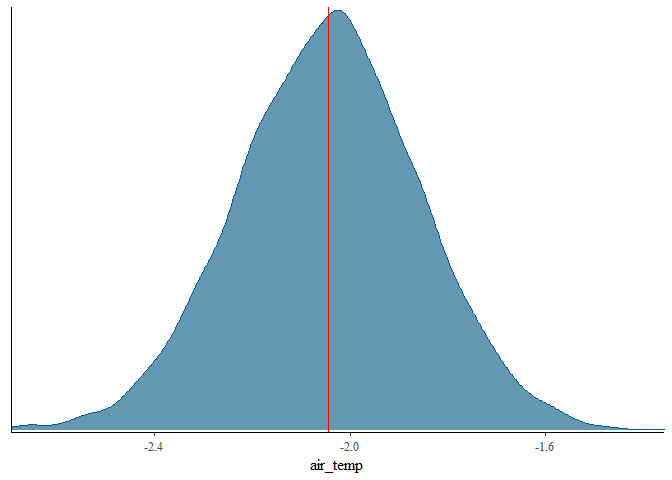
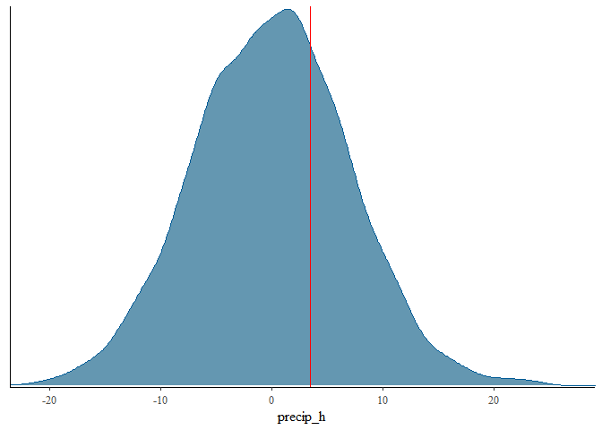
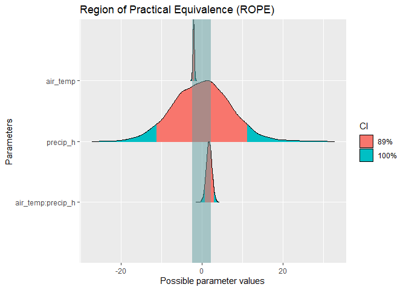

Statistics Course - UWI
================
AlbyDR
2021-04-14

## Example 3.3:Inference and Modeling -

``` r
packages_list3.3 <- c("tidyverse", "lubridate", "GGally", "summarytools", "tidymodels",
                    "moderndive", "vip", "kableExtra", "bayesplot", "bayestestR", 
                    "rstanarm", "insight", "modelbased", "performance", "see")
```

``` r
new.packages <- packages_list3.3[!(packages_list3.3 %in% installed.packages()[,"Package"])]
if(length(new.packages)) install.packages(new.packages)
```

``` r
invisible(lapply(packages_list3.3, library, character.only = T, quietly = TRUE, warn.conflicts = F))
```

    ## -- Attaching packages --------------------------------------- tidyverse 1.3.0 --

    ## v ggplot2 3.3.3     v purrr   0.3.4
    ## v tibble  3.1.0     v dplyr   1.0.5
    ## v tidyr   1.1.3     v stringr 1.4.0
    ## v readr   1.4.0     v forcats 0.5.1

    ## Warning: package 'tidyr' was built under R version 4.0.5

    ## Warning: package 'dplyr' was built under R version 4.0.5

    ## -- Conflicts ------------------------------------------ tidyverse_conflicts() --
    ## x dplyr::filter() masks stats::filter()
    ## x dplyr::lag()    masks stats::lag()

    ## Warning: package 'lubridate' was built under R version 4.0.5

    ## Registered S3 method overwritten by 'GGally':
    ##   method from   
    ##   +.gg   ggplot2

    ## Registered S3 method overwritten by 'pryr':
    ##   method      from
    ##   print.bytes Rcpp

    ## For best results, restart R session and update pander using devtools:: or remotes::install_github('rapporter/pander')

    ## -- Attaching packages -------------------------------------- tidymodels 0.1.2 --

    ## v broom     0.7.5          v recipes   0.1.15    
    ## v dials     0.0.9          v rsample   0.0.9     
    ## v infer     0.5.4          v tune      0.1.3.9001
    ## v modeldata 0.1.0          v workflows 0.2.2     
    ## v parsnip   0.1.5          v yardstick 0.0.8

    ## Warning: package 'yardstick' was built under R version 4.0.5

    ## -- Conflicts ----------------------------------------- tidymodels_conflicts() --
    ## x scales::discard()    masks purrr::discard()
    ## x dplyr::filter()      masks stats::filter()
    ## x recipes::fixed()     masks stringr::fixed()
    ## x dplyr::lag()         masks stats::lag()
    ## x yardstick::spec()    masks readr::spec()
    ## x recipes::step()      masks stats::step()
    ## x summarytools::view() masks tibble::view()

    ## This is bayesplot version 1.8.0

    ## - Online documentation and vignettes at mc-stan.org/bayesplot

    ## - bayesplot theme set to bayesplot::theme_default()

    ##    * Does _not_ affect other ggplot2 plots

    ##    * See ?bayesplot_theme_set for details on theme setting

    ## Note: The default CI width (currently `ci=0.89`) might change in future versions (see https://github.com/easystats/bayestestR/discussions/250). To prevent any issues, please set it explicitly when using bayestestR functions, via the 'ci' argument.

    ## 
    ## Attaching package: 'Rcpp'

    ## The following object is masked from 'package:rsample':
    ## 
    ##     populate

    ## This is rstanarm version 2.21.1

    ## - See https://mc-stan.org/rstanarm/articles/priors for changes to default priors!

    ## - Default priors may change, so it's safest to specify priors, even if equivalent to the defaults.

    ## - For execution on a local, multicore CPU with excess RAM we recommend calling

    ##   options(mc.cores = parallel::detectCores())

    ## Warning: package 'insight' was built under R version 4.0.5

``` r
DWD_temperature <- read_rds("DWD_temperature.rds")
DWD_precipitation <- read_rds("DWD_precipitation.rds")
```

**Simple linear regression**

``` r
linear_reg() %>% set_engine("lm") %>% set_mode("regression") %>%
  fit(rel_humidity ~ air_temp, data = filter(DWD_precipitation, year(timestamp) >= 2020)) %>%
  pluck("fit") %>% summary()
```

    ## 
    ## Call:
    ## stats::lm(formula = rel_humidity ~ air_temp, data = data)
    ## 
    ## Residuals:
    ##     Min      1Q  Median      3Q     Max 
    ## -57.927  -9.963   2.058  11.703  37.586 
    ## 
    ## Coefficients:
    ##             Estimate Std. Error t value Pr(>|t|)    
    ## (Intercept)  90.7119     0.1622   559.1   <2e-16 ***
    ## air_temp     -1.5958     0.0121  -131.8   <2e-16 ***
    ## ---
    ## Signif. codes:  0 '***' 0.001 '**' 0.01 '*' 0.05 '.' 0.1 ' ' 1
    ## 
    ## Residual standard error: 16.81 on 34938 degrees of freedom
    ##   (26 observations deleted due to missingness)
    ## Multiple R-squared:  0.3322, Adjusted R-squared:  0.3322 
    ## F-statistic: 1.738e+04 on 1 and 34938 DF,  p-value: < 2.2e-16

**Multiple linear regression** two explanatory variables (predictors,
independent variables, model inputs)

``` r
linear_reg() %>% set_engine("lm") %>% set_mode("regression") %>%
  fit(rel_humidity ~ air_temp + precip_h, data = filter(DWD_precipitation, year(timestamp) >= 2020)) %>%
  pluck("fit") %>% summary()
```

    ## 
    ## Call:
    ## stats::lm(formula = rel_humidity ~ air_temp + precip_h, data = data)
    ## 
    ## Residuals:
    ##     Min      1Q  Median      3Q     Max 
    ## -55.227  -9.566   1.779  10.967  38.838 
    ## 
    ## Coefficients:
    ##             Estimate Std. Error t value Pr(>|t|)    
    ## (Intercept) 87.49916    0.16043  545.40   <2e-16 ***
    ## air_temp    -1.53319    0.01145 -133.92   <2e-16 ***
    ## precip_h    15.13933    0.22853   66.25   <2e-16 ***
    ## ---
    ## Signif. codes:  0 '***' 0.001 '**' 0.01 '*' 0.05 '.' 0.1 ' ' 1
    ## 
    ## Residual standard error: 15.84 on 34937 degrees of freedom
    ##   (26 observations deleted due to missingness)
    ## Multiple R-squared:  0.4067, Adjusted R-squared:  0.4067 
    ## F-statistic: 1.198e+04 on 2 and 34937 DF,  p-value: < 2.2e-16

very low p-values as the sample size is very big.

CI for the estimations

``` r
linear_reg() %>% set_engine("lm") %>% set_mode("regression") %>%
  fit(rel_humidity ~ air_temp + precip_h, data = filter(DWD_precipitation, year(timestamp) >= 2020)) %>%
  pluck("fit") %>% get_regression_table()
```

    ## # A tibble: 3 x 7
    ##   term      estimate std_error statistic p_value lower_ci upper_ci
    ##   <chr>        <dbl>     <dbl>     <dbl>   <dbl>    <dbl>    <dbl>
    ## 1 intercept    87.5      0.16      545.        0    87.2     87.8 
    ## 2 air_temp     -1.53     0.011    -134.        0    -1.56    -1.51
    ## 3 precip_h     15.1      0.229      66.2       0    14.7     15.6

very narrow CI as the sample size is very big.

many explanatory variables

``` r
linear_reg() %>% set_engine("lm") %>% set_mode("regression") %>%
  fit(rel_humidity ~ ., data = filter(DWD_precipitation, year(timestamp) >= 2020)) %>%
  pluck("fit") %>% summary()
```

    ## 
    ## Call:
    ## stats::lm(formula = rel_humidity ~ ., data = data)
    ## 
    ## Residuals:
    ##     Min      1Q  Median      3Q     Max 
    ## -45.038  -7.674   0.275   8.376  38.248 
    ## 
    ## Coefficients: (2 not defined because of singularities)
    ##                                      Estimate Std. Error  t value Pr(>|t|)    
    ## (Intercept)                        -7.679e+02  1.178e+01  -65.201  < 2e-16 ***
    ## timestamp                           5.460e-07  7.305e-09   74.752  < 2e-16 ***
    ## precip_mm                           4.475e+00  1.810e-01   24.730  < 2e-16 ***
    ## precip_h                            8.413e+00  2.003e-01   41.998  < 2e-16 ***
    ## cloud_cover                        -5.192e-01  1.586e-01   -3.274 0.001061 ** 
    ## sunlight_timesDusk                 -9.487e+00  3.060e-01  -31.001  < 2e-16 ***
    ## sunlight_timesGoldenhour_afternoon -1.388e+01  4.041e-01  -34.344  < 2e-16 ***
    ## sunlight_timesGoldenhour_morning    1.468e+00  4.051e-01    3.624 0.000291 ***
    ## sunlight_timesNight                -4.099e+00  2.467e-01  -16.615  < 2e-16 ***
    ## sunlight_timesNoon                 -1.585e+01  3.883e-01  -40.835  < 2e-16 ***
    ## sunlight_timesSun_rising           -6.696e+00  2.698e-01  -24.818  < 2e-16 ***
    ## sunlight_timesSun_setting          -1.951e+01  2.720e-01  -71.726  < 2e-16 ***
    ## prec.window                        -5.505e-02  7.617e-04  -72.278  < 2e-16 ***
    ## cloud_typeCirrus                   -9.557e+00  1.280e+00   -7.467 8.41e-14 ***
    ## cloud_typeCirrocumulus             -1.059e+01  1.145e+00   -9.249  < 2e-16 ***
    ## cloud_typeCirrostratus             -8.000e+00  1.001e+00   -7.996 1.32e-15 ***
    ## cloud_typeAltocumulus              -7.616e+00  8.620e-01   -8.835  < 2e-16 ***
    ## cloud_typeAltostratus              -7.929e+00  7.224e-01  -10.976  < 2e-16 ***
    ## cloud_typeNimbostratus             -5.402e+00  5.754e-01   -9.388  < 2e-16 ***
    ## cloud_typeStratocumulus            -4.752e+00  4.100e-01  -11.589  < 2e-16 ***
    ## cloud_typeStratus                  -1.134e+00  2.438e-01   -4.649 3.34e-06 ***
    ## cloud_typeCumulus                          NA         NA       NA       NA    
    ## day_night                                  NA         NA       NA       NA    
    ## air_temp                           -1.081e+00  1.025e-02 -105.472  < 2e-16 ***
    ## ---
    ## Signif. codes:  0 '***' 0.001 '**' 0.01 '*' 0.05 '.' 0.1 ' ' 1
    ## 
    ## Residual standard error: 12.02 on 34886 degrees of freedom
    ##   (58 observations deleted due to missingness)
    ## Multiple R-squared:  0.659,  Adjusted R-squared:  0.6588 
    ## F-statistic:  3211 on 21 and 34886 DF,  p-value: < 2.2e-16

the factors was converted in dummy variables (0/1) according with the
number of categories the Rsquared is better, but in practice not all of
this parameters are significant in practice

``` r
linear_reg() %>% set_engine("lm") %>% set_mode("regression") %>%
  fit(rel_humidity ~ ., data = filter(DWD_precipitation, year(timestamp) >= 2020)) %>%
  pluck("fit") %>% get_regression_table() %>% print(n = 24)
```

    ## # A tibble: 24 x 7
    ##    term                   estimate std_error statistic p_value lower_ci upper_ci
    ##    <chr>                     <dbl>     <dbl>     <dbl>   <dbl>    <dbl>    <dbl>
    ##  1 intercept              -768.       11.8      -65.2    0     -791.    -745.   
    ##  2 timestamp                 0         0         74.8    0        0        0    
    ##  3 precip_mm                 4.47      0.181     24.7    0        4.12     4.83 
    ##  4 precip_h                  8.41      0.2       42.0    0        8.02     8.81 
    ##  5 cloud_cover              -0.519     0.159     -3.27   0.001   -0.83    -0.208
    ##  6 sunlight_timesDusk       -9.49      0.306    -31.0    0      -10.1     -8.89 
    ##  7 sunlight_timesGoldenh~  -13.9       0.404    -34.3    0      -14.7    -13.1  
    ##  8 sunlight_timesGoldenh~    1.47      0.405      3.62   0        0.674    2.26 
    ##  9 sunlight_timesNight      -4.10      0.247    -16.6    0       -4.58    -3.62 
    ## 10 sunlight_timesNoon      -15.9       0.388    -40.8    0      -16.6    -15.1  
    ## 11 sunlight_timesSun_ris~   -6.70      0.27     -24.8    0       -7.22    -6.17 
    ## 12 sunlight_timesSun_set~  -19.5       0.272    -71.7    0      -20.0    -19.0  
    ## 13 prec.window              -0.055     0.001    -72.3    0       -0.057   -0.054
    ## 14 cloud_typeCirrus         -9.56      1.28      -7.47   0      -12.1     -7.05 
    ## 15 cloud_typeCirrocumulus  -10.6       1.14      -9.25   0      -12.8     -8.35 
    ## 16 cloud_typeCirrostratus   -8         1.00      -8.00   0       -9.96    -6.04 
    ## 17 cloud_typeAltocumulus    -7.62      0.862     -8.84   0       -9.31    -5.93 
    ## 18 cloud_typeAltostratus    -7.93      0.722    -11.0    0       -9.35    -6.51 
    ## 19 cloud_typeNimbostratus   -5.40      0.575     -9.39   0       -6.53    -4.27 
    ## 20 cloud_typeStratocumul~   -4.75      0.41     -11.6    0       -5.56    -3.95 
    ## 21 cloud_typeStratus        -1.13      0.244     -4.65   0       -1.61    -0.656
    ## 22 cloud_typeCumulus        NA        NA         NA     NA       NA       NA    
    ## 23 day_night                NA        NA         NA     NA       NA       NA    
    ## 24 air_temp                 -1.08      0.01    -105.     0       -1.10    -1.06

what happens if we take a sample before modeling

``` r
set.seed(123)
linear_reg() %>% set_engine("lm") %>% set_mode("regression") %>%
  fit(rel_humidity ~ ., data = sample_n(filter(DWD_precipitation, year(timestamp) >= 2020), 100)) %>%
  pluck("fit") %>% summary()
```

    ## 
    ## Call:
    ## stats::lm(formula = rel_humidity ~ ., data = data)
    ## 
    ## Residuals:
    ##      Min       1Q   Median       3Q      Max 
    ## -26.4965  -6.2756   0.2166   7.2818  26.9246 
    ## 
    ## Coefficients: (2 not defined because of singularities)
    ##                                      Estimate Std. Error t value Pr(>|t|)    
    ## (Intercept)                        -1.022e+03  2.519e+02  -4.056 0.000116 ***
    ## timestamp                           7.013e-07  1.583e-07   4.430 3.00e-05 ***
    ## precip_mm                           1.472e+01  6.181e+00   2.381 0.019667 *  
    ## precip_h                           -1.706e+00  4.870e+00  -0.350 0.727128    
    ## cloud_cover                         3.717e-01  5.378e-01   0.691 0.491472    
    ## sunlight_timesDusk                 -1.120e+01  6.295e+00  -1.780 0.078913 .  
    ## sunlight_timesGoldenhour_afternoon -1.076e+01  7.983e+00  -1.348 0.181619    
    ## sunlight_timesGoldenhour_morning    2.519e+00  8.521e+00   0.296 0.768284    
    ## sunlight_timesNight                 3.667e-01  4.856e+00   0.076 0.939997    
    ## sunlight_timesNoon                 -8.792e+00  8.056e+00  -1.091 0.278414    
    ## sunlight_timesSun_rising           -6.136e+00  5.281e+00  -1.162 0.248762    
    ## sunlight_timesSun_setting          -1.804e+01  5.580e+00  -3.233 0.001786 ** 
    ## prec.window                        -4.902e-02  1.557e-02  -3.148 0.002318 ** 
    ## cloud_typeCirrocumulus             -2.454e+00  5.411e+00  -0.454 0.651399    
    ## cloud_typeCirrostratus             -2.517e+00  5.936e+00  -0.424 0.672671    
    ## cloud_typeAltocumulus               1.127e+00  6.109e+00   0.185 0.854080    
    ## cloud_typeAltostratus              -9.291e+00  6.155e+00  -1.509 0.135172    
    ## cloud_typeNimbostratus              3.440e+00  9.570e+00   0.359 0.720248    
    ## cloud_typeStratocumulus            -1.150e+00  5.173e+00  -0.222 0.824705    
    ## cloud_typeStratus                   3.224e+00  4.206e+00   0.767 0.445631    
    ## cloud_typeCumulus                          NA         NA      NA       NA    
    ## day_night                                  NA         NA      NA       NA    
    ## air_temp                           -1.289e+00  2.190e-01  -5.884 9.19e-08 ***
    ## ---
    ## Signif. codes:  0 '***' 0.001 '**' 0.01 '*' 0.05 '.' 0.1 ' ' 1
    ## 
    ## Residual standard error: 12.44 on 79 degrees of freedom
    ## Multiple R-squared:  0.7135, Adjusted R-squared:  0.6409 
    ## F-statistic: 9.835 on 20 and 79 DF,  p-value: 3.536e-14

The Rsquare is simmilar but now many predictors are not significant at
all

lets check some metrics

``` r
set.seed(123) 
linear_reg() %>% set_engine("lm") %>% set_mode("regression") %>%
  fit(rel_humidity ~ ., data = sample_n(filter(DWD_precipitation, year(timestamp) >= 2020), 100)) %>%
  pluck("fit") %>% get_regression_summaries()
```

    ## # A tibble: 1 x 9
    ##   r_squared adj_r_squared   mse  rmse sigma statistic p_value    df  nobs
    ##       <dbl>         <dbl> <dbl> <dbl> <dbl>     <dbl>   <dbl> <dbl> <dbl>
    ## 1     0.713         0.641  122.  11.1  12.4      9.84       0    20   100

other metrics

``` r
set.seed(123) 
linear_reg() %>% set_engine("lm") %>% set_mode("regression") %>%
  fit(rel_humidity ~ ., data = sample_n(filter(DWD_precipitation, year(timestamp) >= 2020), 100)) %>%
  pluck("fit") %>% glance()
```

    ## # A tibble: 1 x 12
    ##   r.squared adj.r.squared sigma statistic  p.value    df logLik   AIC   BIC
    ##       <dbl>         <dbl> <dbl>     <dbl>    <dbl> <dbl>  <dbl> <dbl> <dbl>
    ## 1     0.713         0.641  12.4      9.83 3.54e-14    20  -382.  808.  866.
    ## # ... with 3 more variables: deviance <dbl>, df.residual <int>, nobs <int>

many different statistics

Lets check the importance of the predictors

``` r
set.seed(123)
linear_reg() %>% set_engine("lm") %>% set_mode("regression") %>%
  fit(rel_humidity ~ ., data = sample_n(filter(DWD_precipitation, year(timestamp) >= 2020), 100)) %>%
  pluck("fit") %>% vip()
```

<!-- -->

timestamp? this kind of variable should be not in the model

``` r
set.seed(123)
linear_reg() %>% set_engine("lm") %>% set_mode("regression") %>%
  fit(rel_humidity ~ air_temp + prec.window + precip_mm + precip_h + sunlight_times, 
      data = sample_n(filter(DWD_precipitation, year(timestamp) >= 2020), 100)) %>%
  pluck("fit") %>% summary()
```

    ## 
    ## Call:
    ## stats::lm(formula = rel_humidity ~ air_temp + prec.window + precip_mm + 
    ##     precip_h + sunlight_times, data = data)
    ## 
    ## Residuals:
    ##     Min      1Q  Median      3Q     Max 
    ## -34.269  -6.925   0.932   9.582  30.546 
    ## 
    ## Coefficients:
    ##                                     Estimate Std. Error t value Pr(>|t|)    
    ## (Intercept)                         93.74669    4.76270  19.684  < 2e-16 ***
    ## air_temp                            -1.09582    0.21916  -5.000  2.9e-06 ***
    ## prec.window                         -0.06002    0.01604  -3.742 0.000325 ***
    ## precip_mm                           14.68829    6.69835   2.193 0.030958 *  
    ## precip_h                            -0.79273    5.12961  -0.155 0.877539    
    ## sunlight_timesDusk                 -10.28336    6.64253  -1.548 0.125185    
    ## sunlight_timesGoldenhour_afternoon -10.44219    8.45288  -1.235 0.219992    
    ## sunlight_timesGoldenhour_morning    12.86138    8.20168   1.568 0.120438    
    ## sunlight_timesNight                  5.33616    5.08040   1.050 0.296436    
    ## sunlight_timesNoon                  -1.67283    8.36202  -0.200 0.841903    
    ## sunlight_timesSun_rising            -6.86065    5.60303  -1.224 0.224048    
    ## sunlight_timesSun_setting          -16.11071    5.69366  -2.830 0.005773 ** 
    ## ---
    ## Signif. codes:  0 '***' 0.001 '**' 0.01 '*' 0.05 '.' 0.1 ' ' 1
    ## 
    ## Residual standard error: 13.76 on 88 degrees of freedom
    ## Multiple R-squared:  0.6096, Adjusted R-squared:  0.5608 
    ## F-statistic: 12.49 on 11 and 88 DF,  p-value: 7.62e-14

``` r
set.seed(123)
linear_reg() %>% set_engine("lm") %>% set_mode("regression") %>%
  fit(rel_humidity ~ air_temp + prec.window + precip_mm + precip_h + sunlight_times, 
      data = sample_n(filter(DWD_precipitation, year(timestamp) >= 2020), 100)) %>%
  pluck("fit") %>% glance()
```

    ## # A tibble: 1 x 12
    ##   r.squared adj.r.squared sigma statistic  p.value    df logLik   AIC   BIC
    ##       <dbl>         <dbl> <dbl>     <dbl>    <dbl> <dbl>  <dbl> <dbl> <dbl>
    ## 1     0.610         0.561  13.8      12.5 7.62e-14    11  -398.  821.  855.
    ## # ... with 3 more variables: deviance <dbl>, df.residual <int>, nobs <int>

``` r
set.seed(123)
linear_reg() %>% set_engine("lm") %>% set_mode("regression") %>%
  fit(rel_humidity ~ air_temp + prec.window + precip_mm + precip_h + sunlight_times, 
      data = sample_n(filter(DWD_precipitation, year(timestamp) >= 2020), 30)) %>%
  pluck("fit") %>% glance()
```

    ## # A tibble: 1 x 12
    ##   r.squared adj.r.squared sigma statistic p.value    df logLik   AIC   BIC
    ##       <dbl>         <dbl> <dbl>     <dbl>   <dbl> <dbl>  <dbl> <dbl> <dbl>
    ## 1     0.652         0.495  14.1      4.16 0.00380     9  -116.  254.  269.
    ## # ... with 3 more variables: deviance <dbl>, df.residual <int>, nobs <int>

``` r
set.seed(123)
linear_reg() %>% set_engine("lm") %>% set_mode("regression") %>%
  fit(rel_humidity ~ air_temp + prec.window + precip_mm + precip_h + sunlight_times, 
      data = sample_n(filter(DWD_precipitation, year(timestamp) >= 2020), 500)) %>%
  pluck("fit") %>% glance()
```

    ## # A tibble: 1 x 12
    ##   r.squared adj.r.squared sigma statistic  p.value    df logLik   AIC   BIC
    ##       <dbl>         <dbl> <dbl>     <dbl>    <dbl> <dbl>  <dbl> <dbl> <dbl>
    ## 1     0.556         0.546  13.7      55.5 9.32e-79    11 -2008. 4041. 4096.
    ## # ... with 3 more variables: deviance <dbl>, df.residual <int>, nobs <int>

``` r
set.seed(123)
linear_reg() %>% set_engine("lm") %>% set_mode("regression") %>%
  fit(rel_humidity ~ air_temp + prec.window + precip_mm + precip_h + sunlight_times, 
      data = sample_n(filter(DWD_precipitation, year(timestamp) >= 2020), 1000)) %>%
  pluck("fit") %>% glance()
```

    ## # A tibble: 1 x 12
    ##   r.squared adj.r.squared sigma statistic   p.value    df logLik   AIC   BIC
    ##       <dbl>         <dbl> <dbl>     <dbl>     <dbl> <dbl>  <dbl> <dbl> <dbl>
    ## 1     0.568         0.563  13.6      118. 3.13e-171    11 -4018. 8062. 8125.
    ## # ... with 3 more variables: deviance <dbl>, df.residual <int>, nobs <int>

``` r
set.seed(123)
linear_reg() %>% set_engine("lm") %>% set_mode("regression") %>%
  fit(rel_humidity ~ air_temp + prec.window + precip_mm + precip_h + sunlight_times, 
      data = sample_n(filter(DWD_precipitation, year(timestamp) >= 2020), 10000)) %>%
  pluck("fit") %>% glance()
```

    ## # A tibble: 1 x 12
    ##   r.squared adj.r.squared sigma statistic p.value    df  logLik    AIC    BIC
    ##       <dbl>         <dbl> <dbl>     <dbl>   <dbl> <dbl>   <dbl>  <dbl>  <dbl>
    ## 1     0.573         0.572  13.4     1217.       0    11 -40140. 80306. 80400.
    ## # ... with 3 more variables: deviance <dbl>, df.residual <int>, nobs <int>

the test statistic and p-values are based on a t-distribution with
degrees of freedom equal to df= n−p = 999-2=996.

``` r
set.seed(999)
linear_reg() %>% set_engine("lm") %>% set_mode("regression") %>%
  fit(rel_humidity ~ air_temp + prec.window + precip_mm + precip_h + sunlight_times, 
      data = sample_n(filter(DWD_precipitation, year(timestamp) >= 2020), 100)) %>%
  pluck("fit") %>% get_regression_points()
```

    ## # A tibble: 100 x 9
    ##       ID rel_humidity air_temp prec.window precip_mm precip_h sunlight_times
    ##    <int>        <dbl>    <dbl>       <dbl>     <dbl>    <dbl> <chr>         
    ##  1     1         35.7      5.8          83         0        0 Noon          
    ##  2     2         90.8      7.5           3         0        0 Dawn          
    ##  3     3         64.2      7.3          28         0        0 Dusk          
    ##  4     4         28       34.7         150         0        0 Sun_setting   
    ##  5     5        100        5.2         142         0        0 Dawn          
    ##  6     6         57.2     16.8         281         0        0 Night         
    ##  7     7         99.3      9.7          18         0        0 Dawn          
    ##  8     8         79.5     11.1          27         0        0 Dusk          
    ##  9     9         27.1     27           189         0        0 Sun_setting   
    ## 10    10         62.5     20.3         129         0        0 Dusk          
    ## # ... with 90 more rows, and 2 more variables: rel_humidity_hat <dbl>,
    ## #   residual <dbl>

``` r
set.seed(999)
linear_reg() %>% set_engine("lm") %>% set_mode("regression") %>%
  fit(rel_humidity ~ air_temp + prec.window + precip_mm + precip_h + sunlight_times, 
      data = sample_n(filter(DWD_precipitation, year(timestamp) >= 2020), 100)) %>%
  pluck("fit") %>% fitted()
```

    ##         1         2         3         4         5         6         7         8 
    ##  63.89802  90.04974  80.85369  28.03640  84.92764  63.72784  87.07488  77.14740 
    ##         9        10        11        12        13        14        15        16 
    ##  33.57878  62.61697  83.69141  91.85939  76.89895  78.66767 104.64183  43.66978 
    ##        17        18        19        20        21        22        23        24 
    ##  94.17037  49.38704  57.90532  44.47850  91.19823  47.51492  65.60621  90.35286 
    ##        25        26        27        28        29        30        31        32 
    ##  80.62688  43.24026  71.10282  56.57719 101.62845 102.05445  56.41084  81.32798 
    ##        33        34        35        36        37        38        39        40 
    ##  75.97696  58.96925  88.60000 101.18408  85.46754  67.47843  60.99868  53.65898 
    ##        41        42        43        44        45        46        47        48 
    ##  57.13887  84.68767  74.18004  84.90123  68.03723  95.22999  83.93499  77.36984 
    ##        49        50        51        52        53        54        55        56 
    ##  97.55318  89.14791  70.89132 108.94464  85.77477  93.33914  61.15416  35.58269 
    ##        57        58        59        60        61        62        63        64 
    ##  49.03701  62.36807  72.54183  66.47924  91.29445  25.51524  82.80373  95.43518 
    ##        65        66        67        68        69        70        71        72 
    ##  70.99579  25.57667  83.67640  86.81014  62.33022  52.64110  66.71174 109.12276 
    ##        73        74        75        76        77        78        79        80 
    ##  47.05845  87.97503  99.04688  60.04879  58.91286  80.03892  94.20858  21.88879 
    ##        81        82        83        84        85        86        87        88 
    ##  61.32811  90.72045  64.25998  93.95662  44.20024  84.50517  76.90696  43.91711 
    ##        89        90        91        92        93        94        95        96 
    ##  95.57866  91.12220  92.72525  78.76387  57.68266  91.13000  60.46162  90.19730 
    ##        97        98        99       100 
    ##  31.29666  81.23041  90.68515 104.78939

``` r
set.seed(999)
linear_reg() %>% set_engine("lm") %>% set_mode("regression") %>%
  fit(rel_humidity ~ air_temp + prec.window + precip_mm + precip_h + sunlight_times,  
      data = sample_n(filter(DWD_precipitation, year(timestamp) >= 2020), 100)) %>%
  pluck("fit") %>% residuals()
```

    ##            1            2            3            4            5            6 
    ## -28.19801880   0.75025922 -16.65369068  -0.03640256  15.07235779  -6.52783911 
    ##            7            8            9           10           11           12 
    ##  12.22512047   2.35260170  -6.47877840  -0.11697123   2.00859141   1.14060695 
    ##           13           14           15           16           17           18 
    ##  -8.39895278  15.73232598  -9.34183134  -5.96978074   2.22962600  -5.78703743 
    ##           19           20           21           22           23           24 
    ##  17.09467640  -5.07849980   2.40176502 -10.01491768  -2.50621473   1.34714198 
    ##           25           26           27           28           29           30 
    ##   1.97311887 -20.94025725  -6.40282462  -8.07719449  -2.32844750  -6.95444616 
    ##           31           32           33           34           35           36 
    ##   6.28916004 -10.42797862  12.52304219   0.93075467   0.00000000 -11.28408406 
    ##           37           38           39           40           41           42 
    ##   7.13246261   5.52157266 -25.89867642 -20.05897563 -16.53886829  12.71233042 
    ##           43           44           45           46           47           48 
    ##  10.01995730   6.69876949  12.76277143   1.17000755  -4.73499211  -3.26983953 
    ##           49           50           51           52           53           54 
    ##  -3.75317659  -6.54791003  23.70868111 -15.24464178  -4.07476860   4.56086082 
    ##           55           56           57           58           59           60 
    ##   5.74583951  -7.88268885  -7.33701373  22.23193190  11.55817169  15.72075791 
    ##           61           62           63           64           65           66 
    ##  -5.99444729  -2.61524397  12.19626649  -3.33517858  17.60420562   8.62333023 
    ##           67           68           69           70           71           72 
    ##   8.92360270  -4.91014018   5.96978074   5.05890040  23.18825679 -17.32276355 
    ##           73           74           75           76           77           78 
    ##  -1.95845379   0.32497370  -3.34688151  -0.74878961  -3.11286490  11.16108122 
    ##           79           80           81           82           83           84 
    ## -10.30858280  12.91120852   2.67188647  -6.82044617  -3.85998257   3.14337553 
    ##           85           86           87           88           89           90 
    ## -15.40024110   3.59482556  15.89303773 -18.91710717  -1.97865504   4.77780473 
    ##           91           92           93           94           95           96 
    ##   6.57475472   3.03613318 -10.88265822   8.16999640  11.73838128  -5.19730060 
    ##           97           98           99          100 
    ##  11.10334240  12.66958849  -2.68514820 -16.68939116

**Interaction**

``` r
set.seed(999)
linear_reg() %>% set_engine("lm") %>% set_mode("regression") %>%
  fit(rel_humidity ~ air_temp*precip_h, 
      data = sample_n(filter(DWD_precipitation, year(timestamp) >= 2020), 100)) %>%
  pluck("fit") %>% get_regression_table()
```

    ## # A tibble: 4 x 7
    ##   term              estimate std_error statistic p_value lower_ci upper_ci
    ##   <chr>                <dbl>     <dbl>     <dbl>   <dbl>    <dbl>    <dbl>
    ## 1 intercept           93.1       2.76      33.7    0       87.6      98.6 
    ## 2 air_temp            -2.05      0.19     -10.8    0       -2.43     -1.67
    ## 3 precip_h             0.003     6.8        0      1      -13.5      13.5 
    ## 4 air_temp:precip_h    1.78      0.672      2.65   0.009    0.445     3.11

the “interaction effect” is significant while the precip\_h effect is
not. However you can not exclude the explanatory variable precip\_h and
keep the interaction, so both should be kept.

``` r
set.seed(999)
linear_reg() %>% set_engine("lm") %>% set_mode("regression") %>%
  fit(rel_humidity ~ air_temp*precip_h, 
      data = sample_n(filter(DWD_precipitation, year(timestamp) >= 2020), 100)) %>%
  pluck("fit") %>% get_regression_summaries()
```

    ## # A tibble: 1 x 9
    ##   r_squared adj_r_squared   mse  rmse sigma statistic p_value    df  nobs
    ##       <dbl>         <dbl> <dbl> <dbl> <dbl>     <dbl>   <dbl> <dbl> <dbl>
    ## 1      0.61         0.598  210.  14.5  14.8      50.1       0     3   100

``` r
set.seed(999)
DWD_precipitation %>%
  filter(year(timestamp) >= 2020) %>%
  sample_n(100) %>%
  ggplot(aes(x = air_temp, y = rel_humidity, color = factor(precip_h))) +
  geom_point() +
  labs(x = "air temperature", y = "relative humidity", color = "precipitation") +
  geom_smooth(method = "lm", se = FALSE)
```

    ## `geom_smooth()` using formula 'y ~ x'

<!-- -->

There is an interaction effect if the associated effect of one variable
depends on the value of another variable. Here, the associated effect of
the variable temperature depends on whether is raining or not. The
difference in slopes for precipitation shows this.

``` r
set.seed(999)
linear_reg() %>% set_engine("lm") %>% set_mode("regression") %>%
  fit(rel_humidity ~ air_temp + precip_h, 
      data = sample_n(filter(DWD_precipitation, year(timestamp) >= 2020), 100)) %>%
  pluck("fit") %>% get_regression_table()
```

    ## # A tibble: 3 x 7
    ##   term      estimate std_error statistic p_value lower_ci upper_ci
    ##   <chr>        <dbl>     <dbl>     <dbl>   <dbl>    <dbl>    <dbl>
    ## 1 intercept    91.4      2.77      33.0        0    85.9     96.9 
    ## 2 air_temp     -1.91     0.188    -10.2        0    -2.28    -1.54
    ## 3 precip_h     14.9      3.94       3.78       0     7.06    22.7

the parameters for model without interaction is ver different

``` r
set.seed(999)
linear_reg() %>% set_engine("lm") %>% set_mode("regression") %>%
  fit(rel_humidity ~ air_temp + precip_h, data = sample_n(filter(DWD_precipitation, year(timestamp) >= 2020), 100)) %>%
  pluck("fit") %>% get_regression_summaries()
```

    ## # A tibble: 1 x 9
    ##   r_squared adj_r_squared   mse  rmse sigma statistic p_value    df  nobs
    ##       <dbl>         <dbl> <dbl> <dbl> <dbl>     <dbl>   <dbl> <dbl> <dbl>
    ## 1     0.582         0.573  225.  15.0  15.2      67.5       0     2   100

``` r
set.seed(999)
DWD_precipitation %>%
  filter(year(timestamp) >= 2020) %>%
  sample_n(100) %>%
  ggplot(aes(x = air_temp, y = rel_humidity, color = factor(precip_h))) +
  geom_point() +
  labs(x = "air temperature", y = "relative humidity", color = "precipitation") +
  geom_parallel_slopes(se = FALSE)
```

<!-- -->

without interaction the slopes are parallel

**Bayesian Framework**

``` r
set.seed(999)
model <- stan_glm(rel_humidity ~ air_temp*precip_h, 
                  data=sample_n(filter(DWD_precipitation, year(timestamp) >= 2020), 100))
```

    ## 
    ## SAMPLING FOR MODEL 'continuous' NOW (CHAIN 1).
    ## Chain 1: 
    ## Chain 1: Gradient evaluation took 0 seconds
    ## Chain 1: 1000 transitions using 10 leapfrog steps per transition would take 0 seconds.
    ## Chain 1: Adjust your expectations accordingly!
    ## Chain 1: 
    ## Chain 1: 
    ## Chain 1: Iteration:    1 / 2000 [  0%]  (Warmup)
    ## Chain 1: Iteration:  200 / 2000 [ 10%]  (Warmup)
    ## Chain 1: Iteration:  400 / 2000 [ 20%]  (Warmup)
    ## Chain 1: Iteration:  600 / 2000 [ 30%]  (Warmup)
    ## Chain 1: Iteration:  800 / 2000 [ 40%]  (Warmup)
    ## Chain 1: Iteration: 1000 / 2000 [ 50%]  (Warmup)
    ## Chain 1: Iteration: 1001 / 2000 [ 50%]  (Sampling)
    ## Chain 1: Iteration: 1200 / 2000 [ 60%]  (Sampling)
    ## Chain 1: Iteration: 1400 / 2000 [ 70%]  (Sampling)
    ## Chain 1: Iteration: 1600 / 2000 [ 80%]  (Sampling)
    ## Chain 1: Iteration: 1800 / 2000 [ 90%]  (Sampling)
    ## Chain 1: Iteration: 2000 / 2000 [100%]  (Sampling)
    ## Chain 1: 
    ## Chain 1:  Elapsed Time: 0.094 seconds (Warm-up)
    ## Chain 1:                0.097 seconds (Sampling)
    ## Chain 1:                0.191 seconds (Total)
    ## Chain 1: 
    ## 
    ## SAMPLING FOR MODEL 'continuous' NOW (CHAIN 2).
    ## Chain 2: 
    ## Chain 2: Gradient evaluation took 0 seconds
    ## Chain 2: 1000 transitions using 10 leapfrog steps per transition would take 0 seconds.
    ## Chain 2: Adjust your expectations accordingly!
    ## Chain 2: 
    ## Chain 2: 
    ## Chain 2: Iteration:    1 / 2000 [  0%]  (Warmup)
    ## Chain 2: Iteration:  200 / 2000 [ 10%]  (Warmup)
    ## Chain 2: Iteration:  400 / 2000 [ 20%]  (Warmup)
    ## Chain 2: Iteration:  600 / 2000 [ 30%]  (Warmup)
    ## Chain 2: Iteration:  800 / 2000 [ 40%]  (Warmup)
    ## Chain 2: Iteration: 1000 / 2000 [ 50%]  (Warmup)
    ## Chain 2: Iteration: 1001 / 2000 [ 50%]  (Sampling)
    ## Chain 2: Iteration: 1200 / 2000 [ 60%]  (Sampling)
    ## Chain 2: Iteration: 1400 / 2000 [ 70%]  (Sampling)
    ## Chain 2: Iteration: 1600 / 2000 [ 80%]  (Sampling)
    ## Chain 2: Iteration: 1800 / 2000 [ 90%]  (Sampling)
    ## Chain 2: Iteration: 2000 / 2000 [100%]  (Sampling)
    ## Chain 2: 
    ## Chain 2:  Elapsed Time: 0.105 seconds (Warm-up)
    ## Chain 2:                0.105 seconds (Sampling)
    ## Chain 2:                0.21 seconds (Total)
    ## Chain 2: 
    ## 
    ## SAMPLING FOR MODEL 'continuous' NOW (CHAIN 3).
    ## Chain 3: 
    ## Chain 3: Gradient evaluation took 0 seconds
    ## Chain 3: 1000 transitions using 10 leapfrog steps per transition would take 0 seconds.
    ## Chain 3: Adjust your expectations accordingly!
    ## Chain 3: 
    ## Chain 3: 
    ## Chain 3: Iteration:    1 / 2000 [  0%]  (Warmup)
    ## Chain 3: Iteration:  200 / 2000 [ 10%]  (Warmup)
    ## Chain 3: Iteration:  400 / 2000 [ 20%]  (Warmup)
    ## Chain 3: Iteration:  600 / 2000 [ 30%]  (Warmup)
    ## Chain 3: Iteration:  800 / 2000 [ 40%]  (Warmup)
    ## Chain 3: Iteration: 1000 / 2000 [ 50%]  (Warmup)
    ## Chain 3: Iteration: 1001 / 2000 [ 50%]  (Sampling)
    ## Chain 3: Iteration: 1200 / 2000 [ 60%]  (Sampling)
    ## Chain 3: Iteration: 1400 / 2000 [ 70%]  (Sampling)
    ## Chain 3: Iteration: 1600 / 2000 [ 80%]  (Sampling)
    ## Chain 3: Iteration: 1800 / 2000 [ 90%]  (Sampling)
    ## Chain 3: Iteration: 2000 / 2000 [100%]  (Sampling)
    ## Chain 3: 
    ## Chain 3:  Elapsed Time: 0.118 seconds (Warm-up)
    ## Chain 3:                0.124 seconds (Sampling)
    ## Chain 3:                0.242 seconds (Total)
    ## Chain 3: 
    ## 
    ## SAMPLING FOR MODEL 'continuous' NOW (CHAIN 4).
    ## Chain 4: 
    ## Chain 4: Gradient evaluation took 0 seconds
    ## Chain 4: 1000 transitions using 10 leapfrog steps per transition would take 0 seconds.
    ## Chain 4: Adjust your expectations accordingly!
    ## Chain 4: 
    ## Chain 4: 
    ## Chain 4: Iteration:    1 / 2000 [  0%]  (Warmup)
    ## Chain 4: Iteration:  200 / 2000 [ 10%]  (Warmup)
    ## Chain 4: Iteration:  400 / 2000 [ 20%]  (Warmup)
    ## Chain 4: Iteration:  600 / 2000 [ 30%]  (Warmup)
    ## Chain 4: Iteration:  800 / 2000 [ 40%]  (Warmup)
    ## Chain 4: Iteration: 1000 / 2000 [ 50%]  (Warmup)
    ## Chain 4: Iteration: 1001 / 2000 [ 50%]  (Sampling)
    ## Chain 4: Iteration: 1200 / 2000 [ 60%]  (Sampling)
    ## Chain 4: Iteration: 1400 / 2000 [ 70%]  (Sampling)
    ## Chain 4: Iteration: 1600 / 2000 [ 80%]  (Sampling)
    ## Chain 4: Iteration: 1800 / 2000 [ 90%]  (Sampling)
    ## Chain 4: Iteration: 2000 / 2000 [100%]  (Sampling)
    ## Chain 4: 
    ## Chain 4:  Elapsed Time: 0.083 seconds (Warm-up)
    ## Chain 4:                0.102 seconds (Sampling)
    ## Chain 4:                0.185 seconds (Total)
    ## Chain 4:

``` r
print(model, digits = 3)
```

    ## stan_glm
    ##  family:       gaussian [identity]
    ##  formula:      rel_humidity ~ air_temp * precip_h
    ##  observations: 100
    ##  predictors:   4
    ## ------
    ##                   Median MAD_SD
    ## (Intercept)       93.033  2.719
    ## air_temp          -2.041  0.186
    ## precip_h           0.066  7.069
    ## air_temp:precip_h  1.770  0.681
    ## 
    ## Auxiliary parameter(s):
    ##       Median MAD_SD
    ## sigma 14.875  1.070
    ## 
    ## ------
    ## * For help interpreting the printed output see ?print.stanreg
    ## * For info on the priors used see ?prior_summary.stanreg

``` r
describe_posterior(model)
```

    ## Warning in doTryCatch(return(expr), name, parentenv, handler): Note that the
    ## default rope range for binomial models might change in future versions (see
    ## https://github.com/easystats/bayestestR/issues/364).Please set it explicitly to
    ## preserve current results.

    ## Possible multicollinearity between air_temp:precip_h and precip_h (r = 0.83). This might lead to inappropriate results. See 'Details' in '?rope'.

    ## # Description of Posterior Distributions
    ## 
    ## Parameter         | Median |          0.89% CI |      pd |        89% ROPE | % in ROPE |  Rhat |      ESS
    ## ---------------------------------------------------------------------------------------------------------
    ## (Intercept)       | 93.033 | [ 88.621, 97.465] | 100.00% | [-2.332, 2.332] |     0.000 | 1.000 | 2976.720
    ## air_temp          | -2.041 | [ -2.347, -1.750] | 100.00% | [-2.332, 2.332] |    98.905 | 1.000 | 3133.409
    ## precip_h          |  0.066 | [-11.124, 11.163] |  50.38% | [-2.332, 2.332] |    29.065 | 1.002 | 2289.716
    ## air_temp:precip_h |  1.770 | [  0.788,  2.966] |  99.38% | [-2.332, 2.332] |    80.764 | 1.002 | 2626.342

``` r
mcmc_dens(model, pars = c("air_temp"))+
  vline_at(-2.045  , col="red")
```

<!-- -->

``` r
mcmc_dens(model, pars = c("precip_h"))+
  vline_at(3.475, col="red")
```

<!-- -->

``` r
rope(get_parameters(model)$air_temp)
```

    ## # Proportion of samples inside the ROPE [-0.10, 0.10]:
    ## 
    ## inside ROPE
    ## -----------
    ## 0.00 %

``` r
# For air_temp almost all the credible interval (HDI) is outside the ROPE range, which means that 
# coefficient is highly significant.
```

``` r
model_performance(model)
```

    ## # Indices of model performance
    ## 
    ## ELPD     | ELPD_SE |   LOOIC | LOOIC_SE |    WAIC |    R2 | R2 (adj.) |   RMSE |  Sigma
    ## ---------------------------------------------------------------------------------------
    ## -413.685 |   9.301 | 827.369 |   18.601 | 827.342 | 0.602 |     0.594 | 14.487 | 14.875

``` r
estimate_means(model, levels = c("precip_h"), length = 2)
```

    ## NOTE: Results may be misleading due to involvement in interactions

    ## precip_h |  Mean |         95% CI
    ## ---------------------------------
    ## 0.00     | 70.50 | [67.31, 73.85]
    ## 1.00     | 90.06 | [82.35, 97.50]

``` r
plot(rope(model))
```

    ## Warning in doTryCatch(return(expr), name, parentenv, handler): Note that the
    ## default rope range for binomial models might change in future versions (see
    ## https://github.com/easystats/bayestestR/issues/364).Please set it explicitly to
    ## preserve current results.

    ## Possible multicollinearity between air_temp:precip_h and precip_h (r = 0.83). This might lead to inappropriate results. See 'Details' in '?rope'.

<!-- -->

CI: Credible Interval, it is used to quantify the uncertainty about the
regression coefficients. with 89% probability (given the data) that a
coefficient lies above the CI\_low value and under CI\_high value This
straightforward probabilistic interpretation is completely different
from the confidence interval used in classical linear regression where
the coefficient fall inside this confidence interval (if we choose 95%
of confidence) 95 times if we repeat the study 100 times.

pd: Probability of Direction, which is the probability that the effect
goes to the positive or to the negative direction, and it is considered
as the best equivalent for the p-value (p-value = 1-PD).

ROPE\_CI: Region of Practical Equivalence, since bayes method deals with
true probabilities, it does not make sense to compute the probability of
getting the effect equals zero (the null hypothesis) as a point
(probability of a point in continuous intervals equal zero ). Thus, we
define instead a small range around zero which can be considered
practically the same as no effect (zero), this range therefore is called
ROPE. By default (according to Cohen, 1988) The Rope is \[-0.1,0.1\]
from the standardized coefficients.

Rhat: scale reduction factor 𝑅̂ , it is computed for each scalar quantity
of interest, as the standard deviation of that quantity from all the
chains included together, divided by the root mean square of the
separate within-chain standard deviations. When this value is close to 1
we do not have any convergence problem with MCMC.

``` r
# ESS: effective sample size, it captures how many independent draws contain the same amount of 
# information as the dependent sample obtained by the MCMC algorithm, the higher the ESS the better. 
# The threshold used in practice is 400.
```

**Logistic Model** using a binomial model (e.g., a logistic model), it
is possible to reformulate the following hypothesis, “there is an
important difference in this variable between the two groups” with the
hypothesis “this variable is able to discriminate between (or classify)
the two groups (rainfall and dry)”

``` r
set.seed(999)
model_B <- stan_glm(precip_h ~ rel_humidity + air_temp, family = "binomial", refresh = 0,
                    data = sample_n(filter(DWD_precipitation, year(timestamp) >= 2020), 100))
```

``` r
print(model_B, digits = 3)
```

    ## stan_glm
    ##  family:       binomial [logit]
    ##  formula:      precip_h ~ rel_humidity + air_temp
    ##  observations: 100
    ##  predictors:   3
    ## ------
    ##              Median  MAD_SD 
    ## (Intercept)  -11.522   3.054
    ## rel_humidity   0.111   0.032
    ## air_temp       0.087   0.054
    ## 
    ## ------
    ## * For help interpreting the printed output see ?print.stanreg
    ## * For info on the priors used see ?prior_summary.stanreg

``` r
describe_posterior(model_B)
```

    ## # Description of Posterior Distributions
    ## 
    ## Parameter    |  Median |          0.89% CI |      pd |        89% ROPE | % in ROPE |  Rhat |      ESS
    ## -----------------------------------------------------------------------------------------------------
    ## (Intercept)  | -11.522 | [-16.567, -6.646] | 100.00% | [-0.181, 0.181] |         0 | 1.003 | 1250.988
    ## rel_humidity |   0.111 | [  0.062,  0.165] | 100.00% | [-0.181, 0.181] |       100 | 1.003 | 1299.535
    ## air_temp     |   0.087 | [ -0.002,  0.168] |  94.77% | [-0.181, 0.181] |       100 | 1.001 | 1799.149

``` r
rope(get_parameters(model_B)$rel_humidity)
```

    ## # Proportion of samples inside the ROPE [-0.10, 0.10]:
    ## 
    ## inside ROPE
    ## -----------
    ## 34.79 %

``` r
rope(get_parameters(model_B)$air_temp)
```

    ## # Proportion of samples inside the ROPE [-0.10, 0.10]:
    ## 
    ## inside ROPE
    ## -----------
    ## 61.81 %

``` r
model_performance(model_B)
```

    ## # Indices of model performance
    ## 
    ## ELPD    | ELPD_SE |  LOOIC | LOOIC_SE |   WAIC |    R2 |  RMSE | Sigma | Log_loss | Score_log | Score_spherical
    ## ---------------------------------------------------------------------------------------------------------------
    ## -39.600 |   4.843 | 79.200 |    9.686 | 79.180 | 0.202 | 0.354 | 1.000 |    0.370 |    -4.013 |           0.062

``` r
estimate_means(model_B, levels = c("air_temp"), length = 2)
```

    ## air_temp | Probability |       95% CI
    ## -------------------------------------
    ## -3.00    |        0.03 | [0.00, 0.11]
    ## 34.70    |        0.41 | [0.04, 0.87]

``` r
plot(rope(model_B))
```

<!-- -->

logistic

``` r
set.seed(999)
model.BF <- glm(precip_h ~ rel_humidity + air_temp, family = binomial, 
                data = sample_n(filter(DWD_precipitation, year(timestamp) >= 2020), 100))
```

``` r
model.BF
```

    ## 
    ## Call:  glm(formula = precip_h ~ rel_humidity + air_temp, family = binomial, 
    ##     data = sample_n(filter(DWD_precipitation, year(timestamp) >= 
    ##         2020), 100))
    ## 
    ## Coefficients:
    ##  (Intercept)  rel_humidity      air_temp  
    ##    -12.51325       0.12145       0.09894  
    ## 
    ## Degrees of Freedom: 99 Total (i.e. Null);  97 Residual
    ## Null Deviance:       97.24 
    ## Residual Deviance: 73.92     AIC: 79.92

``` r
summary(model.BF)
```

    ## 
    ## Call:
    ## glm(formula = precip_h ~ rel_humidity + air_temp, family = binomial, 
    ##     data = sample_n(filter(DWD_precipitation, year(timestamp) >= 
    ##         2020), 100))
    ## 
    ## Deviance Residuals: 
    ##      Min        1Q    Median        3Q       Max  
    ## -1.43786  -0.66451  -0.27877  -0.03518   2.07368  
    ## 
    ## Coefficients:
    ##               Estimate Std. Error z value Pr(>|z|)    
    ## (Intercept)  -12.51325    3.57903  -3.496 0.000472 ***
    ## rel_humidity   0.12145    0.03721   3.264 0.001098 ** 
    ## air_temp       0.09894    0.05527   1.790 0.073431 .  
    ## ---
    ## Signif. codes:  0 '***' 0.001 '**' 0.01 '*' 0.05 '.' 0.1 ' ' 1
    ## 
    ## (Dispersion parameter for binomial family taken to be 1)
    ## 
    ##     Null deviance: 97.245  on 99  degrees of freedom
    ## Residual deviance: 73.919  on 97  degrees of freedom
    ## AIC: 79.919
    ## 
    ## Number of Fisher Scoring iterations: 7

**Poisson**

``` r
DWD_precipitation %>%
  filter(year(timestamp) >= 1900 & precip_h == 1) %>%
  group_by(year = year(timestamp)) %>%
  summarise(precip_hour_year = n(),
            rel_humidity = mean(rel_humidity, na.rm=T),
            air_temp = mean(air_temp, na.rm=T)) %>%
 glm(formula = precip_hour_year ~ rel_humidity + air_temp,
              family = poisson) %>%
  summary()
```

    ## 
    ## Call:
    ## glm(formula = precip_hour_year ~ rel_humidity + air_temp, family = poisson, 
    ##     data = .)
    ## 
    ## Deviance Residuals: 
    ##     Min       1Q   Median       3Q      Max  
    ## -14.707   -9.294   -4.004   -0.150   62.747  
    ## 
    ## Coefficients:
    ##              Estimate Std. Error z value Pr(>|z|)    
    ## (Intercept)  7.148653   0.299608  23.860   <2e-16 ***
    ## rel_humidity 0.001029   0.003204   0.321    0.748    
    ## air_temp     0.048467   0.004234  11.447   <2e-16 ***
    ## ---
    ## Signif. codes:  0 '***' 0.001 '**' 0.01 '*' 0.05 '.' 0.1 ' ' 1
    ## 
    ## (Dispersion parameter for poisson family taken to be 1)
    ## 
    ##     Null deviance: 5740.9  on 23  degrees of freedom
    ## Residual deviance: 5590.6  on 21  degrees of freedom
    ## AIC: 5822.7
    ## 
    ## Number of Fisher Scoring iterations: 4

``` r
DWD_precipitation %>%
  filter(year(timestamp) >= 1900 & precip_h == 1) %>%
  group_by(year = year(timestamp)) %>%
  summarise(precip_hour_year = n(),
            rel_humidity = mean(rel_humidity, na.rm=T),
            air_temp = mean(air_temp, na.rm=T)) %>%
  glm(formula = precip_hour_year ~ rel_humidity + air_temp,
      family = poisson) %>%
  glance()
```

    ## # A tibble: 1 x 8
    ##   null.deviance df.null logLik   AIC   BIC deviance df.residual  nobs
    ##           <dbl>   <int>  <dbl> <dbl> <dbl>    <dbl>       <int> <int>
    ## 1         5741.      23 -2908. 5823. 5826.    5591.          21    24
