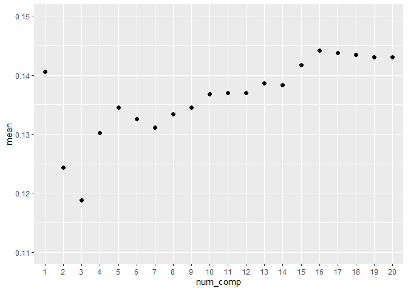
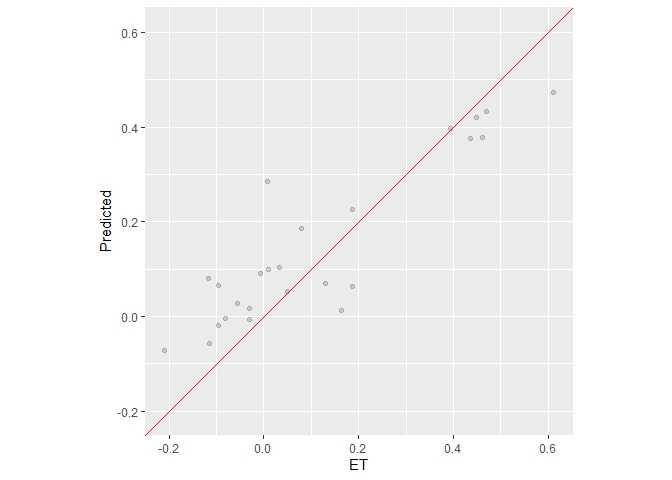
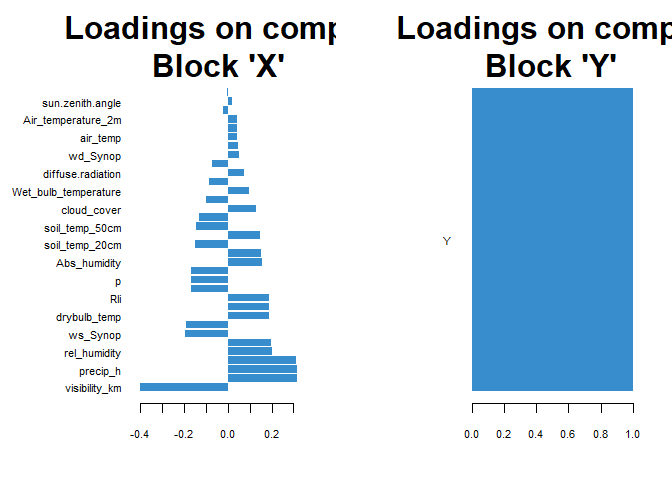
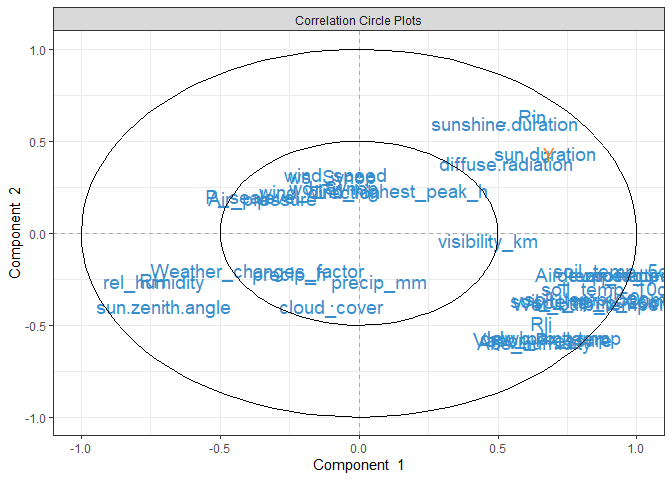
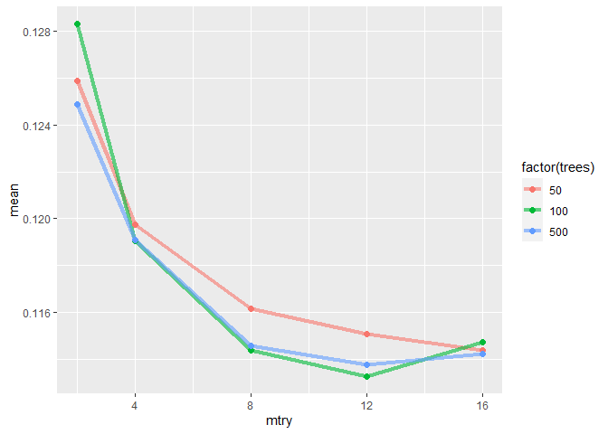
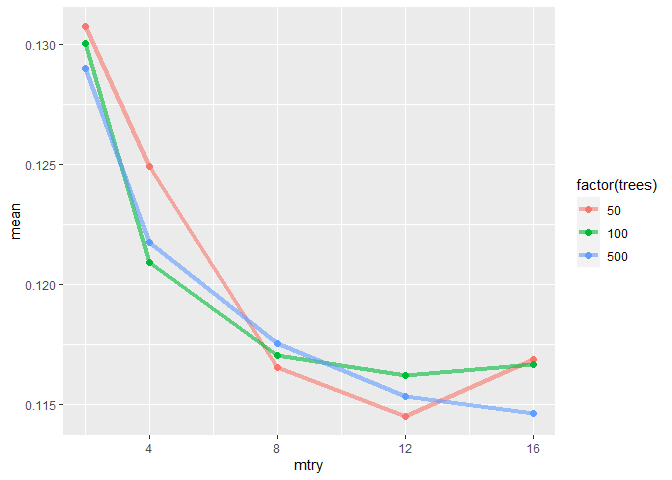
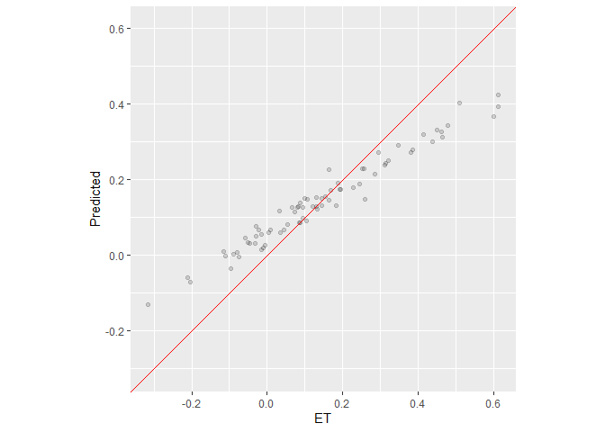
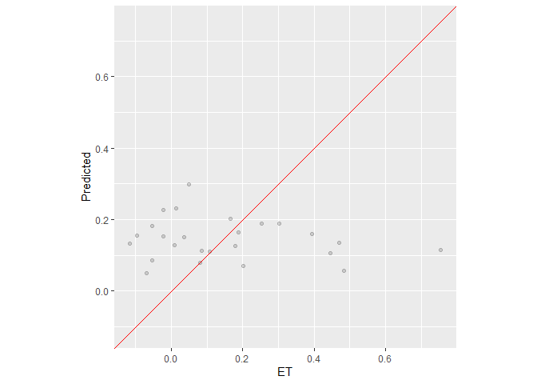
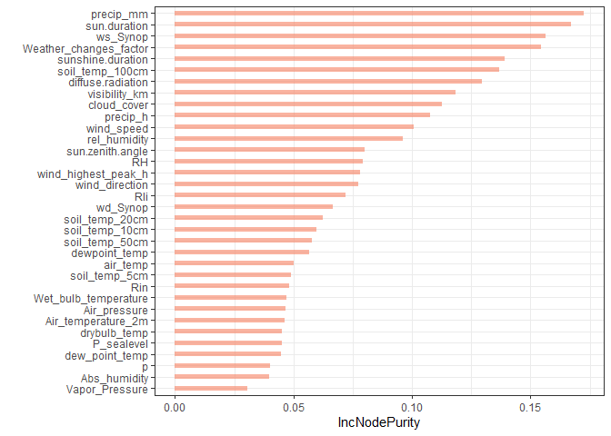

Statistics Course - UWI
================
AlbyDR
2021-04-16

## Example 4.2:Tuning Parameters

``` r
packages_list4 <- c("xts", "water","tidyverse", "lubridate", "vip", "summarytools", "tidymodels",
                      "moderndive", "vip", "kableExtra", "bayesplot", "bayestestR", "plsmod",
                      "rstanarm", "mixOmics", "modelbased", "performance", "see", "randomForest",
                      "MASS", "corrr", "car")
```

new.packages &lt;- packages\_list4\[!(packages\_list4 %in%
installed.packages()\[,“Package”\])\] if(length(new.packages))
install.packages(new.packages) \#’ update.packages &lt;-
packages\_list4\[(packages\_list4 %in% old.packages()\[,“Package”\])\]
if(length(update.packages)) install.packages(update.packages)

``` r
invisible(lapply(packages_list4, library, character.only = T, quietly = TRUE, warn.conflicts = F))
```

    ## 
    ## Attaching package: 'zoo'

    ## The following objects are masked from 'package:base':
    ## 
    ##     as.Date, as.Date.numeric

    ## rgdal: version: 1.5-23, (SVN revision 1121)
    ## Geospatial Data Abstraction Library extensions to R successfully loaded
    ## Loaded GDAL runtime: GDAL 3.2.1, released 2020/12/29
    ## Path to GDAL shared files: C:/Users/Alby Rocha/Documents/R/win-library/4.0/rgdal/gdal
    ## GDAL binary built with GEOS: TRUE 
    ## Loaded PROJ runtime: Rel. 7.2.1, January 1st, 2021, [PJ_VERSION: 721]
    ## Path to PROJ shared files: C:/Users/Alby Rocha/Documents/R/win-library/4.0/rgdal/proj
    ## PROJ CDN enabled: FALSE
    ## Linking to sp version:1.4-5
    ## To mute warnings of possible GDAL/OSR exportToProj4() degradation,
    ## use options("rgdal_show_exportToProj4_warnings"="none") before loading rgdal.
    ## Overwritten PROJ_LIB was C:/Users/Alby Rocha/Documents/R/win-library/4.0/rgdal/proj

    ## -- Attaching packages --------------------------------------- tidyverse 1.3.1 --

    ## v ggplot2 3.3.3     v purrr   0.3.4
    ## v tibble  3.1.0     v dplyr   1.0.5
    ## v tidyr   1.1.3     v stringr 1.4.0
    ## v readr   1.4.0     v forcats 0.5.1

    ## -- Conflicts ------------------------------------------ tidyverse_conflicts() --
    ## x tidyr::extract() masks raster::extract()
    ## x dplyr::filter()  masks stats::filter()
    ## x dplyr::first()   masks xts::first()
    ## x dplyr::lag()     masks stats::lag()
    ## x dplyr::last()    masks xts::last()
    ## x dplyr::select()  masks raster::select()

    ## Registered S3 method overwritten by 'pryr':
    ##   method      from
    ##   print.bytes Rcpp

    ## For best results, restart R session and update pander using devtools:: or remotes::install_github('rapporter/pander')

    ## -- Attaching packages -------------------------------------- tidymodels 0.1.2 --

    ## v broom     0.7.6          v recipes   0.1.15    
    ## v dials     0.0.9          v rsample   0.0.9     
    ## v infer     0.5.4          v tune      0.1.3.9001
    ## v modeldata 0.1.0          v workflows 0.2.2     
    ## v parsnip   0.1.5          v yardstick 0.0.8

    ## -- Conflicts ----------------------------------------- tidymodels_conflicts() --
    ## x scales::discard()    masks purrr::discard()
    ## x tidyr::extract()     masks raster::extract()
    ## x dplyr::filter()      masks stats::filter()
    ## x dplyr::first()       masks xts::first()
    ## x recipes::fixed()     masks stringr::fixed()
    ## x dplyr::lag()         masks stats::lag()
    ## x dplyr::last()        masks xts::last()
    ## x dplyr::select()      masks raster::select()
    ## x yardstick::spec()    masks readr::spec()
    ## x recipes::step()      masks stats::step()
    ## x recipes::update()    masks raster::update(), stats::update()
    ## x summarytools::view() masks tibble::view()

    ## This is bayesplot version 1.8.0

    ## - Online documentation and vignettes at mc-stan.org/bayesplot

    ## - bayesplot theme set to bayesplot::theme_default()

    ##    * Does _not_ affect other ggplot2 plots

    ##    * See ?bayesplot_theme_set for details on theme setting

    ## 
    ## Attaching package: 'Rcpp'

    ## The following object is masked from 'package:rsample':
    ## 
    ##     populate

    ## This is rstanarm version 2.21.1

    ## - See https://mc-stan.org/rstanarm/articles/priors for changes to default priors!

    ## - Default priors may change, so it's safest to specify priors, even if equivalent to the defaults.

    ## - For execution on a local, multicore CPU with excess RAM we recommend calling

    ##   options(mc.cores = parallel::detectCores())

    ## 
    ## Attaching package: 'MASS'

    ## The following object is masked from 'package:dplyr':
    ## 
    ##     select

    ## The following objects are masked from 'package:raster':
    ## 
    ##     area, select

    ## 
    ## Loaded mixOmics 6.14.0
    ## Thank you for using mixOmics!
    ## Tutorials: http://mixomics.org
    ## Bookdown vignette: https://mixomicsteam.github.io/Bookdown
    ## Questions, issues: Follow the prompts at http://mixomics.org/contact-us
    ## Cite us:  citation('mixOmics')

    ## randomForest 4.6-14

    ## Type rfNews() to see new features/changes/bug fixes.

    ## Registered S3 methods overwritten by 'car':
    ##   method                          from
    ##   influence.merMod                lme4
    ##   cooks.distance.influence.merMod lme4
    ##   dfbeta.influence.merMod         lme4
    ##   dfbetas.influence.merMod        lme4

``` r
ETmodel <- read_rds("ETmodel.rds")
#DWD_precipitation <- read_rds("DWD_precipitation.rds")
```

``` r
ETmodel$ETo <- hourlyET(data.frame(wind = na.approx(ETmodel$wind_speed),
                                   RH = na.approx(ETmodel$RH), 
                                   temp = na.approx(ETmodel$air_temp),
                                   radiation = na.approx(ETmodel$Rin), 
                                   height = 81,  elev = 100,
                                   lat = 52.23, long = 13.04, tz = "UTC"), 
                        hours = hour(ymd_hms(ETmodel$timestamp, tz = "UTC")) , 
                        DOY = yday(ymd_hms(ETmodel$timestamp, tz = "UTC")), 
                        ET = "ETo")  
```

``` r
set.seed(999)
linear_reg() %>% set_engine("lm") %>% set_mode("regression") %>%
  fit(ETo ~ rel_humidity + air_temp + wind_speed + Rin, data = ETmodel) %>%
  pluck("fit") %>% get_regression_summaries()
```

    ## # A tibble: 1 x 9
    ##   r_squared adj_r_squared      mse   rmse sigma statistic p_value    df  nobs
    ##       <dbl>         <dbl>    <dbl>  <dbl> <dbl>     <dbl>   <dbl> <dbl> <dbl>
    ## 1     0.961         0.961 0.000748 0.0273 0.027   107749.       0     4 17458

``` r
descr(ETmodel$ETo)
```

    ## Descriptive Statistics  
    ## ETmodel$ETo  
    ## N: 17496  
    ## 
    ##                          ETo
    ## ----------------- ----------
    ##              Mean       0.10
    ##           Std.Dev       0.14
    ##               Min      -0.02
    ##                Q1       0.01
    ##            Median       0.03
    ##                Q3       0.12
    ##               Max       0.69
    ##               MAD       0.04
    ##               IQR       0.11
    ##                CV       1.46
    ##          Skewness       1.81
    ##       SE.Skewness       0.02
    ##          Kurtosis       2.50
    ##           N.Valid   17496.00
    ##         Pct.Valid     100.00

Lets include some measurements error

``` r
ETmodel$ET <- ETmodel$ETo + rnorm(17496, 0, 0.14/1.4)
```

``` r
set.seed(999)
linear_reg() %>% set_engine("lm") %>% set_mode("regression") %>%
  fit(ET ~ rel_humidity + air_temp + wind_speed + Rin, data = ETmodel) %>%
  pluck("fit") %>% get_regression_summaries()
```

    ## # A tibble: 1 x 9
    ##   r_squared adj_r_squared    mse  rmse sigma statistic p_value    df  nobs
    ##       <dbl>         <dbl>  <dbl> <dbl> <dbl>     <dbl>   <dbl> <dbl> <dbl>
    ## 1     0.627         0.627 0.0109 0.104 0.104     7347.       0     4 17458

``` r
set.seed(999)
ETdataS <- 
  ETmodel[,c(-20,-39)] %>%
  select_if(is.numeric) %>%
  drop_na() %>%
  sample_n(100)
```

``` r
summary(ETdataS)
```

    ##     air_temp           RH              p            P_sealevel    
    ##  Min.   :-4.30   Min.   :20.00   Min.   : 977.1   Min.   : 989.3  
    ##  1st Qu.: 5.65   1st Qu.:48.75   1st Qu.: 999.3   1st Qu.:1010.9  
    ##  Median :12.65   Median :70.50   Median :1004.0   Median :1015.9  
    ##  Mean   :13.03   Mean   :67.36   Mean   :1003.9   Mean   :1015.9  
    ##  3rd Qu.:19.15   3rd Qu.:86.25   3rd Qu.:1009.5   3rd Qu.:1022.0  
    ##  Max.   :30.60   Max.   :99.00   Max.   :1022.2   Max.   :1034.5  
    ##    wind_speed    wind_direction     ws_Synop        wd_Synop    
    ##  Min.   :0.700   Min.   : 10.0   Min.   :0.500   Min.   : 10.0  
    ##  1st Qu.:2.500   1st Qu.:127.5   1st Qu.:2.400   1st Qu.:120.0  
    ##  Median :3.700   Median :210.0   Median :3.700   Median :210.0  
    ##  Mean   :3.723   Mean   :194.7   Mean   :3.757   Mean   :194.7  
    ##  3rd Qu.:4.825   3rd Qu.:260.0   3rd Qu.:4.925   3rd Qu.:260.0  
    ##  Max.   :8.300   Max.   :360.0   Max.   :7.900   Max.   :340.0  
    ##  wind_highest_peak_h      Rin              Rli        diffuse.radiation
    ##  Min.   : 1.600      Min.   :  0.00   Min.   :211.1   Min.   :  0.00   
    ##  1st Qu.: 4.900      1st Qu.:  0.00   1st Qu.:304.9   1st Qu.:  0.00   
    ##  Median : 6.700      Median : 69.44   Median :323.6   Median : 50.00   
    ##  Mean   : 6.984      Mean   :193.25   Mean   :328.1   Mean   : 81.11   
    ##  3rd Qu.: 8.725      3rd Qu.:345.13   3rd Qu.:358.3   3rd Qu.:119.44   
    ##  Max.   :16.000      Max.   :813.89   Max.   :405.6   Max.   :347.22   
    ##  sunshine.duration sun.zenith.angle visibility_km    sun.duration  
    ##  Min.   : 0.00     Min.   : 34.07   Min.   :  800   Min.   : 0.00  
    ##  1st Qu.: 0.00     1st Qu.: 59.94   1st Qu.:32750   1st Qu.: 0.00  
    ##  Median : 2.00     Median : 76.66   Median :45670   Median : 0.00  
    ##  Mean   :18.90     Mean   : 78.20   Mean   :42073   Mean   :20.87  
    ##  3rd Qu.:38.25     3rd Qu.: 95.62   3rd Qu.:50000   3rd Qu.:48.25  
    ##  Max.   :60.00     Max.   :146.35   Max.   :75000   Max.   :60.00  
    ##  dewpoint_temp    drybulb_temp    soil_temp_5cm    soil_temp_10cm  
    ##  Min.   :-4.30   Min.   :-8.500   Min.   :-1.000   Min.   :-0.600  
    ##  1st Qu.: 5.65   1st Qu.: 2.050   1st Qu.: 4.075   1st Qu.: 4.825  
    ##  Median :12.65   Median : 6.150   Median :16.100   Median :15.100  
    ##  Mean   :13.03   Mean   : 6.033   Mean   :15.390   Mean   :14.918  
    ##  3rd Qu.:19.15   3rd Qu.:10.025   3rd Qu.:24.250   3rd Qu.:23.600  
    ##  Max.   :30.60   Max.   :19.200   Max.   :36.700   Max.   :33.600  
    ##  soil_temp_20cm  soil_temp_50cm  soil_temp_100cm   Abs_humidity   
    ##  Min.   : 0.20   Min.   : 1.80   Min.   : 3.800   Min.   : 2.600  
    ##  1st Qu.: 5.25   1st Qu.: 5.20   1st Qu.: 6.025   1st Qu.: 5.475  
    ##  Median :16.05   Median :15.55   Median :13.750   Median : 7.200  
    ##  Mean   :14.53   Mean   :14.10   Mean   :13.747   Mean   : 7.486  
    ##  3rd Qu.:22.43   3rd Qu.:20.38   3rd Qu.:19.725   3rd Qu.: 9.150  
    ##  Max.   :30.90   Max.   :26.50   Max.   :23.300   Max.   :16.400  
    ##  Vapor_Pressure   Wet_bulb_temperature  Air_pressure    Air_temperature_2m
    ##  Min.   : 3.200   Min.   :-5.400       Min.   : 977.1   Min.   :-4.30     
    ##  1st Qu.: 7.075   1st Qu.: 4.075       1st Qu.: 999.3   1st Qu.: 5.65     
    ##  Median : 9.450   Median :10.150       Median :1004.0   Median :12.65     
    ##  Mean   : 9.956   Mean   : 9.244       Mean   :1003.9   Mean   :13.03     
    ##  3rd Qu.:12.300   3rd Qu.:14.100       3rd Qu.:1009.5   3rd Qu.:19.15     
    ##  Max.   :22.300   Max.   :19.900       Max.   :1022.2   Max.   :30.60     
    ##   rel_humidity   dew_point_temp     precip_mm        precip_h     cloud_cover  
    ##  Min.   :20.20   Min.   :-8.500   Min.   :0.000   Min.   :0.00   Min.   :-1.0  
    ##  1st Qu.:49.05   1st Qu.: 2.050   1st Qu.:0.000   1st Qu.:0.00   1st Qu.: 3.0  
    ##  Median :70.60   Median : 6.150   Median :0.000   Median :0.00   Median : 6.0  
    ##  Mean   :67.43   Mean   : 6.033   Mean   :0.105   Mean   :0.17   Mean   : 5.1  
    ##  3rd Qu.:86.03   3rd Qu.:10.025   3rd Qu.:0.000   3rd Qu.:0.00   3rd Qu.: 8.0  
    ##  Max.   :98.60   Max.   :19.200   Max.   :7.000   Max.   :1.00   Max.   : 8.0  
    ##  Weather_changes_factor       ET          
    ##  Min.   : -1.00         Min.   :-0.31554  
    ##  1st Qu.: -1.00         1st Qu.:-0.01102  
    ##  Median : -1.00         Median : 0.10433  
    ##  Mean   : 19.32         Mean   : 0.14516  
    ##  3rd Qu.: 11.00         3rd Qu.: 0.25712  
    ##  Max.   :161.00         Max.   : 0.75472

``` r
linear_reg() %>% set_engine("lm") %>% set_mode("regression") %>%
  fit(ET ~ rel_humidity + air_temp + wind_speed + Rin, data = ETdataS) %>%
  pluck("fit") %>% get_regression_summaries()
```

    ## # A tibble: 1 x 9
    ##   r_squared adj_r_squared     mse   rmse sigma statistic p_value    df  nobs
    ##       <dbl>         <dbl>   <dbl>  <dbl> <dbl>     <dbl>   <dbl> <dbl> <dbl>
    ## 1      0.76          0.75 0.00984 0.0992 0.102      75.2       0     4   100

**Tuning a PLSR**

``` r
set.seed(7777)
```

split the data into traing (75%) and testing (25%)

``` r
ET_split <- initial_split(ETdataS, prop = 3/4)
ET_split
```

    ## <Analysis/Assess/Total>
    ## <75/25/100>

extract training and testing sets

``` r
ET_train <- training(ET_split)
ET_test <- testing(ET_split)
```

create CV object from training data

``` r
ET_cv <- vfold_cv(ET_train, repeats = 5)
```

define the recipe

``` r
ET_recipe <- 
  # which consists of the formula (outcome ~ predictors)
  recipe(ET ~ ., data = ETdataS) %>%
  # and some pre-processing steps
  step_nzv(all_predictors()) %>%
  step_center(all_numeric(), -all_outcomes()) %>% 
  step_scale(all_numeric(), -all_outcomes())
```

fix parameter

``` r
pls_spec4 <- plsmod::pls(num_comp = 4, predictor_prop = 1) %>% 
  set_engine("mixOmics") %>% 
  set_mode("regression") 
```

``` r
PLS_wf4 <- workflow() %>% 
  add_model(pls_spec4) %>% 
  add_recipe(ET_recipe) 
```

``` r
pls_fit4 <- PLS_wf4 %>% 
  fit(data = ET_train)
```

``` r
pls_fit4 %>% 
  pull_workflow_fit() %>% 
  tidy()
```

    ## # A tibble: 140 x 4
    ##    term       value type       component
    ##    <chr>      <dbl> <chr>          <dbl>
    ##  1 air_temp  0.240  predictors         1
    ##  2 air_temp -0.0942 predictors         2
    ##  3 air_temp  0.0430 predictors         3
    ##  4 air_temp  0.192  predictors         4
    ##  5 RH       -0.233  predictors         1
    ##  6 RH       -0.0530 predictors         2
    ##  7 RH        0.200  predictors         3
    ##  8 RH       -0.172  predictors         4
    ##  9 p        -0.0876 predictors         1
    ## 10 p         0.0335 predictors         2
    ## # ... with 130 more rows

training accuracy

``` r
ET_pred_train <- predict(pls_fit4, new_data = ET_train)
```

``` r
ET_pred_train <- 
  ET_train %>%
  dplyr::select(ET) %>%
  bind_cols(
    predict(pls_fit4, new_data = ET_train))
```

``` r
ET_pred_train %>% metrics(truth = ET, estimate = .pred) 
```

    ## # A tibble: 3 x 3
    ##   .metric .estimator .estimate
    ##   <chr>   <chr>          <dbl>
    ## 1 rmse    standard      0.101 
    ## 2 rsq     standard      0.726 
    ## 3 mae     standard      0.0817

testing accuracy

``` r
ET_pred_test <-  
  ET_test %>%
  dplyr::select(ET) %>%
  bind_cols(
    predict(pls_fit4, new_data = ET_test))
```

``` r
ET_pred_test %>% metrics(truth = ET, estimate = .pred)
```

    ## # A tibble: 3 x 3
    ##   .metric .estimator .estimate
    ##   <chr>   <chr>          <dbl>
    ## 1 rmse    standard      0.110 
    ## 2 rsq     standard      0.817 
    ## 3 mae     standard      0.0866

**Tuning from a grid PLSR**

``` r
pls_spec_tune <- plsmod::pls(num_comp = tune()) %>% 
  set_mode("regression") %>% 
  set_engine("mixOmics")
```

``` r
comp_grid <- tibble(num_comp = seq(from = 1, to = 20, by = 1))
```

``` r
ctrl <- control_resamples(save_pred = TRUE)
```

``` r
PLS_wf <- workflow() %>% 
  add_model(pls_spec_tune) %>% 
  add_recipe(ET_recipe) 
```

``` r
set.seed(456)
pls_fit <- 
  PLS_wf %>% 
  tune_grid(
    resamples = ET_cv,
    #metrics = metric_set(rmse),
    #control = ctrl,
    grid = comp_grid)
```

``` r
pls_fit %>%
  collect_metrics() %>%
  filter(.metric == "rmse") %>%
  mutate(num_comp = factor(num_comp)) %>%
  ggplot(aes(x = num_comp, y = mean)) +
    geom_point(size = 2) +
    scale_y_continuous(limits = c(0.11, 0.15))
```

<!-- -->

``` r
show_best(pls_fit, metric = "rmse")
```

    ## # A tibble: 5 x 7
    ##   num_comp .metric .estimator  mean     n std_err .config              
    ##      <dbl> <chr>   <chr>      <dbl> <int>   <dbl> <chr>                
    ## 1        3 rmse    standard   0.119    50 0.00430 Preprocessor1_Model03
    ## 2        2 rmse    standard   0.124    50 0.00456 Preprocessor1_Model02
    ## 3        4 rmse    standard   0.130    50 0.00720 Preprocessor1_Model04
    ## 4        7 rmse    standard   0.131    50 0.00726 Preprocessor1_Model07
    ## 5        6 rmse    standard   0.133    50 0.00784 Preprocessor1_Model06

``` r
#show_best(manual_tune, n = 3)
```

``` r
ET_final <- pls_fit %>%
  select_best(metric = "rmse")
```

``` r
ET_final
```

    ## # A tibble: 1 x 2
    ##   num_comp .config              
    ##      <dbl> <chr>                
    ## 1        3 Preprocessor1_Model03

``` r
PLS_wf <- PLS_wf %>%
  finalize_workflow(ET_final)
```

``` r
PLS_wf_final <- PLS_wf %>%
  last_fit(ET_split) # fit on the training set and evaluate on test set
```

``` r
PLS_wf_final %>% collect_metrics()
```

    ## # A tibble: 2 x 4
    ##   .metric .estimator .estimate .config             
    ##   <chr>   <chr>          <dbl> <chr>               
    ## 1 rmse    standard       0.109 Preprocessor1_Model1
    ## 2 rsq     standard       0.812 Preprocessor1_Model1

``` r
PLS_wf_final %>%
  collect_predictions() %>% 
  ggplot(aes(x = ET, y = .pred)) + 
  geom_point(alpha = .15) +
  geom_abline(col = "red") + 
  coord_obs_pred() + 
  ylab("Predicted")
```

<!-- -->

``` r
pls_fit_final <- PLS_wf %>% 
  fit(data = ET_train)
```

variable importance

``` r
pls_fit_final %>%
pull_workflow_fit() -> FItted_plsr
```

``` r
plotLoadings(pls_fit_final$fit$fit$fit, contrib="median", comp = 3)
```

<!-- -->

``` r
plotVar(pls_fit_final$fit$fit$fit)
```

<!-- -->

Imp\_plsr &lt;- tibble(var = rep(names(ETdataS\[,-35\]),3), loadings =
c(data.frame(FItted\_plsr*f**i**t*loadings)*X*.*c**o**m**p*1, *d**a**t**a*.*f**r**a**m**e*(*F**I**t**t**e**d*<sub>*p*</sub>*l**s**r*fit*l**o**a**d**i**n**g**s*)X.comp2,
data.frame(FItted\_plsr*f**i**t*loadings)$X.comp3), comp =
c(rep(1,34),rep(2,34),rep(3,34))) \#’ Imp\_plsr %&gt;% \#mutate(var =
fct\_reorder(var, X1)) %&gt;% ggplot(aes(y = loadings, x = var, fill =
comp)) + geom\_col() + coord\_flip() + xlab("") + theme\_bw()

``` r
descr(ETdataS$Weather_changes_factor)
```

    ## Descriptive Statistics  
    ## ETdataS$Weather_changes_factor  
    ## N: 100  
    ## 
    ##                     Weather_changes_factor
    ## ----------------- ------------------------
    ##              Mean                    19.32
    ##           Std.Dev                    41.97
    ##               Min                    -1.00
    ##                Q1                    -1.00
    ##            Median                    -1.00
    ##                Q3                    12.00
    ##               Max                   161.00
    ##               MAD                     0.00
    ##               IQR                    12.00
    ##                CV                     2.17
    ##          Skewness                     2.04
    ##       SE.Skewness                     0.24
    ##          Kurtosis                     2.90
    ##           N.Valid                   100.00
    ##         Pct.Valid                   100.00

``` r
unique(ETdataS$Weather_changes_factor)
```

    ##  [1]  -1  25 151  60  21 100 110 161 123  17  10  61  14 122  51  66  15   3

weather\_changes\_factor ? This important? take care because this
variable is not ordinal or continuous but there are many unique values.

**Tuning from a grid RF**

``` r
rf_spec_tune <-  rand_forest(
  mode = "regression",
  mtry = tune(),
  trees = tune()) %>%
  set_engine("randomForest")
```

``` r
tree_grid <- expand_grid(mtry = c(2,4,8,12,16), trees = c(50, 100, 500))
```

``` r
ctrl <- control_resamples(save_pred = TRUE)
```

``` r
rf_wf <- workflow() %>%
  add_model(rf_spec_tune) %>% 
  add_recipe(ET_recipe) 
```

``` r
set.seed(456)
rf_fit <- 
  rf_wf %>% 
  tune_grid(
    resamples = ET_cv,
    #metrics = metric_set(rmse),
    #control = ctrl,
    grid = tree_grid)
```

``` r
rf_fit %>% collect_metrics()
```

    ## # A tibble: 30 x 8
    ##     mtry trees .metric .estimator  mean     n std_err .config              
    ##    <dbl> <dbl> <chr>   <chr>      <dbl> <int>   <dbl> <chr>                
    ##  1     2    50 rmse    standard   0.126    50 0.00576 Preprocessor1_Model01
    ##  2     2    50 rsq     standard   0.592    50 0.0310  Preprocessor1_Model01
    ##  3     2   100 rmse    standard   0.128    50 0.00545 Preprocessor1_Model02
    ##  4     2   100 rsq     standard   0.580    50 0.0312  Preprocessor1_Model02
    ##  5     2   500 rmse    standard   0.125    50 0.00560 Preprocessor1_Model03
    ##  6     2   500 rsq     standard   0.606    50 0.0310  Preprocessor1_Model03
    ##  7     4    50 rmse    standard   0.120    50 0.00486 Preprocessor1_Model04
    ##  8     4    50 rsq     standard   0.609    50 0.0324  Preprocessor1_Model04
    ##  9     4   100 rmse    standard   0.119    50 0.00482 Preprocessor1_Model05
    ## 10     4   100 rsq     standard   0.611    50 0.0311  Preprocessor1_Model05
    ## # ... with 20 more rows

``` r
rf_fit %>%
  collect_metrics() %>%
  filter(.metric == "rmse") %>%
  ggplot(aes(mtry, mean, color = factor(trees))) +
  geom_line(size = 1.5, alpha = 0.6) +
  geom_point(size = 2) 
```

<!-- -->

``` r
show_best(rf_fit, metric = "rmse")
```

    ## # A tibble: 5 x 8
    ##    mtry trees .metric .estimator  mean     n std_err .config              
    ##   <dbl> <dbl> <chr>   <chr>      <dbl> <int>   <dbl> <chr>                
    ## 1    12   100 rmse    standard   0.113    50 0.00449 Preprocessor1_Model11
    ## 2    12   500 rmse    standard   0.114    50 0.00449 Preprocessor1_Model12
    ## 3    16   500 rmse    standard   0.114    50 0.00455 Preprocessor1_Model15
    ## 4     8   100 rmse    standard   0.114    50 0.00468 Preprocessor1_Model08
    ## 5    16    50 rmse    standard   0.114    50 0.00465 Preprocessor1_Model13

``` r
rf_final <- rf_fit %>%
  select_best(metric = "rmse")
```

``` r
rf_wf <- rf_wf %>%
  finalize_workflow(rf_final)
```

``` r
rf_wf_final <- rf_wf %>%
  # fit on the training set and evaluate on test set
  last_fit(ET_split)
```

``` r
rf_wf_final %>% collect_metrics()
```

    ## # A tibble: 2 x 4
    ##   .metric .estimator .estimate .config             
    ##   <chr>   <chr>          <dbl> <chr>               
    ## 1 rmse    standard       0.110 Preprocessor1_Model1
    ## 2 rsq     standard       0.842 Preprocessor1_Model1

``` r
rf_wf_final %>% collect_predictions()
```

    ## # A tibble: 25 x 5
    ##    id                 .pred  .row       ET .config             
    ##    <chr>              <dbl> <int>    <dbl> <chr>               
    ##  1 train/test split 0.293       1  0.187   Preprocessor1_Model1
    ##  2 train/test split 0.102      10  0.164   Preprocessor1_Model1
    ##  3 train/test split 0.00880    11  0.0326  Preprocessor1_Model1
    ##  4 train/test split 0.144      13  0.00818 Preprocessor1_Model1
    ##  5 train/test split 0.116      15  0.0802  Preprocessor1_Model1
    ##  6 train/test split 0.378      17  0.469   Preprocessor1_Model1
    ##  7 train/test split 0.0560     21 -0.0807  Preprocessor1_Model1
    ##  8 train/test split 0.0646     31 -0.0955  Preprocessor1_Model1
    ##  9 train/test split 0.0567     34 -0.117   Preprocessor1_Model1
    ## 10 train/test split 0.0470     35 -0.0296  Preprocessor1_Model1
    ## # ... with 15 more rows

fit the final model

``` r
rf_specbest <- rand_forest(
    mode = "regression",
    mtry = 16,
    trees = 500) %>%
  set_engine("randomForest")
```

``` r
rf_best <- workflow() %>% 
  add_model(rf_specbest) %>% 
  add_recipe(ET_recipe)
```

``` r
rf_fitbest <- rf_best %>% 
  fit(data = ET_train)
```

``` r
rf_fitbest
```

    ## == Workflow [trained] ==========================================================
    ## Preprocessor: Recipe
    ## Model: rand_forest()
    ## 
    ## -- Preprocessor ----------------------------------------------------------------
    ## 3 Recipe Steps
    ## 
    ## * step_nzv()
    ## * step_center()
    ## * step_scale()
    ## 
    ## -- Model -----------------------------------------------------------------------
    ## 
    ## Call:
    ##  randomForest(x = maybe_data_frame(x), y = y, ntree = ~500, mtry = min_cols(~16,      x)) 
    ##                Type of random forest: regression
    ##                      Number of trees: 500
    ## No. of variables tried at each split: 16
    ## 
    ##           Mean of squared residuals: 0.01374195
    ##                     % Var explained: 63.34

training accuracy

``` r
ET_train %>%
  dplyr::select(ET) %>%
  bind_cols(predict(rf_fitbest, new_data = ET_train)) %>% 
  metrics(truth = ET, estimate = .pred) 
```

    ## # A tibble: 3 x 3
    ##   .metric .estimator .estimate
    ##   <chr>   <chr>          <dbl>
    ## 1 rmse    standard      0.0492
    ## 2 rsq     standard      0.948 
    ## 3 mae     standard      0.0386

testing accuracy

``` r
ET_test %>%
  dplyr::select(ET) %>%
  bind_cols(predict(rf_fitbest, new_data = ET_test)) %>% 
  metrics(truth = ET, estimate = .pred)
```

    ## # A tibble: 3 x 3
    ##   .metric .estimator .estimate
    ##   <chr>   <chr>          <dbl>
    ## 1 rmse    standard      0.112 
    ## 2 rsq     standard      0.820 
    ## 3 mae     standard      0.0958

``` r
##############################################################################
################ simulate an uncorrelated predictors #########################
##############################################################################
```

data random generation independent of the response variable

``` r
ETdataS %>%
  select_if(is.numeric) %>%
  correlate(use = "pairwise.complete.obs", quiet = TRUE) %>% 
  focus(ET) %>%
  print(n = 35)
```

    ## # A tibble: 34 x 2
    ##    term                         ET
    ##    <chr>                     <dbl>
    ##  1 air_temp                0.632  
    ##  2 RH                     -0.629  
    ##  3 p                      -0.128  
    ##  4 P_sealevel             -0.154  
    ##  5 wind_speed             -0.0622 
    ##  6 wind_direction         -0.110  
    ##  7 ws_Synop               -0.0754 
    ##  8 wd_Synop               -0.0784 
    ##  9 wind_highest_peak_h     0.104  
    ## 10 Rin                     0.824  
    ## 11 Rli                     0.339  
    ## 12 diffuse.radiation       0.564  
    ## 13 sunshine.duration       0.655  
    ## 14 sun.zenith.angle       -0.677  
    ## 15 visibility_km           0.179  
    ## 16 sun.duration            0.628  
    ## 17 dewpoint_temp           0.632  
    ## 18 drybulb_temp            0.284  
    ## 19 soil_temp_5cm           0.616  
    ## 20 soil_temp_10cm          0.528  
    ## 21 soil_temp_20cm          0.456  
    ## 22 soil_temp_50cm          0.439  
    ## 23 soil_temp_100cm         0.424  
    ## 24 Abs_humidity            0.224  
    ## 25 Vapor_Pressure          0.256  
    ## 26 Wet_bulb_temperature    0.535  
    ## 27 Air_pressure           -0.128  
    ## 28 Air_temperature_2m      0.632  
    ## 29 rel_humidity           -0.629  
    ## 30 dew_point_temp          0.284  
    ## 31 precip_mm              -0.00912
    ## 32 precip_h               -0.194  
    ## 33 cloud_cover            -0.295  
    ## 34 Weather_changes_factor -0.283

``` r
set.seed(31)
Mock_ETdataS <- tibble(data.frame(mvrnorm(n = length(ETdataS$ET), 
                                         colMeans(ETdataS[,-35], na.rm = FALSE, dims = 1),
                                         cov(ETdataS[,-35]) )))
```

``` r
Mock_ETdataS$ET <- ETdataS$ET
```

``` r
Mock_ETdataS %>%
  select_if(is.numeric) %>%
  correlate(use = "pairwise.complete.obs", quiet = TRUE) %>% 
  focus(ET) %>%
  print(n = 35)
```

    ## # A tibble: 34 x 2
    ##    term                          ET
    ##    <chr>                      <dbl>
    ##  1 air_temp                0.000789
    ##  2 RH                     -0.00641 
    ##  3 p                      -0.0143  
    ##  4 P_sealevel             -0.0145  
    ##  5 wind_speed              0.0220  
    ##  6 wind_direction         -0.119   
    ##  7 ws_Synop                0.0246  
    ##  8 wd_Synop               -0.144   
    ##  9 wind_highest_peak_h     0.0401  
    ## 10 Rin                     0.0299  
    ## 11 Rli                     0.0377  
    ## 12 diffuse.radiation       0.130   
    ## 13 sunshine.duration       0.0404  
    ## 14 sun.zenith.angle       -0.0837  
    ## 15 visibility_km          -0.0197  
    ## 16 sun.duration            0.0511  
    ## 17 dewpoint_temp           0.000789
    ## 18 drybulb_temp            0.0466  
    ## 19 soil_temp_5cm          -0.0183  
    ## 20 soil_temp_10cm         -0.00206 
    ## 21 soil_temp_20cm          0.0119  
    ## 22 soil_temp_50cm          0.0295  
    ## 23 soil_temp_100cm         0.0322  
    ## 24 Abs_humidity            0.0526  
    ## 25 Vapor_Pressure          0.0487  
    ## 26 Wet_bulb_temperature    0.0205  
    ## 27 Air_pressure           -0.0143  
    ## 28 Air_temperature_2m      0.000789
    ## 29 rel_humidity           -0.00819 
    ## 30 dew_point_temp          0.0466  
    ## 31 precip_mm              -0.0385  
    ## 32 precip_h               -0.0449  
    ## 33 cloud_cover             0.118   
    ## 34 Weather_changes_factor -0.0908

``` r
set.seed(7777)
```

split the data into training (75%) and testing (25%)

``` r
ET_splitS <- initial_split(Mock_ETdataS, prop = 3/4)
ET_trainS <- training(ET_splitS)
ET_testS <- testing(ET_splitS)
```

``` r
ET_recipeS <- 
  # which consists of the formula (outcome ~ predictors)
  recipe(ET ~ ., data = Mock_ETdataS)
```

``` r
ET_cv <- vfold_cv(ET_train, v = 5, repeats = 1)
```

``` r
rf_wfS <- workflow() %>%
  add_model(rf_spec_tune) %>% 
  add_recipe(ET_recipeS) 
```

``` r
set.seed(456)
rf_fitS <- 
  rf_wfS %>% 
  tune_grid(
    resamples = ET_cv,
    grid = tree_grid)
```

``` r
rf_fitS %>% collect_metrics()
```

    ## # A tibble: 30 x 8
    ##     mtry trees .metric .estimator  mean     n std_err .config              
    ##    <dbl> <dbl> <chr>   <chr>      <dbl> <int>   <dbl> <chr>                
    ##  1     2    50 rmse    standard   0.131     5 0.00464 Preprocessor1_Model01
    ##  2     2    50 rsq     standard   0.576     5 0.0586  Preprocessor1_Model01
    ##  3     2   100 rmse    standard   0.130     5 0.00523 Preprocessor1_Model02
    ##  4     2   100 rsq     standard   0.581     5 0.0726  Preprocessor1_Model02
    ##  5     2   500 rmse    standard   0.129     5 0.00573 Preprocessor1_Model03
    ##  6     2   500 rsq     standard   0.597     5 0.0744  Preprocessor1_Model03
    ##  7     4    50 rmse    standard   0.125     5 0.00578 Preprocessor1_Model04
    ##  8     4    50 rsq     standard   0.605     5 0.0738  Preprocessor1_Model04
    ##  9     4   100 rmse    standard   0.121     5 0.00493 Preprocessor1_Model05
    ## 10     4   100 rsq     standard   0.636     5 0.0754  Preprocessor1_Model05
    ## # ... with 20 more rows

``` r
rf_finalS <- rf_fitS %>%
  select_best(metric = "rmse")
```

``` r
rf_fitS %>%
  collect_metrics() %>%
  filter(.metric=="rmse") %>%
  ggplot(aes(mtry, mean, color = factor(trees))) +
  geom_line(size = 1.5, alpha = 0.6) +
  geom_point(size = 2) 
```

<!-- -->

``` r
rf_wfS %>%
  finalize_workflow(rf_finalS) %>%
  last_fit(ET_split) %>% collect_metrics()
```

    ## # A tibble: 2 x 4
    ##   .metric .estimator .estimate .config             
    ##   <chr>   <chr>          <dbl> <chr>               
    ## 1 rmse    standard       0.110 Preprocessor1_Model1
    ## 2 rsq     standard       0.853 Preprocessor1_Model1

fit the final model

``` r
rf_specbest <- rand_forest(
  mode = "regression",
  mtry = 16,
  trees = 500) %>%
  set_engine("randomForest")
```

``` r
rf_bestS <- workflow() %>% 
  add_model(rf_specbest) %>% 
  add_recipe(ET_recipeS)
```

``` r
rf_fitbestS <- rf_bestS %>% 
  fit(data = ET_trainS)
```

``` r
rf_fitbestS
```

    ## == Workflow [trained] ==========================================================
    ## Preprocessor: Recipe
    ## Model: rand_forest()
    ## 
    ## -- Preprocessor ----------------------------------------------------------------
    ## 0 Recipe Steps
    ## 
    ## -- Model -----------------------------------------------------------------------
    ## 
    ## Call:
    ##  randomForest(x = maybe_data_frame(x), y = y, ntree = ~500, mtry = min_cols(~16,      x)) 
    ##                Type of random forest: regression
    ##                      Number of trees: 500
    ## No. of variables tried at each split: 16
    ## 
    ##           Mean of squared residuals: 0.04564457
    ##                     % Var explained: -16.35

training accuracy

``` r
ET_trainS %>%
  dplyr::select(ET) %>%
  bind_cols(predict(rf_fitbestS, new_data = ET_trainS)) %>% 
  metrics(truth = ET, estimate = .pred)
```

    ## # A tibble: 3 x 3
    ##   .metric .estimator .estimate
    ##   <chr>   <chr>          <dbl>
    ## 1 rmse    standard      0.0852
    ## 2 rsq     standard      0.963 
    ## 3 mae     standard      0.0672

``` r
ET_trainS %>%
  dplyr::select(ET) %>%
  bind_cols(predict(rf_fitbestS, new_data = ET_trainS)) %>% 
  ggplot(aes(x = ET, y = .pred)) + 
  geom_point(alpha = .15) +
  geom_abline(col = "red") + 
  coord_obs_pred() + 
  ylab("Predicted")
```

<!-- -->

training accuracy

``` r
ET_testS %>%
  dplyr::select(ET) %>%
  bind_cols(predict(rf_fitbestS, new_data = ET_testS)) %>% 
  metrics(truth = ET, estimate = .pred) 
```

    ## # A tibble: 3 x 3
    ##   .metric .estimator .estimate
    ##   <chr>   <chr>          <dbl>
    ## 1 rmse    standard      0.233 
    ## 2 rsq     standard      0.0342
    ## 3 mae     standard      0.182

``` r
ET_testS %>%
  dplyr::select(ET) %>%
  bind_cols(predict(rf_fitbestS, new_data = ET_testS)) %>% 
  ggplot(aes(x = ET, y = .pred)) + 
  geom_point(alpha = .15) +
  geom_abline(col = "red") + 
  coord_obs_pred() + 
  ylab("Predicted")
```

<!-- -->

variable importance

``` r
VIP_rf <- pull_workflow_fit(rf_fitbestS)$fit
```

``` r
Imp_rf <- data.frame(unlist(VIP_rf$importance))
Imp_rf$var <- names(data.frame(t(VIP_rf$importance)))
```

``` r
Imp_rf %>%
  mutate(var = fct_reorder(var, IncNodePurity)) %>%
  ggplot(aes(y = IncNodePurity, x = var)) + 
  geom_bar(stat="identity", fill="#f68060", alpha=.6, width=.4) +
  coord_flip() +
  xlab("") +
  theme_bw()
```

<!-- -->

``` r
correlate(ETdataS[,-35]) %>%
  print(n = 34)
```

    ## 
    ## Correlation method: 'pearson'
    ## Missing treated using: 'pairwise.complete.obs'

    ## # A tibble: 34 x 35
    ##    term  air_temp      RH        p P_sealevel wind_speed wind_direction ws_Synop
    ##    <chr>    <dbl>   <dbl>    <dbl>      <dbl>      <dbl>          <dbl>    <dbl>
    ##  1 air_~  NA      -0.771  -0.194      -0.235     -0.200         -0.219  -0.217  
    ##  2 RH     -0.771  NA       0.102       0.133      0.0367         0.270   0.0354 
    ##  3 p      -0.194   0.102  NA           0.999     -0.114          0.101  -0.124  
    ##  4 P_se~  -0.235   0.133   0.999      NA         -0.104          0.108  -0.113  
    ##  5 wind~  -0.200   0.0367 -0.114      -0.104     NA              0.215   0.946  
    ##  6 wind~  -0.219   0.270   0.101       0.108      0.215         NA       0.234  
    ##  7 ws_S~  -0.217   0.0354 -0.124      -0.113      0.946          0.234  NA      
    ##  8 wd_S~  -0.192   0.241   0.0438      0.0509     0.226          0.983   0.233  
    ##  9 wind~   0.0399 -0.153  -0.241      -0.239      0.886          0.214   0.817  
    ## 10 Rin     0.475  -0.533   0.0438      0.0231    -0.113         -0.0725 -0.133  
    ## 11 Rli     0.729  -0.328  -0.285      -0.315     -0.138         -0.170  -0.161  
    ## 12 diff~   0.356  -0.321  -0.159      -0.173      0.0253         0.0386  0.00175
    ## 13 suns~   0.429  -0.505   0.155       0.136     -0.185         -0.109  -0.188  
    ## 14 sun.~  -0.548   0.485  -0.00445     0.0196     0.0879         0.0511  0.140  
    ## 15 visi~   0.464  -0.571  -0.0221     -0.0424     0.0635         0.0247  0.0678 
    ## 16 sun.~   0.566  -0.612   0.104       0.0787    -0.178         -0.113  -0.204  
    ## 17 dewp~   1      -0.771  -0.194      -0.235     -0.200         -0.219  -0.217  
    ## 18 dryb~   0.706  -0.119  -0.210      -0.240     -0.278         -0.0413 -0.308  
    ## 19 soil~   0.972  -0.779  -0.175      -0.216     -0.187         -0.219  -0.212  
    ## 20 soil~   0.953  -0.722  -0.162      -0.201     -0.209         -0.225  -0.233  
    ## 21 soil~   0.912  -0.637  -0.127      -0.166     -0.244         -0.224  -0.268  
    ## 22 soil~   0.833  -0.520  -0.0749     -0.111     -0.270         -0.208  -0.300  
    ## 23 soil~   0.796  -0.461  -0.0619     -0.0965    -0.273         -0.187  -0.309  
    ## 24 Abs_~   0.637  -0.0492 -0.207      -0.234     -0.251         -0.0157 -0.289  
    ## 25 Vapo~   0.676  -0.102  -0.212      -0.241     -0.250         -0.0291 -0.287  
    ## 26 Wet_~   0.952  -0.555  -0.219      -0.259     -0.246         -0.158  -0.274  
    ## 27 Air_~  -0.194   0.102   1           0.999     -0.114          0.101  -0.124  
    ## 28 Air_~   1      -0.771  -0.194      -0.235     -0.200         -0.219  -0.217  
    ## 29 rel_~  -0.770   1.00    0.102       0.133      0.0351         0.270   0.0345 
    ## 30 dew_~   0.706  -0.119  -0.210      -0.240     -0.278         -0.0413 -0.308  
    ## 31 prec~   0.0729  0.148  -0.0941     -0.0972    -0.111          0.0626 -0.219  
    ## 32 prec~  -0.260   0.442  -0.283      -0.270      0.146          0.0722  0.126  
    ## 33 clou~  -0.123   0.330  -0.301      -0.294      0.118          0.150   0.110  
    ## 34 Weat~  -0.270   0.413  -0.292      -0.278      0.0146         0.0274  0.0137 
    ## # ... with 27 more variables: wd_Synop <dbl>, wind_highest_peak_h <dbl>,
    ## #   Rin <dbl>, Rli <dbl>, diffuse.radiation <dbl>, sunshine.duration <dbl>,
    ## #   sun.zenith.angle <dbl>, visibility_km <dbl>, sun.duration <dbl>,
    ## #   dewpoint_temp <dbl>, drybulb_temp <dbl>, soil_temp_5cm <dbl>,
    ## #   soil_temp_10cm <dbl>, soil_temp_20cm <dbl>, soil_temp_50cm <dbl>,
    ## #   soil_temp_100cm <dbl>, Abs_humidity <dbl>, Vapor_Pressure <dbl>,
    ## #   Wet_bulb_temperature <dbl>, Air_pressure <dbl>, Air_temperature_2m <dbl>,
    ## #   rel_humidity <dbl>, dew_point_temp <dbl>, precip_mm <dbl>, precip_h <dbl>,
    ## #   cloud_cover <dbl>, Weather_changes_factor <dbl>

``` r
set.seed(123)
linear_reg() %>% set_engine("lm") %>% set_mode("regression") %>%
  fit(ET ~ ., data = ET_train) %>%
  pluck("fit") -> lm_test
```

``` r
lm_test
```

    ## 
    ## Call:
    ## stats::lm(formula = ET ~ ., data = data)
    ## 
    ## Coefficients:
    ##            (Intercept)                air_temp                      RH  
    ##              4.564e+00               6.488e-02               5.350e-03  
    ##                      p              P_sealevel              wind_speed  
    ##              1.199e+00              -1.190e+00               4.568e-02  
    ##         wind_direction                ws_Synop                wd_Synop  
    ##              8.662e-04              -4.034e-02              -8.027e-04  
    ##    wind_highest_peak_h                     Rin                     Rli  
    ##              4.643e-03               8.653e-04              -4.809e-04  
    ##      diffuse.radiation       sunshine.duration        sun.zenith.angle  
    ##              2.759e-04              -6.429e-05               3.466e-03  
    ##          visibility_km            sun.duration           dewpoint_temp  
    ##             -9.478e-07              -1.108e-03                      NA  
    ##           drybulb_temp           soil_temp_5cm          soil_temp_10cm  
    ##              1.580e-02              -1.600e-02               5.801e-02  
    ##         soil_temp_20cm          soil_temp_50cm         soil_temp_100cm  
    ##             -5.414e-02               2.767e-02              -2.193e-02  
    ##           Abs_humidity          Vapor_Pressure    Wet_bulb_temperature  
    ##              6.448e-01              -4.358e-01              -1.504e-01  
    ##           Air_pressure      Air_temperature_2m            rel_humidity  
    ##                     NA                      NA               1.846e-03  
    ##         dew_point_temp               precip_mm                precip_h  
    ##                     NA              -2.597e-02               1.024e-01  
    ##            cloud_cover  Weather_changes_factor  
    ##             -7.407e-03              -1.706e-03

Test Multicolinearity

``` r
# vif(lm_test)
```

Error in vif.default(lm\_test) : there are aliased coefficients in the
model In other words some variables are linear combination of other.

``` r
vif(lm(ET ~ ., data = ET_train[,c(-17,-26,-27,-28,-29,-30,-31,-32,-33,-34)]))
```

    ##            air_temp                  RH                   p          P_sealevel 
    ##        5.638618e+02        7.620905e+01        1.059536e+05        1.094161e+05 
    ##          wind_speed      wind_direction            ws_Synop            wd_Synop 
    ##        2.325900e+01        4.908872e+01        1.148821e+01        4.958210e+01 
    ## wind_highest_peak_h                 Rin                 Rli   diffuse.radiation 
    ##        1.299142e+01        2.026209e+01        7.253854e+00        4.160728e+00 
    ##   sunshine.duration    sun.zenith.angle       visibility_km        sun.duration 
    ##        1.000929e+01        6.820677e+00        3.533221e+00        6.258700e+00 
    ##        drybulb_temp       soil_temp_5cm      soil_temp_10cm      soil_temp_20cm 
    ##        1.670480e+02        1.122862e+03        3.626170e+03        2.492270e+03 
    ##      soil_temp_50cm     soil_temp_100cm        Abs_humidity      Vapor_Pressure 
    ##        6.997293e+02        1.134188e+02        4.920994e+03        4.644891e+03

many variables are far higher than 10,
