Statistics Course - UWI
================
AlbyDR
2021-04-14

## Example 5.2:EVA - Extreme Values Events

``` r
suppressPackageStartupMessages({
  library(extRemes)
  library(tidyverse)     # ggplot, readr and dplyr packages
  library(lubridate)     # date-time
  })  
```

    ## Warning: package 'extRemes' was built under R version 4.0.5

    ## Warning: package 'tidyr' was built under R version 4.0.5

    ## Warning: package 'dplyr' was built under R version 4.0.5

    ## Warning: package 'lubridate' was built under R version 4.0.5

``` r
DWD_temperature <- read_rds("DWD_temperature.rds")
DWD_precipitation <- read_rds("DWD_precipitation.rds")
```

**Block Maxima Approach**

``` r
DWD_temperature[,1:2] %>%
  filter(year(timestamp) >= 1900) %>%
  group_by(Year = year(timestamp), doy = yday(timestamp)) %>%
  summarise(Tmax = max(air_temp, na.rm = T)) %>%
  print(n=10) -> Max_tempday
```

    ## `summarise()` has grouped output by 'Year'. You can override using the `.groups` argument.

    ## # A tibble: 44,195 x 3
    ## # Groups:   Year [121]
    ##     Year   doy  Tmax
    ##    <dbl> <dbl> <dbl>
    ##  1  1900     1   2.5
    ##  2  1900     2   1.9
    ##  3  1900     3   7  
    ##  4  1900     4   8.1
    ##  5  1900     5   3.7
    ##  6  1900     6   0.3
    ##  7  1900     7  -0.9
    ##  8  1900     8  -0.1
    ##  9  1900     9   2.5
    ## 10  1900    10   3.8
    ## # ... with 44,185 more rows

``` r
bmTempday <- blockmaxxer(Max_tempday, blocks = Max_tempday$doy, which = "Tmax")
summary(bmTempday)
```

    ##       Year           doy              Tmax      
    ##  Min.   :1900   Min.   :  1.00   Min.   : 9.30  
    ##  1st Qu.:1943   1st Qu.: 92.25   1st Qu.:15.50  
    ##  Median :1980   Median :183.50   Median :24.50  
    ##  Mean   :1972   Mean   :183.50   Mean   :24.12  
    ##  3rd Qu.:2005   3rd Qu.:274.75   3rd Qu.:32.50  
    ##  Max.   :2020   Max.   :366.00   Max.   :38.60

``` r
plot(bmTempday$doy, bmTempday$Tmax, col = "white", pch = 21, bg = "darkred", cex=1.5)
```

<!-- -->

``` r
GEV_temp_day <- fevd(bmTempday$Tmax, type='GEV')
GEV_temp_day
```

    ## 
    ## fevd(x = bmTempday$Tmax, type = "GEV")
    ## 
    ## [1] "Estimation Method used: MLE"
    ## 
    ## 
    ##  Negative Log-Likelihood Value:  1290.355 
    ## 
    ## 
    ##  Estimated parameters:
    ##   location      scale      shape 
    ## 22.3447723  9.6532729 -0.5806074 
    ## 
    ##  Standard Error Estimates:
    ##   location      scale      shape 
    ## 0.54603731 0.46275834 0.03799477 
    ## 
    ##  Estimated parameter covariance matrix.
    ##              location       scale        shape
    ## location  0.298156744 -0.07565872 -0.007830146
    ## scale    -0.075658716  0.21414529 -0.012416963
    ## shape    -0.007830146 -0.01241696  0.001443603
    ## 
    ##  AIC = 2586.71 
    ## 
    ##  BIC = 2598.418

``` r
ci(GEV_temp_day, alpha=0.05, type="parameter")
```

    ## fevd(x = bmTempday$Tmax, type = "GEV")
    ## 
    ## [1] "Normal Approx."
    ## 
    ##          95% lower CI   Estimate 95% upper CI
    ## location   21.2745588 22.3447723    23.414986
    ## scale       8.7462832  9.6532729    10.560263
    ## shape      -0.6550758 -0.5806074    -0.506139

``` r
plot(GEV_temp_day)
```

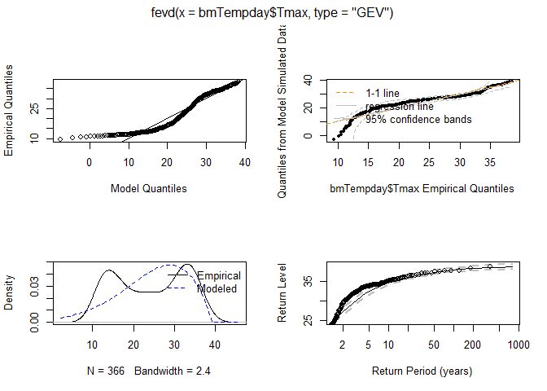<!-- -->

``` r
# plot(GEV_temp_day, "trace")
```

``` r
threshrange.plot(bmTempday$Tmax, r = c(28, 36), type = "GP", nint = 20)
```

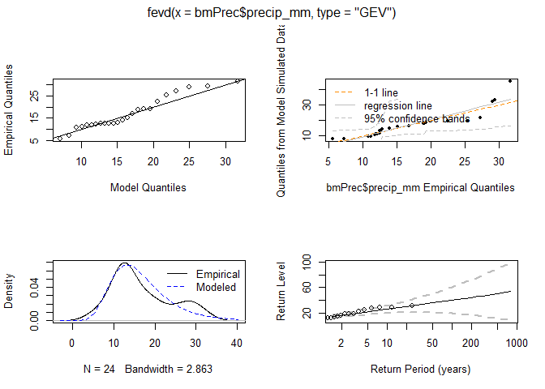<!-- -->

``` r
GP_temp_day <- fevd(x = bmTempday$Tmax, threshold = 33.5, type = "GP", span = 62,
                    units = "deg C", time.units = "5/year")
```

``` r
ci(GP_temp_day, alpha=0.05, type="parameter")
```

    ## fevd(x = bmTempday$Tmax, threshold = 33.5, type = "GP", span = 62, 
    ##     units = "deg C", time.units = "5/year")
    ## 
    ## [1] "Normal Approx."
    ## 
    ##       95% lower CI  Estimate 95% upper CI
    ## scale    1.7094119  2.428395    3.1473785
    ## shape   -0.6378906 -0.427937   -0.2179835

``` r
plot(GP_temp_day)
```

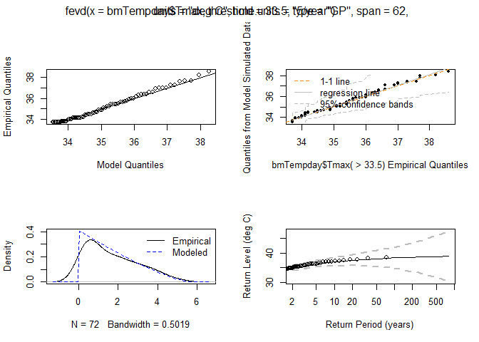<!-- -->

estimates of the auto-tail dependence function(s) (atdf) based on either
chi (rho) or chibar (rhobar), or both.

``` r
atdf(bmTempday$Tmax, 0.90)
```

<!-- -->

The extremal index is a useful indicator of how much clustering of
exceedances of a threshold occurs in the limit of the distribution. For
independent data, theta = 1, (though the converse is does not hold) and
if theta &lt; 1, then there is some dependency (clustering) in the
limit.

``` r
extremalindex(bmTempday$Tmax, threshold = 20, method = "runs", run.length = 10, blocks=Max_temp$Year)
```

    ## 
    ##  Runs Estimator for the Extremal Index
    ##     extremal.index number.of.clusters         run.length 
    ##        0.004444444        1.000000000       10.000000000

Decluster data above a given threshold to try to make them independent.

``` r
dcTemp_day <- decluster(bmTempday$Tmax, 20, r = 10)
plot(dcTemp_day)
```

<!-- -->

The Block Maxima option takes the maxima of one variable over blocks
defined by another variable where both are columns of the same data
frame usually, a column containing the years is used for the blocks so
that annual maxima are taken

``` r
DWD_temperature[,1:2] %>%
  filter(year(timestamp) >= 1900) %>%
  group_by(Year = year(timestamp)) %>%
  summarise(Tmax = max(air_temp, na.rm = T)) -> Max_temp
```

estimates of the auto-tail dependence function(s) (atdf) based on either
chi (rho) or chibar (rhobar), or both.

``` r
atdf(Max_temp$Tmax, 0.90)
```

<!-- -->

The extremal index is a useful indicator of how much clustering of
exceedances of a threshold occurs in the limit of the distribution. For
independent data, theta = 1, (though the converse is does not hold) and
if theta &lt; 1, then there is some dependency (clustering) in the
limit.

``` r
extremalindex(Max_temp$Tmax, threshold = 30, method = "runs", run.length = 9, blocks=Max_temp$Year)
```

    ## 
    ##  Runs Estimator for the Extremal Index
    ##     extremal.index number.of.clusters         run.length 
    ##         0.00862069         1.00000000         9.00000000

Decluster data above a given threshold to try to make them independent.

``` r
dcTemp_year <- decluster(Max_temp$Tmax, 30, r = 9)
plot(dcTemp_year)
```

<!-- -->

``` r
DWD_temperature <- filter(DWD_temperature, year(timestamp) >= 1900)
```

``` r
bmTemp <- blockmaxxer(DWD_temperature[,1:2], blocks = year(DWD_temperature$timestamp), which = "air_temp")
bmTemp <- filter(bmTemp, !is.na(air_temp))
```

estimates of the auto-tail dependence function(s) (atdf) based on either
chi (rho) or chibar (rhobar), or both.

``` r
atdf(bmTemp$air_temp, 0.90)
```

<!-- -->

The extremal index is a useful indicator of how much clustering of
exceedances of a threshold occurs in the limit of the distribution. For
independent data, theta = 1, (though the converse is does not hold) and
if theta &lt; 1, then there is some dependency (clustering) in the
limit.

``` r
extremalindex(bmTemp$air_temp, threshold = 20, method = "runs", run.length = 10, blocks=Max_temp$Year)
```

    ## 
    ##  Runs Estimator for the Extremal Index
    ##     extremal.index number.of.clusters         run.length 
    ##        0.008403361        1.000000000       10.000000000

Decluster data above a given threshold to try to make them independent.

``` r
dcTemp_year <- decluster(Max_temp$Tmax, 35, r = 9)
plot(dcTemp_year)
```

<!-- -->

``` r
summary(bmTemp)
```

    ##    timestamp                      air_temp    
    ##  Min.   :1900-07-21 13:00:00   Min.   :29.50  
    ##  1st Qu.:1930-01-12 01:30:00   1st Qu.:32.10  
    ##  Median :1960-08-27 15:00:00   Median :33.60  
    ##  Mean   :1960-06-26 00:45:53   Mean   :33.55  
    ##  3rd Qu.:1990-02-09 04:00:00   3rd Qu.:34.95  
    ##  Max.   :2020-08-09 15:00:00   Max.   :38.20

``` r
summary(Max_temp)
```

    ##       Year           Tmax      
    ##  Min.   :1900   Min.   :29.50  
    ##  1st Qu.:1930   1st Qu.:32.10  
    ##  Median :1960   Median :33.60  
    ##  Mean   :1960   Mean   :33.59  
    ##  3rd Qu.:1990   3rd Qu.:35.00  
    ##  Max.   :2020   Max.   :38.60

``` r
plot(Max_temp$Year, Max_temp$Tmax, xlab = "Year",
     ylab = "precip_mm", cex = 1.25,
     cex.lab = 1.25, col = "darkblue", bg = "lightblue", pch = 21)
```

<!-- -->

``` r
qqnorm(Max_temp$Tmax, cex.lab = 1.25)
```

<!-- -->

``` r
plot(year(bmTemp$timestamp), bmTemp$air_temp, xlab = "Year",
     ylab = "precip_mm", cex = 1.25,
     cex.lab = 1.25, col = "darkblue", bg = "lightblue", pch = 21)
```

<!-- -->

``` r
qqnorm(bmTemp$air_temp, cex.lab = 1.25)
```

<!-- -->

``` r
plot(Max_temp$Year, log(Max_temp$Tmax), xlab = "Year",
     ylab = "log(precip_mm)", cex = 1.25,
     cex.lab = 1.25, col = "darkblue", bg = "lightblue", pch = 21)
```

<!-- -->

``` r
qqnorm(log(Max_temp$Tmax), cex.lab = 1.25)
```

<!-- -->

Select a threshold for daily data from above.

``` r
threshrange.plot(Max_temp$Tmax, r = c(28,38), nint=10)
```

    ## Warning in log(z): NaNs produced

    ## Warning in log(z): NaNs produced

    ## Warning in log(z): NaNs produced

    ## Warning in log(z): NaNs produced

<!-- -->

``` r
mrlplot(Max_temp$Tmax)
```

<!-- -->

``` r
plot(year(bmTemp$timestamp), bmTemp$air_temp, col = "white", pch = 21, bg = "darkred", cex=1.5)
```

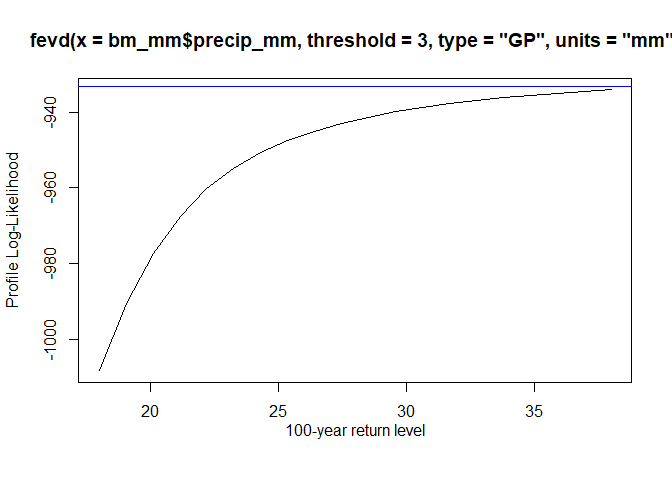<!-- -->

estimates of the auto-tail dependence function(s) (atdf) based on either
chi (rho) or chibar (rhobar), or both.

``` r
atdf(Max_temp$Tmax, 0.90)
```

<!-- -->

The extremal index is a useful indicator of how much clustering of
exceedances of a threshold occurs in the limit of the distribution. For
independent data, theta = 1, (though the converse is does not hold) and
if theta &lt; 1, then there is some dependency (clustering) in the
limit.

``` r
extremalindex(Max_temp$Tmax, threshold = 30, method = "runs", run.length = 9, blocks=Max_temp$Year)
```

    ## 
    ##  Runs Estimator for the Extremal Index
    ##     extremal.index number.of.clusters         run.length 
    ##         0.00862069         1.00000000         9.00000000

Decluster data above a given threshold to try to make them independent.

``` r
dcTemp_year <- decluster(Max_temp$Tmax, 30, r = 9)
plot(dcTemp_year)
```

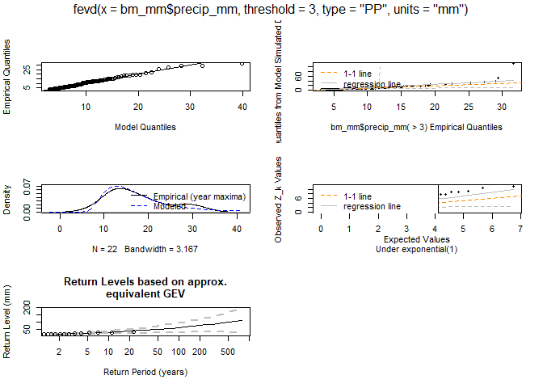<!-- -->

Fit a GEV distribution to annual maximum temperature

``` r
GEV_temp_year <- fevd(bmTemp$air_temp, type='GEV', units = "deg C")
```

``` r
GEV_temp_year
```

    ## 
    ## fevd(x = bmTemp$air_temp, type = "GEV", units = "deg C")
    ## 
    ## [1] "Estimation Method used: MLE"
    ## 
    ## 
    ##  Negative Log-Likelihood Value:  248.7357 
    ## 
    ## 
    ##  Estimated parameters:
    ##   location      scale      shape 
    ## 32.8469232  1.9407510 -0.2717893 
    ## 
    ##  Standard Error Estimates:
    ##   location      scale      shape 
    ## 0.19858515 0.14284312 0.06610419 
    ## 
    ##  Estimated parameter covariance matrix.
    ##              location        scale        shape
    ## location  0.039436063  0.001928014 -0.005327589
    ## scale     0.001928014  0.020404158 -0.005543709
    ## shape    -0.005327589 -0.005543709  0.004369764
    ## 
    ##  AIC = 503.4714 
    ## 
    ##  BIC = 511.8088

``` r
ci(GEV_temp_year, alpha=0.05, type="parameter")
```

    ## fevd(x = bmTemp$air_temp, type = "GEV", units = "deg C")
    ## 
    ## [1] "Normal Approx."
    ## 
    ##          95% lower CI   Estimate 95% upper CI
    ## location   32.4577034 32.8469232   33.2361429
    ## scale       1.6607836  1.9407510    2.2207183
    ## shape      -0.4013512 -0.2717893   -0.1422275

``` r
plot(GEV_temp_year)
```

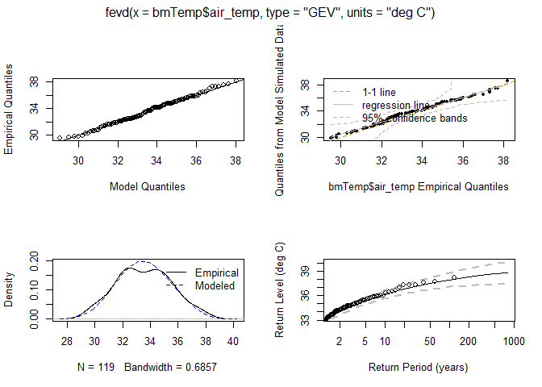<!-- -->

``` r
#plot(GEV_temp_year, "trace")
```

``` r
return.level(GEV_temp_year, return.period=c(2,5,10,20,30,50,100), do.ci=TRUE)
```

    ## fevd(x = bmTemp$air_temp, type = "GEV", units = "deg C")
    ## 
    ## [1] "Normal Approx."
    ## 
    ##                       95% lower CI Estimate 95% upper CI
    ## 2-year return level       33.12440 33.52395     33.92350
    ## 5-year return level       34.81398 35.23761     35.66124
    ## 10-year return level      35.65610 36.11400     36.57189
    ## 20-year return level      36.26186 36.80230     37.34274
    ## 30-year return level      36.53069 37.14136     37.75203
    ## 50-year return level      36.79908 37.51490     38.23072
    ## 100-year return level     37.06586 37.94229     38.81873

**Gumbel**

``` r
Gumbel_temp <- fevd(bmTemp$air_temp, type="Gumbel", units="deg C")
Gumbel_temp
```

    ## 
    ## fevd(x = bmTemp$air_temp, type = "Gumbel", units = "deg C")
    ## 
    ## [1] "Estimation Method used: MLE"
    ## 
    ## 
    ##  Negative Log-Likelihood Value:  254.7187 
    ## 
    ## 
    ##  Estimated parameters:
    ##  location     scale 
    ## 32.575410  1.837881 
    ## 
    ##  Standard Error Estimates:
    ##  location     scale 
    ## 0.1785156 0.1260702 
    ## 
    ##  Estimated parameter covariance matrix.
    ##             location       scale
    ## location 0.031867829 0.007440187
    ## scale    0.007440187 0.015893706
    ## 
    ##  AIC = 513.4374 
    ## 
    ##  BIC = 518.9957

``` r
ci(Gumbel_temp, alpha=0.05, type="parameter")
```

    ## fevd(x = bmTemp$air_temp, type = "Gumbel", units = "deg C")
    ## 
    ## [1] "Normal Approx."
    ## 
    ##          95% lower CI  Estimate 95% upper CI
    ## location    32.225526 32.575410    32.925294
    ## scale        1.590788  1.837881     2.084974

``` r
plot(Gumbel_temp)
```

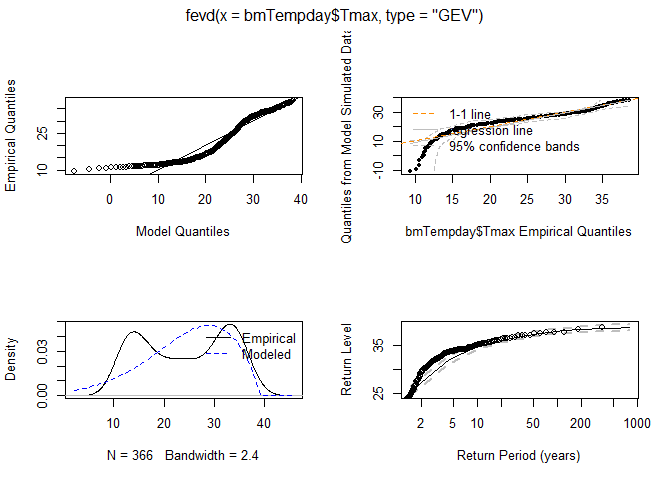<!-- -->

``` r
#plot(Gumbel_temp, "trace")
```

``` r
return.level(Gumbel_temp, return.period=c(2,5,10,20,30,50,100), do.ci=TRUE)
```

    ## fevd(x = bmTemp$air_temp, type = "Gumbel", units = "deg C")
    ## 
    ## [1] "Normal Approx."
    ## 
    ##                       95% lower CI Estimate 95% upper CI
    ## 2-year return level       32.85970 33.24902     33.63834
    ## 5-year return level       34.74431 35.33212     35.91993
    ## 10-year return level      35.96282 36.71132     37.45981
    ## 20-year return level      37.12277 38.03428     38.94578
    ## 30-year return level      37.78779 38.79534     39.80289
    ## 50-year return level      38.61754 39.74671     40.87588
    ## 100-year return level     39.73480 41.02994     42.32507

``` r
lr.test(Gumbel_temp, GEV_temp_year, alpha = 0.05)
```

    ## 
    ##  Likelihood-ratio Test
    ## 
    ## data:  bmTemp$air_tempbmTemp$air_temp
    ## Likelihood-ratio = 11.966, chi-square critical value = 3.8415, alpha =
    ## 0.0500, Degrees of Freedom = 1.0000, p-value = 0.0005418
    ## alternative hypothesis: greater

**Bayesian**

``` r
Bayesian_temp <- fevd(bmTemp$air_temp, method = "Bayesian")
Bayesian_temp
```

    ## 
    ## fevd(x = bmTemp$air_temp, method = "Bayesian")
    ## 
    ## [1] "Estimation Method used: Bayesian"
    ## 
    ## 
    ##  Acceptance Rates:
    ## log.scale     shape 
    ## 0.4290858 0.4045809 
    ## fevd(x = bmTemp$air_temp, method = "Bayesian")
    ## 
    ## [1] "Quantiles of MCMC Sample from Posterior Distribution"
    ## 
    ##                2.5% Posterior Mean       97.5%
    ## location 32.3877448     32.8324897 33.29448552
    ## scale     1.6813910      1.9770715  2.34565467
    ## shape    -0.3943989     -0.2555436 -0.08817144
    ## 
    ## 
    ##  Estimated parameter covariance matrix.
    ##               location    log.scale        shape
    ## location   0.056000984  0.003171440 -0.007048577
    ## log.scale  0.003171440  0.028533427 -0.007266835
    ## shape     -0.007048577 -0.007266835  0.005944691
    ## 
    ##  DIC =  1500.601

``` r
postmode(Bayesian_temp)
```

    ##   location      scale      shape 
    ## 32.8550424  1.9391266 -0.2743547

``` r
plot(Bayesian_temp)
```

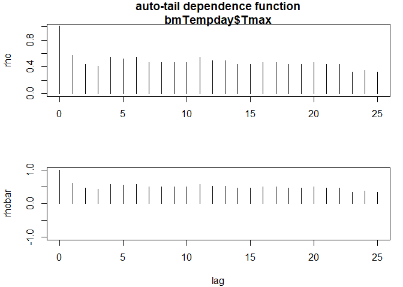<!-- -->

``` r
plot(Bayesian_temp, "trace")
```

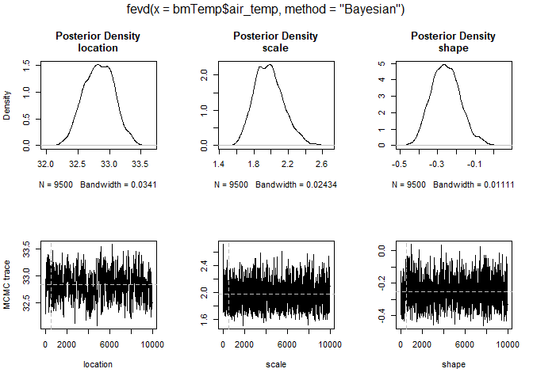<!-- -->

The result is a distribution of the parameters locations, scale and
shape

``` r
ci(Bayesian_temp, alpha=0.05, type="parameter")
```

    ## fevd(x = bmTemp$air_temp, method = "Bayesian")
    ## 
    ## [1] "Quantiles of MCMC Sample from Posterior Distribution"
    ## 
    ##                2.5% Posterior Mean       97.5%
    ## location 32.3877448     32.8324897 33.29448552
    ## scale     1.6813910      1.9770715  2.34565467
    ## shape    -0.3943989     -0.2555436 -0.08817144

``` r
return.level(Bayesian_temp, return.period=c(2,5,10,20,30,50,100), do.ci=TRUE)
```

    ## fevd(x = bmTemp$air_temp, method = "Bayesian")
    ## 
    ## [1] "Quantiles of MCMC Sample from Posterior Distribution"
    ## 
    ##                    2.5% Posterior Mean    97.5%
    ## 2-year level   33.05842       33.52385 33.99779
    ## 5-year level   34.78449       35.29452 35.81339
    ## 10-year level  35.67230       36.21832 36.84740
    ## 20-year level  36.35639       36.95806 37.82547
    ## 30-year level  36.67997       37.32886 38.37258
    ## 50-year level  37.02378       37.74384 39.02445
    ## 100-year level 37.38972       38.22949 39.90374

``` r
pextRemes(Bayesian_temp, c(32, 34, 36, 38, 40), lower.tail = FALSE)
```

    ## [1] 7.754726e-01 4.089738e-01 1.184758e-01 1.292137e-02 3.062898e-05

``` r
mrlplot(bmTemp$air_temp)
```

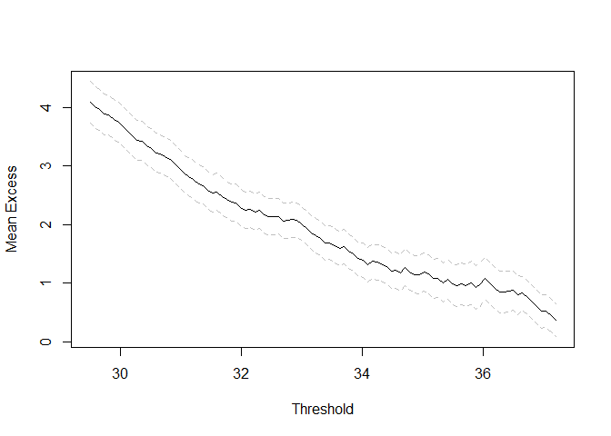<!-- -->

``` r
# PEACKS OVER THRESHOLD APPROACH
# Dataset of daily rainfall data
DWD_precipitation[,1:2] %>%
  group_by(Year = year(timestamp), Month = month(timestamp), Doy = yday(timestamp)) %>%
  summarise(mm_max = max(precip_mm, na.rm = T)) %>%
  print(n=10) -> Max_mm
```

    ## Warning in max(precip_mm, na.rm = T): no non-missing arguments to max; returning
    ## -Inf

    ## Warning in max(precip_mm, na.rm = T): no non-missing arguments to max; returning
    ## -Inf

    ## Warning in max(precip_mm, na.rm = T): no non-missing arguments to max; returning
    ## -Inf

    ## `summarise()` has grouped output by 'Year', 'Month'. You can override using the `.groups` argument.

    ## # A tibble: 8,766 x 4
    ## # Groups:   Year, Month [288]
    ##     Year Month   Doy mm_max
    ##    <dbl> <dbl> <dbl>  <dbl>
    ##  1  1997     1     1    0  
    ##  2  1997     1     2    0  
    ##  3  1997     1     3    0  
    ##  4  1997     1     4    0  
    ##  5  1997     1     5    0  
    ##  6  1997     1     6    0  
    ##  7  1997     1     7    0  
    ##  8  1997     1     8    0  
    ##  9  1997     1     9    0  
    ## 10  1997     1    10    0.2
    ## # ... with 8,756 more rows

``` r
8766/24
```

    ## [1] 365.25

``` r
bm_mm <- blockmaxxer(DWD_precipitation, which = "precip_mm", blocks=NULL, blen = 24, span = 24*365)
bm_mm <- filter(bm_mm, !is.na(precip_mm))
```

``` r
summary(bm_mm)
```

    ##    timestamp                     precip_mm          precip_h     
    ##  Min.   :1997-01-01 00:00:00   Min.   : 0.0000   Min.   :0.0000  
    ##  1st Qu.:2004-02-02 01:00:00   1st Qu.: 0.0000   1st Qu.:0.0000  
    ##  Median :2009-10-01 08:00:00   Median : 0.0000   Median :0.0000  
    ##  Mean   :2009-08-18 13:53:07   Mean   : 0.6687   Mean   :0.4833  
    ##  3rd Qu.:2015-05-13 12:00:00   3rd Qu.: 0.6000   3rd Qu.:1.0000  
    ##  Max.   :2020-06-13 16:00:00   Max.   :31.7000   Max.   :1.0000  
    ##                                                                  
    ##   cloud_cover     rel_humidity    sunlight_times      prec.window    
    ##  Min.   :-1.00   Min.   : 22.40   Length:8195        Min.   :  0.00  
    ##  1st Qu.: 2.00   1st Qu.: 81.90   Class :character   1st Qu.:  0.00  
    ##  Median : 7.00   Median : 92.40   Mode  :character   Median :  1.00  
    ##  Mean   : 5.44   Mean   : 88.08                      Mean   : 22.66  
    ##  3rd Qu.: 8.00   3rd Qu.: 97.40                      3rd Qu.: 27.00  
    ##  Max.   : 8.00   Max.   :100.00                      Max.   :400.00  
    ##  NA's   :3       NA's   :5                                           
    ##          cloud_type     day_night         air_temp      
    ##  Cumulus      :3484   Min.   :0.0000   Min.   :-17.300  
    ##  Stratus      :1314   1st Qu.:0.0000   1st Qu.:  3.400  
    ##  Cirrus       :1134   Median :0.0000   Median :  8.400  
    ##  Stratocumulus: 533   Mean   :0.3243   Mean   :  8.339  
    ##  Cirrocumulus : 479   3rd Qu.:1.0000   3rd Qu.: 13.800  
    ##  (Other)      :1248   Max.   :1.0000   Max.   : 26.300  
    ##  NA's         :   3

``` r
mrlplot(bm_mm$precip_mm)
```

<!-- -->

``` r
threshrange.plot(bm_mm$precip_mm)
```

<!-- -->

**Generalized Pareto (GP)**

``` r
GP_mm <- fevd(bm_mm$precip_mm, threshold = 3, type = "GP", units = "mm")
GP_mm
```

    ## 
    ## fevd(x = bm_mm$precip_mm, threshold = 3, type = "GP", units = "mm")
    ## 
    ## [1] "Estimation Method used: MLE"
    ## 
    ## 
    ##  Negative Log-Likelihood Value:  931.4193 
    ## 
    ## 
    ##  Estimated parameters:
    ##    scale    shape 
    ## 2.481896 0.262118 
    ## 
    ##  Standard Error Estimates:
    ##      scale      shape 
    ## 0.19696136 0.06424162 
    ## 
    ##  Estimated parameter covariance matrix.
    ##              scale        shape
    ## scale  0.038793778 -0.008328914
    ## shape -0.008328914  0.004126986
    ## 
    ##  AIC = 1866.839 
    ## 
    ##  BIC = 1874.962

``` r
plot(GP_mm)
```

<!-- -->

``` r
ci(GP_mm, alpha = 0.05, type = "parameter")
```

    ## fevd(x = bm_mm$precip_mm, threshold = 3, type = "GP", units = "mm")
    ## 
    ## [1] "Normal Approx."
    ## 
    ##       95% lower CI Estimate 95% upper CI
    ## scale    2.0958586 2.481896    2.8679329
    ## shape    0.1362067 0.262118    0.3880292

``` r
ci(GP_mm, alpha = 0.05, type = "return.level")
```

    ## fevd(x = bm_mm$precip_mm, threshold = 3, type = "GP", units = "mm")
    ## 
    ## [1] "Normal Approx."
    ## 
    ## [1] "100-year return level: 62.148"
    ## 
    ## [1] "95% Confidence Interval: (30.5669, 93.7281)"

``` r
profliker (GP_mm, type ="parameter", which.par = 2,
main = "Profile Log - Likelihood for ShapeParameter")
```

<!-- -->

``` r
return.level(GP_mm, return.period = c(10,20,30,50,100), do.ci = TRUE)
```

    ## fevd(x = bm_mm$precip_mm, threshold = 3, type = "GP", units = "mm")
    ## 
    ## [1] "Normal Approx."
    ## 
    ##                       95% lower CI Estimate 95% upper CI
    ## 10-year return level      21.96921 31.05532     40.14143
    ## 20-year return level      24.89419 38.53152     52.16884
    ## 30-year return level      26.52261 43.57751     60.63241
    ## 50-year return level      28.42053 50.74785     73.07518
    ## 100-year return level     30.56695 62.14754     93.72814

Number of excesses

``` r
count = 0
for (i in c(1:length(bm_mm$precip_mm))){
  if (bm_mm$precip_mm[i] >= 10){
    count = count + 1
  }
}
```

``` r
plot(y=bm_mm$precip_mm, x=bm_mm$timestamp)
points(y=filter(bm_mm, precip_mm >= 20)$precip_mm,
       x=filter(bm_mm, precip_mm >= 20)$timestamp, 
       pch = 16, col = 'red')
```

<!-- -->

``` r
pextRemes(GP_mm, c(10, 20, 30, 40), lower.tail = FALSE)
```

    ## [1] 0.121050961 0.019805231 0.005831322 0.002313485

100-year return level

``` r
ci(GP_mm, method="proflik", xrange=c(18,38), verbose=TRUE)
```

    ## 
    ##  Preparing to calculate  95 % CI for  100-year return level 
    ## 
    ##  Model is   fixed 
    ## 
    ##  Using Profile Likelihood Method.
    ## 
    ##  Calculating profile likelihood.  This may take a few moments.

    ## 
    ##  Profile likelihood has been calculated.  Now, trying to find where it crosses the critical value =  -933.3401

    ## Warning in min(x): no non-missing arguments to min; returning Inf

    ## Warning in max(x): no non-missing arguments to max; returning -Inf

<!-- -->

    ## fevd(x = bm_mm$precip_mm, threshold = 3, type = "GP", units = "mm")
    ## 
    ## [1] "Profile Likelihood"
    ## 
    ## [1] "100-year return level: 62.148"
    ## 
    ## [1] "95% Confidence Interval: (Inf, -Inf)"

Fit the Poisson Process (PP) model to the daily data from above.

``` r
GP_mm <- fevd(bm_mm$precip_mm, threshold = 3,
              type = "PP", units = "mm")
```

``` r
GP_mm
```

    ## 
    ## fevd(x = bm_mm$precip_mm, threshold = 3, type = "PP", units = "mm")
    ## 
    ## [1] "Estimation Method used: MLE"
    ## 
    ## 
    ##  Negative Log-Likelihood Value:  94.54353 
    ## 
    ## 
    ##  Estimated parameters:
    ##   location      scale      shape 
    ## 14.0520399  5.3788493  0.2621192 
    ## 
    ##  Standard Error Estimates:
    ##   location      scale      shape 
    ## 0.93146411 0.80803903 0.06421054 
    ## 
    ##  Estimated parameter covariance matrix.
    ##            location      scale       shape
    ## location 0.86762539 0.67540304 0.038752175
    ## scale    0.67540304 0.65292707 0.047404321
    ## shape    0.03875217 0.04740432 0.004122993
    ## 
    ##  AIC = 195.0871 
    ## 
    ##  BIC = 207.2714

``` r
plot(GP_mm)
```

    ## Warning in get(paste0("plot.", newcl))(x = x, type = type, rperiods =
    ## rperiods, : plot.fevd.mle: span or npy not integers; determination of max in
    ## each block may be substantially in error when there are many blocks.

<!-- -->

Fit the Poisson Process (PP) model to the daily data from above.

``` r
GP_mm <- fevd(bm_mm$precip_mm, threshold = 3,
              type = "Exponential", units = "mm")
GP_mm
```

    ## 
    ## fevd(x = bm_mm$precip_mm, threshold = 3, type = "Exponential", 
    ##     units = "mm")
    ## 
    ## [1] "Estimation Method used: MLE"
    ## 
    ## 
    ##  Negative Log-Likelihood Value:  944.6334 
    ## 
    ## 
    ##  Estimated parameters:
    ##    scale 
    ## 3.326573 
    ## 
    ##  Standard Error Estimates:
    ##     scale 
    ## 0.1606084 
    ## 
    ##  Estimated parameter covariance matrix.
    ##            scale
    ## scale 0.02579507
    ## 
    ##  AIC = 1891.267 
    ## 
    ##  BIC = 1895.328

``` r
plot(GP_mm)
```

<!-- -->

``` r
bmPrec <- blockmaxxer(filter(bm_mm, !is.na(timestamp))[,1:2],
                      blocks = year(filter(bm_mm, !is.na(precip_mm))$timestamp), which="precip_mm")
```

``` r
filter(bmPrec, !is.na(timestamp))[,1:2]
```

    ## # A tibble: 24 x 2
    ##    timestamp           precip_mm
    ##    <dttm>                  <dbl>
    ##  1 1997-07-15 15:00:00      12.5
    ##  2 1998-09-28 18:00:00      16.8
    ##  3 1999-05-11 15:00:00       7.2
    ##  4 2000-08-19 05:00:00      15.1
    ##  5 2001-07-31 18:00:00      11.1
    ##  6 2002-07-10 19:00:00      22.5
    ##  7 2003-07-17 15:00:00      10.8
    ##  8 2004-08-24 17:00:00      11.8
    ##  9 2005-07-30 02:00:00      12.7
    ## 10 2006-07-08 05:00:00      29  
    ## # ... with 14 more rows

``` r
plot(year(bmPrec$timestamp), bmPrec$precip_mm, col = "white", pch = 21, bg = "darkred", cex=1.5)
```

<!-- -->

estimates of the auto-tail dependence function(s) (atdf) based on either
chi (rho) or chibar (rhobar), or both.

``` r
atdf(Max_temp$Tmax, 0.75)
```

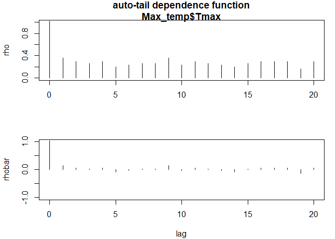<!-- -->

The extremal index is a useful indicator of how much clustering of
exceedances of a threshold occurs in the limit of the distribution. For
independent data, theta = 1, (though the converse is does not hold) and
if theta &lt; 1, then there is some dependency (clustering) in the
limit.

``` r
extremalindex(Max_temp$Tmax, threshold = 30, method = "runs", run.length = 9, blocks=Max_temp$Year)
```

    ## 
    ##  Runs Estimator for the Extremal Index
    ##     extremal.index number.of.clusters         run.length 
    ##         0.00862069         1.00000000         9.00000000

Decluster data above a given threshold to try to make them independent.

``` r
dcTemp <- decluster(Max_temp$Tmax, 30, r = 9)
plot(dcTemp)
```

<!-- -->
